## FIFA21 : 탐색적 데이터 분석 (EDA) & 시각화


<br/>


### FIFA 21
- FIFA 21은 축구를 소재로 한 비디오 게임으로 EA 스포츠의 FIFA 시리즈 28번째 정규작. (https://ko.wikipedia.org/wiki/FIFA_21)
- 데이터의 출처 : https://sofifa.com (EA Sports의 비디오 게임 시리즈의 유저 토론 및 통계 플랫폼)
- 해당 데이터는 FIFA 21에 등장하는 선수들의 포지션, 능력치, 소속 팀등에 대한 정보를 담고 있음.
- [데이터](https://raw.githubusercontent.com/ChSSolee/R-study/main/EDA%20%26%20Vis/fifa21_male2.csv)

<br/>

### 필요 라이브러리 및 데이터 로딩
```R
library(tidyverse)
library(ggtextures)
library(DMwR)
library(magick)
library(ggridges)
library(ggsci)
library(cowplot)
library(see)
ggplot2::theme_set(theme_ridges())
```


```R
fifa <- read.csv("C:/fifa21_male2.csv", stringsAsFactors = TRUE)
```

<br/>

### 데이터 확인
```R
head(fifa)
```


<table class="dataframe">
<caption>A data.frame: 6 × 107</caption>
<thead>
	<tr><th></th><th scope=col>ID</th><th scope=col>Name</th><th scope=col>Age</th><th scope=col>OVA</th><th scope=col>Nationality</th><th scope=col>Club</th><th scope=col>BOV</th><th scope=col>BP</th><th scope=col>Position</th><th scope=col>Player.Photo</th><th scope=col>...</th><th scope=col>CDM</th><th scope=col>RDM</th><th scope=col>RWB</th><th scope=col>LB</th><th scope=col>LCB</th><th scope=col>CB</th><th scope=col>RCB</th><th scope=col>RB</th><th scope=col>GK</th><th scope=col>Gender</th></tr>
	<tr><th></th><th scope=col>&lt;int&gt;</th><th scope=col>&lt;fct&gt;</th><th scope=col>&lt;int&gt;</th><th scope=col>&lt;int&gt;</th><th scope=col>&lt;fct&gt;</th><th scope=col>&lt;fct&gt;</th><th scope=col>&lt;int&gt;</th><th scope=col>&lt;fct&gt;</th><th scope=col>&lt;fct&gt;</th><th scope=col>&lt;fct&gt;</th><th scope=col>...</th><th scope=col>&lt;fct&gt;</th><th scope=col>&lt;fct&gt;</th><th scope=col>&lt;fct&gt;</th><th scope=col>&lt;fct&gt;</th><th scope=col>&lt;fct&gt;</th><th scope=col>&lt;fct&gt;</th><th scope=col>&lt;fct&gt;</th><th scope=col>&lt;fct&gt;</th><th scope=col>&lt;fct&gt;</th><th scope=col>&lt;fct&gt;</th></tr>
</thead>
<tbody>
	<tr><th scope=row>1</th><td> 2</td><td>G. Pasquale</td><td>33</td><td>69</td><td>Italy                </td><td>Udinese         </td><td>71</td><td>LWB</td><td>LM          </td><td>https://cdn.sofifa.com/players/000/002/16_120.png</td><td>...</td><td>70+-1</td><td>70+-1</td><td>71+-2</td><td>70+-1</td><td>69+0</td><td>69+0</td><td>69+0</td><td>70+-1</td><td>17+0</td><td>Male</td></tr>
	<tr><th scope=row>2</th><td>16</td><td>Luis Garc?a</td><td>37</td><td>71</td><td>Spain                </td><td>KAS Eupen       </td><td>70</td><td>CM </td><td>CM CAM CDM  </td><td>https://cdn.sofifa.com/players/000/016/19_120.png</td><td>...</td><td>66+1 </td><td>66+1 </td><td>62+1 </td><td>60+1 </td><td>60+1</td><td>60+1</td><td>60+1</td><td>60+1 </td><td>17+1</td><td>Male</td></tr>
	<tr><th scope=row>3</th><td>27</td><td>J. Cole    </td><td>33</td><td>71</td><td>England              </td><td>Coventry City   </td><td>71</td><td>CAM</td><td>CAM RM RW LM</td><td>https://cdn.sofifa.com/players/000/027/16_120.png</td><td>...</td><td>54+0 </td><td>54+0 </td><td>52+0 </td><td>47+0 </td><td>46+0</td><td>46+0</td><td>46+0</td><td>47+0 </td><td>15+0</td><td>Male</td></tr>
	<tr><th scope=row>4</th><td>36</td><td><span style=white-space:pre-wrap>D. Yorke   </span></td><td>36</td><td>68</td><td>Trinidad &amp;amp; Tobago</td><td><span style=white-space:pre-wrap>Sunderland      </span></td><td>70</td><td>ST </td><td><span style=white-space:pre-wrap>            </span></td><td>https://cdn.sofifa.com/players/000/036/09_120.png</td><td>...</td><td>65+0 </td><td>65+0 </td><td>56+0 </td><td>57+0 </td><td>51+0</td><td>51+0</td><td>51+0</td><td>57+0 </td><td>22+0</td><td>Male</td></tr>
	<tr><th scope=row>5</th><td>41</td><td>Iniesta    </td><td>36</td><td>81</td><td>Spain                </td><td>Vissel Kobe     </td><td>82</td><td>CAM</td><td>CM CAM      </td><td>https://cdn.sofifa.com/players/000/041/20_120.png</td><td>...</td><td>73+3 </td><td>73+3 </td><td>70+3 </td><td>67+3 </td><td>64+3</td><td>64+3</td><td>64+3</td><td>67+3 </td><td>17+3</td><td>Male</td></tr>
	<tr><th scope=row>6</th><td>61</td><td>D. Odonkor </td><td>27</td><td>66</td><td>Germany              </td><td>Alemannia Aachen</td><td>66</td><td>RW </td><td>RW RM       </td><td>https://cdn.sofifa.com/players/000/061/12_120.png</td><td>...</td><td>47+0 </td><td>47+0 </td><td>50+0 </td><td>46+0 </td><td>41+0</td><td>41+0</td><td>41+0</td><td>46+0 </td><td>13+0</td><td>Male</td></tr>
</tbody>
</table>


<style>
.list-inline {list-style: none; margin:0; padding: 0}
.list-inline>li {display: inline-block}
.list-inline>li:not(:last-child)::after {content: "\00b7"; padding: 0 .5ex}
</style>

<br/>
<br/>


### 데이터는 17125명의 선수들에 대해 각각 107개의 특성을 가짐

```R
dim(fifa)
str(fifa)
```
<ol class=list-inline><li>17125</li><li>107</li></ol>


    'data.frame':	17125 obs. of  107 variables:
     $ ID              : int  2 16 27 36 41 61 80 241 244 246 ...
     $ Name            : Factor w/ 16173 levels "?. Radu","?der",..: 5718 9770 6940 3930 6605 3656 4175 13098 5698 12623 ...
     $ Age             : int  33 37 33 36 36 27 38 39 35 37 ...
     $ OVA             : int  69 71 71 68 81 66 77 78 76 80 ...
     $ Nationality     : Factor w/ 167 levels "Afghanistan",..: 78 145 49 154 145 59 156 165 49 49 ...
     $ Club            : Factor w/ 918 levels "","?aykur Rizespor",..: 837 478 240 796 884 57 367 535 535 535 ...
     $ BOV             : int  71 70 71 70 82 66 77 78 78 82 ...
     $ BP              : Factor w/ 15 levels "CAM","CB","CDM",..: 10 5 1 15 1 13 5 1 2 1 ...
     $ Position        : Factor w/ 623 levels "","ACB","CAM",..: 273 161 51 1 160 542 174 289 400 174 ...
     $ Player.Photo    : Factor w/ 17125 levels "https://cdn.sofifa.com/players/000/002/16_120.png",..: 1 2 3 4 5 6 7 8 9 10 ...
     $ Club.Logo       : Factor w/ 919 levels "","https://cdn.sofifa.com/teams/1/light_60.png",..: 818 680 564 82 66 585 749 84 84 84 ...
     $ Flag.Photo      : Factor w/ 167 levels "https://cdn.sofifa.com/flags/ad.png",..: 82 50 55 154 50 42 153 58 55 55 ...
     $ POT             : int  69 71 71 82 81 70 77 78 82 80 ...
     $ X111648         : Factor w/ 9823 levels "?aykur Rizespor 2013 ~ 2022",..: 166 166 46 47 48 49 50 51 51 51 ...
     $ Height          : Factor w/ 21 levels "5'1\"","5'10\"",..: 12 2 11 3 9 10 9 2 2 9 ...
     $ Weight          : Factor w/ 57 levels "110lbs","115lbs",..: 32 15 23 25 18 24 22 21 29 21 ...
     $ foot            : Factor w/ 2 levels "Left","Right": 1 2 2 2 2 2 1 1 2 2 ...
     $ Growth          : int  0 0 0 14 0 4 0 0 6 0 ...
     $ Joined          : Factor w/ 1954 levels "","01-Apr-11",..: 83 1254 510 1 1078 62 204 37 72 583 ...
     $ Loan.Date.End   : Factor w/ 39 levels "","01-Jan-21",..: 1 1 1 1 1 1 1 1 1 1 ...
     $ Value           : Factor w/ 216 levels "€0","€1.1M",..: 179 175 2 1 152 192 53 44 1 132 ...
     $ Wage            : Factor w/ 142 levels "€0","€100K",..: 117 117 19 1 10 91 71 93 1 67 ...
     $ Release.Clause  : Factor w/ 1200 levels "€0","€1.1M",..: 1 2 1 1 938 1 710 1 1 1 ...
     $ Contract        : Factor w/ 434 levels "111648","113974 2019 ~ 2021",..: 68 158 180 76 199 109 205 4 5 7 ...
     $ Attacking       : int  313 337 337 264 367 271 342 380 304 394 ...
     $ Crossing        : int  75 68 80 54 75 61 80 90 72 83 ...
     $ Finishing       : int  50 64 64 70 69 53 66 70 31 65 ...
     $ Heading.Accuracy: int  59 61 41 60 54 42 43 60 75 72 ...
     $ Short.Passing   : int  71 76 77 80 90 58 84 85 71 89 ...
     $ Volleys         : int  58 68 75 NA 79 57 69 75 55 85 ...
     $ Skill           : int  338 369 387 255 408 276 406 402 258 393 ...
     $ Dribbling       : int  73 69 79 68 85 67 77 77 44 75 ...
     $ Curve           : int  65 79 84 NA 80 61 83 87 56 74 ...
     $ FK.Accuracy     : int  60 79 77 46 70 42 80 78 33 67 ...
     $ Long.Passing    : int  69 71 69 64 83 44 85 81 61 90 ...
     $ Ball.Control    : int  71 71 78 77 90 62 81 79 64 87 ...
     $ Movement        : int  347 305 295 176 346 406 308 337 324 338 ...
     $ Acceleration    : int  68 56 48 59 61 90 54 59 64 53 ...
     $ Sprint.Speed    : int  74 50 42 62 56 91 36 60 70 53 ...
     $ Agility         : int  68 62 71 NA 79 75 67 72 51 68 ...
     $ Reactions       : int  69 65 59 55 75 65 70 76 72 82 ...
     $ Balance         : int  68 72 75 NA 75 85 81 70 67 82 ...
     $ Power           : int  347 324 284 239 297 315 340 310 284 333 ...
     $ Shot.Power      : int  74 75 72 63 67 71 77 71 47 88 ...
     $ Jumping         : int  68 54 58 NA 40 70 72 59 70 64 ...
     $ Stamina         : int  69 64 29 51 58 64 51 48 65 34 ...
     $ Strength        : int  68 60 56 66 62 61 64 61 74 63 ...
     $ Long.Shots      : int  68 71 69 59 70 49 76 71 28 84 ...
     $ Mentality       : int  320 362 317 271 370 256 384 358 319 417 ...
     $ Aggression      : int  72 71 69 59 58 63 87 60 87 87 ...
     $ Interceptions   : int  69 71 39 70 70 26 62 47 85 79 ...
     $ Positioning     : int  63 72 69 72 78 63 65 78 45 83 ...
     $ Vision          : int  66 73 74 NA 93 58 85 83 70 91 ...
     $ Penalties       : int  50 75 66 70 71 46 85 90 32 77 ...
     $ Composure       : int  NA 79 NA NA 89 NA 80 NA NA NA ...
     $ Defending       : int  208 153 99 75 181 79 190 120 242 143 ...
     $ Marking         : int  70 70 35 34 68 22 65 26 78 58 ...
     $ Standing.Tackle : int  69 43 34 41 57 26 65 43 81 49 ...
     $ Sliding.Tackle  : int  69 40 30 NA 56 31 60 51 83 36 ...
     $ Goalkeeping     : int  56 56 51 68 45 46 47 32 43 47 ...
     $ GK.Diving       : int  14 9 9 5 6 8 7 10 12 7 ...
     $ GK.Handling     : int  5 12 6 21 13 13 11 5 9 12 ...
     $ GK.Kicking      : int  15 13 13 64 6 7 7 7 5 5 ...
     $ GK.Positioning  : int  10 11 16 21 13 9 14 5 6 15 ...
     $ GK.Reflexes     : int  12 11 7 21 7 9 8 5 11 8 ...
     $ Total.Stats     : int  1929 1906 1770 1348 2014 1649 2017 1939 1774 2065 ...
     $ Base.Stats      : int  408 385 354 369 420 360 403 392 378 415 ...
     $ W.F             : Factor w/ 5 levels "1 ★","2 ★",..: 3 4 4 3 4 2 4 2 3 3 ...
     $ SM              : Factor w/ 5 levels "1★","2★","3★",..: 2 3 4 1 4 3 4 3 2 3 ...
     $ A.W             : Factor w/ 4 levels "","High","Low",..: 4 4 4 1 2 4 4 4 1 4 ...
     $ D.W             : Factor w/ 4 levels "","High","Low",..: 2 4 3 1 4 4 4 4 1 4 ...
     $ IR              : Factor w/ 5 levels "1 ★","2 ★",..: 2 1 2 1 4 2 2 3 3 2 ...
     $ PAC             : int  71 53 45 61 58 91 44 60 67 53 ...
     $ SHO             : int  59 69 68 66 70 56 71 72 36 76 ...
     $ PAS             : int  70 73 76 66 85 56 83 85 67 87 ...
     $ DRI             : int  71 69 77 69 85 67 77 77 53 79 ...
     $ DEF             : int  68 58 36 47 63 27 62 41 81 59 ...
     $ PHY             : int  69 63 52 60 59 63 66 57 74 61 ...
     $ Hits            : Factor w/ 529 levels "1.1K","1.2K",..: 312 312 21 226 63 455 455 510 312 455 ...
     $ LS              : Factor w/ 278 levels "15+1","16+1",..: 168 180 162 179 211 153 176 203 119 225 ...
     $ ST              : Factor w/ 278 levels "15+1","16+1",..: 168 180 162 179 211 153 176 203 119 225 ...
     $ RS              : Factor w/ 278 levels "15+1","16+1",..: 168 180 162 179 211 153 176 203 119 225 ...
     $ LW              : Factor w/ 178 levels "14+0","15+0",..: 102 96 113 91 157 91 123 153 67 153 ...
     $ LF              : Factor w/ 167 levels "15+0","16+0",..: 89 94 98 89 145 71 112 123 56 145 ...
     $ CF              : Factor w/ 167 levels "15+0","16+0",..: 89 94 98 89 145 71 112 123 56 145 ...
     $ RF              : Factor w/ 167 levels "15+0","16+0",..: 89 94 98 89 145 71 112 123 56 145 ...
     $ RW              : Factor w/ 178 levels "14+0","15+0",..: 102 96 113 91 157 91 123 153 67 153 ...
     $ LAM             : Factor w/ 321 levels "15+2","16+2",..: 200 213 219 212 290 164 251 269 132 291 ...
     $ CAM             : Factor w/ 321 levels "15+2","16+2",..: 200 213 219 212 290 164 251 269 132 291 ...
     $ RAM             : Factor w/ 321 levels "15+2","16+2",..: 200 213 219 212 290 164 251 269 132 291 ...
     $ LM              : Factor w/ 309 levels "15+2","16+2",..: 207 202 201 188 271 174 229 260 162 264 ...
     $ LCM             : Factor w/ 269 levels "15+2","16+2",..: 183 189 169 178 247 117 224 207 159 242 ...
     $ CM              : Factor w/ 269 levels "15+2","16+2",..: 183 189 169 178 247 117 224 207 159 242 ...
     $ RCM             : Factor w/ 269 levels "15+2","16+2",..: 183 189 169 178 247 117 224 207 159 242 ...
     $ RM              : Factor w/ 309 levels "15+2","16+2",..: 207 202 201 188 271 174 229 260 162 264 ...
     $ LWB             : Factor w/ 279 levels "14+2","15+1",..: 215 166 119 135 213 110 190 166 228 194 ...
     $ LDM             : Factor w/ 312 levels "16+2","17+2",..: 221 198 132 190 246 103 239 178 249 254 ...
     $ CDM             : Factor w/ 312 levels "16+2","17+2",..: 221 198 132 190 246 103 239 178 249 254 ...
     $ RDM             : Factor w/ 312 levels "16+2","17+2",..: 221 198 132 190 246 103 239 178 249 254 ...
      [list output truncated]
    


<br/>

### 결측값 확인 및 제거
- 843개의 결측값에 대해 DMwR패키지의 ```centralImputation()```를 통하여, 수치형 변수는 해당 변수의 중위수, 요인형 변수는 경우는 최빈값으로 대체


```R
sum(is.na(fifa))
```


843


```R
fifa <- centralImputation(fifa)
```


```R
sum(is.na(fifa))
```


0

<br/>

<br/>

### FIFA21의 데이터 중 가장 많은 선수 국적은?


```R
top10_country <- fifa %>% select(Nationality) %>% group_by(Nationality) %>%
  count() %>% arrange(desc(n)) %>% head(10)
top10_country
```


<table class="dataframe">
<caption>A grouped_df: 10 × 2</caption>
<thead>
	<tr><th scope=col>Nationality</th><th scope=col>n</th></tr>
	<tr><th scope=col>&lt;fct&gt;</th><th scope=col>&lt;int&gt;</th></tr>
</thead>
<tbody>
	<tr><td>England      </td><td>1707</td></tr>
	<tr><td>Germany      </td><td>1154</td></tr>
	<tr><td>Spain        </td><td>1121</td></tr>
	<tr><td>France       </td><td> 990</td></tr>
	<tr><td>Brazil       </td><td> 857</td></tr>
	<tr><td>Argentina    </td><td> 778</td></tr>
	<tr><td>Italy        </td><td> 565</td></tr>
	<tr><td>Netherlands  </td><td> 475</td></tr>
	<tr><td>Portugal     </td><td> 365</td></tr>
	<tr><td>United States</td><td> 358</td></tr>
</tbody>
</table>


```R
nation <- tibble(
  count = top10_country$n,
  country = top10_country$Nationality,
  image = list(
    image_read("https://upload.wikimedia.org/wikipedia/en/thumb/d/d5/FA_crest_2009.svg/1200px-FA_crest_2009.svg.png"),
    image_read("https://upload.wikimedia.org/wikipedia/commons/thumb/a/a9/Deutscher_Fu%C3%9Fball-Bund_logo.svg/1200px-Deutscher_Fu%C3%9Fball-Bund_logo.svg.png"),
    image_read("https://upload.wikimedia.org/wikipedia/commons/thumb/e/ea/Royal_Spanish_Football_Federation_logo.svg/1200px-Royal_Spanish_Football_Federation_logo.svg.png"),
    image_read("https://upload.wikimedia.org/wikipedia/en/thumb/2/23/French_Football_Federation_logo.svg/1200px-French_Football_Federation_logo.svg.png"),
    image_read("https://upload.wikimedia.org/wikipedia/en/thumb/9/99/Brazilian_Football_Confederation_logo.svg/1200px-Brazilian_Football_Confederation_logo.svg.png"),
    image_read("https://upload.wikimedia.org/wikipedia/en/thumb/1/1e/Asociaci%C3%B3n_del_F%C3%BAtbol_Argentino_%28crest%29.svg/1200px-Asociaci%C3%B3n_del_F%C3%BAtbol_Argentino_%28crest%29.svg.png"),
    image_read("https://upload.wikimedia.org/wikipedia/commons/thumb/e/e2/Federazione_Italiana_Giuoco_Calcio%2C_Logo_2017%2C_4_stars.svg/1200px-Federazione_Italiana_Giuoco_Calcio%2C_Logo_2017%2C_4_stars.svg.png"),
    image_read("https://upload.wikimedia.org/wikipedia/en/thumb/7/78/Netherlands_national_football_team_logo.svg/1200px-Netherlands_national_football_team_logo.svg.png"),
    image_read("https://upload.wikimedia.org/wikipedia/en/thumb/5/5f/Portuguese_Football_Federation.svg/1200px-Portuguese_Football_Federation.svg.png"),
    image_read("https://upload.wikimedia.org/wikipedia/commons/thumb/1/17/United_States_Soccer_Federation_logo_2016.svg/1200px-United_States_Soccer_Federation_logo_2016.svg.png")
  )
)
```


```R
ggplot(nation, aes(fct_reorder(country, count), count, image = image, fill = country)) +
  geom_isotype_col(colour = "black",
    img_height = grid::unit(1, "null"), img_width = NULL,
    ncol = 1, nrow = 1, hjust = 0.98, vjust = 0.1
  ) + coord_flip() +
  ggtitle("Player Count of Countries") + ylab("Count") +
  theme(legend.position = "none",
        axis.text.x = element_text(size = 11, face = "bold"),
        axis.text.y = element_text(size = 15, face = "bold"),
        axis.title.x = element_blank(),
        axis.title.y = element_blank(),
        plot.title = element_text(size = 15, hjust = 0.5, face = "bold.italic")) +
  scale_fill_brewer(palette = "Pastel1")
```

    Warning message in RColorBrewer::brewer.pal(n, pal):
    "n too large, allowed maximum for palette Pastel1 is 9
    Returning the palette you asked for with that many colors
    "
    


    
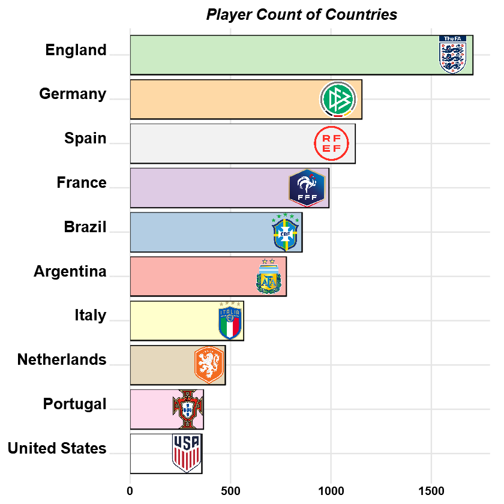
    

- 관찰 결과 FIFA 21의 데이터에서 가장 많은 선수의 국적은 잉글랜드이다. 이와 관련된 주요 이유 중 하나는 영국에서 대부분의 사용자 기반을 독점하고 있는 EA 프랜차이즈 때문이다. 또한 FIFA에서도 잉글랜드 리그가 가장 많은 수의 팀을 보유하고 있으며, 가장 많은 선수를 배출하고 있다.


<br/>

<br/>

### 신장(Height)과 몸무게(Weight) 산점도
- 해당 데이터의 신장과 몸무게의 표현단위는 인치/피트(inch/feet) & 파운드(lbs)로 표현되어 있기에, 해당 열들을 Kg와 cm으로 변환 


```R
head(fifa$Height)
head(fifa$Weight)
```


<style>
.list-inline {list-style: none; margin:0; padding: 0}
.list-inline>li {display: inline-block}
.list-inline>li:not(:last-child)::after {content: "\00b7"; padding: 0 .5ex}
</style>
<ol class=list-inline><li>6'0"</li><li>5'10"</li><li>5'9"</li><li>5'11"</li><li>5'7"</li><li>5'8"</li></ol>

<details>
	<summary style=display:list-item;cursor:pointer>
		<strong>Levels</strong>:
	</summary>
	<style>
	.list-inline {list-style: none; margin:0; padding: 0}
	.list-inline>li {display: inline-block}
	.list-inline>li:not(:last-child)::after {content: "\00b7"; padding: 0 .5ex}
	</style>
	<ol class=list-inline><li>'5\'1"'</li><li>'5\'10"'</li><li>'5\'11"'</li><li>'5\'2"'</li><li>'5\'3"'</li><li>'5\'4"'</li><li>'5\'5"'</li><li>'5\'6"'</li><li>'5\'7"'</li><li>'5\'8"'</li><li>'5\'9"'</li><li>'6\'0"'</li><li>'6\'1"'</li><li>'6\'2"'</li><li>'6\'3"'</li><li>'6\'4"'</li><li>'6\'5"'</li><li>'6\'6"'</li><li>'6\'7"'</li><li>'6\'8"'</li><li>'6\'9"'</li></ol>
</details>


<style>
.list-inline {list-style: none; margin:0; padding: 0}
.list-inline>li {display: inline-block}
.list-inline>li:not(:last-child)::after {content: "\00b7"; padding: 0 .5ex}
</style>
<ol class=list-inline><li>181lbs</li><li>143lbs</li><li>161lbs</li><li>165lbs</li><li>150lbs</li><li>163lbs</li></ol>

<details>
	<summary style=display:list-item;cursor:pointer>
		<strong>Levels</strong>:
	</summary>
	<style>
	.list-inline {list-style: none; margin:0; padding: 0}
	.list-inline>li {display: inline-block}
	.list-inline>li:not(:last-child)::after {content: "\00b7"; padding: 0 .5ex}
	</style>
	<ol class=list-inline><li>'110lbs'</li><li>'115lbs'</li><li>'117lbs'</li><li>'119lbs'</li><li>'121lbs'</li><li>'123lbs'</li><li>'126lbs'</li><li>'128lbs'</li><li>'130lbs'</li><li>'132lbs'</li><li>'134lbs'</li><li>'137lbs'</li><li>'139lbs'</li><li>'141lbs'</li><li>'143lbs'</li><li>'146lbs'</li><li>'148lbs'</li><li>'150lbs'</li><li>'152lbs'</li><li>'154lbs'</li><li>'157lbs'</li><li>'159lbs'</li><li>'161lbs'</li><li>'163lbs'</li><li>'165lbs'</li><li>'168lbs'</li><li>'170lbs'</li><li>'172lbs'</li><li>'174lbs'</li><li>'176lbs'</li><li>'179lbs'</li><li>'181lbs'</li><li>'183lbs'</li><li>'185lbs'</li><li>'187lbs'</li><li>'190lbs'</li><li>'192lbs'</li><li>'194lbs'</li><li>'196lbs'</li><li>'198lbs'</li><li>'201lbs'</li><li>'203lbs'</li><li>'205lbs'</li><li>'207lbs'</li><li>'209lbs'</li><li>'212lbs'</li><li>'214lbs'</li><li>'216lbs'</li><li>'218lbs'</li><li>'220lbs'</li><li>'223lbs'</li><li>'225lbs'</li><li>'227lbs'</li><li>'229lbs'</li><li>'234lbs'</li><li>'236lbs'</li><li>'243lbs'</li></ol>
</details>


```R
fifa <- fifa %>%
    mutate(Height = as.character(Height)) %>% 
    separate(Height, into = c("feet", "inches"), sep = "'") %>%
    mutate(feet = (as.numeric(feet) * 30.48)) %>%
    mutate(inches = (str_remove(inches, "\"") %>% as.numeric() * 2.54)) %>%
    mutate(Height = feet + inches) %>% 
    mutate(Weight = (str_remove(Weight, "lbs") %>% as.numeric() * 0.453592))

head(fifa) %>% select(Height, Weight)
```


<table class="dataframe">
<caption>A data.frame: 6 × 2</caption>
<thead>
	<tr><th></th><th scope=col>Height</th><th scope=col>Weight</th></tr>
	<tr><th></th><th scope=col>&lt;dbl&gt;</th><th scope=col>&lt;dbl&gt;</th></tr>
</thead>
<tbody>
	<tr><th scope=row>1</th><td>182.88</td><td>82.10015</td></tr>
	<tr><th scope=row>2</th><td>177.80</td><td>64.86366</td></tr>
	<tr><th scope=row>3</th><td>175.26</td><td>73.02831</td></tr>
	<tr><th scope=row>4</th><td>180.34</td><td>74.84268</td></tr>
	<tr><th scope=row>5</th><td>170.18</td><td>68.03880</td></tr>
	<tr><th scope=row>6</th><td>172.72</td><td>73.93550</td></tr>
</tbody>
</table>


```R
ggplot(fifa, aes(Height, Weight, size = Height, color = Height)) + 
  geom_point(alpha = 0.7) + 
  scale_size_continuous("Height", breaks = seq(150, 220, 10),
                        labels = paste0(seq(150, 220, 10), "cm")) + 
  scale_color_viridis_c("Height", option = "A") +
  scale_y_continuous(labels = paste0(seq(40, 120, 20), "Kg"), 
                     limits = c(50, 120), 
                     breaks = seq(40, 120, 20)) +
  scale_x_continuous(labels = paste0(seq(150, 220, 10), "cm"),
                     breaks = seq(150, 220, 10)) +
  theme(legend.key.height = unit(1, "cm"),
        axis.title.x = element_text(size = 14, face = "bold", hjust = 0.5),
        axis.title.y = element_text(size = 14, face = "bold", angle = 0, vjust = 0.5),
        plot.title = element_text(size = 15, hjust = 0.5, face = "bold"),
        axis.line.x.bottom = element_line(color = "black", size = 1),
        axis.line.y.left = element_line(color = "black", size = 1))
```

    Warning message:
    "Removed 1 rows containing missing values (geom_point)."
    


    
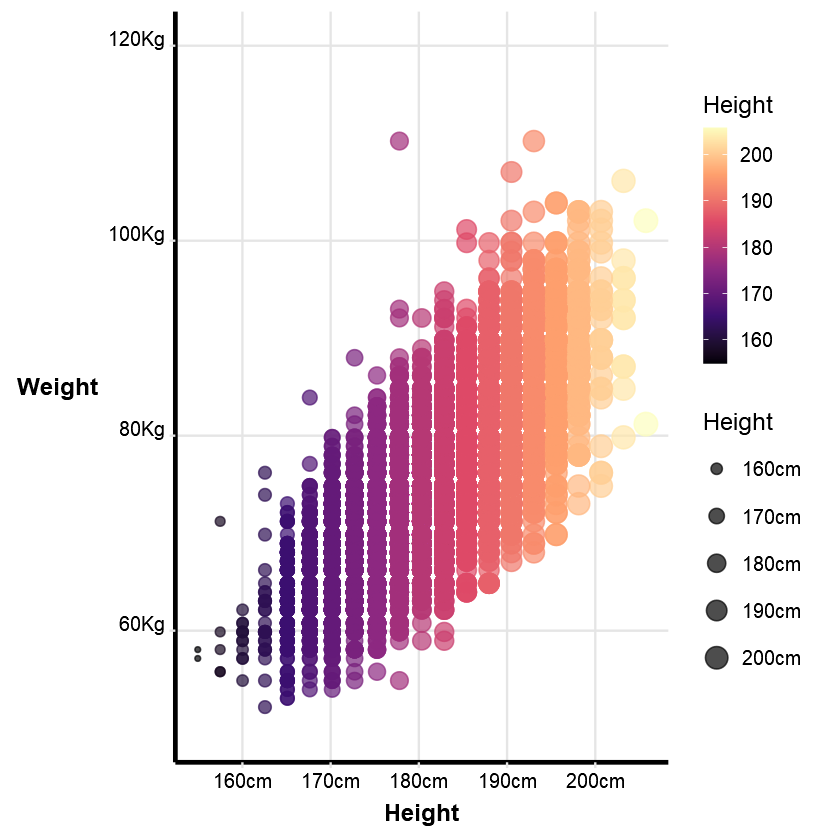
    
<br/>

<br/>

### 국가별 OVA분포
- OVA (Overall)는 선수의 종합 능력치를 의미
- 데이터에서 가장 많은 선수를 보유한 상위 10개의 국가들에 대해 OVA의 분포를 시각화


```R
n1 <- fifa %>% filter(Nationality %in% top10_country$Nationality) %>% 
  select(Nationality, OVA) %>%
  ggplot(aes(OVA, fct_relevel(Nationality, rev(as.character(top10_country$Nationality))))) + 
  geom_density_ridges_gradient(aes(fill = stat(x), scale = 1.5)) +
  ggtitle("OVA Distribution of Countries") +
  scale_x_continuous(limits = c(40, 100)) +
  theme(legend.position = "top",
        legend.title = element_text(size = 10, face = "bold"),
        legend.key.width = unit(2.3, "cm"),
        axis.text.x = element_text(size = 11, face = "bold"),
        axis.text.y = element_text(size = 13, face = "bold"),
        axis.title.x = element_blank(),
        axis.title.y = element_blank(),
        plot.title = element_text(size = 15, hjust = 0.5, face = "bold.italic")) +
  scale_fill_viridis_c(name = "OVA", option = "C")

n2 <- fifa %>% filter(Nationality %in% top10_country$Nationality) %>% 
  select(Nationality, OVA) %>%
  ggplot(aes(OVA, fct_relevel(Nationality, rev(as.character(top10_country$Nationality))))) +
  geom_boxplot(aes(fill = Nationality)) +
  ggtitle("OVA Boxplot of Leagues") +
  scale_x_continuous(limits = c(40, 100)) +
  theme(legend.position = "none",
        axis.text.x = element_text(size = 11, face = "bold"),
        axis.text.y = element_text(size = 13, face = "bold"),
        axis.title.x = element_blank(),
        axis.title.y = element_blank(),
        plot.title = element_text(size = 15, hjust = 0.5, face = "bold.italic"))
n1 ; n2
```

    Picking joint bandwidth of 1.51
    
    Warning message:
    "Removed 1 rows containing non-finite values (stat_boxplot)."
    


    
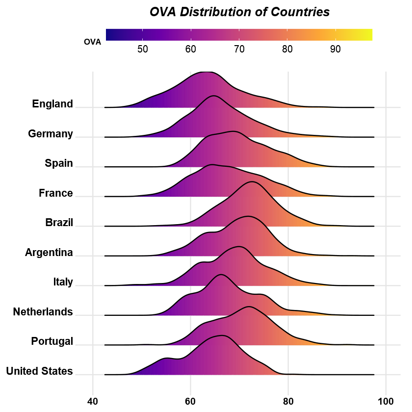
    


    
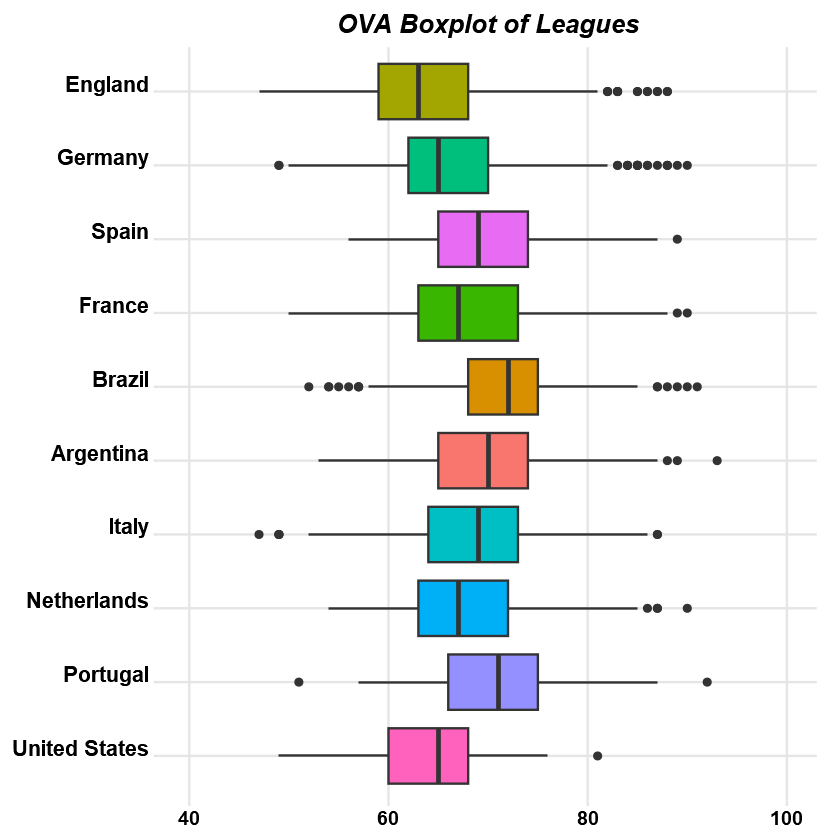
    

<br/>

<br/>

### 왼발/오른발 분포


```R
lar <- fifa %>% group_by(foot) %>% count() %>% 
        mutate(ratio = n / nrow(fifa))
lar$ymax <- cumsum(lar$ratio)
lar$ymin <- c(0, lar$ymax[1])
lar$ymax <- cumsum(lar$ratio)
lar$labelPosition <- c(lar$ratio[1] / 2, lar$ratio[2])
lar$label <- paste0(lar$foot, "\n", round(lar$ratio, 3) * 100, "%")
```


```R
ggplot(lar, aes(ymax = ymax, ymin = ymin, xmax = 5, xmin = 3.5, fill = foot)) + 
    geom_rect() + coord_polar(theta = "y") + xlim(c(1, 5)) + 
    ggtitle("Ratio of Foot") + 
    theme_void() + 
    theme(legend.position = "none",
    plot.title = element_text(size = 15, hjust = 0.5, face = "bold")) + 
    scale_fill_brewer(palette = "Paired") +
    geom_text(x = 4.3, aes(y = labelPosition, label = label), 
              size = 5) 
```


    
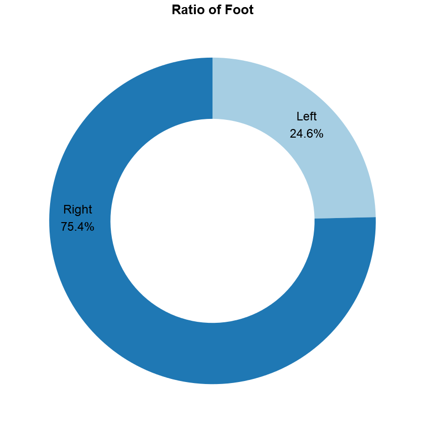
    
- 오른발잡이 선수들의 비율은 75.4%, 왼발잡이 선수들의 비율은 24.6%임을 알 수 있다.


<br/>

<br/>

#### 포지션의 빈도
- 선수들의 포지션은 총 15개로 구분
- (ST : 스트라이커 / CF : 센터포워드 / LW : 레프트 윙 포워드 / RW : 라이트 윙 포워드)
- (CAM : 중앙 공격형 미드필더 / CM : 중앙 미드필더 / CDM : 중앙 수비형 미드필더 / LM : 왼쪽 측면 미드필더 / RM : 우측 측면 미드필더)
- (CB : 중앙 수비수 / RB : 우측 측면 수비수 / LB : 좌측 측면 수비수 / RWB : 우측 윙백 / LWB : 좌측 윙백)
- (GK : 골키퍼)


```R
fifa %>% group_by(BP) %>% count()  %>% 
  ggplot(aes(fct_reorder(BP, -n), n, fill = n)) + geom_col() +
  ggtitle("Positions Counts") + xlab("Positions") + 
  theme(legend.position = "none",
        axis.title.y = element_blank(),
        axis.title.x = element_text(size = 14, face = "bold"),
        axis.text.x = element_text(size = 11, face = "bold"),
        plot.title = element_text(size = 15, hjust = 0.5, face = "bold"),
        axis.line.x.bottom = element_line(color = "black", size = 1),
        axis.line.y.left = element_line(color = "black", size = 1)) +
  scale_fill_viridis_c(option = "C")
```


    
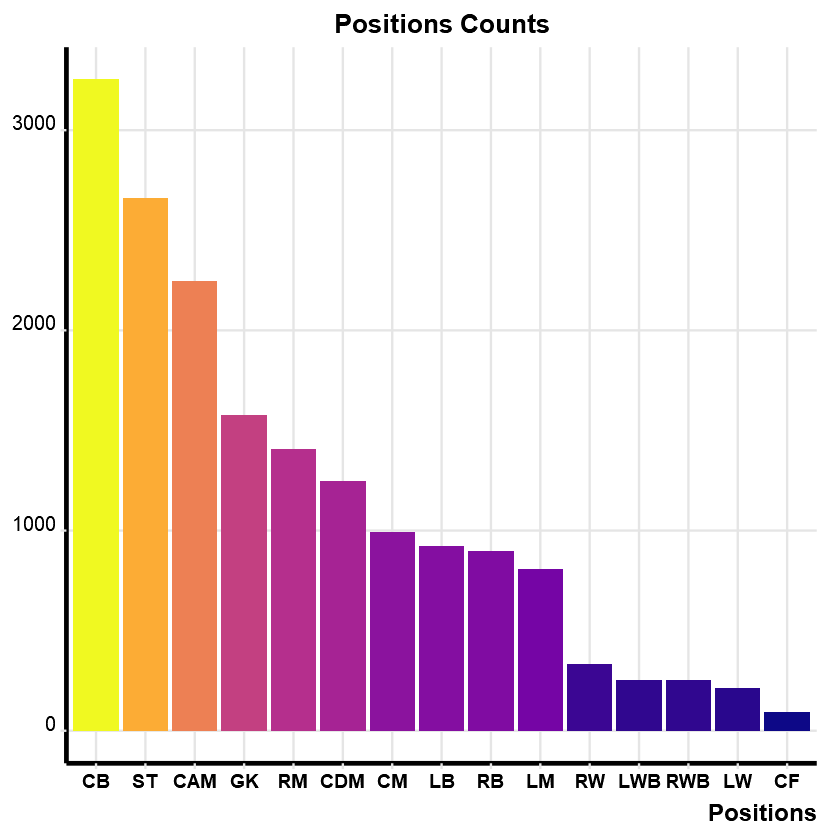
    
- 데이터에서 가장 많은 포지션은 센터백으로 스트라이커와 중앙 공격형 미드필더 포지션이 그 뒤를 잇는다.

<br/>

<br/>

#### 연령 분포 시각화


```R
fifa %>% ggplot(aes(Age)) + stat_count(aes(fill = ..count..)) +
  scale_y_continuous(breaks = seq(0, 2000, 200)) + 
  ggtitle("Age Distribution") +
  scale_fill_viridis_c(option = "C") +
  theme(legend.title = element_text(size = 12, face = "bold"),
        legend.key.height = unit(2.5, "cm"),
        axis.title.x = element_text(size = 14, face = "bold"),
        axis.title.y = element_blank(),
        axis.text.x = element_text(size = 11, face = "bold"),
        plot.title = element_text(size = 15, hjust = 0.5, face = "bold"),
        axis.line.x.bottom = element_line(color = "black", size = 1),
        axis.line.y.left = element_line(color = "black", size = 1))
```


    
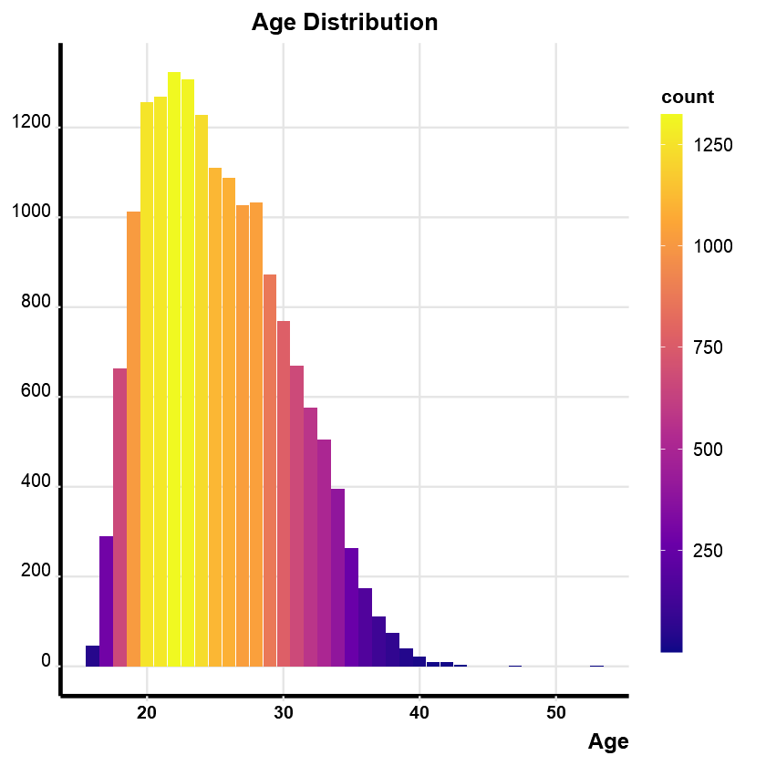
    
- 연령의 분포는 좌측으로 기울어져 있으며, 20 ~ 24세의 선수들이 가장 높은 비율을 가짐


#### 선수가치(Value)와 급여(Wage) 분포 

```R
head(fifa$Value)
```


<style>
.list-inline {list-style: none; margin:0; padding: 0}
.list-inline>li {display: inline-block}
.list-inline>li:not(:last-child)::after {content: "\00b7"; padding: 0 .5ex}
</style>
<ol class=list-inline><li>€625K</li><li>€600K</li><li>€1.1M</li><li>€0</li><li>€5.5M</li><li>€725K</li></ol>

<details>
	<summary style=display:list-item;cursor:pointer>
		<strong>Levels</strong>:
	</summary>
	<style>
	.list-inline {list-style: none; margin:0; padding: 0}
	.list-inline>li {display: inline-block}
	.list-inline>li:not(:last-child)::after {content: "\00b7"; padding: 0 .5ex}
	</style>
	<ol class=list-inline><li>'€0'</li><li>'€1.1M'</li><li>'€1.2M'</li><li>'€1.3M'</li><li>'€1.4M'</li><li>'€1.5M'</li><li>'€1.6M'</li><li>'€1.7M'</li><li>'€1.8M'</li><li>'€1.9M'</li><li>'€10.5M'</li><li>'€100K'</li><li>'€105.5M'</li><li>'€10K'</li><li>'€10M'</li><li>'€11.5M'</li><li>'€110K'</li><li>'€11M'</li><li>'€12.5M'</li><li>'€120K'</li><li>'€12M'</li><li>'€13.5M'</li><li>'€130K'</li><li>'€13M'</li><li>'€14.5M'</li><li>'€140K'</li><li>'€14M'</li><li>'€15.5M'</li><li>'€150K'</li><li>'€15K'</li><li>'€15M'</li><li>'€16.5M'</li><li>'€160K'</li><li>'€16M'</li><li>'€17.5M'</li><li>'€170K'</li><li>'€17M'</li><li>'€18.5M'</li><li>'€180K'</li><li>'€18M'</li><li>'€19.5M'</li><li>'€190K'</li><li>'€19M'</li><li>'€1K'</li><li>'€1M'</li><li>'€2.1M'</li><li>'€2.2M'</li><li>'€2.3M'</li><li>'€2.4M'</li><li>'€2.5M'</li><li>'€2.6M'</li><li>'€2.7M'</li><li>'€2.8M'</li><li>'€2.9M'</li><li>'€20.5M'</li><li>'€200K'</li><li>'€20K'</li><li>'€20M'</li><li>'€21.5M'</li><li>'€210K'</li><li>'€21M'</li><li>'€22.5M'</li><li>'€220K'</li><li>'€22M'</li><li>'€23.5M'</li><li>'€230K'</li><li>'€23M'</li><li>'€24.5M'</li><li>'€240K'</li><li>'€24M'</li><li>'€25.5M'</li><li>'€250K'</li><li>'€25K'</li><li>'€25M'</li><li>'€26.5M'</li><li>'€26M'</li><li>'€27.5M'</li><li>'€275K'</li><li>'€27M'</li><li>'€28.5M'</li><li>'€28M'</li><li>'€29.5M'</li><li>'€29M'</li><li>'€2M'</li><li>'€3.1M'</li><li>'€3.2M'</li><li>'€3.3M'</li><li>'€3.4M'</li><li>'€3.5M'</li><li>'€3.6M'</li><li>'€3.7M'</li><li>'€3.8M'</li><li>'€3.9M'</li><li>'€30.5M'</li><li>'€300K'</li><li>'€30K'</li><li>'€30M'</li><li>'€31.5M'</li><li>'€31M'</li><li>'€32.5M'</li><li>'€325K'</li><li>'€32M'</li><li>'€33.5M'</li><li>'€33M'</li><li>'€34.5M'</li><li>'€34M'</li><li>'€35.5M'</li><li>'€350K'</li><li>'€35K'</li><li>'€35M'</li><li>'€36.5M'</li><li>'€36M'</li><li>'€37.5M'</li><li>'€375K'</li><li>'€37M'</li><li>'€38.5M'</li><li>'€38M'</li><li>'€39.5M'</li><li>'€39M'</li><li>'€3K'</li><li>'€3M'</li><li>'€4.1M'</li><li>'€4.2M'</li><li>'€4.3M'</li><li>'€4.4M'</li><li>'€4.5M'</li><li>'€4.6M'</li><li>'€4.7M'</li><li>'€4.8M'</li><li>'€4.9M'</li><li>'€40.5M'</li><li>'€400K'</li><li>'€40K'</li><li>'€41.5M'</li><li>'€41M'</li><li>'€42.5M'</li><li>'€425K'</li><li>'€42M'</li><li>'€44.5M'</li><li>'€44M'</li><li>'€450K'</li><li>'€45K'</li><li>'€45M'</li><li>'€46.5M'</li><li>'€46M'</li><li>'€47.5M'</li><li>'€475K'</li><li>'€48.5M'</li><li>'€49.5M'</li><li>'€49M'</li><li>'€4M'</li><li>'€5.5M'</li><li>'€50.5M'</li><li>'€500K'</li><li>'€50K'</li><li>'€50M'</li><li>'€51.5M'</li><li>'€51M'</li><li>'€52.5M'</li><li>'€525K'</li><li>'€52M'</li><li>'€53.5M'</li><li>'€53M'</li><li>'€54.5M'</li><li>'€550K'</li><li>'€55M'</li><li>'€56M'</li><li>'€575K'</li><li>'€57M'</li><li>'€58M'</li><li>'€59.5M'</li><li>'€5K'</li><li>'€5M'</li><li>'€6.5M'</li><li>'€600K'</li><li>'€60K'</li><li>'€60M'</li><li>'€62.5M'</li><li>'€625K'</li><li>'€63M'</li><li>'€650K'</li><li>'€65M'</li><li>'€67.5M'</li><li>'€675K'</li><li>'€69.5M'</li><li>'€6M'</li><li>'€7.5M'</li><li>'€700K'</li><li>'€70K'</li><li>'€71M'</li><li>'€72.5M'</li><li>'€725K'</li><li>'€75.5M'</li><li>'€750K'</li><li>'€75M'</li><li>'€775K'</li><li>'€78M'</li><li>'€7M'</li><li>'€8.5M'</li><li>'€800K'</li><li>'€80K'</li><li>'€80M'</li><li>'€825K'</li><li>'€850K'</li><li>'€875K'</li><li>'€87M'</li><li>'€8K'</li><li>'€8M'</li><li>'€9.5M'</li><li>'€900K'</li><li>'€90K'</li><li>'€90M'</li><li>'€925K'</li><li>'€950K'</li><li>'€975K'</li><li>'€9M'</li></ol>
</details>


```R
fifa$Value <- fifa$Value %>% as.character()
fifa$Value_1 <- str_replace_all(fifa$Value, "€", "") %>%
  str_replace_all("K", "")
for (i in 1:length(fifa$Value_1)) {
  if (str_detect(fifa$Value_1[i], "\\.")) {
    fifa$Value_1[i] <- fifa$Value_1[i] %>% str_remove_all("\\.") %>% 
      str_replace_all("M", "00")
  } else {
    fifa$Value_1[i] <- fifa$Value_1[i] %>% str_remove_all("\\.") %>%
      str_replace_all("M", "000")
  }
}

fifa$Value_1 <- as.integer(fifa$Value_1)
head(fifa$Value_1)
```


<style>
.list-inline {list-style: none; margin:0; padding: 0}
.list-inline>li {display: inline-block}
.list-inline>li:not(:last-child)::after {content: "\00b7"; padding: 0 .5ex}
</style>
<ol class=list-inline><li>625</li><li>600</li><li>1100</li><li>0</li><li>5500</li><li>725</li></ol>


```R
head(fifa$Wage)
```


<style>
.list-inline {list-style: none; margin:0; padding: 0}
.list-inline>li {display: inline-block}
.list-inline>li:not(:last-child)::after {content: "\00b7"; padding: 0 .5ex}
</style>
<ol class=list-inline><li>€7K</li><li>€7K</li><li>€15K</li><li>€0</li><li>€12K</li><li>€5K</li></ol>

<details>
	<summary style=display:list-item;cursor:pointer>
		<strong>Levels</strong>:
	</summary>
	<style>
	.list-inline {list-style: none; margin:0; padding: 0}
	.list-inline>li {display: inline-block}
	.list-inline>li:not(:last-child)::after {content: "\00b7"; padding: 0 .5ex}
	</style>
	<ol class=list-inline><li>'€0'</li><li>'€100K'</li><li>'€105K'</li><li>'€10K'</li><li>'€110K'</li><li>'€115K'</li><li>'€11K'</li><li>'€120K'</li><li>'€125K'</li><li>'€12K'</li><li>'€130K'</li><li>'€135K'</li><li>'€13K'</li><li>'€140K'</li><li>'€145K'</li><li>'€14K'</li><li>'€150K'</li><li>'€155K'</li><li>'€15K'</li><li>'€160K'</li><li>'€165K'</li><li>'€16K'</li><li>'€170K'</li><li>'€175K'</li><li>'€17K'</li><li>'€18K'</li><li>'€190K'</li><li>'€195K'</li><li>'€19K'</li><li>'€1K'</li><li>'€200K'</li><li>'€20K'</li><li>'€210K'</li><li>'€21K'</li><li>'€220K'</li><li>'€22K'</li><li>'€230K'</li><li>'€23K'</li><li>'€240K'</li><li>'€24K'</li><li>'€250'</li><li>'€250K'</li><li>'€25K'</li><li>'€260K'</li><li>'€26K'</li><li>'€270K'</li><li>'€27K'</li><li>'€28K'</li><li>'€290K'</li><li>'€29K'</li><li>'€2K'</li><li>'€300K'</li><li>'€30K'</li><li>'€310K'</li><li>'€31K'</li><li>'€32K'</li><li>'€33K'</li><li>'€34K'</li><li>'€350K'</li><li>'€35K'</li><li>'€36K'</li><li>'€370K'</li><li>'€37K'</li><li>'€38K'</li><li>'€39K'</li><li>'€3K'</li><li>'€40K'</li><li>'€41K'</li><li>'€42K'</li><li>'€43K'</li><li>'€44K'</li><li>'€45K'</li><li>'€46K'</li><li>'€47K'</li><li>'€48K'</li><li>'€49K'</li><li>'€4K'</li><li>'€500'</li><li>'€50K'</li><li>'€51K'</li><li>'€52K'</li><li>'€53K'</li><li>'€54K'</li><li>'€550'</li><li>'€55K'</li><li>'€560K'</li><li>'€56K'</li><li>'€57K'</li><li>'€58K'</li><li>'€59K'</li><li>'€5K'</li><li>'€600'</li><li>'€60K'</li><li>'€61K'</li><li>'€62K'</li><li>'€63K'</li><li>'€64K'</li><li>'€650'</li><li>'€65K'</li><li>'€66K'</li><li>'€67K'</li><li>'€68K'</li><li>'€69K'</li><li>'€6K'</li><li>'€700'</li><li>'€70K'</li><li>'€71K'</li><li>'€72K'</li><li>'€73K'</li><li>'€74K'</li><li>'€750'</li><li>'€75K'</li><li>'€76K'</li><li>'€77K'</li><li>'€78K'</li><li>'€79K'</li><li>'€7K'</li><li>'€800'</li><li>'€80K'</li><li>'€81K'</li><li>'€82K'</li><li>'€83K'</li><li>'€84K'</li><li>'€850'</li><li>'€85K'</li><li>'€86K'</li><li>'€87K'</li><li>'€89K'</li><li>'€8K'</li><li>'€900'</li><li>'€90K'</li><li>'€91K'</li><li>'€92K'</li><li>'€93K'</li><li>'€94K'</li><li>'€950'</li><li>'€95K'</li><li>'€96K'</li><li>'€97K'</li><li>'€98K'</li><li>'€99K'</li><li>'€9K'</li></ol>
</details>


```R
fifa$Wage <- fifa$Wage %>% as.character()
fifa$Wage_1 <- str_replace_all(fifa$Wage, "€", "") %>%
  str_replace_all("K", "000") %>% as.integer()
head(fifa$Wage_1)
```


<style>
.list-inline {list-style: none; margin:0; padding: 0}
.list-inline>li {display: inline-block}
.list-inline>li:not(:last-child)::after {content: "\00b7"; padding: 0 .5ex}
</style>
<ol class=list-inline><li>7000</li><li>7000</li><li>15000</li><li>0</li><li>12000</li><li>5000</li></ol>


```R
ggplot(fifa, aes(Value_1, Wage_1, size = Wage_1, color = Value_1)) + 
  geom_point(alpha = 0.7) + 
  ggtitle("Value vs Wage Plot") + xlab("Value (€)") + ylab("Wage (€)") + 
  scale_size_continuous("Wage", breaks = seq(0, 600000, 100000),
                        labels = paste0(seq(0, 600, 100), "K")) + 
  scale_color_viridis_c("Value", option = "D") +
  scale_y_continuous(labels = paste0(seq(0, 600, 100), "K"), 
                     limits = c(0, 600000), 
                     breaks = seq(0, 600000, 100000)) +
  scale_x_continuous(labels = paste0(seq(0, 100, 20), "M"),
                     breaks = seq(0, 100000, 20000)) +
  theme(legend.key.height = unit(1, "cm"),
        axis.title.x = element_text(size = 14, face = "bold", hjust = 0.5),
        axis.title.y = element_text(size = 14, face = "bold", angle = 0, vjust = 0.5),
        plot.title = element_text(size = 15, hjust = 0.5, face = "bold"),
        axis.line.x.bottom = element_line(color = "black", size = 1),
        axis.line.y.left = element_line(color = "black", size = 1))
```


    
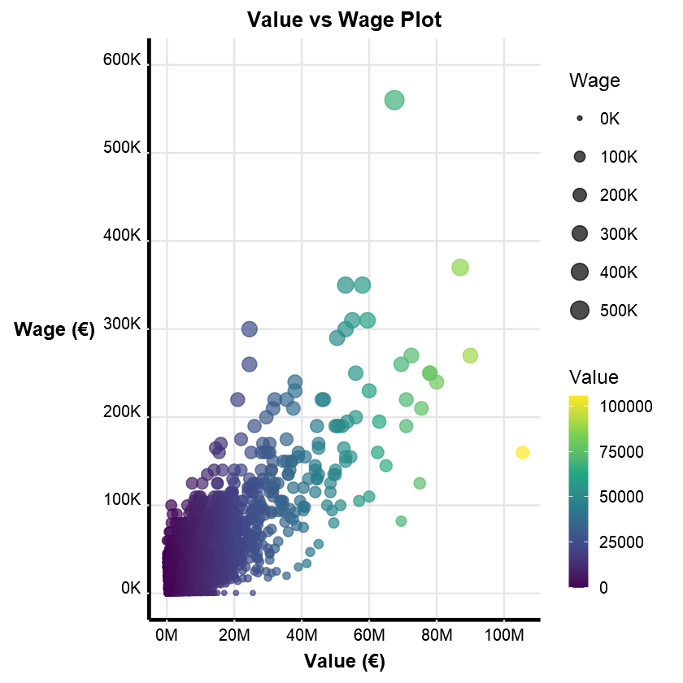
    
<br/>

### 선수가치 Top 10


```R
top10_value <- fifa %>% arrange(-Value_1) %>% head(10) %>% 
    mutate(Name = as.character(Name))
top10_value$Name[1] <- "K. Mbappe" ; top10_value$Name[5] <- "S. Mane"

top10_value %>% arrange(-Value_1) %>% head(10) %>%
    ggplot(aes(fct_reorder(Name, Value_1), Value_1)) +
    geom_col(fill = "azure", color = "black") + ylab("Value (€)") + coord_flip() + 
    geom_text(aes(label = paste0(c(Value_1 / 1000), "M €")), hjust = 1.5) + 
    ggtitle("Top10 Value Players") +
    scale_y_continuous(labels = paste0(seq(0, 600, 20), "M"), 
                     limits = c(0, 120000), 
                     breaks = seq(0, 600000, 20000)) +
    theme(legend.position = "none",
          axis.text.y = element_text(size = 12, face = "bold"),
          axis.title.y = element_blank(),
         axis.title.x = element_text(size = 13, face = "bold", hjust = 0.5),
         plot.title = element_text(size = 15, hjust = 0.5, face = "bold.italic"))
```


    
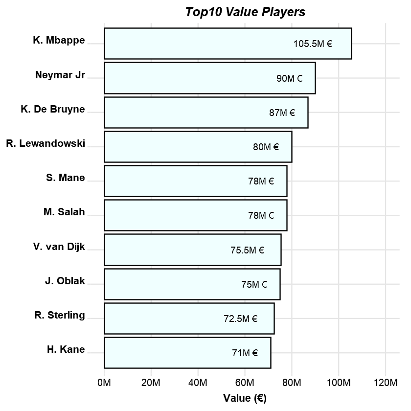
    
- 가장 가치가 높은 선수는 K.Mbappe(킬리앙 음바페)로, 그 가치는 105.5M 파운드(1700억원)이다.

<br/>

### 선수급여 Top 10


```R
top10_wage <- fifa %>% arrange(-Wage_1) %>% head(10) %>% 
    mutate(Name = as.character(Name))
top10_wage$Name[7] <- "S. Aguero"

top10_wage %>% arrange(-Wage_1) %>% head(10) %>%
    ggplot(aes(fct_reorder(Name, Wage_1), Wage_1)) +
    geom_col(fill = "burlywood1", color = "black") + ylab("Wage (€)") + coord_flip() + 
    geom_text(aes(label = paste0(c(Wage_1 / 1000), "K €")), hjust = 1.5) + 
    ggtitle("Top10 Wage Players") +
    scale_y_continuous(labels = paste0(seq(0, 600, 100), "K"), 
                     limits = c(0, 600000), 
                     breaks = seq(0, 600000, 100000)) +

    theme(legend.position = "none",
          axis.text.y = element_text(size = 12, face = "bold"),
          axis.title.y = element_blank(),
         axis.title.x = element_text(size = 13, face = "bold", hjust = 0.5),
         plot.title = element_text(size = 15, hjust = 0.5, face = "bold.italic"))
```


    
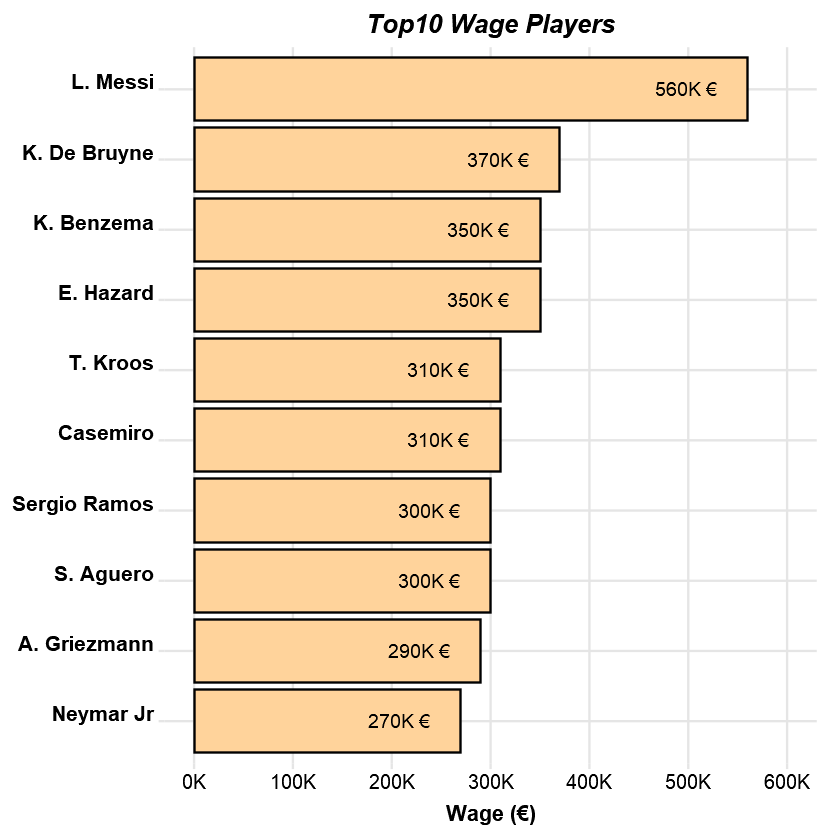

- 가장 높은 급여를 가진 선수는 L.Messi(리오넬 메시)로, 주급은 56만 파운드(9억원)이다.


<br/>

<br/>

### 유럽 5대리그
#### 유럽 상위 5대리그 (잉글랜드 EPL, 스페인 Laliga, 독일 Bundes Liga, 이탈리아 Serie A, 프랑스 Ligue 1)에 속한 선수들의 특성 분포 시각화를 위한 데이터 Filtering


```R
EPL <- c("Manchester United", "Manchester City", "Chelsea", "Liverpool", 
         "Leicester City", "Tottenham Hotspur", "West Ham United", "Arsenal",
         "Leeds United", "Everton", "Aston Villa", "Newcastle United", 
         "Wolverhampton Wanderers", "Crystal Palace", "Southampton", "Brighton & Hove Albion",
         "Burnley", "Fulham", "West Bromwich Albion", "Sheffield United")

LALIGA <- c("Real Madrid", "Atletico Madrid", "FC Barcelona", "Athletic Club de Bilbao", "Real Betis", 
            "RC Celta", "Real Sociedad", "Valencia CF", "Real Valladolid CF", "Deportivo Alav?s",
            "SD Eibar", "Elche CF", "CA Osasuna", "Sevilla FC", "Villarreal CF",
            "Levante UD", "Getafe CF", "C?diz CF", "Granada CF", "SD Huesca")

BUNDES <- c("FC Bayern M?nchen", "Borussia Dortmund", "Borussia M?nchengladbach", "SC Freiburg", 
            "1. FC K?ln", "Bayer 04 Leverkusen", "FC Schalke 04", "VfB Stuttgart", 
            "SV Werder Bremen", "DSC Arminia Bielefeld", "Hertha BSC", "1. FSV Mainz 05", 
            "VfL Wolfsburg", "Eintracht Frankfurt", "1. FC Union Berlin",
            "TSG 1899 Hoffenheim", "FC Augsburg", "RB Leipzig")
SERIE <- c("Juventus", "Inter", "Atalanta", "Lazio",
           "Milan", "Napoli", "Parma", "Roma",
           "Torino", "Udinese", "Bologna", "Hellas Verona",
           "Sampdoria", "Cagliari", "Fiorentina", "Genoa",
           "Crotone", "Spezia", "Sassuolo", "Benevento")
LIGUE1 <- c("Paris Saint-Germain", "Olympique Lyonnais", "Olympique de Marseille", "OGC Nice",
            "FC Nantes", "FC Girondins de Bordeaux", "Racing Club de Lens", "LOSC Lille",
            "FC Metz", "AS Monaco", "Montpellier HSC", "Stade Rennais FC",
            "RC Strasbourg Alsace", "FC Lorient", "N?mes Olympique", "Stade Brestois 29",
            "Stade de Reims", "Angers SCO", "AS Saint-?tienne", "Dijon FCO")
```


```R
league_df <- fifa %>% filter(Club %in% c(EPL, LALIGA, BUNDES, SERIE, LIGUE1))

for (i in 1:nrow(league_df)) {
  if (league_df$Club[i] %in% EPL) {
    league_df$League[i] = "EPL"
  } else if (league_df$Club[i] %in% LALIGA) {
    league_df$League[i] = "LALIGA"
  } else if (league_df$Club[i] %in% BUNDES) {
    league_df$League[i] = "BUNDES"
  } else if (league_df$Club[i] %in% SERIE) {
    league_df$League[i] = "SERIE"
  } else {
    league_df$League[i] = "LIGUE1"
  }
}

dim(league_df)
```


<style>
.list-inline {list-style: none; margin:0; padding: 0}
.list-inline>li {display: inline-block}
.list-inline>li:not(:last-child)::after {content: "\00b7"; padding: 0 .5ex}
</style>
<ol class=list-inline><li>3524</li><li>112</li></ol>

<br/>

### 유럽 5대리그의 리그별 OVA분포


```R
a1 <- league_df %>% group_by(League) %>% select(League, OVA) %>%
  ggplot(aes(OVA, fct_relevel(League, c("LIGUE1", "SERIE", "BUNDES", "LALIGA", "EPL")))) + 
  geom_density_ridges_gradient(aes(fill = stat(x), scale = 1.5)) +
  ggtitle("OVA Distribution of Leagues") +
  scale_x_continuous(limits = c(30, 100)) + 
  theme(legend.position = "top",
        legend.title = element_text(size = 10, face = "bold"),
        legend.key.width = unit(2.5, "cm"),
        axis.text.x = element_text(size = 11, face = "bold"),
        axis.text.y = element_text(size = 13, face = "bold"),
        axis.title.x = element_blank(),
        axis.title.y = element_blank(),
        plot.title = element_text(size = 15, hjust = 0.5, face = "bold.italic")) +
  scale_fill_viridis_c(name = "OVA", option = "C")

a2 <- league_df %>% group_by(League) %>% select(League, OVA) %>%
  ggplot(aes(OVA, fct_relevel(League, c("LIGUE1", "SERIE", "BUNDES", "LALIGA", "EPL")))) + 
  geom_boxplot(aes(fill = League)) +
  ggtitle("OVA Boxplot of Leagues") +
  scale_x_continuous(limits = c(30, 100)) +
  theme(legend.position = "none",
        axis.text.x = element_text(size = 11, face = "bold"),
        axis.text.y = element_text(size = 13, face = "bold"),
        axis.title.x = element_blank(),
        axis.title.y = element_blank(),
        plot.title = element_text(size = 15, hjust = 0.5, face = "bold.italic"))

gridExtra::grid.arrange(a1, a2, nrow = 2)
```

    Picking joint bandwidth of 1.78
    
    


    
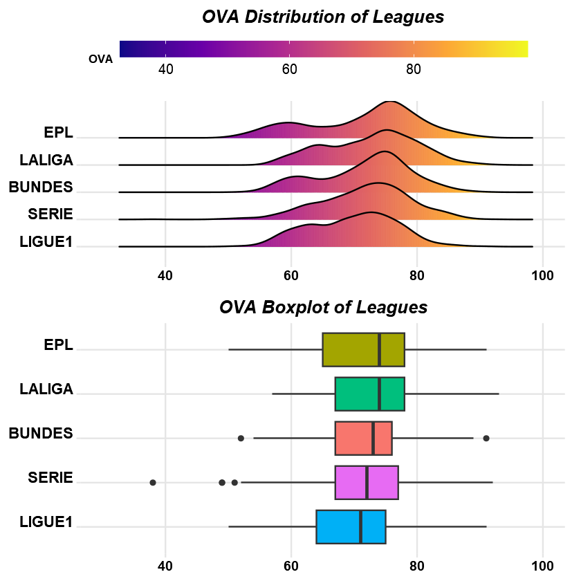
    
<br/>

<br/>

### 유럽 5대리그의 리그별 선수급여 분포


```R
b1 <- league_df %>% group_by(League) %>% select(League, Wage_1) %>%
  ggplot(aes(Wage_1, fct_relevel(League, c("LIGUE1", "SERIE", "BUNDES", "LALIGA", "EPL")))) + 
  geom_density_ridges_gradient(aes(fill = stat(x), scale = 1)) +
  ggtitle("Wage Distribution of Leagues") +
  scale_x_continuous(labels = paste0(seq(0, 600, 100), "K"), 
                     limits = c(-50000, 600000), 
                     breaks = seq(0, 600000, 100000)) +
  theme(legend.position = "top",
        legend.title = element_text(size = 10, face = "bold"),
        legend.key.width = unit(2.5, "cm"),
        axis.text.x = element_text(size = 11, face = "bold"),
        axis.text.y = element_text(size = 13, face = "bold"),
        axis.title.x = element_blank(),
        axis.title.y = element_blank(),
        plot.title = element_text(size = 15, hjust = 0.5, face = "bold.italic")) +
  scale_fill_viridis_c(name = "Wage", option = "E")

b2 <- league_df %>% group_by(League) %>% select(League, Wage_1) %>%
  ggplot(aes(Wage_1, fct_relevel(League, c("LIGUE1", "SERIE", "BUNDES", "LALIGA", "EPL")))) + 
  geom_boxplot(aes(fill = League)) +
  scale_x_continuous(labels = paste0(seq(0, 600, 100), "K"), 
                     limits = c(-50000, 600000), 
                     breaks = seq(0, 600000, 100000)) +
  ggtitle("Wage Boxplot of Leagues") +
  theme(legend.position = "none",
        axis.text.x = element_text(size = 11, face = "bold"),
        axis.text.y = element_text(size = 13, face = "bold"),
        axis.title.x = element_blank(),
        axis.title.y = element_blank(),
        plot.title = element_text(size = 15, hjust = 0.5, face = "bold.italic"))

gridExtra::grid.arrange(b1, b2, nrow = 2)
```

    Picking joint bandwidth of 5490
    
    


    
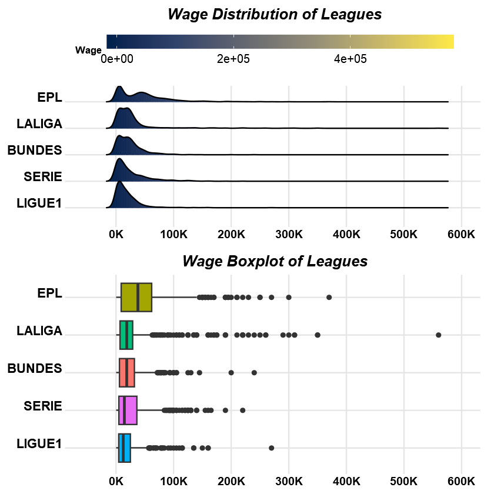
    

<br/>

<br/>

### 유럽 5대리그의 리그별 선수급여 분포

```R
c1 <- league_df %>% group_by(League) %>% select(League, Value_1) %>%
  ggplot(aes(Value_1, fct_relevel(League, c("LIGUE1", "SERIE", "BUNDES", "LALIGA", "EPL")))) + 
  geom_density_ridges_gradient(aes(fill = stat(x), scale = 1)) +
  ggtitle("Value Distribution of Leagues") +
  scale_x_continuous(labels = paste0(seq(0, 100, 20), "M"),
                     breaks = seq(0, 100000, 20000)) +
  theme(legend.position = "top",
        legend.title = element_text(size = 10, face = "bold"),
        legend.key.width = unit(2.5, "cm"),
        axis.text.x = element_text(size = 11, face = "bold"),
        axis.text.y = element_text(size = 13, face = "bold"),
        axis.title.x = element_blank(),
        axis.title.y = element_blank(),
        plot.title = element_text(size = 15, hjust = 0.5, face = "bold.italic")) +
  scale_fill_viridis_c(name = "Value", option = "A")

c2 <- league_df %>% group_by(League) %>% select(League, Value_1) %>%
  ggplot(aes(Value_1, fct_relevel(League, c("LIGUE1", "SERIE", "BUNDES", "LALIGA", "EPL")))) + 
  geom_boxplot(aes(fill = League)) +
  scale_x_continuous(labels = paste0(seq(0, 100, 20), "M"),
                     breaks = seq(0, 100000, 20000)) +
  ggtitle("Value Boxplot of Leagues") +
  theme(legend.position = "none",
        axis.text.x = element_text(size = 11, face = "bold"),
        axis.text.y = element_text(size = 13, face = "bold"),
        axis.title.x = element_blank(),
        axis.title.y = element_blank(),
        plot.title = element_text(size = 15, hjust = 0.5, face = "bold.italic"))

gridExtra::grid.arrange(c1, c2, nrow = 2)
```

    Picking joint bandwidth of 1370
    
    


    
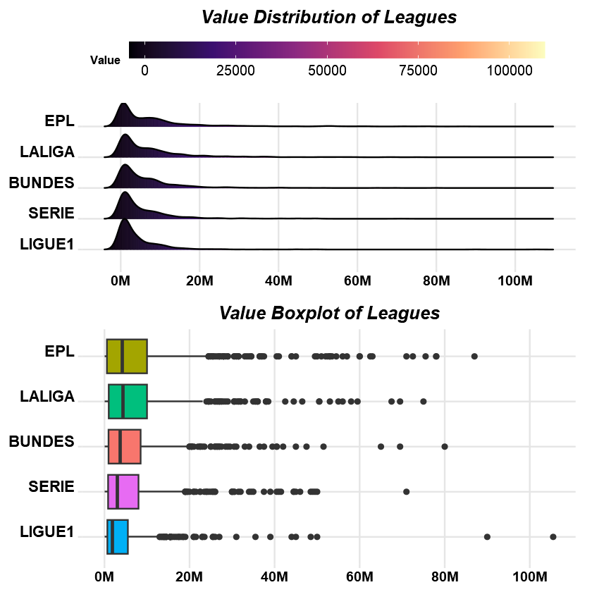
    
<br/>

<br/>

### 각 리그별 Best 11 선정
- ST, CF, LW, LM, RW, RW 포지션을 공격진 (FW_LW_RW)으로 라벨링
- CM, CAM, CDM 포지션을 미드필더 (MF)로 라벨링
- LB, LWB를 좌측 측면 수비수 (LB)로 라벨링
- RB, RWB를 우측 측면 수비수 (RB)로 라벨링
- CB와 GK는 각각 중앙 수비수 (CB)와 골키퍼 (GK)로 라벨링
- 이후 포지션별 가장 OVA를 가진 선수들로 Best 11을 선정

<br/>

### EPL Best 11


```R
FW_LW_RW <- c("ST", "CF", "LW", "LM", "RM", "RW")
MF <- c("CM", "CAM", "CDM")
LB <- c("LB", "LWB") ; RB <- c("RB", "RWB")
CB <- c("CB") ; GK = c("GK")

for (i in 1:nrow(league_df)) {
  if (league_df$BP[i] %in% FW_LW_RW) {
    league_df$BP2[i] = "FW_LW_RW"
  } else if (league_df$BP[i] %in% MF) {
    league_df$BP2[i] = "MF"
  } else if (league_df$BP[i] %in% LB) {
    league_df$BP2[i] = "LB"
  } else if (league_df$BP[i] %in% RB) {
    league_df$BP2[i] = "RB"
  } else if (league_df$BP[i] %in% CB) {
    league_df$BP2[i] = "CB"
  } else if (league_df$BP[i] %in% GK) {
    league_df$BP2[i] = "GK"
  }
}
```


```R
epl_fw <- league_df %>% filter(League == "EPL") %>% filter(BP2 == "FW_LW_RW") %>% 
        arrange(-OVA) %>% head(3) %>% select(Name, Nationality, Club, OVA, BP, Age)
epl_mf <- league_df %>% filter(League == "EPL") %>% filter(BP2 == "MF") %>% 
        arrange(-OVA) %>% head(3) %>% select(Name, Nationality, Club, OVA, BP, Age)
epl_lb <- league_df %>% filter(League == "EPL") %>% filter(BP2 == "LB") %>%
        arrange(-OVA) %>% head(1) %>% select(Name, Nationality, Club, OVA, BP, Age)
epl_cb <- league_df %>% filter(League == "EPL") %>% filter(BP2 == "CB") %>% 
        arrange(-OVA) %>% head(2) %>% select(Name, Nationality, Club, OVA, BP, Age)
epl_rb <- league_df %>% filter(League == "EPL") %>% filter(BP2 == "RB") %>%
        arrange(-OVA) %>% head(1) %>% select(Name, Nationality, Club, OVA, BP, Age)
epl_gk <- league_df %>% filter(League == "EPL") %>% filter(BP2 == "GK") %>% 
        arrange(-OVA) %>% head(1) %>% select(Name, Nationality, Club, OVA, BP, Age)
```


```R
rbind(epl_fw, epl_mf) %>% rbind(epl_lb) %>% rbind(epl_cb) %>% rbind(epl_rb) %>% rbind(epl_gk)
```


<table class="dataframe">
<caption>A data.frame: 11 × 6</caption>
<thead>
	<tr><th scope=col>Name</th><th scope=col>Nationality</th><th scope=col>Club</th><th scope=col>OVA</th><th scope=col>BP</th><th scope=col>Age</th></tr>
	<tr><th scope=col>&lt;fct&gt;</th><th scope=col>&lt;fct&gt;</th><th scope=col>&lt;fct&gt;</th><th scope=col>&lt;int&gt;</th><th scope=col>&lt;fct&gt;</th><th scope=col>&lt;int&gt;</th></tr>
</thead>
<tbody>
	<tr><td>S. Mane            </td><td>Senegal    </td><td>Liverpool      </td><td>90</td><td>LW </td><td>28</td></tr>
	<tr><td>M. Salah           </td><td>Egypt      </td><td>Liverpool      </td><td>90</td><td>RW </td><td>28</td></tr>
	<tr><td>S. Aguero          </td><td>Argentina  </td><td>Manchester City</td><td>89</td><td>ST </td><td>32</td></tr>
	<tr><td>K. De Bruyne       </td><td>Belgium    </td><td>Manchester City</td><td>91</td><td>CAM</td><td>29</td></tr>
	<tr><td>N. Kante           </td><td>France     </td><td>Chelsea        </td><td>88</td><td>CDM</td><td>29</td></tr>
	<tr><td>Fabinho            </td><td>Brazil     </td><td>Liverpool      </td><td>87</td><td>CDM</td><td>26</td></tr>
	<tr><td>A. Robertson       </td><td>Scotland   </td><td>Liverpool      </td><td>87</td><td>LB </td><td>26</td></tr>
	<tr><td>V. van Dijk        </td><td>Netherlands</td><td>Liverpool      </td><td>90</td><td>CB </td><td>28</td></tr>
	<tr><td>A. Laporte         </td><td>France     </td><td>Manchester City</td><td>87</td><td>CB </td><td>26</td></tr>
	<tr><td>T. Alexander-Arnold</td><td>England    </td><td>Liverpool      </td><td>87</td><td>RB </td><td>21</td></tr>
	<tr><td>Alisson            </td><td>Brazil     </td><td>Liverpool      </td><td>90</td><td>GK </td><td>27</td></tr>
</tbody>
</table>

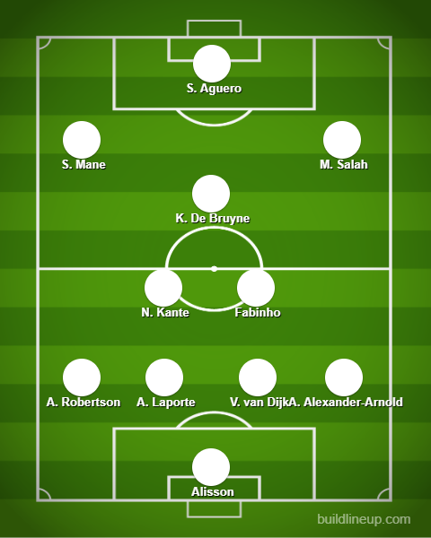

<br/>

### LALIGA


```R
llg_fw <- league_df %>% filter(League == "LALIGA") %>% filter(BP2 == "FW_LW_RW") %>% 
        arrange(-OVA) %>% head(3) %>% select(Name, Nationality, Club, OVA, BP, Age)
llg_mf <- league_df %>% filter(League == "LALIGA") %>% filter(BP2 == "MF") %>% 
        arrange(-OVA) %>% head(3) %>% select(Name, Nationality, Club, OVA, BP, Age)
llg_lb <- league_df %>% filter(League == "LALIGA") %>% filter(BP2 == "LB") %>%
        arrange(-OVA) %>% head(1) %>% select(Name, Nationality, Club, OVA, BP, Age)
llg_cb <- league_df %>% filter(League == "LALIGA") %>% filter(BP2 == "CB") %>% 
        arrange(-OVA) %>% head(2) %>% select(Name, Nationality, Club, OVA, BP, Age)
llg_rb <- league_df %>% filter(League == "LALIGA") %>% filter(BP2 == "RB") %>%
        arrange(-OVA) %>% head(1) %>% select(Name, Nationality, Club, OVA, BP, Age)
llg_gk <- league_df %>% filter(League == "LALIGA") %>% filter(BP2 == "GK") %>% 
        arrange(-OVA) %>% head(1) %>% select(Name, Nationality, Club, OVA, BP, Age)
```


```R
rbind(llg_fw, llg_mf) %>% rbind(llg_lb) %>% rbind(llg_cb) %>% rbind(llg_rb) %>% rbind(llg_gk)
```


<table class="dataframe">
<caption>A data.frame: 11 × 6</caption>
<thead>
	<tr><th scope=col>Name</th><th scope=col>Nationality</th><th scope=col>Club</th><th scope=col>OVA</th><th scope=col>BP</th><th scope=col>Age</th></tr>
	<tr><th scope=col>&lt;fct&gt;</th><th scope=col>&lt;fct&gt;</th><th scope=col>&lt;fct&gt;</th><th scope=col>&lt;int&gt;</th><th scope=col>&lt;fct&gt;</th><th scope=col>&lt;int&gt;</th></tr>
</thead>
<tbody>
	<tr><td>L. Messi    </td><td>Argentina</td><td>FC Barcelona   </td><td>93</td><td>RW </td><td>33</td></tr>
	<tr><td>K. Benzema  </td><td>France   </td><td>Real Madrid    </td><td>89</td><td>CF </td><td>32</td></tr>
	<tr><td>E. Hazard   </td><td>Belgium  </td><td>Real Madrid    </td><td>88</td><td>LW </td><td>29</td></tr>
	<tr><td>Casemiro    </td><td>Brazil   </td><td>Real Madrid    </td><td>89</td><td>CDM</td><td>28</td></tr>
	<tr><td>T. Kroos    </td><td>Germany  </td><td>Real Madrid    </td><td>88</td><td>CM </td><td>30</td></tr>
	<tr><td>L. Modric   </td><td>Croatia  </td><td>Real Madrid    </td><td>87</td><td>CM </td><td>34</td></tr>
	<tr><td>Jordi Alba  </td><td>Spain    </td><td>FC Barcelona   </td><td>86</td><td>LB </td><td>31</td></tr>
	<tr><td>Sergio Ramos</td><td>Spain    </td><td>Real Madrid    </td><td>89</td><td>CB </td><td>34</td></tr>
	<tr><td>Pique       </td><td>Spain    </td><td>FC Barcelona   </td><td>86</td><td>CB </td><td>33</td></tr>
	<tr><td>Carvajal    </td><td>Spain    </td><td>Real Madrid    </td><td>86</td><td>RB </td><td>28</td></tr>
	<tr><td>J. Oblak    </td><td>Slovenia </td><td>Atletico Madrid</td><td>91</td><td>GK </td><td>27</td></tr>
</tbody>
</table>


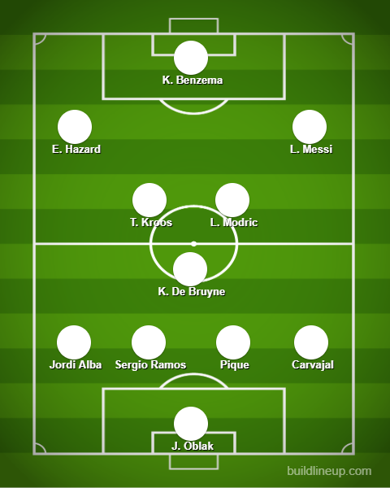

<br/>

### BUNDES


```R
bun_fw <- league_df %>% filter(League == "BUNDES") %>% filter(BP2 == "FW_LW_RW") %>% 
        arrange(-OVA) %>% head(3) %>% select(Name, Nationality, Club, OVA, BP, Age)
bun_mf <- league_df %>% filter(League == "BUNDES") %>% filter(BP2 == "MF") %>% 
        arrange(-OVA) %>% head(3) %>% select(Name, Nationality, Club, OVA, BP, Age)
bun_lb <- league_df %>% filter(League == "BUNDES") %>% filter(BP2 == "LB") %>%
        arrange(-OVA) %>% head(1) %>% select(Name, Nationality, Club, OVA, BP, Age)
bun_cb <- league_df %>% filter(League == "BUNDES") %>% filter(BP2 == "CB") %>% 
        arrange(-OVA) %>% head(2) %>% select(Name, Nationality, Club, OVA, BP, Age)
bun_rb <- league_df %>% filter(League == "BUNDES") %>% filter(BP2 == "RB") %>%
        arrange(-OVA) %>% head(2) %>% select(Name, Nationality, Club, OVA, BP, Age)
bun_gk <- league_df %>% filter(League == "BUNDES") %>% filter(BP2 == "GK") %>% 
        arrange(-OVA) %>% head(1) %>% select(Name, Nationality, Club, OVA, BP, Age)
```


```R
rbind(bun_fw, bun_mf) %>% rbind(bun_lb) %>% rbind(bun_cb) %>% rbind(bun_rb[2,]) %>% rbind(bun_gk)
```


<table class="dataframe">
<caption>A data.frame: 11 × 6</caption>
<thead>
	<tr><th></th><th scope=col>Name</th><th scope=col>Nationality</th><th scope=col>Club</th><th scope=col>OVA</th><th scope=col>BP</th><th scope=col>Age</th></tr>
	<tr><th></th><th scope=col>&lt;fct&gt;</th><th scope=col>&lt;fct&gt;</th><th scope=col>&lt;fct&gt;</th><th scope=col>&lt;int&gt;</th><th scope=col>&lt;fct&gt;</th><th scope=col>&lt;int&gt;</th></tr>
</thead>
<tbody>
	<tr><th scope=row>1</th><td>R. Lewandowski</td><td>Poland </td><td>FC Bayern Munchen  </td><td>91</td><td>ST </td><td>31</td></tr>
	<tr><th scope=row>2</th><td>S. Gnabry     </td><td>Germany</td><td>FC Bayern Munchen  </td><td>85</td><td>RM </td><td>24</td></tr>
	<tr><th scope=row>3</th><td>L. Sane       </td><td>Germany</td><td>FC Bayern Munchen  </td><td>85</td><td>LM </td><td>24</td></tr>
	<tr><th scope=row>4</th><td>J. Kimmich    </td><td>Germany</td><td>FC Bayern Munchen  </td><td>88</td><td>CDM</td><td>25</td></tr>
	<tr><th scope=row>5</th><td>J. Sancho     </td><td>England</td><td>Borussia Dortmund  </td><td>87</td><td>CAM</td><td>20</td></tr>
	<tr><th scope=row>6</th><td>T. Muller     </td><td>Germany</td><td>FC Bayern Munchen  </td><td>86</td><td>CAM</td><td>30</td></tr>
	<tr><th scope=row>7</th><td>M. Halstenberg</td><td>Germany</td><td>RB Leipzig         </td><td>82</td><td>LB </td><td>28</td></tr>
	<tr><th scope=row>8</th><td>M. Hummels    </td><td>Germany</td><td>Borussia Dortmund  </td><td>86</td><td>CB </td><td>31</td></tr>
	<tr><th scope=row>9</th><td>D. Alaba      </td><td>Austria</td><td>FC Bayern Munchen  </td><td>84</td><td>CB </td><td>28</td></tr>
	<tr><th scope=row>21</th><td>L. Bender     </td><td>Germany</td><td>Bayer 04 Leverkusen</td><td>82</td><td>RB </td><td>31</td></tr>
	<tr><th scope=row>11</th><td>M. Neuer      </td><td>Germany</td><td>FC Bayern Munchen  </td><td>89</td><td>GK </td><td>34</td></tr>
</tbody>
</table>

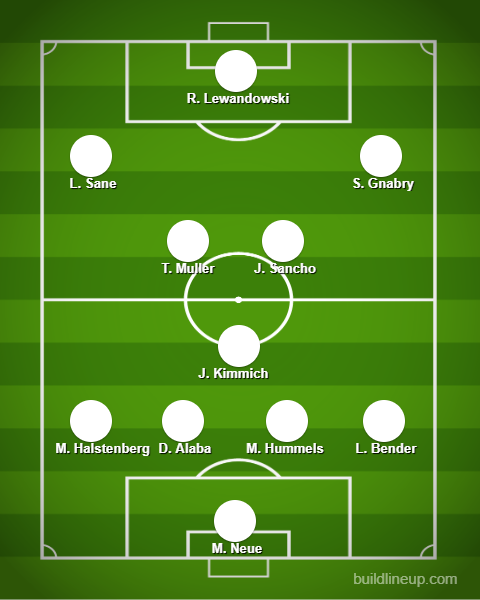

<br/>

### Serie


```R
ser_fw <- league_df %>% filter(League == "SERIE") %>% filter(BP2 == "FW_LW_RW") %>% 
        arrange(-OVA) %>% head(3) %>% select(Name, Nationality, Club, OVA, BP, Age)
ser_mf <- league_df %>% filter(League == "SERIE") %>% filter(BP2 == "MF") %>% 
        arrange(-OVA) %>% head(3) %>% select(Name, Nationality, Club, OVA, BP, Age)
ser_lb <- league_df %>% filter(League == "SERIE") %>% filter(BP2 == "LB") %>%
        arrange(-OVA) %>% head(1) %>% select(Name, Nationality, Club, OVA, BP, Age)
ser_cb <- league_df %>% filter(League == "SERIE") %>% filter(BP2 == "CB") %>% 
        arrange(-OVA) %>% head(2) %>% select(Name, Nationality, Club, OVA, BP, Age)
ser_rb <- league_df %>% filter(League == "SERIE") %>% filter(BP2 == "RB") %>%
        arrange(-OVA) %>% head(1) %>% select(Name, Nationality, Club, OVA, BP, Age)
ser_gk <- league_df %>% filter(League == "SERIE") %>% filter(BP2 == "GK") %>% 
        arrange(-OVA) %>% head(1) %>% select(Name, Nationality, Club, OVA, BP, Age)
```


```R
rbind(ser_fw, ser_mf) %>% rbind(ser_lb) %>% rbind(ser_cb) %>% rbind(ser_rb) %>% rbind(ser_gk)
```


<table class="dataframe">
<caption>A data.frame: 11 × 6</caption>
<thead>
	<tr><th scope=col>Name</th><th scope=col>Nationality</th><th scope=col>Club</th><th scope=col>OVA</th><th scope=col>BP</th><th scope=col>Age</th></tr>
	<tr><th scope=col>&lt;fct&gt;</th><th scope=col>&lt;fct&gt;</th><th scope=col>&lt;fct&gt;</th><th scope=col>&lt;int&gt;</th><th scope=col>&lt;fct&gt;</th><th scope=col>&lt;int&gt;</th></tr>
</thead>
<tbody>
	<tr><td>Cristiano Ronaldo</td><td>Portugal </td><td>Juventus</td><td>92</td><td>ST </td><td>35</td></tr>
	<tr><td>C. Immobile      </td><td>Italy    </td><td>Lazio   </td><td>87</td><td>ST </td><td>30</td></tr>
	<tr><td>D. Mertens       </td><td>Belgium  </td><td>Napoli  </td><td>85</td><td>CF </td><td>33</td></tr>
	<tr><td>P. Dybala        </td><td>Argentina</td><td>Juventus</td><td>88</td><td>CAM</td><td>26</td></tr>
	<tr><td>A. Gomez         </td><td>Argentina</td><td>Atalanta</td><td>86</td><td>CAM</td><td>32</td></tr>
	<tr><td>C. Eriksen       </td><td>Denmark  </td><td>Inter   </td><td>85</td><td>CAM</td><td>28</td></tr>
	<tr><td>Alex Sandro      </td><td>Brazil   </td><td>Juventus</td><td>85</td><td>LB </td><td>29</td></tr>
	<tr><td>K. Koulibaly     </td><td>Senegal  </td><td>Napoli  </td><td>88</td><td>CB </td><td>29</td></tr>
	<tr><td>G. Chiellini     </td><td>Italy    </td><td>Juventus</td><td>87</td><td>CB </td><td>35</td></tr>
	<tr><td>Danilo           </td><td>Brazil   </td><td>Juventus</td><td>79</td><td>RB </td><td>28</td></tr>
	<tr><td>S. Handanovic    </td><td>Slovenia </td><td>Inter   </td><td>88</td><td>GK </td><td>35</td></tr>
</tbody>
</table>

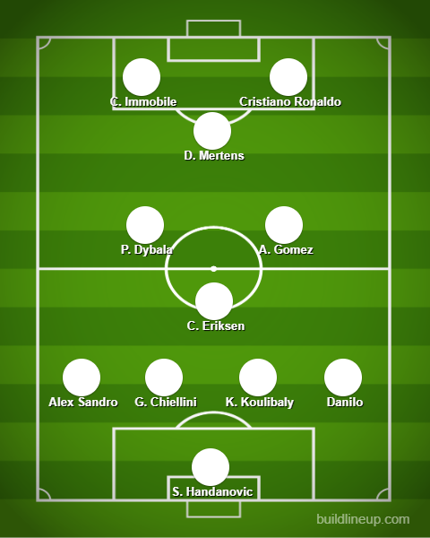

<br/>

### LIGUE1


```R
lig_fw <- league_df %>% filter(League == "LIGUE1") %>% filter(BP2 == "FW_LW_RW") %>% 
        arrange(-OVA) %>% head(3) %>% select(Name, Nationality, Club, OVA, BP, Age)
lig_mf <- league_df %>% filter(League == "LIGUE1") %>% filter(BP2 == "MF") %>% 
        arrange(-OVA) %>% head(3) %>% select(Name, Nationality, Club, OVA, BP, Age)
lig_lb <- league_df %>% filter(League == "LIGUE1") %>% filter(BP2 == "LB") %>%
        arrange(-OVA) %>% head(1) %>% select(Name, Nationality, Club, OVA, BP, Age)
lig_cb <- league_df %>% filter(League == "LIGUE1") %>% filter(BP2 == "CB") %>% 
        arrange(-OVA) %>% head(2) %>% select(Name, Nationality, Club, OVA, BP, Age)
lig_rb <- league_df %>% filter(League == "LIGUE1") %>% filter(BP2 == "RB") %>%
        arrange(-OVA) %>% head(1) %>% select(Name, Nationality, Club, OVA, BP, Age)
lig_gk <- league_df %>% filter(League == "LIGUE1") %>% filter(BP2 == "GK") %>% 
        arrange(-OVA) %>% head(1) %>% select(Name, Nationality, Club, OVA, BP, Age)
```


```R
rbind(lig_fw, lig_mf) %>% rbind(lig_lb) %>% rbind(lig_cb) %>% rbind(lig_rb) %>% rbind(lig_gk)
```


<table class="dataframe">
<caption>A data.frame: 11 × 6</caption>
<thead>
	<tr><th scope=col>Name</th><th scope=col>Nationality</th><th scope=col>Club</th><th scope=col>OVA</th><th scope=col>BP</th><th scope=col>Age</th></tr>
	<tr><th scope=col>&lt;fct&gt;</th><th scope=col>&lt;fct&gt;</th><th scope=col>&lt;fct&gt;</th><th scope=col>&lt;int&gt;</th><th scope=col>&lt;fct&gt;</th><th scope=col>&lt;int&gt;</th></tr>
</thead>
<tbody>
	<tr><td>Neymar Jr  </td><td>Brazil     </td><td>Paris Saint-Germain</td><td>91</td><td>LW </td><td>28</td></tr>
	<tr><td>K. Mbappe  </td><td>France     </td><td>Paris Saint-Germain</td><td>90</td><td>ST </td><td>21</td></tr>
	<tr><td>A. Di Mar?a</td><td>Argentina  </td><td>Paris Saint-Germain</td><td>87</td><td>RW </td><td>32</td></tr>
	<tr><td>M. Verratti</td><td>Italy      </td><td>Paris Saint-Germain</td><td>86</td><td>CM </td><td>27</td></tr>
	<tr><td>M. Depay   </td><td>Netherlands</td><td>Olympique Lyonnais </td><td>85</td><td>CAM</td><td>26</td></tr>
	<tr><td>I. Gueye   </td><td>Senegal    </td><td>Paris Saint-Germain</td><td>84</td><td>CDM</td><td>30</td></tr>
	<tr><td>Juan Bernat</td><td>Spain      </td><td>Paris Saint-Germain</td><td>83</td><td>LB </td><td>27</td></tr>
	<tr><td>Marquinhos </td><td>Brazil     </td><td>Paris Saint-Germain</td><td>85</td><td>CB </td><td>26</td></tr>
	<tr><td>P. Kimpembe</td><td>France     </td><td>Paris Saint-Germain</td><td>81</td><td>CB </td><td>24</td></tr>
	<tr><td>A. Florenzi</td><td>Italy      </td><td>Paris Saint-Germain</td><td>81</td><td>RB </td><td>29</td></tr>
	<tr><td>K. Navas   </td><td>Costa Rica </td><td>Paris Saint-Germain</td><td>87</td><td>GK </td><td>33</td></tr>
</tbody>
</table>

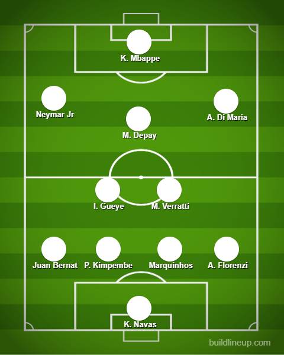

<br/>

### 통합 Best 11


```R
tot_fw <- league_df %>% filter(BP2 == "FW_LW_RW") %>% 
        arrange(-OVA) %>% head(3) %>% select(Name, Nationality, Club, OVA, BP, Age)
tot_mf <- league_df %>% filter(BP2 == "MF") %>% 
        arrange(-OVA) %>% head(3) %>% select(Name, Nationality, Club, OVA, BP, Age)
tot_lb <- league_df %>% filter(BP2 == "LB") %>%
        arrange(-OVA) %>% head(1) %>% select(Name, Nationality, Club, OVA, BP, Age)
tot_cb <- league_df %>% filter(BP2 == "CB") %>% 
        arrange(-OVA) %>% head(2) %>% select(Name, Nationality, Club, OVA, BP, Age)
tot_rb <- league_df %>% filter(BP2 == "RB") %>%
        arrange(-OVA) %>% head(2) %>% select(Name, Nationality, Club, OVA, BP, Age)
tot_gk <- league_df %>% filter(BP2 == "GK") %>% 
        arrange(-OVA) %>% head(1) %>% select(Name, Nationality, Club, OVA, BP, Age)
```


```R
rbind(tot_fw, tot_mf) %>% rbind(tot_lb) %>% rbind(tot_cb) %>% rbind(tot_rb[2,]) %>% rbind(tot_gk)
```


<table class="dataframe">
<caption>A data.frame: 11 × 6</caption>
<thead>
	<tr><th></th><th scope=col>Name</th><th scope=col>Nationality</th><th scope=col>Club</th><th scope=col>OVA</th><th scope=col>BP</th><th scope=col>Age</th></tr>
	<tr><th></th><th scope=col>&lt;fct&gt;</th><th scope=col>&lt;fct&gt;</th><th scope=col>&lt;fct&gt;</th><th scope=col>&lt;int&gt;</th><th scope=col>&lt;fct&gt;</th><th scope=col>&lt;int&gt;</th></tr>
</thead>
<tbody>
	<tr><th scope=row>1</th><td>L. Messi           </td><td>Argentina  </td><td>FC Barcelona     </td><td>93</td><td>RW </td><td>33</td></tr>
	<tr><th scope=row>2</th><td>Cristiano Ronaldo  </td><td>Portugal   </td><td>Juventus         </td><td>92</td><td>ST </td><td>35</td></tr>
	<tr><th scope=row>3</th><td>R. Lewandowski     </td><td>Poland     </td><td>FC Bayern Munchen</td><td>91</td><td>ST </td><td>31</td></tr>
	<tr><th scope=row>4</th><td>K. De Bruyne       </td><td>Belgium    </td><td>Manchester City  </td><td>91</td><td>CAM</td><td>29</td></tr>
	<tr><th scope=row>5</th><td>Casemiro           </td><td>Brazil     </td><td>Real Madrid      </td><td>89</td><td>CDM</td><td>28</td></tr>
	<tr><th scope=row>6</th><td>T. Kroos           </td><td>Germany    </td><td>Real Madrid      </td><td>88</td><td>CM </td><td>30</td></tr>
	<tr><th scope=row>7</th><td>A. Robertson       </td><td>Scotland   </td><td>Liverpool        </td><td>87</td><td>LB </td><td>26</td></tr>
	<tr><th scope=row>8</th><td>V. van Dijk        </td><td>Netherlands</td><td>Liverpool        </td><td>90</td><td>CB </td><td>28</td></tr>
	<tr><th scope=row>9</th><td>Sergio Ramos       </td><td>Spain      </td><td>Real Madrid      </td><td>89</td><td>CB </td><td>34</td></tr>
	<tr><th scope=row>21</th><td>T. Alexander-Arnold</td><td>England    </td><td>Liverpool        </td><td>87</td><td>RB </td><td>21</td></tr>
	<tr><th scope=row>11</th><td>J. Oblak           </td><td>Slovenia   </td><td>Atletico Madrid  </td><td>91</td><td>GK </td><td>27</td></tr>
</tbody>
</table>

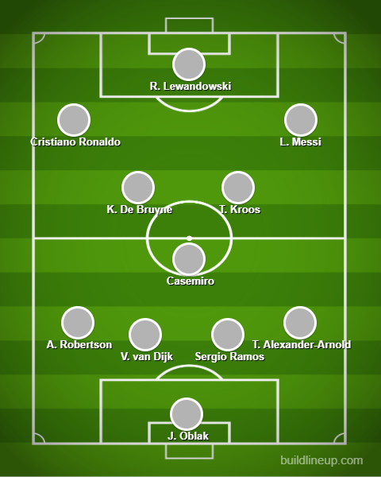


<br/>

### 가장 높은 잠재력(POT)를 가진 영 플레이어 Top 10
- 23세 이하의 연령의 선수들중 가장 높은 잠재력 (POT)를 가진 선수들 Top 10을 선정


```R
(best_rk <- league_df %>% filter(Age <= 23) %>% 
        arrange(-POT) %>% head(10) %>% select(Name, Nationality, Club, POT, BP, Age))
```


<table class="dataframe">
<caption>A data.frame: 10 × 6</caption>
<thead>
	<tr><th></th><th scope=col>Name</th><th scope=col>Nationality</th><th scope=col>Club</th><th scope=col>POT</th><th scope=col>BP</th><th scope=col>Age</th></tr>
	<tr><th></th><th scope=col>&lt;fct&gt;</th><th scope=col>&lt;fct&gt;</th><th scope=col>&lt;fct&gt;</th><th scope=col>&lt;int&gt;</th><th scope=col>&lt;fct&gt;</th><th scope=col>&lt;int&gt;</th></tr>
</thead>
<tbody>
	<tr><th scope=row>1</th><td>K. Mbappe          </td><td>France     </td><td>Paris Saint-Germain</td><td>95</td><td>ST </td><td>21</td></tr>
	<tr><th scope=row>2</th><td>J. Sancho          </td><td>England    </td><td>Borussia Dortmund  </td><td>93</td><td>CAM</td><td>20</td></tr>
	<tr><th scope=row>3</th><td>K. Havertz         </td><td>Germany    </td><td>Chelsea            </td><td>93</td><td>CAM</td><td>21</td></tr>
	<tr><th scope=row>4</th><td>Vinicius Jr.       </td><td>Brazil     </td><td>Real Madrid        </td><td>93</td><td>RM </td><td>19</td></tr>
	<tr><th scope=row>5</th><td>Jo?o Felix         </td><td>Portugal   </td><td>Atletico Madrid    </td><td>93</td><td>CAM</td><td>20</td></tr>
	<tr><th scope=row>6</th><td>G. Donnarumma      </td><td>Italy      </td><td>Milan              </td><td>92</td><td>GK </td><td>21</td></tr>
	<tr><th scope=row>7</th><td>T. Alexander-Arnold</td><td>England    </td><td>Liverpool          </td><td>92</td><td>RB </td><td>21</td></tr>
	<tr><th scope=row>8</th><td>M. de Ligt         </td><td>Netherlands</td><td>Juventus           </td><td>92</td><td>CB </td><td>20</td></tr>
	<tr><th scope=row>9</th><td>E. Haaland         </td><td>Norway     </td><td>Borussia Dortmund  </td><td>92</td><td>ST </td><td>19</td></tr>
	<tr><th scope=row>10</th><td>L. Martinez        </td><td>Argentina  </td><td>Inter              </td><td>91</td><td>ST </td><td>22</td></tr>
</tbody>
</table>


```R
write.csv(league_df, "league_df.csv")
```
