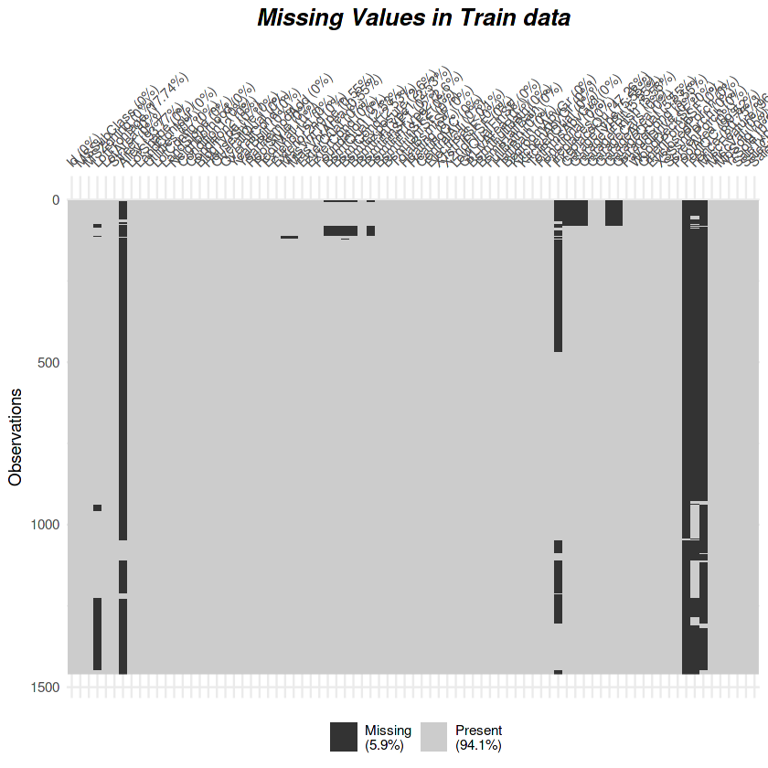
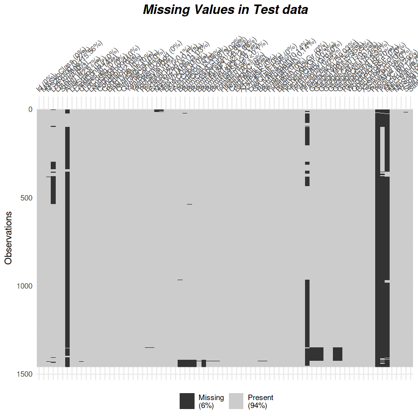
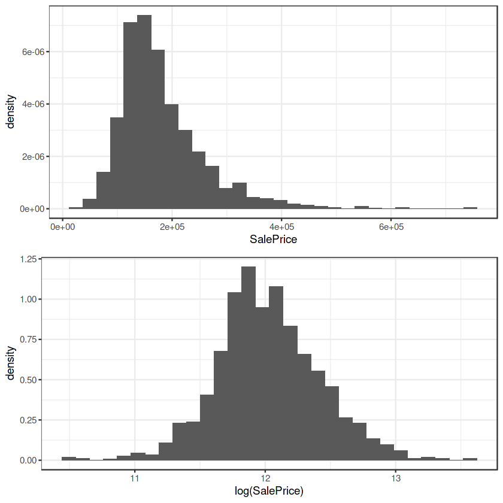
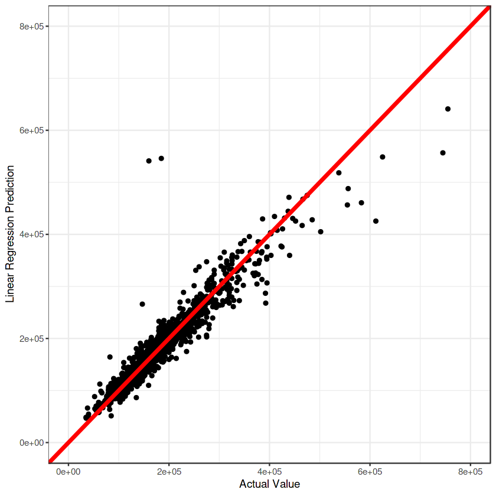
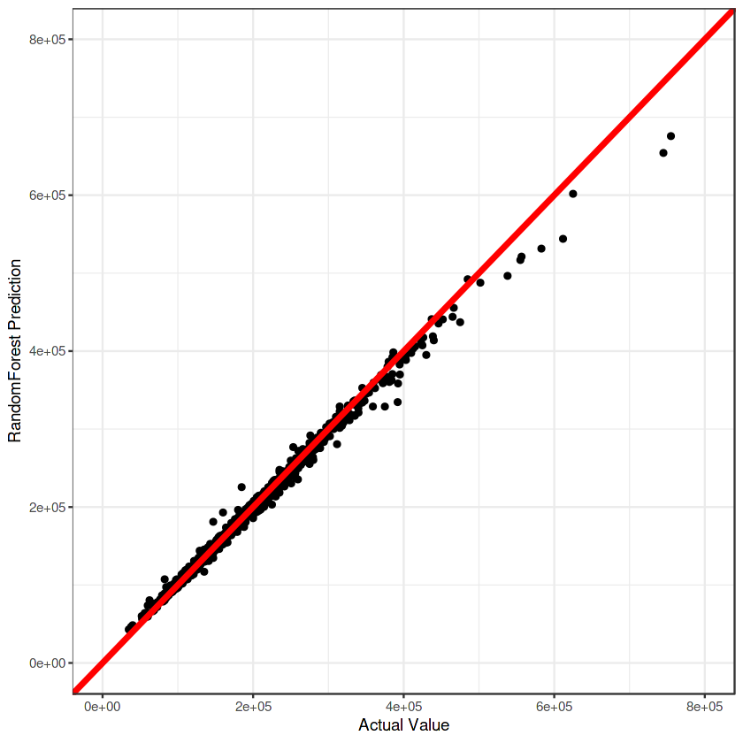
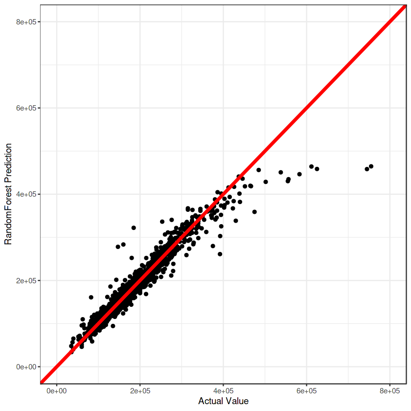
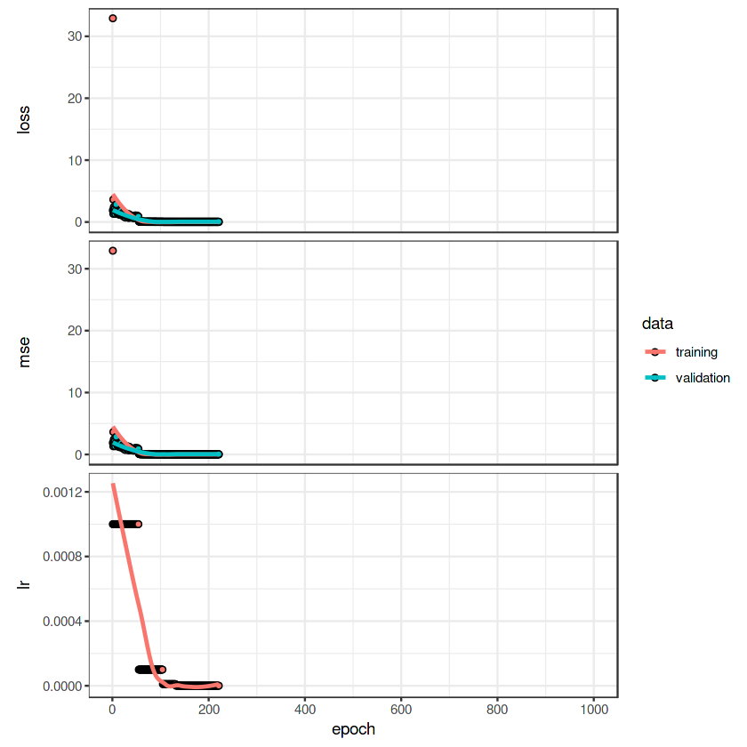

```R
library(tidyverse)
library(recipes)
ggplot2::theme_set(theme_bw())
```

<br/>    
    
<br/>    

### 반응변수 : SalePrice = 부동산 가격 예측

### Load Data


```R
train <- read.csv("../input/house-prices-advanced-regression-techniques/train.csv",
                 stringsAsFactors = T)
test <- read.csv("../input/house-prices-advanced-regression-techniques/test.csv",
                 stringsAsFactors = T)

cat(paste0("Dimensions of Train Data : ", dim(train)[1], " X ", dim(train)[2]), "\n")
cat(paste0("Dimensions of Test Data : ", dim(test)[1], " X ", dim(test)[2]))
```

    Dimensions of Train Data : 1460 X 81 
    Dimensions of Test Data : 1459 X 80


<br/>


### 데이터 전처리

#### 결측값 확인 (Missing Values)
- 훈련데이터와 평가데이터의 결측값은 각각 6965, 7000개 이며, 각각의 데이터의 5.9%, 6%를 차지


```R
cat(paste0("Missing Values in Train Data : ", sum(is.na(train))), "\n")
for (i in 1:dim(train)[2]) {
    if (sum(is.na(train[, i])) != 0) {
        cat(paste0(colnames(train)[i], " (", class(train[, i]), ") : ", sum(is.na(train[, i]))), "\n")
        }
}

visdat::vis_miss(train, cluster = T) + ggtitle("Missing Values in Train data") + 
    theme(plot.title = element_text(size = 15, hjust = 0.5, face = "bold.italic"))
```

    Missing Values in Train Data : 6965 
    LotFrontage (integer) : 259 
    Alley (factor) : 1369 
    MasVnrType (factor) : 8 
    MasVnrArea (integer) : 8 
    BsmtQual (factor) : 37 
    BsmtCond (factor) : 37 
    BsmtExposure (factor) : 38 
    BsmtFinType1 (factor) : 37 
    BsmtFinType2 (factor) : 38 
    Electrical (factor) : 1 
    FireplaceQu (factor) : 690 
    GarageType (factor) : 81 
    GarageYrBlt (integer) : 81 
    GarageFinish (factor) : 81 
    GarageQual (factor) : 81 
    GarageCond (factor) : 81 
    PoolQC (factor) : 1453 
    Fence (factor) : 1179 
    MiscFeature (factor) : 1406 
    

    Warning message:
    “`gather_()` was deprecated in tidyr 1.2.0.
    Please use `gather()` instead.
    This warning is displayed once every 8 hours.
    Call `lifecycle::last_lifecycle_warnings()` to see where this warning was generated.”
    


    

    

<br/>

```R
cat(paste0("Missing Values in Test Data : ", sum(is.na(test))), "\n")
for (i in 1:dim(test)[2]) {
    if (sum(is.na(test[, i])) != 0) {
        cat(paste0(colnames(test)[i], " (", class(test[, i]), ") : ", sum(is.na(test[, i]))), "\n")
        }
}
visdat::vis_miss(test, cluster = T) + ggtitle("Missing Values in Test data") + 
    theme(plot.title = element_text(size = 15, hjust = 0.5, face = "bold.italic"))
```

    Missing Values in Test Data : 7000 
    MSZoning (factor) : 4 
    LotFrontage (integer) : 227 
    Alley (factor) : 1352 
    Utilities (factor) : 2 
    Exterior1st (factor) : 1 
    Exterior2nd (factor) : 1 
    MasVnrType (factor) : 16 
    MasVnrArea (integer) : 15 
    BsmtQual (factor) : 44 
    BsmtCond (factor) : 45 
    BsmtExposure (factor) : 44 
    BsmtFinType1 (factor) : 42 
    BsmtFinSF1 (integer) : 1 
    BsmtFinType2 (factor) : 42 
    BsmtFinSF2 (integer) : 1 
    BsmtUnfSF (integer) : 1 
    TotalBsmtSF (integer) : 1 
    BsmtFullBath (integer) : 2 
    BsmtHalfBath (integer) : 2 
    KitchenQual (factor) : 1 
    Functional (factor) : 2 
    FireplaceQu (factor) : 730 
    GarageType (factor) : 76 
    GarageYrBlt (integer) : 78 
    GarageFinish (factor) : 78 
    GarageCars (integer) : 1 
    GarageArea (integer) : 1 
    GarageQual (factor) : 78 
    GarageCond (factor) : 78 
    PoolQC (factor) : 1456 
    Fence (factor) : 1169 
    MiscFeature (factor) : 1408 
    SaleType (factor) : 1 
    


    

    
<br/>

#### 결측값 대체


```R
train <- train %>% mutate(split = rep("train", nrow(train)))
test <- test %>% mutate(SalePrice = rep(0, nrow(test))) %>%
    mutate(split = rep("test", nrow(test)))

df <- rbind(train, test)
```

- GarageYrBlt(차고지 시공 연도)는 시간을 나타내는 변수
- 이를 기간별로 나눈 범주형 변수로 변환하고 결측값을 대체


```R
df %>% select(GarageYrBlt) %>% summary()
```


      GarageYrBlt  
     Min.   :1895  
     1st Qu.:1960  
     Median :1979  
     Mean   :1978  
     3rd Qu.:2002  
     Max.   :2207  
     NA's   :159   


```R
df$GarageYrBlt <- ifelse(is.na(df$GarageYrBlt), "None",
                            ifelse(df$GarageYrBlt < 1900, "19C",
                                   ifelse(1900 <= df$GarageYrBlt & df$GarageYrBlt < 1950, "20C_1",
                                          ifelse(1950 <= df$GarageYrBlt & df$GarageYrBlt < 2000, "20C_2", "21C")))) %>%
    as.factor()
```

- 이외의 변수들에 대해 결측값은 0으로 대체


```R
df_rep <- df %>%
    mutate_if(is.numeric, function(x) ifelse(is.na(x), 0, x)) %>%
    mutate_if(is.factor, function(x) ifelse(is.na(x), "0", x) %>% as.factor)
```

<br/>

#### 분산이 0에 가까운 변수
- 범주형 변수가 변수가 단일 값만 포함한다는 의미의 0 및 0에 가까운 분산을 가진 변수는 모델에 유용한 정보를 제공하지 않는다
- 아래 범주형 변수들은 0에 가까운 분산을 가짐


```R
library(caret)
nearZeroVar(df, saveMetrics = T) %>%
    tibble::rownames_to_column() %>%
    filter(nzv)
```


<table class="dataframe">
<caption>A data.frame: 21 × 5</caption>
<thead>
	<tr><th scope=col>rowname</th><th scope=col>freqRatio</th><th scope=col>percentUnique</th><th scope=col>zeroVar</th><th scope=col>nzv</th></tr>
	<tr><th scope=col>&lt;chr&gt;</th><th scope=col>&lt;dbl&gt;</th><th scope=col>&lt;dbl&gt;</th><th scope=col>&lt;lgl&gt;</th><th scope=col>&lt;lgl&gt;</th></tr>
</thead>
<tbody>
	<tr><td>Street       </td><td> 242.25000</td><td>0.06851662</td><td>FALSE</td><td>TRUE</td></tr>
	<tr><td>LandContour  </td><td>  21.85000</td><td>0.13703323</td><td>FALSE</td><td>TRUE</td></tr>
	<tr><td>Utilities    </td><td>2916.00000</td><td>0.06851662</td><td>FALSE</td><td>TRUE</td></tr>
	<tr><td>LandSlope    </td><td>  22.22400</td><td>0.10277492</td><td>FALSE</td><td>TRUE</td></tr>
	<tr><td>Condition2   </td><td> 222.23077</td><td>0.27406646</td><td>FALSE</td><td>TRUE</td></tr>
	<tr><td>RoofMatl     </td><td> 125.04348</td><td>0.27406646</td><td>FALSE</td><td>TRUE</td></tr>
	<tr><td>BsmtCond     </td><td>  21.36066</td><td>0.13703323</td><td>FALSE</td><td>TRUE</td></tr>
	<tr><td>BsmtFinType2 </td><td>  23.74286</td><td>0.20554985</td><td>FALSE</td><td>TRUE</td></tr>
	<tr><td>BsmtFinSF2   </td><td> 514.20000</td><td>9.31825968</td><td>FALSE</td><td>TRUE</td></tr>
	<tr><td>Heating      </td><td> 106.44444</td><td>0.20554985</td><td>FALSE</td><td>TRUE</td></tr>
	<tr><td>LowQualFinSF </td><td> 719.75000</td><td>1.23329908</td><td>FALSE</td><td>TRUE</td></tr>
	<tr><td>KitchenAbvGr </td><td>  21.58915</td><td>0.13703323</td><td>FALSE</td><td>TRUE</td></tr>
	<tr><td>Functional   </td><td>  38.81429</td><td>0.23980815</td><td>FALSE</td><td>TRUE</td></tr>
	<tr><td>GarageQual   </td><td>  21.00000</td><td>0.17129154</td><td>FALSE</td><td>TRUE</td></tr>
	<tr><td>GarageCond   </td><td>  35.86486</td><td>0.17129154</td><td>FALSE</td><td>TRUE</td></tr>
	<tr><td>OpenPorchSF  </td><td>  24.96154</td><td>8.63309353</td><td>FALSE</td><td>TRUE</td></tr>
	<tr><td>EnclosedPorch</td><td> 111.81818</td><td>6.26927030</td><td>FALSE</td><td>TRUE</td></tr>
	<tr><td>X3SsnPorch   </td><td> 960.66667</td><td>1.06200754</td><td>FALSE</td><td>TRUE</td></tr>
	<tr><td>ScreenPorch  </td><td> 204.84615</td><td>4.14525522</td><td>FALSE</td><td>TRUE</td></tr>
	<tr><td>PoolArea     </td><td>2906.00000</td><td>0.47961631</td><td>FALSE</td><td>TRUE</td></tr>
	<tr><td>MiscVal      </td><td> 156.44444</td><td>1.30181569</td><td>FALSE</td><td>TRUE</td></tr>
</tbody>
</table>

<br/>

#### 정규화
- 각각의 수치형 변수들은 단위가 상이함으로, 0 ~ 1사이 값을 가지도록 이를 정규화

<br/>

#### 원-핫 인코딩
- 모든 범주형 변수들에 대하여 원-핫 인코딩으로 가변수화


<br/>

#### 설명변수들에 대해 위의 전처리과정 일괄적용


```R
df_recipe <- recipe(SalePrice ~ ., data = df_rep) %>%
    step_rm(c(Id, SalePrice)) %>%
    step_nzv(all_nominal()) %>%
    step_center(all_numeric()) %>%
    step_scale(all_numeric()) %>%
    step_dummy(all_nominal(), one_hot = TRUE) %>%
    prep(training = df_rep, retain = TRUE) %>%
    juice()
```


```R
dim(df_recipe)
df_recipe %>% head
```


<style>
.list-inline {list-style: none; margin:0; padding: 0}
.list-inline>li {display: inline-block}
.list-inline>li:not(:last-child)::after {content: "\00b7"; padding: 0 .5ex}
</style>
<ol class=list-inline><li>2919</li><li>251</li></ol>


<table class="dataframe">
<caption>A tibble: 6 × 251</caption>
<thead>
	<tr><th scope=col>MSSubClass</th><th scope=col>LotFrontage</th><th scope=col>LotArea</th><th scope=col>OverallQual</th><th scope=col>OverallCond</th><th scope=col>YearBuilt</th><th scope=col>YearRemodAdd</th><th scope=col>MasVnrArea</th><th scope=col>BsmtFinSF1</th><th scope=col>BsmtFinSF2</th><th scope=col>⋯</th><th scope=col>SaleType_X8</th><th scope=col>SaleType_X9</th><th scope=col>SaleCondition_X1</th><th scope=col>SaleCondition_X2</th><th scope=col>SaleCondition_X3</th><th scope=col>SaleCondition_X4</th><th scope=col>SaleCondition_X5</th><th scope=col>SaleCondition_X6</th><th scope=col>split_test</th><th scope=col>split_train</th></tr>
	<tr><th scope=col>&lt;dbl&gt;</th><th scope=col>&lt;dbl&gt;</th><th scope=col>&lt;dbl&gt;</th><th scope=col>&lt;dbl&gt;</th><th scope=col>&lt;dbl&gt;</th><th scope=col>&lt;dbl&gt;</th><th scope=col>&lt;dbl&gt;</th><th scope=col>&lt;dbl&gt;</th><th scope=col>&lt;dbl&gt;</th><th scope=col>&lt;dbl&gt;</th><th scope=col>⋯</th><th scope=col>&lt;dbl&gt;</th><th scope=col>&lt;dbl&gt;</th><th scope=col>&lt;dbl&gt;</th><th scope=col>&lt;dbl&gt;</th><th scope=col>&lt;dbl&gt;</th><th scope=col>&lt;dbl&gt;</th><th scope=col>&lt;dbl&gt;</th><th scope=col>&lt;dbl&gt;</th><th scope=col>&lt;dbl&gt;</th><th scope=col>&lt;dbl&gt;</th></tr>
</thead>
<tbody>
	<tr><td> 0.06731988</td><td>0.21603781</td><td>-0.21784137</td><td> 0.64607270</td><td>-0.5071973</td><td> 1.0460784</td><td> 0.8966793</td><td> 0.5289435</td><td> 0.58104586</td><td>-0.2929751</td><td>⋯</td><td>0</td><td>1</td><td>0</td><td>0</td><td>0</td><td>0</td><td>1</td><td>0</td><td>0</td><td>1</td></tr>
	<tr><td>-0.87346638</td><td>0.66404459</td><td>-0.07203174</td><td>-0.06317371</td><td> 2.1879039</td><td> 0.1547375</td><td>-0.3955364</td><td>-0.5669188</td><td> 1.17805291</td><td>-0.2929751</td><td>⋯</td><td>0</td><td>1</td><td>0</td><td>0</td><td>0</td><td>0</td><td>1</td><td>0</td><td>0</td><td>1</td></tr>
	<tr><td> 0.06731988</td><td>0.30563916</td><td> 0.13717338</td><td> 0.64607270</td><td>-0.5071973</td><td> 0.9800531</td><td> 0.8488195</td><td> 0.3388450</td><td> 0.09817252</td><td>-0.2929751</td><td>⋯</td><td>0</td><td>1</td><td>0</td><td>0</td><td>0</td><td>0</td><td>1</td><td>0</td><td>0</td><td>1</td></tr>
	<tr><td> 0.30251644</td><td>0.06670221</td><td>-0.07837129</td><td> 0.64607270</td><td>-0.5071973</td><td>-1.8590326</td><td>-0.6826955</td><td>-0.5669188</td><td>-0.49444477</td><td>-0.2929751</td><td>⋯</td><td>0</td><td>1</td><td>1</td><td>0</td><td>0</td><td>0</td><td>0</td><td>0</td><td>0</td><td>1</td></tr>
	<tr><td> 0.06731988</td><td>0.78351307</td><td> 0.51881423</td><td> 1.35531911</td><td>-0.5071973</td><td> 0.9470405</td><td> 0.7530998</td><td> 1.3899782</td><td> 0.46910704</td><td>-0.2929751</td><td>⋯</td><td>0</td><td>1</td><td>0</td><td>0</td><td>0</td><td>0</td><td>1</td><td>0</td><td>0</td><td>1</td></tr>
	<tr><td>-0.16787668</td><td>0.81338019</td><td> 0.50042953</td><td>-0.77242013</td><td>-0.5071973</td><td> 0.7159521</td><td> 0.5138006</td><td>-0.5669188</td><td> 0.63811271</td><td>-0.2929751</td><td>⋯</td><td>0</td><td>1</td><td>0</td><td>0</td><td>0</td><td>0</td><td>1</td><td>0</td><td>0</td><td>1</td></tr>
</tbody>
</table>


```R
train_rec <- df_recipe %>% filter(split_train == 1) %>%
    select(-c(split_test, split_train)) %>%
    mutate(SalePrice = train$SalePrice)
test_rec <- df_recipe %>% filter(split_test == 1) %>%
    select(-c(split_test, split_train))

dim(train_rec) ; dim(test_rec)
```


<style>
.list-inline {list-style: none; margin:0; padding: 0}
.list-inline>li {display: inline-block}
.list-inline>li:not(:last-child)::after {content: "\00b7"; padding: 0 .5ex}
</style>
<ol class=list-inline><li>1460</li><li>250</li></ol>


<style>
.list-inline {list-style: none; margin:0; padding: 0}
.list-inline>li {display: inline-block}
.list-inline>li:not(:last-child)::after {content: "\00b7"; padding: 0 .5ex}
</style>
<ol class=list-inline><li>1459</li><li>249</li></ol>

<br/>

### 선형 회귀 분석

- 선형 회귀 모델은 반응변수가 정규 분포를 따른다고 가정
- 반응변수의 정규성 가정을 성립시키기 위하여 (반응변수의 왜도를 최소화 하가 위하여), 반응변수를 로그변환


```R
p1 <- ggplot(train) + geom_histogram(aes(SalePrice, ..density..))
p2 <- ggplot(train) + geom_histogram(aes(log(SalePrice), ..density..))
gridExtra::grid.arrange(p1, p2)
```

    `stat_bin()` using `bins = 30`. Pick better value with `binwidth`.
    
    `stat_bin()` using `bins = 30`. Pick better value with `binwidth`.
    
    


    

    


```R
set.seed(123)

cv_model1 <- caret::train(
    log(SalePrice) ~ .,
    data = train_rec,
    method = "lm",
    trControl = trainControl(method = "cv")
)

cv_model1$results
```

    Warning message in predict.lm(modelFit, newdata):
    “prediction from a rank-deficient fit may be misleading”
    Warning message in predict.lm(modelFit, newdata):
    “prediction from a rank-deficient fit may be misleading”
    Warning message in predict.lm(modelFit, newdata):
    “prediction from a rank-deficient fit may be misleading”
    Warning message in predict.lm(modelFit, newdata):
    “prediction from a rank-deficient fit may be misleading”
    Warning message in predict.lm(modelFit, newdata):
    “prediction from a rank-deficient fit may be misleading”
    Warning message in predict.lm(modelFit, newdata):
    “prediction from a rank-deficient fit may be misleading”
    Warning message in predict.lm(modelFit, newdata):
    “prediction from a rank-deficient fit may be misleading”
    Warning message in predict.lm(modelFit, newdata):
    “prediction from a rank-deficient fit may be misleading”
    Warning message in predict.lm(modelFit, newdata):
    “prediction from a rank-deficient fit may be misleading”
    Warning message in predict.lm(modelFit, newdata):
    “prediction from a rank-deficient fit may be misleading”
    


<table class="dataframe">
<caption>A data.frame: 1 × 7</caption>
<thead>
	<tr><th></th><th scope=col>intercept</th><th scope=col>RMSE</th><th scope=col>Rsquared</th><th scope=col>MAE</th><th scope=col>RMSESD</th><th scope=col>RsquaredSD</th><th scope=col>MAESD</th></tr>
	<tr><th></th><th scope=col>&lt;lgl&gt;</th><th scope=col>&lt;dbl&gt;</th><th scope=col>&lt;dbl&gt;</th><th scope=col>&lt;dbl&gt;</th><th scope=col>&lt;dbl&gt;</th><th scope=col>&lt;dbl&gt;</th><th scope=col>&lt;dbl&gt;</th></tr>
</thead>
<tbody>
	<tr><th scope=row>1</th><td>TRUE</td><td>0.1472454</td><td>0.8655783</td><td>0.09460358</td><td>0.03374239</td><td>0.05981785</td><td>0.004905526</td></tr>
</tbody>
</table>


```R
lm_pred <- predict(cv_model1, train_rec)
(lm_rmse <- RMSE(exp(lm_pred), train_rec$SalePrice))
```

    Warning message in predict.lm(modelFit, newdata):
    “prediction from a rank-deficient fit may be misleading”
    


24827.9972659707


```R
ggplot() + geom_point(aes(train_rec$SalePrice, exp(lm_pred))) +
    geom_abline(intercept = 0, slope = 1, color = "red", size = 1.5) +
    xlab("Actual Value") + ylab("Linear Regression Prediction") + 
    scale_x_continuous(limits = c(0, 8e+05)) +
    scale_y_continuous(limits = c(0, 8e+05))
```


    

    
<br/>

### 정규화 회귀


```R
library(glmnet)
```


```R
set.seed(123)

cv_glmnet <- train(
    log(SalePrice) ~ .,
    data = train_rec,
    method = "glmnet",
    trControl = trainControl(method = "cv", number = 10),
    tuneLength = 10
)

cv_glmnet$results %>%
    filter(alpha == cv_glmnet$bestTune$alpha, lambda == cv_glmnet$bestTune$lambda)
```


<table class="dataframe">
<caption>A data.frame: 1 × 8</caption>
<thead>
	<tr><th scope=col>alpha</th><th scope=col>lambda</th><th scope=col>RMSE</th><th scope=col>Rsquared</th><th scope=col>MAE</th><th scope=col>RMSESD</th><th scope=col>RsquaredSD</th><th scope=col>MAESD</th></tr>
	<tr><th scope=col>&lt;dbl&gt;</th><th scope=col>&lt;dbl&gt;</th><th scope=col>&lt;dbl&gt;</th><th scope=col>&lt;dbl&gt;</th><th scope=col>&lt;dbl&gt;</th><th scope=col>&lt;dbl&gt;</th><th scope=col>&lt;dbl&gt;</th><th scope=col>&lt;dbl&gt;</th></tr>
</thead>
<tbody>
	<tr><td>0.2</td><td>0.02291502</td><td>0.1366661</td><td>0.8823635</td><td>0.08846795</td><td>0.03427322</td><td>0.06537287</td><td>0.005171887</td></tr>
</tbody>
</table>


```R
glm_pred <- predict(cv_glmnet, train_rec)
(glm_rmse <- RMSE(exp(glm_pred), train_rec$SalePrice))
```


29332.2475598891


```R
ggplot() + geom_point(aes(train_rec$SalePrice, exp(glm_pred))) +
    geom_abline(intercept = 0, slope = 1, color = "red", size = 1.5) +
    xlab("Actual Value") + ylab("GLM Prediction")  + 
    scale_x_continuous(limits = c(0, 8e+05)) +
    scale_y_continuous(limits = c(0, 8e+05))
```


    

    
<br/>

### 회귀 스플라인 (MARS)


```R
library(earth)
```


```R
hyper_grid <- expand.grid(
    degree = 1:3,
    nprune = seq(2, 100, length.out = 10) %>% floor()
)

tail(hyper_grid)
```


<table class="dataframe">
<caption>A data.frame: 6 × 2</caption>
<thead>
	<tr><th></th><th scope=col>degree</th><th scope=col>nprune</th></tr>
	<tr><th></th><th scope=col>&lt;int&gt;</th><th scope=col>&lt;dbl&gt;</th></tr>
</thead>
<tbody>
	<tr><th scope=row>25</th><td>1</td><td> 89</td></tr>
	<tr><th scope=row>26</th><td>2</td><td> 89</td></tr>
	<tr><th scope=row>27</th><td>3</td><td> 89</td></tr>
	<tr><th scope=row>28</th><td>1</td><td>100</td></tr>
	<tr><th scope=row>29</th><td>2</td><td>100</td></tr>
	<tr><th scope=row>30</th><td>3</td><td>100</td></tr>
</tbody>
</table>


```R
set.seed(123)
cv_mars <- train(
    log(SalePrice) ~ .,
    data = train_rec,
    method = "earth",
    trControl = trainControl(method = "cv", number = 10),
    tuneGrid = hyper_grid
)
```


```R
cv_mars$results %>%
  filter(nprune == cv_mars$bestTune$nprune, degree == cv_mars$bestTune$degree)
```


<table class="dataframe">
<caption>A data.frame: 1 × 8</caption>
<thead>
	<tr><th scope=col>degree</th><th scope=col>nprune</th><th scope=col>RMSE</th><th scope=col>Rsquared</th><th scope=col>MAE</th><th scope=col>RMSESD</th><th scope=col>RsquaredSD</th><th scope=col>MAESD</th></tr>
	<tr><th scope=col>&lt;int&gt;</th><th scope=col>&lt;dbl&gt;</th><th scope=col>&lt;dbl&gt;</th><th scope=col>&lt;dbl&gt;</th><th scope=col>&lt;dbl&gt;</th><th scope=col>&lt;dbl&gt;</th><th scope=col>&lt;dbl&gt;</th><th scope=col>&lt;dbl&gt;</th></tr>
</thead>
<tbody>
	<tr><td>1</td><td>34</td><td>0.1272569</td><td>0.899113</td><td>0.08685163</td><td>0.009078037</td><td>0.01285436</td><td>0.004809277</td></tr>
</tbody>
</table>


```R
mars_pred <- predict(cv_mars, train_rec)
(mars_rmse <- RMSE(exp(mars_pred), train_rec$SalePrice))
```


22553.2370762507


```R
ggplot() + geom_point(aes(train_rec$SalePrice, exp(mars_pred))) +
    geom_abline(intercept = 0, slope = 1, color = "red", size = 1.5) +
    xlab("Actual Value") + ylab("MARS Prediction") + 
    scale_x_continuous(limits = c(0, 8e+05)) +
    scale_y_continuous(limits = c(0, 8e+05))
```


    

    
<br/>

### 랜덤포레스트 회귀


```R
library(ranger)
```


```R
(n_features <- length(setdiff(names(train_rec), "SalePrice")))
```


249


```R
hyper_grid <- expand.grid(
    mtry = floor(n_features * c(0.05, 0.15, 0.25, 0.333, 0.4)),
    min.node.size = c(1, 3, 5, 10),
    replace = c(TRUE, FALSE),
    sample.fraction = c(.5, 0.63, 0.8),
    rmse = NA
)

hyper_grid %>% head
```


<table class="dataframe">
<caption>A data.frame: 6 × 5</caption>
<thead>
	<tr><th></th><th scope=col>mtry</th><th scope=col>min.node.size</th><th scope=col>replace</th><th scope=col>sample.fraction</th><th scope=col>rmse</th></tr>
	<tr><th></th><th scope=col>&lt;dbl&gt;</th><th scope=col>&lt;dbl&gt;</th><th scope=col>&lt;lgl&gt;</th><th scope=col>&lt;dbl&gt;</th><th scope=col>&lt;lgl&gt;</th></tr>
</thead>
<tbody>
	<tr><th scope=row>1</th><td>12</td><td>1</td><td>TRUE</td><td>0.5</td><td>NA</td></tr>
	<tr><th scope=row>2</th><td>37</td><td>1</td><td>TRUE</td><td>0.5</td><td>NA</td></tr>
	<tr><th scope=row>3</th><td>62</td><td>1</td><td>TRUE</td><td>0.5</td><td>NA</td></tr>
	<tr><th scope=row>4</th><td>82</td><td>1</td><td>TRUE</td><td>0.5</td><td>NA</td></tr>
	<tr><th scope=row>5</th><td>99</td><td>1</td><td>TRUE</td><td>0.5</td><td>NA</td></tr>
	<tr><th scope=row>6</th><td>12</td><td>3</td><td>TRUE</td><td>0.5</td><td>NA</td></tr>
</tbody>
</table>


```R
for(i in seq_len(nrow(hyper_grid))) {
  fit <- ranger(
    formula         = log(SalePrice) ~ ., 
    data            = train_rec, 
    num.trees       = n_features * 10,
    mtry            = hyper_grid$mtry[i],
    min.node.size   = hyper_grid$min.node.size[i],
    replace         = hyper_grid$replace[i],
    sample.fraction = hyper_grid$sample.fraction[i],
    verbose         = FALSE,
    seed            = 123
  )
  hyper_grid$rmse[i] <- sqrt(fit$prediction.error)
}
```


```R
hyper_grid %>%
  arrange(rmse) %>% head(10)
```


<table class="dataframe">
<caption>A data.frame: 10 × 5</caption>
<thead>
	<tr><th></th><th scope=col>mtry</th><th scope=col>min.node.size</th><th scope=col>replace</th><th scope=col>sample.fraction</th><th scope=col>rmse</th></tr>
	<tr><th></th><th scope=col>&lt;dbl&gt;</th><th scope=col>&lt;dbl&gt;</th><th scope=col>&lt;lgl&gt;</th><th scope=col>&lt;dbl&gt;</th><th scope=col>&lt;dbl&gt;</th></tr>
</thead>
<tbody>
	<tr><th scope=row>1</th><td>62</td><td>3</td><td>FALSE</td><td>0.8</td><td>0.1346047</td></tr>
	<tr><th scope=row>2</th><td>62</td><td>1</td><td>FALSE</td><td>0.8</td><td>0.1347906</td></tr>
	<tr><th scope=row>3</th><td>62</td><td>5</td><td>FALSE</td><td>0.8</td><td>0.1351544</td></tr>
	<tr><th scope=row>4</th><td>82</td><td>3</td><td>FALSE</td><td>0.8</td><td>0.1352234</td></tr>
	<tr><th scope=row>5</th><td>99</td><td>1</td><td>FALSE</td><td>0.8</td><td>0.1353612</td></tr>
	<tr><th scope=row>6</th><td>82</td><td>5</td><td>FALSE</td><td>0.8</td><td>0.1354287</td></tr>
	<tr><th scope=row>7</th><td>82</td><td>1</td><td>FALSE</td><td>0.8</td><td>0.1354420</td></tr>
	<tr><th scope=row>8</th><td>99</td><td>3</td><td>FALSE</td><td>0.8</td><td>0.1355906</td></tr>
	<tr><th scope=row>9</th><td>37</td><td>1</td><td>FALSE</td><td>0.8</td><td>0.1356973</td></tr>
	<tr><th scope=row>10</th><td>99</td><td>5</td><td>FALSE</td><td>0.8</td><td>0.1358546</td></tr>
</tbody>
</table>


```R
cv_rf <- ranger(
    log(SalePrice) ~ ., 
    data = train_rec,
    mtry = 62,
    num.trees = n_features * 10,
    min.node.size = 3,
    replace = FALSE,
    sample.fraction = 0.8,
    seed = 123
)
```


```R
rf_pred <- predict(cv_rf, train_rec)
(rf_rmse <- RMSE(exp(rf_pred$predictions), train_rec$SalePrice))
```


7365.8770078294


```R
ggplot() + geom_point(aes(train_rec$SalePrice, exp(rf_pred$predictions))) +
    geom_abline(intercept = 0, slope = 1, color = "red", size = 1.5) +
    xlab("Actual Value") + ylab("RandomForest Prediction") + 
    scale_x_continuous(limits = c(0, 8e+05)) +
    scale_y_continuous(limits = c(0, 8e+05))
```


    

    
<br/>

### 부스팅 (XGBoost)


```R
library(xgboost)
```


```R
X_train <- as.matrix(train_rec %>% select(-SalePrice))
Y_train <- log(train_rec$SalePrice)

dtrain <- xgb.DMatrix(data = X_train, label = Y_train)
```


```R
hyper_grid <- expand.grid(
  eta = 0.1, 
  max_depth = 3,
  min_child_weight = 3, 
  subsample = 0.5,  
  colsample_bytree = 0.5, 
  gamma = c(0, 1, 10, 100, 1000),
  lambda = c(0, 1e-2, 0.1, 1, 100, 1000, 10000),
  alpha = c(0, 1e-2, 0.1, 1, 100, 1000, 10000),
  rmse = 0,          
  trees = 0          
)
```


```R
for(i in seq_len(nrow(hyper_grid))) {
  set.seed(123)
  m <- xgb.cv(
    data = dtrain,
    nrounds = 4000,
    objective = "reg:linear",
    early_stopping_rounds = 50, 
    nfold = 10,
    verbose = 0,
    params = list( 
      eta = hyper_grid$eta[i], 
      max_depth = hyper_grid$max_depth[i],
      min_child_weight = hyper_grid$min_child_weight[i],
      subsample = hyper_grid$subsample[i],
      colsample_bytree = hyper_grid$colsample_bytree[i],
      gamma = hyper_grid$gamma[i], 
      lambda = hyper_grid$lambda[i], 
      alpha = hyper_grid$alpha[i]
    ) 
  )
  hyper_grid$rmse[i] <- min(m$evaluation_log$test_rmse_mean)
  hyper_grid$trees[i] <- m$best_iteration
}
```


```R
hyper_grid %>%
  filter(rmse > 0) %>%
  arrange(rmse) %>% head
```


<table class="dataframe">
<caption>A data.frame: 6 × 10</caption>
<thead>
	<tr><th></th><th scope=col>eta</th><th scope=col>max_depth</th><th scope=col>min_child_weight</th><th scope=col>subsample</th><th scope=col>colsample_bytree</th><th scope=col>gamma</th><th scope=col>lambda</th><th scope=col>alpha</th><th scope=col>rmse</th><th scope=col>trees</th></tr>
	<tr><th></th><th scope=col>&lt;dbl&gt;</th><th scope=col>&lt;dbl&gt;</th><th scope=col>&lt;dbl&gt;</th><th scope=col>&lt;dbl&gt;</th><th scope=col>&lt;dbl&gt;</th><th scope=col>&lt;dbl&gt;</th><th scope=col>&lt;dbl&gt;</th><th scope=col>&lt;dbl&gt;</th><th scope=col>&lt;dbl&gt;</th><th scope=col>&lt;dbl&gt;</th></tr>
</thead>
<tbody>
	<tr><th scope=row>1</th><td>0.1</td><td>3</td><td>3</td><td>0.5</td><td>0.5</td><td>0</td><td>1.00</td><td>0.0</td><td>0.1249688</td><td>311</td></tr>
	<tr><th scope=row>2</th><td>0.1</td><td>3</td><td>3</td><td>0.5</td><td>0.5</td><td>0</td><td>1.00</td><td>0.1</td><td>0.1252391</td><td>344</td></tr>
	<tr><th scope=row>3</th><td>0.1</td><td>3</td><td>3</td><td>0.5</td><td>0.5</td><td>0</td><td>0.00</td><td>1.0</td><td>0.1254042</td><td>331</td></tr>
	<tr><th scope=row>4</th><td>0.1</td><td>3</td><td>3</td><td>0.5</td><td>0.5</td><td>0</td><td>1.00</td><td>1.0</td><td>0.1258710</td><td>337</td></tr>
	<tr><th scope=row>5</th><td>0.1</td><td>3</td><td>3</td><td>0.5</td><td>0.5</td><td>0</td><td>0.01</td><td>1.0</td><td>0.1259220</td><td>322</td></tr>
	<tr><th scope=row>6</th><td>0.1</td><td>3</td><td>3</td><td>0.5</td><td>0.5</td><td>0</td><td>0.10</td><td>1.0</td><td>0.1259949</td><td>325</td></tr>
</tbody>
</table>


```R
params <- list(
  eta = 0.1,
  max_depth = 3,
  min_child_weight = 3,
  subsample = 0.5,
  colsample_bytree = 0.5,
  gamma = 0,
  lambda = 100,
  alpha = 0
)
```


```R
xgb.fit.final <- xgboost(
  params = params,
  dtrain,
  nrounds = 311,
  objective = "reg:linear",
  verbose = 0
)
```

    


```R
xgb_pred <- predict(xgb.fit.final, newdata = dtrain)
(xgb_rmse <- RMSE(exp(pred), train_rec$SalePrice))
```


21775.0396937197


```R
ggplot() + geom_point(aes(train_rec$SalePrice, exp(xgb_pred))) +
    geom_abline(intercept = 0, slope = 1, color = "red", size = 1.5) +
    xlab("Actual Value") + ylab("RandomForest Prediction") + 
    scale_x_continuous(limits = c(0, 8e+05)) +
    scale_y_continuous(limits = c(0, 8e+05))
```


    

    
<br/>

### Keras DNN


```R
library(tensorflow)
library(keras)
library(tfruns)
```


```R
FLAGS <- tfruns::flags(
    flag_numeric("nodes1", 512),
    flag_numeric("nodes2", 256),
    flag_numeric("nodes3", 128),
    flag_numeric("nodes4", 64),

    flag_string("optimizer", "rmsprop"),
    flag_numeric("lr_annealing", 0.1)
)
```


```R
model <- keras_model_sequential() %>%
    layer_dense(units = FLAGS$nodes1, activation = "relu", input_shape = c(ncol(X_train))) %>%
    layer_dense(units = FLAGS$nodes2, activation = "relu") %>%
    layer_dense(units = FLAGS$nodes3, activation = "relu") %>%
    layer_dense(units = FLAGS$nodes4, activation = "relu") %>%
    layer_dense(units = 1, activation = "relu") %>%
    compile(
        loss = "mean_squared_error",
        metrics = c("mse"),
        optimizer = FLAGS$optimizer
    ) 

history <- model %>%  fit(
        x = X_train, y = Y_train,
        epochs = 1000, batch_size = 128,
        validation_split = 0.2,
        callbacks = list(
            callback_early_stopping(patience = 100),
            callback_reduce_lr_on_plateau(factor = FLAGS$lr_annealing)
        ),
    verbose = FALSE
    )
```


```R
history
plot(history)
```


    
    Final epoch (plot to see history):
        loss: 0.004772
         mse: 0.004772
    val_loss: 0.05107
     val_mse: 0.05107
          lr: 0.00000000000001 


    `geom_smooth()` using formula 'y ~ x'
    
    


    

    


```R
(eval <- model %>% evaluate(x = X_train, y = Y_train))
```


<style>
.dl-inline {width: auto; margin:0; padding: 0}
.dl-inline>dt, .dl-inline>dd {float: none; width: auto; display: inline-block}
.dl-inline>dt::after {content: ":\0020"; padding-right: .5ex}
.dl-inline>dt:not(:first-of-type) {padding-left: .5ex}
</style><dl class=dl-inline><dt>loss</dt><dd>0.0140316849574447</dd><dt>mse</dt><dd>0.0140316849574447</dd></dl>


```R
dnn_pred <- model %>% predict(X_train)
(dnn_rmse <- RMSE(exp(dnn_pred), train_rec$SalePrice))
```


29094.8034343088


```R
ggplot() + geom_point(aes(train_rec$SalePrice, exp(dnn_pred))) +
    geom_abline(intercept = 0, slope = 1, color = "red", size = 1.5) +
    xlab("Actual Value") + ylab("DNN Prediction") + 
    scale_x_continuous(limits = c(0, 8e+05)) +
    scale_y_continuous(limits = c(0, 8e+05))
```


    

    
<br/>

### Predict Test Data


```R
tibble(
    method = c("Linear Regression", "GLM", "MARS", "RandomForest", "XGB", "DNN"),
    rmse = c(lm_rmse, glm_rmse, mars_rmse, rf_rmse, xgb_rmse, dnn_rmse)
) %>% arrange(rmse)
```


<table class="dataframe">
<caption>A tibble: 6 × 2</caption>
<thead>
	<tr><th scope=col>method</th><th scope=col>rmse</th></tr>
	<tr><th scope=col>&lt;chr&gt;</th><th scope=col>&lt;dbl&gt;</th></tr>
</thead>
<tbody>
	<tr><td>RandomForest     </td><td> 7365.877</td></tr>
	<tr><td>XGB              </td><td>21775.040</td></tr>
	<tr><td>MARS             </td><td>22553.237</td></tr>
	<tr><td>Linear Regression</td><td>24827.997</td></tr>
	<tr><td>DNN              </td><td>29094.803</td></tr>
	<tr><td>GLM              </td><td>29332.248</td></tr>
</tbody>
</table>


```R
rf_pred_test <- predict(cv_rf, test_rec) 
rf_pred_test <- exp(rf_pred_test$prediction)
submission <- sample_submission %>% mutate(SalePrice = rf_pred_test)
write.csv(submission, "submission.csv")
```
