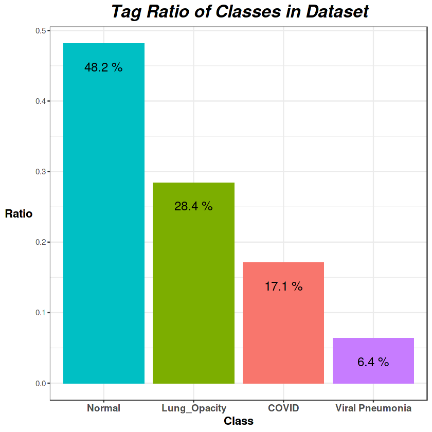
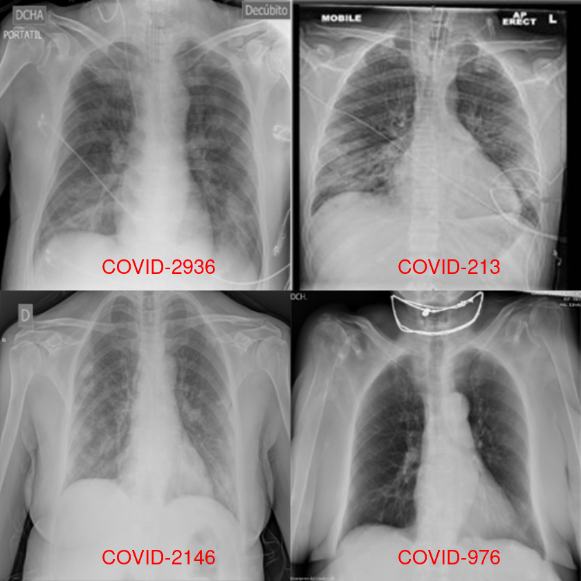
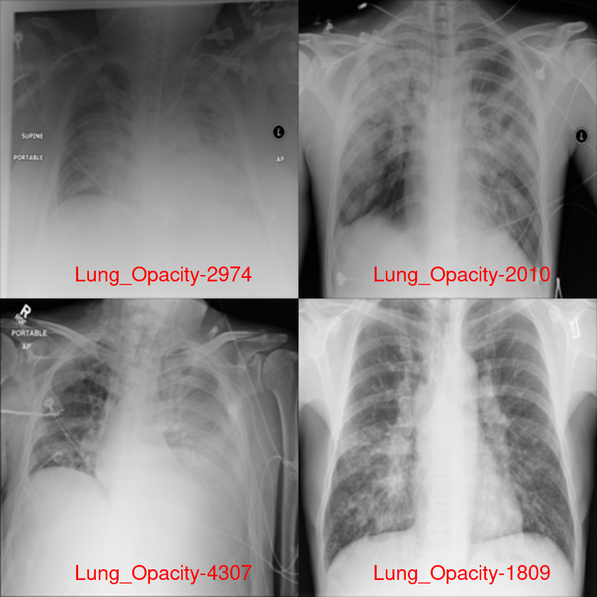
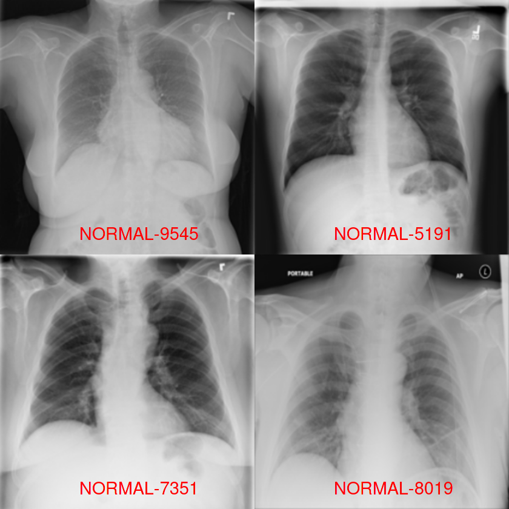
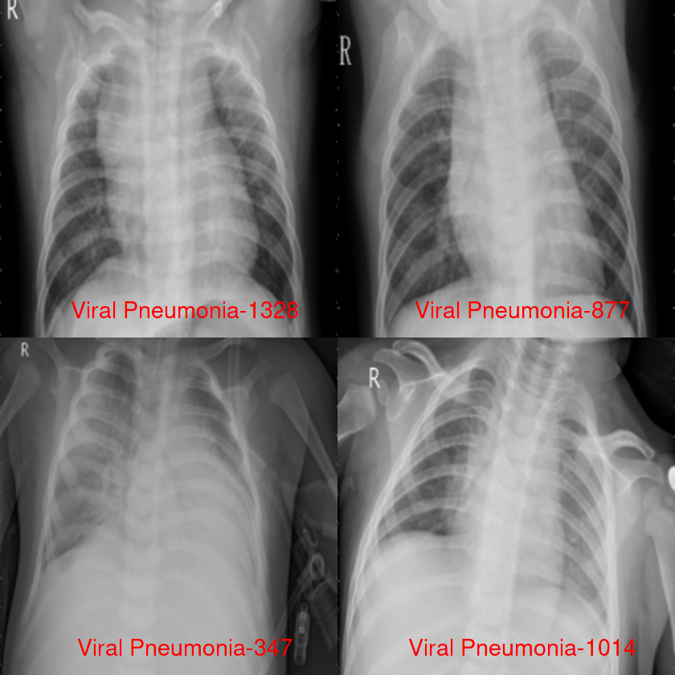
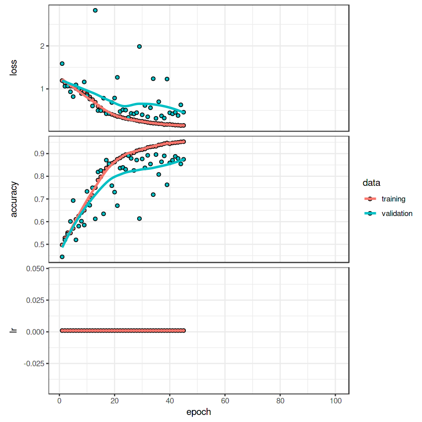
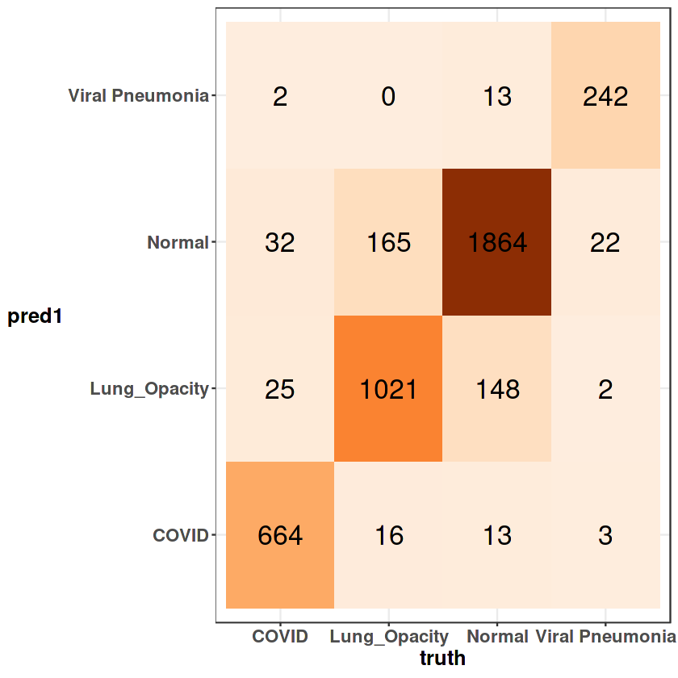
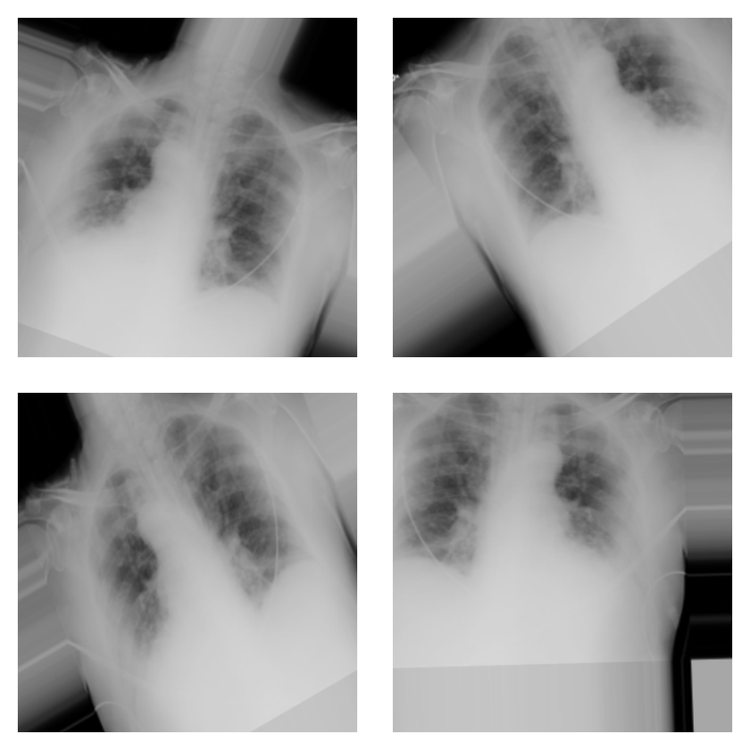
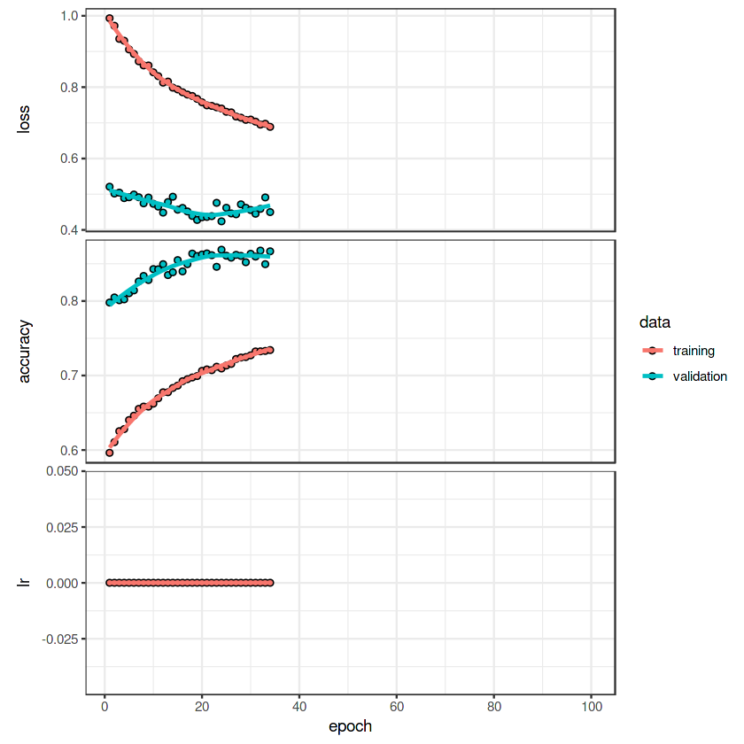
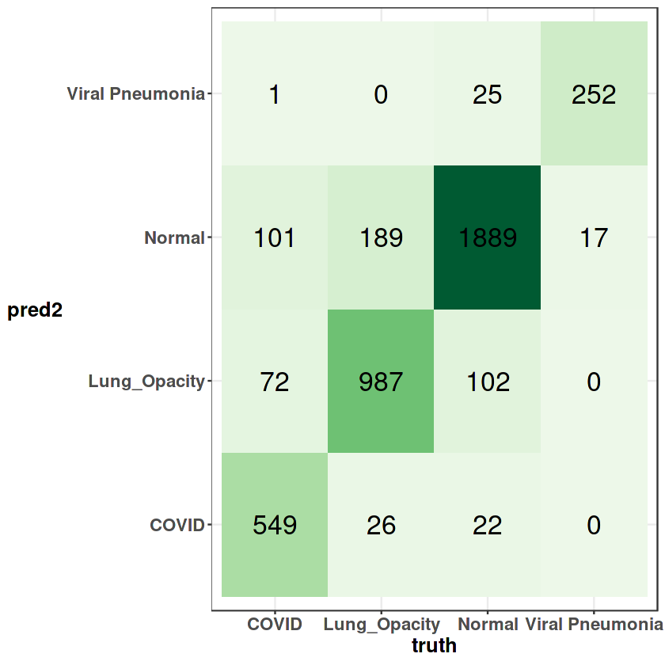

```R
library(keras)
library(tensorflow)

library(OpenImageR)
library(imager)
library(EBImage)

library(tidyverse)
library(rsample)
library(readxl)
ggplot2::theme_set(theme_bw())
```

<br/>    

- ### 카타르, 도하, 다카, 방글라데시 다카 대학의 연구진과 파키스탄, 말레이시아의 공동 연구자들이 의사들과 협력하여 정상 및 바이러스 폐렴 이미지와 함께 COVID-19 양성 사례에 대한 흉부 X선 이미지의 데이터베이스

[1]https://bimcv.cipf.es/bimcv-projects/bimcv-covid19/#1590858128006-9e640421-6711

[2]https://github.com/ml-workgroup/covid-19-image-repository/tree/master/png

[3]https://sirm.org/category/senza-categoria/covid-19/

[4]https://eurorad.org

[5]https://github.com/ieee8023/covid-chestxray-dataset

[6]https://figshare.com/articles/COVID-19_Chest_X-Ray_Image_Repository/12580328

[7]https://github.com/armiro/COVID-CXNet

[8]https://www.kaggle.com/c/rsna-pneumonia-detection-challenge/data

[9] https://www.kaggle.com/paultimothymooney/chest-xray-pneumonia
- ### 3616개의 COVID-19 양성환자의 폐(COVID), 10192개의 정상인의 폐(Normal), 6012개의 일반 폐 질환환자의 폐(Lung Opacity), 1345개의 바이러스성 폐렴환자의 폐(Viral Pneumonia) 이미지 (총 21165개의 이미지 데이터)에 대해 CNN 이미지 분류 모델 생성

<br/>    

## 데이터 로드


```R
Covid_meta <- read_xlsx("../input/covid19-radiography-dataset/COVID.metadata.xlsx",
                                sheet = "Sheet1") 
Lung_meta <- read_xlsx("../input/covid19-radiography-dataset/Lung_Opacity.metadata.xlsx",
                        sheet = "Sheet1") 
Normal_meta <- read_xlsx("../input/covid19-radiography-dataset/Normal.metadata.xlsx",
                        sheet = "Sheet1") 
Viral_meta <- read_xlsx("../input/covid19-radiography-dataset/Viral Pneumonia.metadata.xlsx",
                        sheet = "Sheet1") 
```


```R
Covid_img <- file.path("../input/covid19-radiography-dataset/COVID/images") %>%
  list.files(full.names = T)
Lung_img <- file.path("../input/covid19-radiography-dataset/Lung_Opacity/images") %>%
  list.files(full.names = T)
Normal_img <- file.path("../input/covid19-radiography-dataset/Normal/images") %>%
  list.files(full.names = T)
Viral_img <- file.path("../input/covid19-radiography-dataset/Viral Pneumonia/images") %>%
  list.files(full.names = T)
```


```R
classes = c("COVID", "Lung_Opacity", "Normal", "Viral Pneumonia")
Covid_meta <- Covid_meta %>% mutate(class = rep(classes[1], nrow(Covid_meta))) %>%
  arrange(.['FILE NAME'])
Lung_meta <- Lung_meta %>% mutate(class = rep(classes[2], nrow(Lung_meta))) %>%
  arrange(.['FILE NAME'])
Normal_meta <- Normal_meta %>% mutate(class = rep(classes[3], nrow(Normal_meta))) %>%
  arrange(.['FILE NAME'])
Viral_meta <- Viral_meta %>% mutate(class = rep(classes[4], nrow(Viral_meta))) %>%
  arrange(.['FILE NAME'])
```


```R
df <- rbind(Covid_meta, Lung_meta) %>% rbind(Normal_meta) %>% rbind(Viral_meta)
df$class <- df$class %>% as.factor()
```

## Ratio of Classes in Dataset


```R
df %>% group_by(class) %>% count() %>% mutate(ratio = n / nrow(df)) %>% ungroup() %>%
    ggplot(aes(fct_reorder(class, -ratio), ratio, fill = class)) + geom_col() + 
    ggtitle("Tag Ratio of Classes in Dataset") + xlab("Class") + ylab("Ratio") + 
    geom_text(aes(label = paste((table(df$class) %>% prop.table() %>% round(3)) * 100, "%")), vjust = 3, size = 5) + 
    theme(legend.position = "none",
        axis.text.x = element_text(size = 11, face = "bold"),
        axis.title.y = element_text(size = 13, face = "bold", angle = 0, vjust = 0.5),
        axis.title.x = element_text(size = 13, face = "bold"),
        plot.title = element_text(size = 20, hjust = 0.5, face = "bold.italic"))
```


    

    


## 데이터 확인
- 이미지는 299 X 299의 픽셀 크기를 가짐을 확인


```R
dim(image_load(Covid_img[1]) %>% image_to_array())
```

    Loaded Tensorflow version 2.6.3
    
    


<style>
.list-inline {list-style: none; margin:0; padding: 0}
.list-inline>li {display: inline-block}
.list-inline>li:not(:last-child)::after {content: "\00b7"; padding: 0 .5ex}
</style>
<ol class=list-inline><li>299</li><li>299</li><li>3</li></ol>


### Covid Images


```R
par(mfrow = c(2, 2))
for (i in sample(length(Covid_img),4)) {    
  readImage(Covid_img[i]) %>% resize(w = 299, h = 299) %>% 
    Image() %>% plot() %>% title(xlab = paste0(Covid_meta[i,1]), cex.lab = 1.7, col.lab = "red") 
}
```


    

    


## Lung Opacity Images


```R
par(mfrow = c(2,2))
for (i in sample(length(Lung_img),4)) {    
  readImage(Lung_img[i]) %>% resize(w = 299, h = 299) %>% 
    Image() %>% plot() %>% title(xlab = paste0(Lung_meta[i,1]), cex.lab = 1.7, col.lab = "red") 
}
```


    

    


### Normal Images


```R
par(mfrow = c(2,2))
for (i in sample(length(Normal_img),4)) {    
  readImage(Normal_img[i]) %>% resize(w = 256, h = 256) %>% 
    Image() %>% plot() %>% title(xlab = paste0(Normal_meta[i,1]), cex.lab = 1.7, col.lab = "red") 
}
```


    

    


### Viral Pneumonia Images


```R
par(mfrow = c(2,2))
for (i in sample(length(Viral_img),4)) {    
  readImage(Viral_img[i]) %>% resize(w = 256, h = 256) %>% 
    Image() %>% plot() %>% title(xlab = paste0(Viral_meta[i, 1]), cex.lab = 1.7, col.lab = "red") 
}
```


    

    


## Create Generator


```R
(classes) ; length(classes)
batch_size = 32
path = "../input/covid19-radiography-dataset"
```


<style>
.list-inline {list-style: none; margin:0; padding: 0}
.list-inline>li {display: inline-block}
.list-inline>li:not(:last-child)::after {content: "\00b7"; padding: 0 .5ex}
</style>
<ol class=list-inline><li>'COVID'</li><li>'Lung_Opacity'</li><li>'Normal'</li><li>'Viral Pneumonia'</li></ol>


4


```R
train_datagen1 <- image_data_generator(
    rescale = 1/255,
    validation_split = 0.2,
)
```


```R
train_generator1 <- flow_images_from_directory(
    directory = path,
    generator = train_datagen1,
    target_size = c(299, 299),
    batch_size = batch_size,
    class_mode = "categorical",
    classes = classes,
    shuffle = TRUE,
    color_mode = "grayscale",
    subset = "training"
)
```


```R
val_generator1 <- flow_images_from_directory(
    directory = path,
    generator = train_datagen1,
    target_size = c(299, 299),
    batch_size = batch_size,
    class_mode = "categorical",
    classes = classes,
    shuffle = FALSE,
    color_mode = "grayscale",
    subset = "validation"
)
```


```R
(train_length1 <- train_generator1$classes %>% length)
(val_length <- val_generator1$classes %>% length)
```


16933


4232


## Model Creation & Fit


```R
model <- keras_model_sequential() %>%
    layer_conv_2d(filters = 32, kernel_size = c(3, 3), activation = 'relu', 
                  padding = "same", input_shape = c(299, 299, 1)) %>%
    layer_batch_normalization() %>%
    layer_max_pooling_2d(pool_size = c(2, 2), strides = 2, padding = "same") %>%

    layer_conv_2d(filters = 64, kernel_size = c(3, 3), activation = 'relu',
                 padding = "same") %>%
    layer_batch_normalization() %>%
    layer_max_pooling_2d(pool_size = c(2, 2), strides = 2, padding = "same") %>%

    layer_conv_2d(filters = 128, kernel_size = c(3, 3), activation = 'relu',
                 padding = "same") %>%
    layer_batch_normalization() %>%
    layer_max_pooling_2d(pool_size = c(2, 2), strides = 2, padding = "same") %>%

    layer_dropout(rate = 0.5)
```


```R
model %>% layer_flatten() %>%
    layer_dense(units = 256, activation = 'relu') %>%

    layer_dropout(rate = 0.5) %>%

    layer_dense(units = 128, activation = "relu") %>%

    layer_dense(units = 4,activation = 'softmax')
```


```R
model %>%
  compile(
    loss = 'categorical_crossentropy',
    optimizer = optimizer_rmsprop(),
    metrics = 'accuracy'
  )
```


```R
summary(model)
```

    Model: "sequential"
    ________________________________________________________________________________
    Layer (type)                        Output Shape                    Param #     
    ================================================================================
    conv2d_2 (Conv2D)                   (None, 299, 299, 32)            320         
    ________________________________________________________________________________
    batch_normalization_2 (BatchNormali (None, 299, 299, 32)            128         
    ________________________________________________________________________________
    max_pooling2d_2 (MaxPooling2D)      (None, 150, 150, 32)            0           
    ________________________________________________________________________________
    conv2d_1 (Conv2D)                   (None, 150, 150, 64)            18496       
    ________________________________________________________________________________
    batch_normalization_1 (BatchNormali (None, 150, 150, 64)            256         
    ________________________________________________________________________________
    max_pooling2d_1 (MaxPooling2D)      (None, 75, 75, 64)              0           
    ________________________________________________________________________________
    conv2d (Conv2D)                     (None, 75, 75, 128)             73856       
    ________________________________________________________________________________
    batch_normalization (BatchNormaliza (None, 75, 75, 128)             512         
    ________________________________________________________________________________
    max_pooling2d (MaxPooling2D)        (None, 38, 38, 128)             0           
    ________________________________________________________________________________
    dropout (Dropout)                   (None, 38, 38, 128)             0           
    ________________________________________________________________________________
    flatten (Flatten)                   (None, 184832)                  0           
    ________________________________________________________________________________
    dense_2 (Dense)                     (None, 256)                     47317248    
    ________________________________________________________________________________
    dropout_1 (Dropout)                 (None, 256)                     0           
    ________________________________________________________________________________
    dense_1 (Dense)                     (None, 128)                     32896       
    ________________________________________________________________________________
    dense (Dense)                       (None, 4)                       516         
    ================================================================================
    Total params: 47,444,228
    Trainable params: 47,443,780
    Non-trainable params: 448
    ________________________________________________________________________________
    


```R
reduce_lr <- callback_reduce_lr_on_plateau(monitor = "val_loss", factor = 0.05)
early_stop <- callback_early_stopping(patience = 10, restore_best_weights = TRUE)
checkpoint <- callback_model_checkpoint("checkpoints.h5", save_best_only = TRUE)
```


```R
history1 <- model %>% fit(
    train_generator1,
    validation_data = val_generator1,
    batch_size = batch_size,
    callbacks = list(reduce_lr, early_stop, checkpoint),
    epochs = 100,
    verbose = FALSE
)
```

## Model Evaluation


```R
history1
```


    
    Final epoch (plot to see history):
            loss: 0.1517
        accuracy: 0.9528
        val_loss: 0.459
    val_accuracy: 0.8748
              lr: 0.001 


```R
plot(history1)
```

    `geom_smooth()` using formula 'y ~ x'
    
    


    

    


```R
model %>% evaluate(val_generator1)
```


<style>
.dl-inline {width: auto; margin:0; padding: 0}
.dl-inline>dt, .dl-inline>dd {float: none; width: auto; display: inline-block}
.dl-inline>dt::after {content: ":\0020"; padding-right: .5ex}
.dl-inline>dt:not(:first-of-type) {padding-left: .5ex}
</style><dl class=dl-inline><dt>loss</dt><dd>0.316579967737198</dd><dt>accuracy</dt><dd>0.895793974399567</dd></dl>


```R
pred1 <- model %>% predict(val_generator1) %>% 
    ramify::argmax()
pred1 <- (pred1 - 1) %>% as.factor()
```


```R
truth <- val_generator1$classes %>% factor()
(levels(truth) <- classes)
(levels(pred1) <- classes)
```


<style>
.list-inline {list-style: none; margin:0; padding: 0}
.list-inline>li {display: inline-block}
.list-inline>li:not(:last-child)::after {content: "\00b7"; padding: 0 .5ex}
</style>
<ol class=list-inline><li>'COVID'</li><li>'Lung_Opacity'</li><li>'Normal'</li><li>'Viral Pneumonia'</li></ol>


<style>
.list-inline {list-style: none; margin:0; padding: 0}
.list-inline>li {display: inline-block}
.list-inline>li:not(:last-child)::after {content: "\00b7"; padding: 0 .5ex}
</style>
<ol class=list-inline><li>'COVID'</li><li>'Lung_Opacity'</li><li>'Normal'</li><li>'Viral Pneumonia'</li></ol>


```R
caret::confusionMatrix(pred1, truth)
```


    Confusion Matrix and Statistics
    
                     Reference
    Prediction        COVID Lung_Opacity Normal Viral Pneumonia
      COVID             664           16     13               3
      Lung_Opacity       25         1021    148               2
      Normal             32          165   1864              22
      Viral Pneumonia     2            0     13             242
    
    Overall Statistics
                                              
                   Accuracy : 0.8958          
                     95% CI : (0.8862, 0.9048)
        No Information Rate : 0.4816          
        P-Value [Acc > NIR] : < 2e-16         
                                              
                      Kappa : 0.8399          
                                              
     Mcnemar's Test P-Value : 0.01713         
    
    Statistics by Class:
    
                         Class: COVID Class: Lung_Opacity Class: Normal
    Sensitivity                0.9184              0.8494        0.9146
    Specificity                0.9909              0.9422        0.9002
    Pos Pred Value             0.9540              0.8537        0.8949
    Neg Pred Value             0.9833              0.9404        0.9190
    Prevalence                 0.1708              0.2840        0.4816
    Detection Rate             0.1569              0.2413        0.4405
    Detection Prevalence       0.1645              0.2826        0.4922
    Balanced Accuracy          0.9546              0.8958        0.9074
                         Class: Viral Pneumonia
    Sensitivity                         0.89963
    Specificity                         0.99621
    Pos Pred Value                      0.94163
    Neg Pred Value                      0.99321
    Prevalence                          0.06356
    Detection Rate                      0.05718
    Detection Prevalence                0.06073
    Balanced Accuracy                   0.94792


```R
table(truth, pred1) %>% as.tibble() %>% 
    ggplot(aes(truth, pred1, fill = n)) + geom_tile() + 
    geom_text(aes(label = n), size = 7) + 
    theme(legend.position = "none",
         axis.title.x = element_text(size = 15, face = "bold"),
         axis.title.y = element_text(size = 15, face = "bold",
                                    angle = 0, vjust = 0.5),
        axis.text = element_text(size = 13, face = "bold")) +
    scale_fill_distiller(palette="Oranges", direction=1) 
```


    

    


### Image Augmentation


```R
sample_gen <- image_data_generator(
    rescale = 1/255,
    rotation_range = 40,
    width_shift_range = 0.2,
    height_shift_range = 0.2,
    shear_range = 0.2,
    zoom_range = 0.2,
    horizontal_flip = TRUE,
    fill_mode = "nearest"
)
```


```R
sample_aug <- flow_images_from_data(
    sample_img,
    generator = sample_gen,
    batch_size = 1
)
```


```R
sample_img1 <- image_load(Covid_img[1]) %>% 
    image_to_array() %>% array_reshape(c(1, 299, 299, 3))

par(mfrow = c(2,2), pty = 's', mar = c(1, 0, 1, 0))
for (i in 1:4) {
  aug_img <- generator_next(sample_aug)
  plot(as.raster(aug_img[1, , , ]))
}
```


    

    


### Fit Augmented Images


```R
train_datagen2 <- image_data_generator(
    rescale = 1/255,
    rotation_range = 40,
    width_shift_range = 0.2,
    height_shift_range = 0.2,
    shear_range = 0.2,
    zoom_range = 0.2,
    horizontal_flip = TRUE,
    fill_mode = "nearest",
    validation_split = 0.2
)
```


```R
train_generator2 <- flow_images_from_directory(
    directory = path,
    generator = train_datagen2,
    target_size = c(299, 299),
    batch_size = batch_size,
    class_mode = "categorical",
    classes = classes,
    shuffle = TRUE,
    color_mode = "grayscale",
    subset = "training"
)
```


```R
(train_length2 <- train_generator2$classes %>% length)
val_length
```


16933


4232


```R
history2 <- model %>% fit(
    train_generator2,
    validation_data = val_generator1,
    batch_size = batch_size,
    callbacks = list(reduce_lr, early_stop, checkpoint),
    epochs = 100,
    verbose = FALSE
)
```


```R
history2
plot(history2)
```


    
    Final epoch (plot to see history):
            loss: 0.6887
        accuracy: 0.7342
        val_loss: 0.4499
    val_accuracy: 0.8667
              lr: 0.00005 


    `geom_smooth()` using formula 'y ~ x'
    
    


    

    


```R
model %>% evaluate(val_generator1)
```


<style>
.dl-inline {width: auto; margin:0; padding: 0}
.dl-inline>dt, .dl-inline>dd {float: none; width: auto; display: inline-block}
.dl-inline>dt::after {content: ":\0020"; padding-right: .5ex}
.dl-inline>dt:not(:first-of-type) {padding-left: .5ex}
</style><dl class=dl-inline><dt>loss</dt><dd>0.424004346132278</dd><dt>accuracy</dt><dd>0.868856310844421</dd></dl>


```R
pred2 <- model %>% predict(val_generator1) %>% 
    ramify::argmax()
pred2 <- (pred2 - 1) %>% as.factor()
```


```R
(levels(pred2) <- classes)
```


<style>
.list-inline {list-style: none; margin:0; padding: 0}
.list-inline>li {display: inline-block}
.list-inline>li:not(:last-child)::after {content: "\00b7"; padding: 0 .5ex}
</style>
<ol class=list-inline><li>'COVID'</li><li>'Lung_Opacity'</li><li>'Normal'</li><li>'Viral Pneumonia'</li></ol>


```R
caret::confusionMatrix(pred2, truth)
```


    Confusion Matrix and Statistics
    
                     Reference
    Prediction        COVID Lung_Opacity Normal Viral Pneumonia
      COVID             549           26     22               0
      Lung_Opacity       72          987    102               0
      Normal            101          189   1889              17
      Viral Pneumonia     1            0     25             252
    
    Overall Statistics
                                              
                   Accuracy : 0.8689          
                     95% CI : (0.8583, 0.8789)
        No Information Rate : 0.4816          
        P-Value [Acc > NIR] : < 2.2e-16       
                                              
                      Kappa : 0.7963          
                                              
     Mcnemar's Test P-Value : NA              
    
    Statistics by Class:
    
                         Class: COVID Class: Lung_Opacity Class: Normal
    Sensitivity                0.7593              0.8211        0.9269
    Specificity                0.9863              0.9426        0.8601
    Pos Pred Value             0.9196              0.8501        0.8602
    Neg Pred Value             0.9521              0.9300        0.9268
    Prevalence                 0.1708              0.2840        0.4816
    Detection Rate             0.1297              0.2332        0.4464
    Detection Prevalence       0.1411              0.2743        0.5189
    Balanced Accuracy          0.8728              0.8819        0.8935
                         Class: Viral Pneumonia
    Sensitivity                         0.93680
    Specificity                         0.99344
    Pos Pred Value                      0.90647
    Neg Pred Value                      0.99570
    Prevalence                          0.06356
    Detection Rate                      0.05955
    Detection Prevalence                0.06569
    Balanced Accuracy                   0.96512


```R
table(truth, pred2) %>% as.tibble() %>% 
    ggplot(aes(truth, pred2, fill = n)) + geom_tile() + 
    geom_text(aes(label = n), size = 7) + 
    theme(legend.position = "none",
         axis.title.x = element_text(size = 15, face = "bold"),
         axis.title.y = element_text(size = 15, face = "bold",
                                    angle = 0, vjust = 0.5),
        axis.text = element_text(size = 13, face = "bold")) +
    scale_fill_distiller(palette="Greens", direction = 1) 
```


    

    

