```R
library(tidyverse)
library(NbClust)
library(cluster)
library(factoextra)
library(FactoMineR)

ggplot2::theme_set(theme_classic())
```


```R
league_df <- read.csv("C:/league_df.csv", stringsAsFactors = TRUE)
```


```R
colnames(league_df)
```


<style>
.list-inline {list-style: none; margin:0; padding: 0}
.list-inline>li {display: inline-block}
.list-inline>li:not(:last-child)::after {content: "\00b7"; padding: 0 .5ex}
</style>
<ol class=list-inline><li>'ID'</li><li>'Name'</li><li>'Age'</li><li>'OVA'</li><li>'Nationality'</li><li>'Club'</li><li>'BOV'</li><li>'BP'</li><li>'Position'</li><li>'Player.Photo'</li><li>'Club.Logo'</li><li>'Flag.Photo'</li><li>'POT'</li><li>'X111648'</li><li>'feet'</li><li>'inches'</li><li>'Weight'</li><li>'foot'</li><li>'Growth'</li><li>'Joined'</li><li>'Loan.Date.End'</li><li>'Value'</li><li>'Wage'</li><li>'Release.Clause'</li><li>'Contract'</li><li>'Attacking'</li><li>'Crossing'</li><li>'Finishing'</li><li>'Heading.Accuracy'</li><li>'Short.Passing'</li><li>'Volleys'</li><li>'Skill'</li><li>'Dribbling'</li><li>'Curve'</li><li>'FK.Accuracy'</li><li>'Long.Passing'</li><li>'Ball.Control'</li><li>'Movement'</li><li>'Acceleration'</li><li>'Sprint.Speed'</li><li>'Agility'</li><li>'Reactions'</li><li>'Balance'</li><li>'Power'</li><li>'Shot.Power'</li><li>'Jumping'</li><li>'Stamina'</li><li>'Strength'</li><li>'Long.Shots'</li><li>'Mentality'</li><li>'Aggression'</li><li>'Interceptions'</li><li>'Positioning'</li><li>'Vision'</li><li>'Penalties'</li><li>'Composure'</li><li>'Defending'</li><li>'Marking'</li><li>'Standing.Tackle'</li><li>'Sliding.Tackle'</li><li>'Goalkeeping'</li><li>'GK.Diving'</li><li>'GK.Handling'</li><li>'GK.Kicking'</li><li>'GK.Positioning'</li><li>'GK.Reflexes'</li><li>'Total.Stats'</li><li>'Base.Stats'</li><li>'W.F'</li><li>'SM'</li><li>'A.W'</li><li>'D.W'</li><li>'IR'</li><li>'PAC'</li><li>'SHO'</li><li>'PAS'</li><li>'DRI'</li><li>'DEF'</li><li>'PHY'</li><li>'Hits'</li><li>'LS'</li><li>'ST'</li><li>'RS'</li><li>'LW'</li><li>'LF'</li><li>'CF'</li><li>'RF'</li><li>'RW'</li><li>'LAM'</li><li>'CAM'</li><li>'RAM'</li><li>'LM'</li><li>'LCM'</li><li>'CM'</li><li>'RCM'</li><li>'RM'</li><li>'LWB'</li><li>'LDM'</li><li>'CDM'</li><li>'RDM'</li><li>'RWB'</li><li>'LB'</li><li>'LCB'</li><li>'CB'</li><li>'RCB'</li><li>'RB'</li><li>'GK'</li><li>'Gender'</li><li>'Height'</li><li>'Value_1'</li><li>'Wage_1'</li><li>'League'</li><li>'BP2'</li></ol>


### Attacking Stats


```R
league_df[, 26:31] %>% head
```


<table class="dataframe">
<caption>A data.frame: 6 × 6</caption>
<thead>
	<tr><th></th><th scope=col>Attacking</th><th scope=col>Crossing</th><th scope=col>Finishing</th><th scope=col>Heading.Accuracy</th><th scope=col>Short.Passing</th><th scope=col>Volleys</th></tr>
	<tr><th></th><th scope=col>&lt;int&gt;</th><th scope=col>&lt;int&gt;</th><th scope=col>&lt;int&gt;</th><th scope=col>&lt;int&gt;</th><th scope=col>&lt;int&gt;</th><th scope=col>&lt;int&gt;</th></tr>
</thead>
<tbody>
	<tr><th scope=row>1</th><td>313</td><td>75</td><td>50</td><td>59</td><td>71</td><td>58</td></tr>
	<tr><th scope=row>2</th><td>380</td><td>90</td><td>70</td><td>60</td><td>85</td><td>75</td></tr>
	<tr><th scope=row>3</th><td>304</td><td>72</td><td>31</td><td>75</td><td>71</td><td>55</td></tr>
	<tr><th scope=row>4</th><td>394</td><td>83</td><td>65</td><td>72</td><td>89</td><td>85</td></tr>
	<tr><th scope=row>5</th><td>315</td><td>73</td><td>36</td><td>69</td><td>74</td><td>63</td></tr>
	<tr><th scope=row>6</th><td>206</td><td>20</td><td>28</td><td>81</td><td>54</td><td>23</td></tr>
</tbody>
</table>


### Skill Stats


```R
league_df[, 32:37] %>% head
```


<table class="dataframe">
<caption>A data.frame: 6 × 6</caption>
<thead>
	<tr><th></th><th scope=col>Skill</th><th scope=col>Dribbling</th><th scope=col>Curve</th><th scope=col>FK.Accuracy</th><th scope=col>Long.Passing</th><th scope=col>Ball.Control</th></tr>
	<tr><th></th><th scope=col>&lt;int&gt;</th><th scope=col>&lt;int&gt;</th><th scope=col>&lt;int&gt;</th><th scope=col>&lt;int&gt;</th><th scope=col>&lt;int&gt;</th><th scope=col>&lt;int&gt;</th></tr>
</thead>
<tbody>
	<tr><th scope=row>1</th><td>338</td><td>73</td><td>65</td><td>60</td><td>69</td><td>71</td></tr>
	<tr><th scope=row>2</th><td>402</td><td>77</td><td>87</td><td>78</td><td>81</td><td>79</td></tr>
	<tr><th scope=row>3</th><td>258</td><td>44</td><td>56</td><td>33</td><td>61</td><td>64</td></tr>
	<tr><th scope=row>4</th><td>393</td><td>75</td><td>74</td><td>67</td><td>90</td><td>87</td></tr>
	<tr><th scope=row>5</th><td>283</td><td>53</td><td>45</td><td>41</td><td>72</td><td>72</td></tr>
	<tr><th scope=row>6</th><td>173</td><td>40</td><td>19</td><td>15</td><td>44</td><td>55</td></tr>
</tbody>
</table>


### Movement Stats


```R
league_df[, 38:43] %>% head
```


<table class="dataframe">
<caption>A data.frame: 6 × 6</caption>
<thead>
	<tr><th></th><th scope=col>Movement</th><th scope=col>Acceleration</th><th scope=col>Sprint.Speed</th><th scope=col>Agility</th><th scope=col>Reactions</th><th scope=col>Balance</th></tr>
	<tr><th></th><th scope=col>&lt;int&gt;</th><th scope=col>&lt;int&gt;</th><th scope=col>&lt;int&gt;</th><th scope=col>&lt;int&gt;</th><th scope=col>&lt;int&gt;</th><th scope=col>&lt;int&gt;</th></tr>
</thead>
<tbody>
	<tr><th scope=row>1</th><td>347</td><td>68</td><td>74</td><td>68</td><td>69</td><td>68</td></tr>
	<tr><th scope=row>2</th><td>337</td><td>59</td><td>60</td><td>72</td><td>76</td><td>70</td></tr>
	<tr><th scope=row>3</th><td>324</td><td>64</td><td>70</td><td>51</td><td>72</td><td>67</td></tr>
	<tr><th scope=row>4</th><td>338</td><td>53</td><td>53</td><td>68</td><td>82</td><td>82</td></tr>
	<tr><th scope=row>5</th><td>321</td><td>52</td><td>51</td><td>65</td><td>83</td><td>70</td></tr>
	<tr><th scope=row>6</th><td>321</td><td>61</td><td>68</td><td>44</td><td>68</td><td>80</td></tr>
</tbody>
</table>


### Power Stats


```R
league_df[, 44:49] %>% head
```


<table class="dataframe">
<caption>A data.frame: 6 × 6</caption>
<thead>
	<tr><th></th><th scope=col>Power</th><th scope=col>Shot.Power</th><th scope=col>Jumping</th><th scope=col>Stamina</th><th scope=col>Strength</th><th scope=col>Long.Shots</th></tr>
	<tr><th></th><th scope=col>&lt;int&gt;</th><th scope=col>&lt;int&gt;</th><th scope=col>&lt;int&gt;</th><th scope=col>&lt;int&gt;</th><th scope=col>&lt;int&gt;</th><th scope=col>&lt;int&gt;</th></tr>
</thead>
<tbody>
	<tr><th scope=row>1</th><td>347</td><td>74</td><td>68</td><td>69</td><td>68</td><td>68</td></tr>
	<tr><th scope=row>2</th><td>310</td><td>71</td><td>59</td><td>48</td><td>61</td><td>71</td></tr>
	<tr><th scope=row>3</th><td>284</td><td>47</td><td>70</td><td>65</td><td>74</td><td>28</td></tr>
	<tr><th scope=row>4</th><td>333</td><td>88</td><td>64</td><td>34</td><td>63</td><td>84</td></tr>
	<tr><th scope=row>5</th><td>349</td><td>77</td><td>71</td><td>61</td><td>76</td><td>64</td></tr>
	<tr><th scope=row>6</th><td>319</td><td>57</td><td>85</td><td>64</td><td>87</td><td>26</td></tr>
</tbody>
</table>


### Mentality Stats


```R
league_df[, 50:56] %>% head
```


<table class="dataframe">
<caption>A data.frame: 6 × 7</caption>
<thead>
	<tr><th></th><th scope=col>Mentality</th><th scope=col>Aggression</th><th scope=col>Interceptions</th><th scope=col>Positioning</th><th scope=col>Vision</th><th scope=col>Penalties</th><th scope=col>Composure</th></tr>
	<tr><th></th><th scope=col>&lt;int&gt;</th><th scope=col>&lt;int&gt;</th><th scope=col>&lt;int&gt;</th><th scope=col>&lt;int&gt;</th><th scope=col>&lt;int&gt;</th><th scope=col>&lt;int&gt;</th><th scope=col>&lt;int&gt;</th></tr>
</thead>
<tbody>
	<tr><th scope=row>1</th><td>320</td><td>72</td><td>69</td><td>63</td><td>66</td><td>50</td><td>61</td></tr>
	<tr><th scope=row>2</th><td>358</td><td>60</td><td>47</td><td>78</td><td>83</td><td>90</td><td>61</td></tr>
	<tr><th scope=row>3</th><td>319</td><td>87</td><td>85</td><td>45</td><td>70</td><td>32</td><td>61</td></tr>
	<tr><th scope=row>4</th><td>417</td><td>87</td><td>79</td><td>83</td><td>91</td><td>77</td><td>61</td></tr>
	<tr><th scope=row>5</th><td>335</td><td>78</td><td>83</td><td>48</td><td>57</td><td>69</td><td>61</td></tr>
	<tr><th scope=row>6</th><td>296</td><td>84</td><td>77</td><td>41</td><td>57</td><td>37</td><td>61</td></tr>
</tbody>
</table>


### Defending Stats


```R
league_df[, 57:60] %>% head
```


<table class="dataframe">
<caption>A data.frame: 6 × 4</caption>
<thead>
	<tr><th></th><th scope=col>Defending</th><th scope=col>Marking</th><th scope=col>Standing.Tackle</th><th scope=col>Sliding.Tackle</th></tr>
	<tr><th></th><th scope=col>&lt;int&gt;</th><th scope=col>&lt;int&gt;</th><th scope=col>&lt;int&gt;</th><th scope=col>&lt;int&gt;</th></tr>
</thead>
<tbody>
	<tr><th scope=row>1</th><td>208</td><td>70</td><td>69</td><td>69</td></tr>
	<tr><th scope=row>2</th><td>120</td><td>26</td><td>43</td><td>51</td></tr>
	<tr><th scope=row>3</th><td>242</td><td>78</td><td>81</td><td>83</td></tr>
	<tr><th scope=row>4</th><td>143</td><td>58</td><td>49</td><td>36</td></tr>
	<tr><th scope=row>5</th><td>224</td><td>77</td><td>75</td><td>72</td></tr>
	<tr><th scope=row>6</th><td>222</td><td>72</td><td>77</td><td>73</td></tr>
</tbody>
</table>


### Goalkeeping Stats


```R
league_df[, 61:66] %>% head
```


<table class="dataframe">
<caption>A data.frame: 6 × 6</caption>
<thead>
	<tr><th></th><th scope=col>Goalkeeping</th><th scope=col>GK.Diving</th><th scope=col>GK.Handling</th><th scope=col>GK.Kicking</th><th scope=col>GK.Positioning</th><th scope=col>GK.Reflexes</th></tr>
	<tr><th></th><th scope=col>&lt;int&gt;</th><th scope=col>&lt;int&gt;</th><th scope=col>&lt;int&gt;</th><th scope=col>&lt;int&gt;</th><th scope=col>&lt;int&gt;</th><th scope=col>&lt;int&gt;</th></tr>
</thead>
<tbody>
	<tr><th scope=row>1</th><td>56</td><td>14</td><td> 5</td><td>15</td><td>10</td><td>12</td></tr>
	<tr><th scope=row>2</th><td>32</td><td>10</td><td> 5</td><td> 7</td><td> 5</td><td> 5</td></tr>
	<tr><th scope=row>3</th><td>43</td><td>12</td><td> 9</td><td> 5</td><td> 6</td><td>11</td></tr>
	<tr><th scope=row>4</th><td>47</td><td> 7</td><td>12</td><td> 5</td><td>15</td><td> 8</td></tr>
	<tr><th scope=row>5</th><td>41</td><td>10</td><td> 7</td><td>12</td><td> 5</td><td> 7</td></tr>
	<tr><th scope=row>6</th><td>44</td><td>11</td><td> 7</td><td>12</td><td> 5</td><td> 9</td></tr>
</tbody>
</table>


### Foot


```R
league_df$foot <- league_df$foot %>% as.numeric - 1
head(league_df$foot)
```


<style>
.list-inline {list-style: none; margin:0; padding: 0}
.list-inline>li {display: inline-block}
.list-inline>li:not(:last-child)::after {content: "\00b7"; padding: 0 .5ex}
</style>
<ol class=list-inline><li>0</li><li>0</li><li>1</li><li>1</li><li>1</li><li>1</li></ol>


### Data for K-Means Cluster


```R
league_df_c <- league_df[c(which(colnames(league_df) %in% c("foot", "Height", "Weight")),
                    27:31, 33:37, 39:43, 45:49, 51:56, 58:60, 62:66)] %>% scale
head(league_df_c)
```


<table class="dataframe">
<caption>A matrix: 6 × 37 of type dbl</caption>
<thead>
	<tr><th scope=col>Weight</th><th scope=col>foot</th><th scope=col>Height</th><th scope=col>Crossing</th><th scope=col>Finishing</th><th scope=col>Heading.Accuracy</th><th scope=col>Short.Passing</th><th scope=col>Volleys</th><th scope=col>Dribbling</th><th scope=col>Curve</th><th scope=col>...</th><th scope=col>Penalties</th><th scope=col>Composure</th><th scope=col>Marking</th><th scope=col>Standing.Tackle</th><th scope=col>Sliding.Tackle</th><th scope=col>GK.Diving</th><th scope=col>GK.Handling</th><th scope=col>GK.Kicking</th><th scope=col>GK.Positioning</th><th scope=col>GK.Reflexes</th></tr>
</thead>
<tbody>
	<tr><td> 0.84270337</td><td>-1.7072575</td><td> 0.08926233</td><td> 1.0043338</td><td>-0.005013885</td><td>0.1121892</td><td> 0.3931987</td><td> 0.510249</td><td> 0.5777518</td><td> 0.5829927</td><td>...</td><td>-0.1298504</td><td>-0.3199184</td><td> 0.8244603</td><td> 0.6863446</td><td> 0.80404150</td><td>-0.1388187</td><td>-0.6228130</td><td>-0.07728738</td><td>-0.35021905</td><td>-0.2488648</td></tr>
	<tr><td>-0.67531499</td><td>-1.7072575</td><td>-0.68077546</td><td> 1.7629227</td><td> 0.939848716</td><td>0.1654285</td><td> 1.3094924</td><td> 1.382723</td><td> 0.7784218</td><td> 1.6913364</td><td>...</td><td> 2.2426334</td><td>-0.3199184</td><td>-1.1650120</td><td>-0.4201541</td><td> 0.03041713</td><td>-0.3482128</td><td>-0.6228130</td><td>-0.52150464</td><td>-0.61857563</td><td>-0.6084171</td></tr>
	<tr><td> 0.39994801</td><td> 0.5855685</td><td>-0.68077546</td><td> 0.8526160</td><td>-0.902633355</td><td>0.9640174</td><td> 0.3931987</td><td> 0.356283</td><td>-0.8771054</td><td> 0.1295793</td><td>...</td><td>-1.1974681</td><td>-0.3199184</td><td> 1.1861826</td><td> 1.1970363</td><td> 1.40574935</td><td>-0.2435157</td><td>-0.4048972</td><td>-0.63255896</td><td>-0.56490431</td><td>-0.3002294</td></tr>
	<tr><td>-0.67531499</td><td> 0.5855685</td><td>-1.83583215</td><td> 1.4089145</td><td> 0.703633065</td><td>0.8042996</td><td> 1.5712906</td><td> 1.895943</td><td> 0.6780868</td><td> 1.0364060</td><td>...</td><td> 1.4715761</td><td>-0.3199184</td><td> 0.2818770</td><td>-0.1648082</td><td>-0.61426985</td><td>-0.5052583</td><td>-0.2414604</td><td>-0.63255896</td><td>-0.08186247</td><td>-0.4543233</td></tr>
	<tr><td> 0.02044342</td><td> 0.5855685</td><td>-0.29575657</td><td> 0.9031886</td><td>-0.666417705</td><td>0.6445818</td><td> 0.5895474</td><td> 0.766859</td><td>-0.4255980</td><td>-0.4245925</td><td>...</td><td> 0.9970794</td><td>-0.3199184</td><td> 1.1409673</td><td> 0.9416905</td><td> 0.93297890</td><td>-0.3482128</td><td>-0.5138551</td><td>-0.24386885</td><td>-0.61857563</td><td>-0.5056879</td></tr>
	<tr><td> 1.41196025</td><td> 0.5855685</td><td> 0.85930011</td><td>-1.7771588</td><td>-1.044362746</td><td>1.2834530</td><td>-0.7194436</td><td>-1.286021</td><td>-1.0777754</td><td>-1.7344533</td><td>...</td><td>-0.9009076</td><td>-0.3199184</td><td> 0.9148909</td><td> 1.0268058</td><td> 0.97595803</td><td>-0.2958642</td><td>-0.5138551</td><td>-0.24386885</td><td>-0.61857563</td><td>-0.4029586</td></tr>
</tbody>
</table>


### K-Means Clustering with Elbow


```R
fviz_nbclust(league_df_c, kmeans, k.max = 15, method = "wss")
```

    Warning message:
    "did not converge in 10 iterations"
    


    

    


### Elbow Point = 4


```R
k4 <- kmeans(league_df_c, 4)

fviz_cluster(k4, data = league_df_c) + theme_bw()
```


    
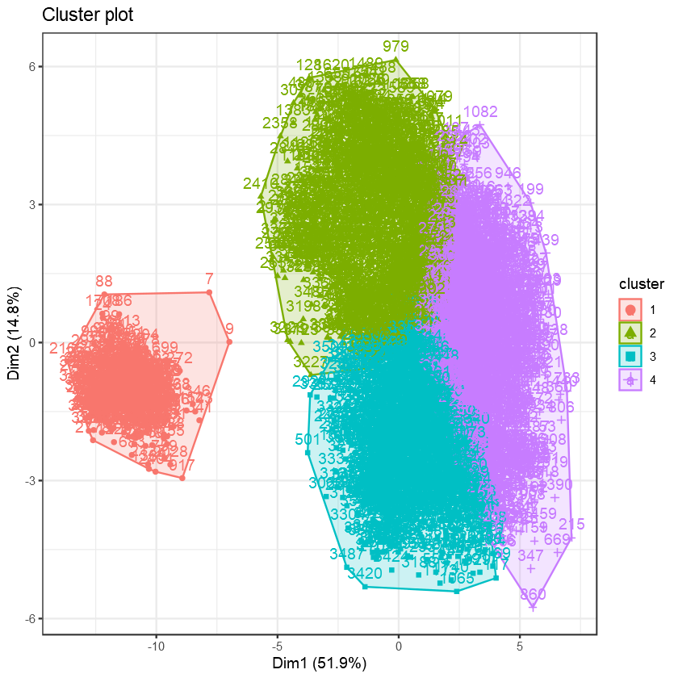
    


```R
pca <- PCA(league_df_c, graph = FALSE)
fviz_contrib(pca, choice = "var", axes = 1, top = 5) + theme_bw()
fviz_contrib(pca, choice = "var", axes = 2, top = 5) + theme_bw()
```


    
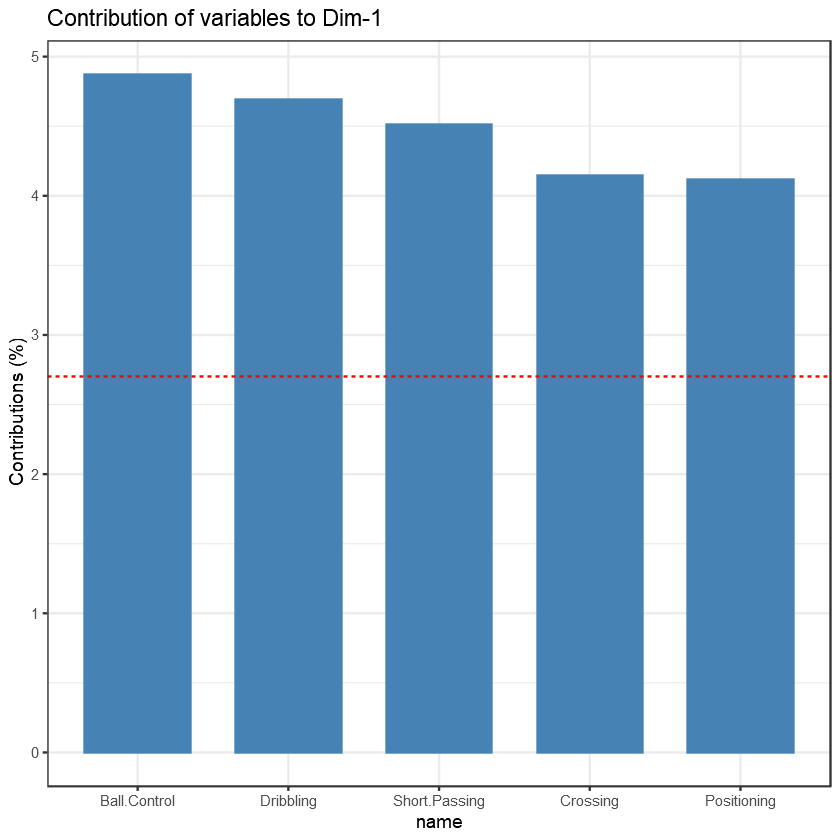
    


    
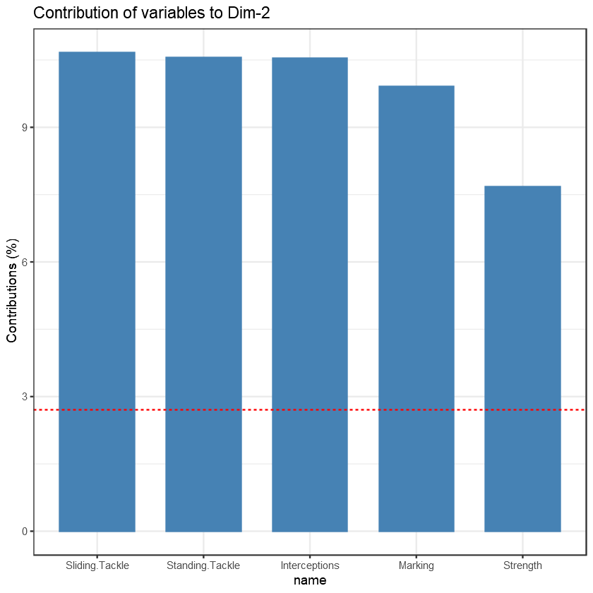
    


### Cluster 1


```R
library(fmsb)
library(RColorBrewer)
library(scales)
```


```R
league_df['Cluster'] <- k4$cluster

posit_abil_max <- league_df %>%
    select(foot, Height, Weight, Attacking, Skill, Movement, Power, Mentality, Defending, Goalkeeping) %>%
    summarise_all(max) %>% head

Cluster1 <- league_df %>%
    filter(Cluster == 1) %>%
    select(foot, Height, Weight, Attacking, Skill, Movement, Power, Mentality, Defending, Goalkeeping) %>%
    summarise_all(mean)

Cluster2 <- league_df %>%
    filter(Cluster == 2) %>%
    select(foot, Height, Weight, Attacking, Skill, Movement, Power, Mentality, Defending, Goalkeeping) %>%
    summarise_all(mean)

Cluster3 <- league_df %>%
    filter(Cluster == 3) %>%
    select(foot, Height, Weight, Attacking, Skill, Movement, Power, Mentality, Defending, Goalkeeping) %>%
    summarise_all(mean)

Cluster4 <- league_df %>%
    filter(Cluster == 4) %>%
    select(foot, Height, Weight, Attacking, Skill, Movement, Power, Mentality, Defending, Goalkeeping) %>%
    summarise_all(mean)
```


```R
league_df %>%
    filter(Cluster == 1) %>%
    group_by(BP) %>% count() %>%
    ggplot(aes(BP, n, fill = n)) + geom_col() + 
    ggtitle("Position Counts in Cluster1") + xlab("Positions") + 
    theme(legend.position = "none",
        axis.title.y = element_blank(),
        axis.title.x = element_text(size = 14, face = "bold"),
        axis.text.x = element_text(size = 11, face = "bold"),
        axis.text.y = element_text(size = 11, face = "bold"),
        plot.title = element_text(size = 15, hjust = 0.5, face = "bold"),
        axis.line.x.bottom = element_line(color = "black", size = 1),
        axis.line.y.left = element_line(color = "black", size = 1))

radarchart(bind_rows(rbind(posit_abil_max, rep(0, 10)), Cluster1), 
           axistype = 0, maxmin = T,
           plwd = 4, plty = 1.5 ,
           cglcol = "grey", cglty = 1, axislabcol = "black", cglwd = 0.8,
           vlcex = 0.8) + 
            title("Mean Ability of Players in Cluster1")
```


    
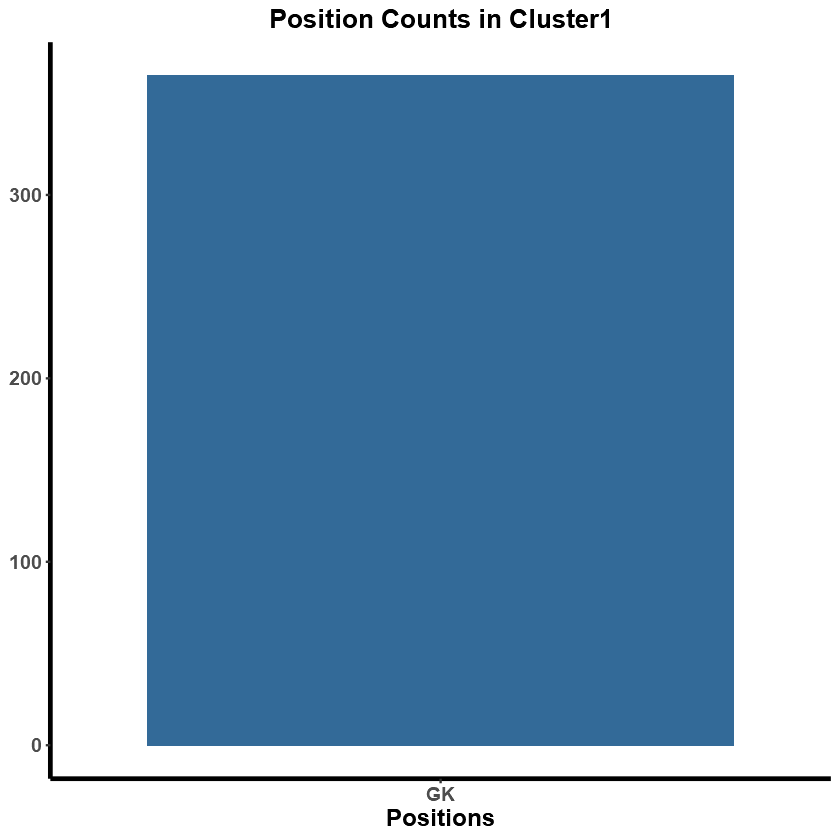
    


    
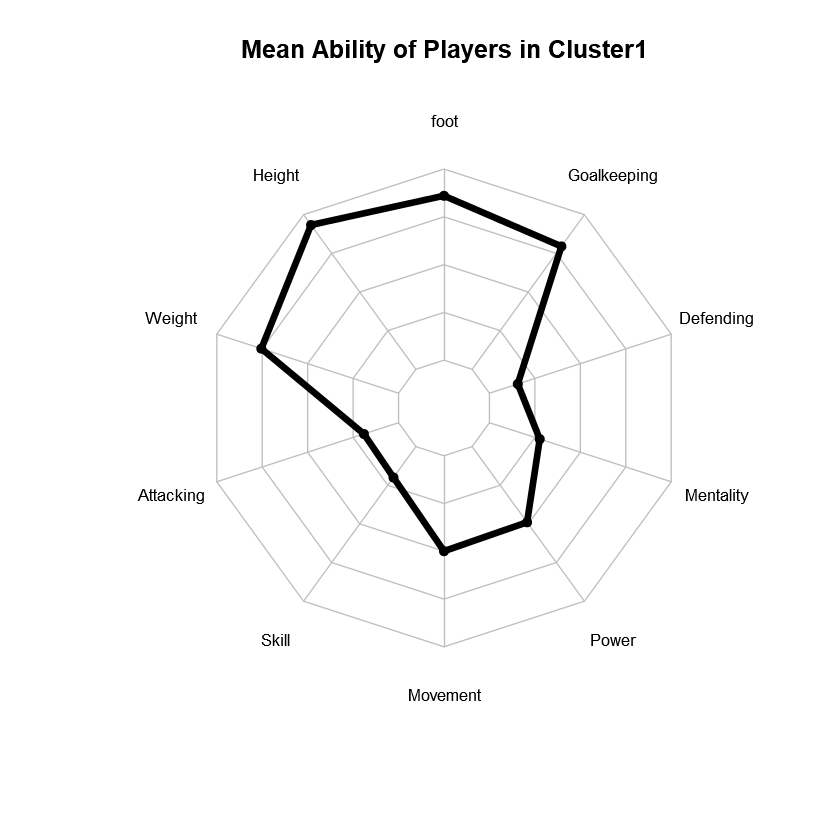
    


```R
league_df %>%
    filter(Cluster == 2) %>%
    group_by(BP) %>% count() %>%
    ggplot(aes(fct_reorder(BP, -n), n, fill = n)) + geom_col() +
    ggtitle("Position Counts in Cluster2") + xlab("Positions") + 
    theme(legend.position = "none",
        axis.title.y = element_blank(),
        axis.title.x = element_text(size = 14, face = "bold"),
        axis.text.x = element_text(size = 11, face = "bold"),
        axis.text.y = element_text(size = 11, face = "bold"),
        plot.title = element_text(size = 15, hjust = 0.5, face = "bold"),
        axis.line.x.bottom = element_line(color = "black", size = 1),
        axis.line.y.left = element_line(color = "black", size = 1))

radarchart(bind_rows(rbind(posit_abil_max, rep(0, 10)), Cluster2), 
           axistype = 0, maxmin = T,
           plwd = 4, plty = 1.5 ,
           cglcol = "grey", cglty = 1, axislabcol = "black", cglwd = 0.8,
           vlcex = 0.8) + 
            title("Mean Ability of Players in Cluster2")
```


    
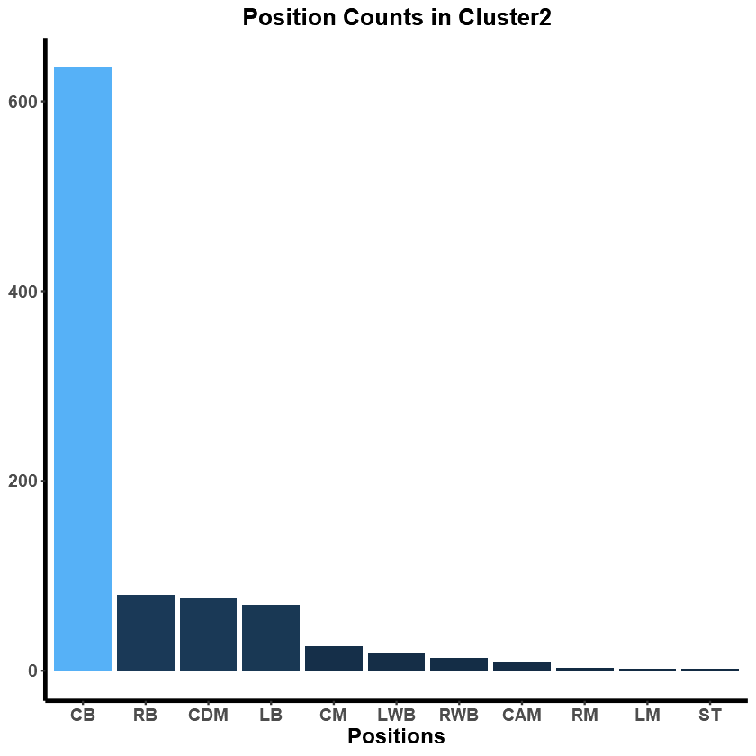
    


    
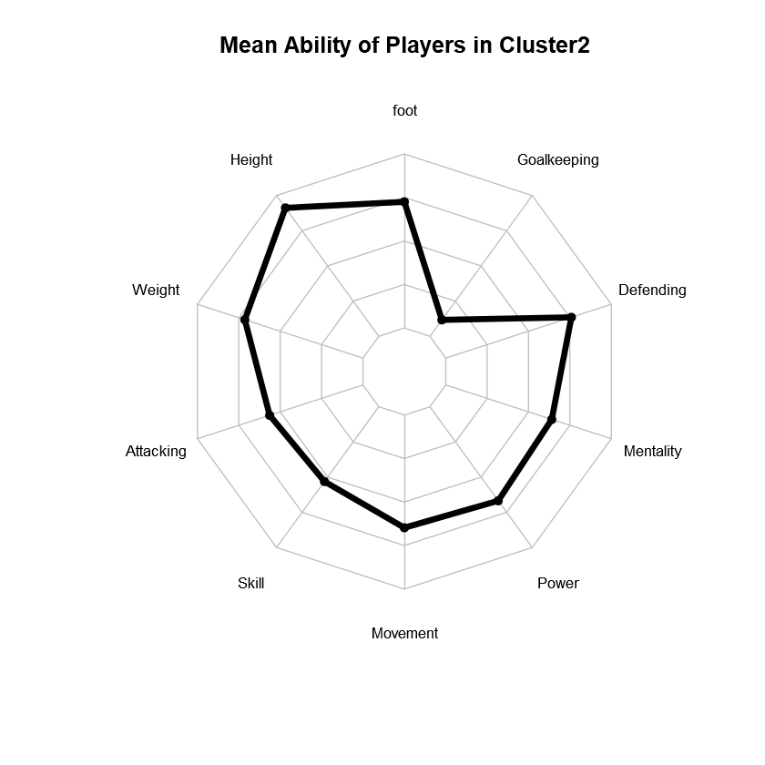
    


```R
league_df %>%
    filter(Cluster == 3) %>%
    group_by(BP) %>% count() %>%
    ggplot(aes(fct_reorder(BP, -n), n, fill = n)) + geom_col() +
    ggtitle("Position Counts in Cluster3") + xlab("Positions") + 
    theme(legend.position = "none",
        axis.title.y = element_blank(),
        axis.title.x = element_text(size = 14, face = "bold"),
        axis.text.x = element_text(size = 11, face = "bold"),
        axis.text.y = element_text(size = 11, face = "bold"),
        plot.title = element_text(size = 15, hjust = 0.5, face = "bold"),
        axis.line.x.bottom = element_line(color = "black", size = 1),
        axis.line.y.left = element_line(color = "black", size = 1)) 

radarchart(bind_rows(rbind(posit_abil_max, rep(0, 10)), Cluster3), 
           axistype = 0, maxmin = T,
           plwd = 4, plty = 1.5 ,
           cglcol = "grey", cglty = 1, axislabcol = "black", cglwd = 0.8,
           vlcex = 0.8) + 
            title("Mean Ability of Players in Cluster3")
```


    
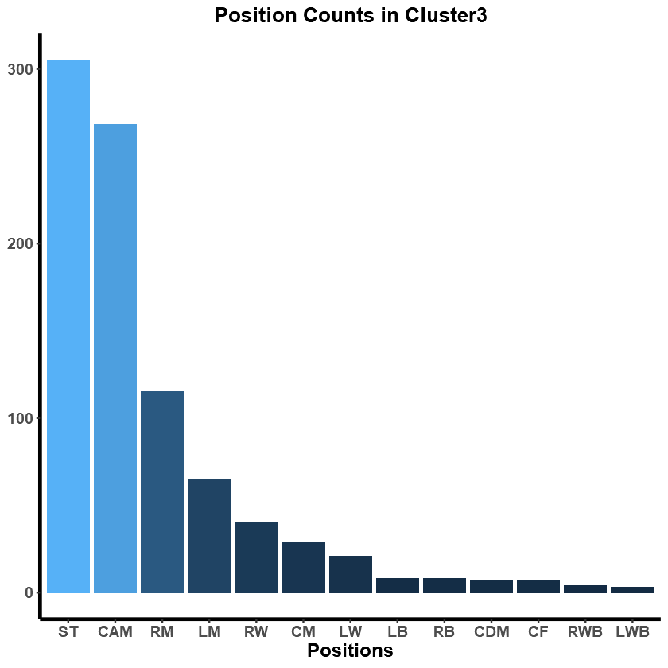
    


    
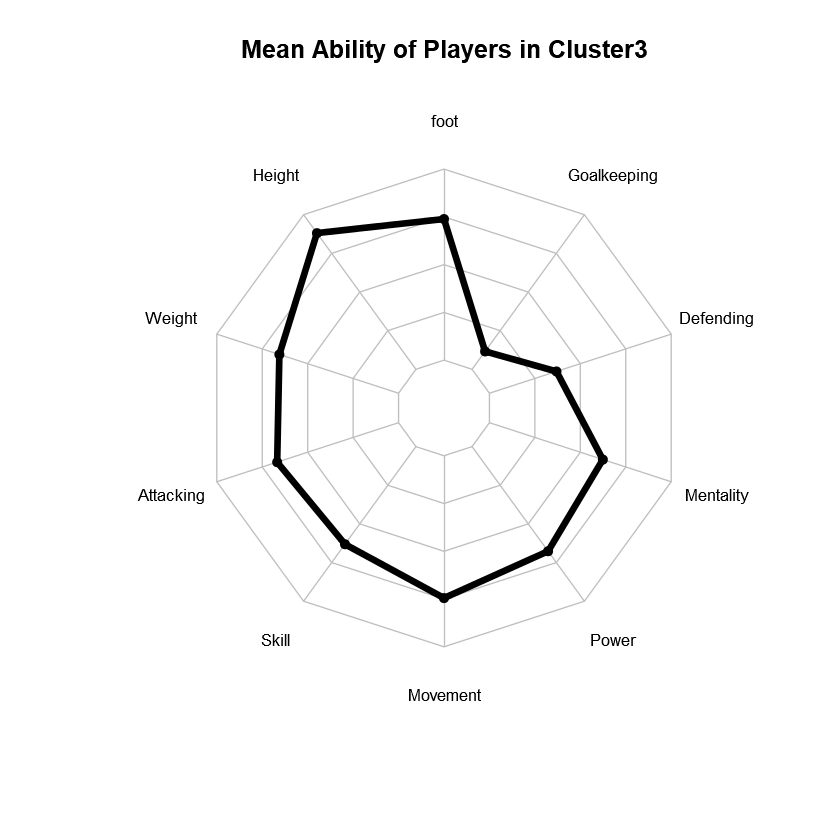
    


```R
league_df %>%
    filter(Cluster == 4) %>%
    group_by(BP) %>% count() %>%
    ggplot(aes(fct_reorder(BP, -n), n, fill = n)) + geom_col() +
    ggtitle("Position Counts in Cluster4") + xlab("Positions") + 
    theme(legend.position = "none",
        axis.title.y = element_blank(),
        axis.title.x = element_text(size = 14, face = "bold"),
        axis.text.x = element_text(size = 11, face = "bold"),
        axis.text.y = element_text(size = 11, face = "bold"),
        plot.title = element_text(size = 15, hjust = 0.5, face = "bold"),
        axis.line.x.bottom = element_line(color = "black", size = 1),
        axis.line.y.left = element_line(color = "black", size = 1))

radarchart(bind_rows(rbind(posit_abil_max, rep(0, 10)), Cluster4), 
           axistype = 0, maxmin = T,
           plwd = 4, plty = 1.5 ,
           cglcol = "grey", cglty = 1, axislabcol = "black", cglwd = 0.8,
           vlcex = 0.8) + 
            title("Mean Ability of Players in Cluster4")
```


    
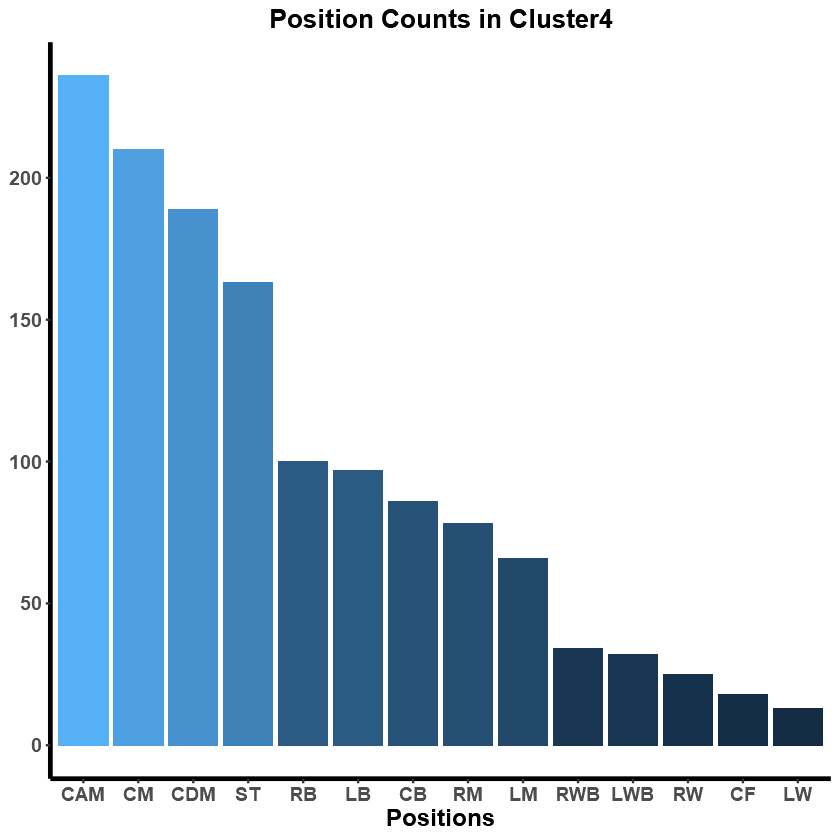
    


    
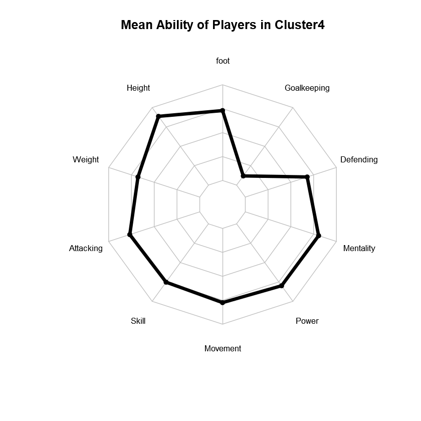
    

