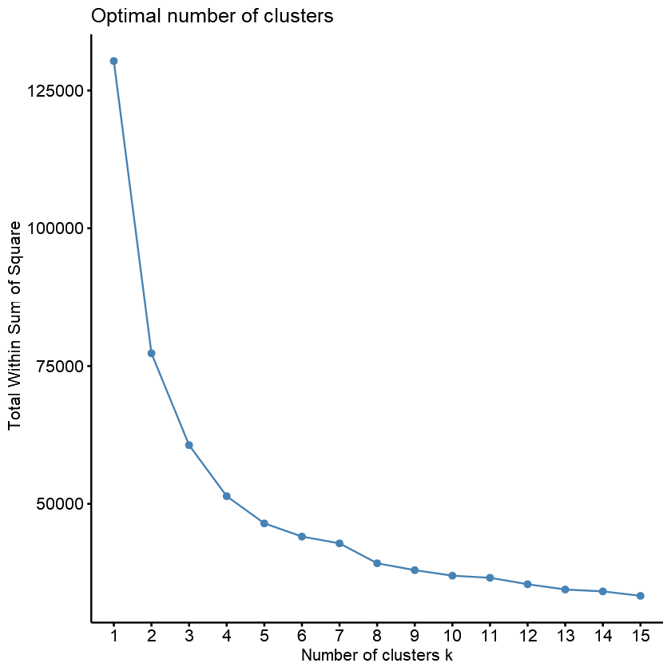
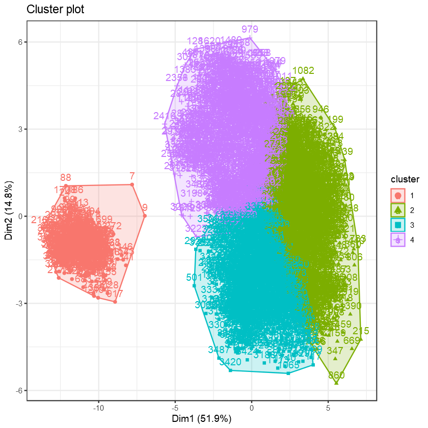
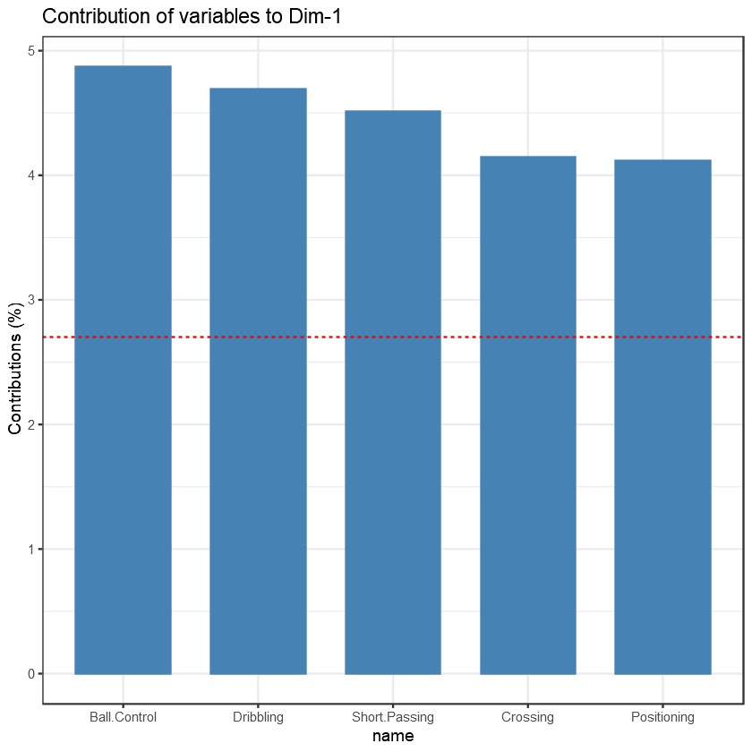
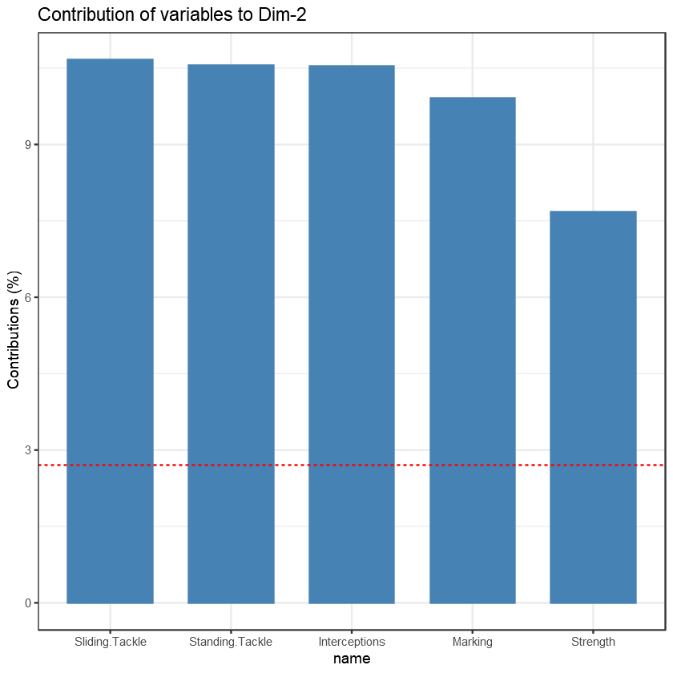
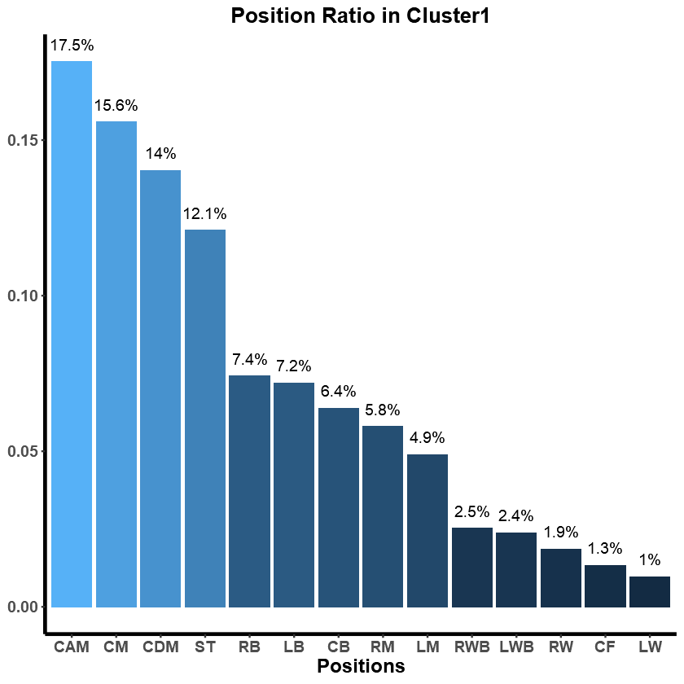
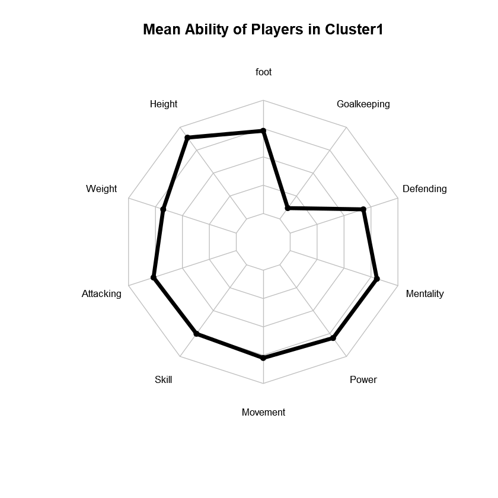
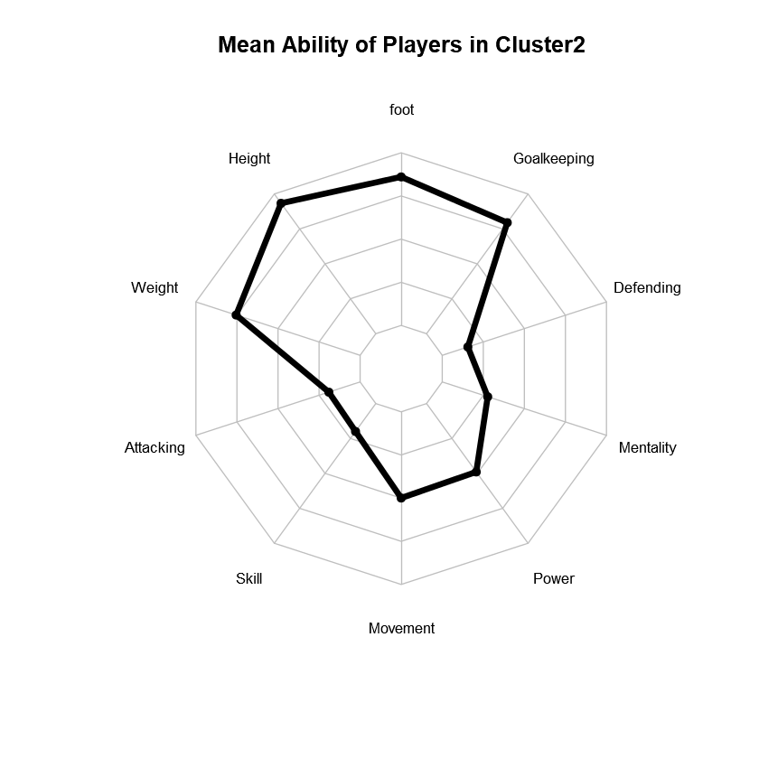
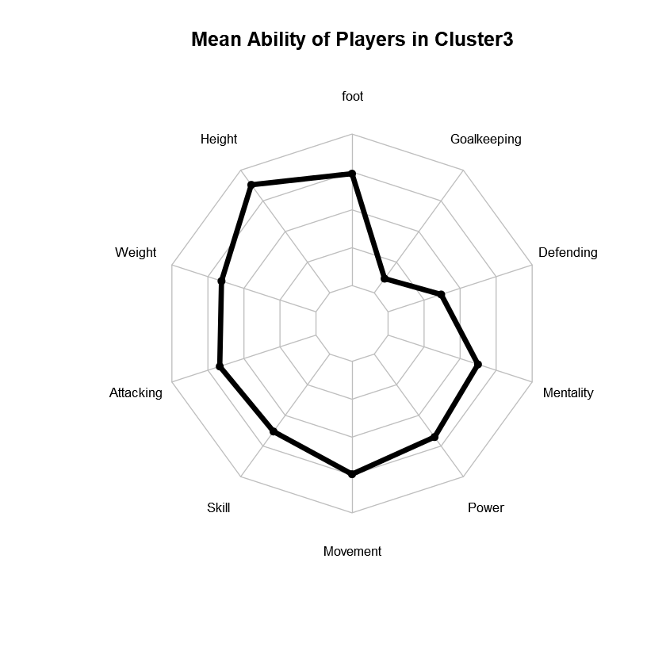
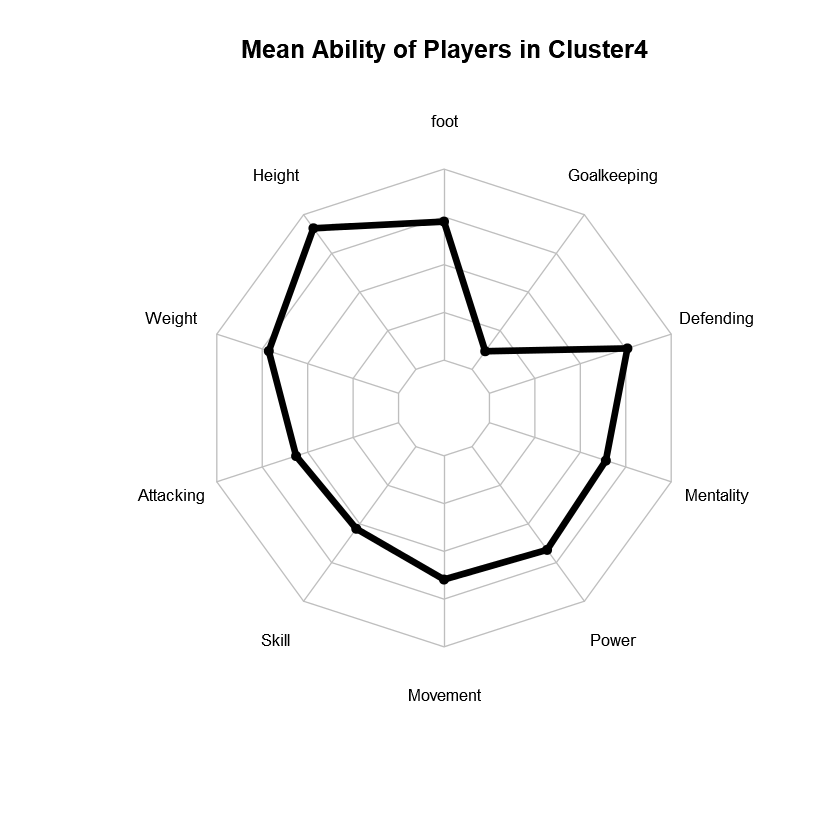

## 선수의 능력치에 따른 K-평균 군집화

<br/>

### K-평균 군집분석
- 비계층적 군집분석
- 주어진 데이터를 K개의 군집으로 묶는 알고리즘, 각 군집과 거리 차이의 분산을 최소화 하는 방식으로 동작
> * 원하는 군집의 개수가 초기 값(seed)들을 정해 seed중심으로 군집을 형성
> * 각 데이터를 거리가 가장 가까운 seed가 있는 군집으로 분류
> * 각 군집의 seed값을 다시 계산
> * 모든 개체가 군집으로 할당될 떄까지 

<br/>

```R
library(tidyverse)
library(NbClust)
library(cluster)
library(factoextra)
library(FactoMineR)

ggplot2::theme_set(theme_classic())
```

<br/>

### 데이터 로드
- 앞서 저장한 5대리그 데이터 로드

```R
league_df <- read.csv("C:/league_df.csv", stringsAsFactors = TRUE)
```
<br/>

#### 데이터에는 107개의 변수가 있으나, 모든 변수를 군집분석에 사용하지 않고 선수들의 능력치, 사용 발 여부(좌/우)와 관련된 변수들을 통해 K-평균 군집분석 실시

<br/>

### 군집분석을 하기 위한 변수 및 데이터 정제

<br/>

### Attacking Stats
- 선수의 공격력을 나타내는 Attacking변수는 Crossing(크로스), Finishing(골 결졍력), Heading.Accuracy(헤딩 정확도), Short.Passing(짧은 패스), Volleys(발리)의 총합인 파생변수.
- 따라서 군집분석을 위한 데이터에서 Attacking변수를 제외

```R
league_df[, 26:31] %>% head
```


<table class="dataframe">
<caption>A data.frame: 6 × 6</caption>
<thead>
	<tr><th></th><th scope=col>Attacking</th><th scope=col>Crossing</th><th scope=col>Finishing</th><th scope=col>Heading.Accuracy</th><th scope=col>Short.Passing</th><th scope=col>Volleys</th></tr>
	<tr><th></th><th scope=col>&lt;int&gt;</th><th scope=col>&lt;int&gt;</th><th scope=col>&lt;int&gt;</th><th scope=col>&lt;int&gt;</th><th scope=col>&lt;int&gt;</th><th scope=col>&lt;int&gt;</th></tr>
</thead>
<tbody>
	<tr><th scope=row>1</th><td>313</td><td>75</td><td>50</td><td>59</td><td>71</td><td>58</td></tr>
	<tr><th scope=row>2</th><td>380</td><td>90</td><td>70</td><td>60</td><td>85</td><td>75</td></tr>
	<tr><th scope=row>3</th><td>304</td><td>72</td><td>31</td><td>75</td><td>71</td><td>55</td></tr>
	<tr><th scope=row>4</th><td>394</td><td>83</td><td>65</td><td>72</td><td>89</td><td>85</td></tr>
	<tr><th scope=row>5</th><td>315</td><td>73</td><td>36</td><td>69</td><td>74</td><td>63</td></tr>
	<tr><th scope=row>6</th><td>206</td><td>20</td><td>28</td><td>81</td><td>54</td><td>23</td></tr>
</tbody>
</table>


<br/>

### Skill Stats
- 선수의 기술을 나타내는 Skill변수는 Dribbling(드리블), Curve(커브), FK.Accuracy(프리킥 정확도), Long.Passing(긴 패스), Ball.Control(볼 관리)의 총합인 파생변수.
- 따라서 군집분석을 위한 데이터에서 Skill변수를 제외


```R
league_df[, 32:37] %>% head
```


<table class="dataframe">
<caption>A data.frame: 6 × 6</caption>
<thead>
	<tr><th></th><th scope=col>Skill</th><th scope=col>Dribbling</th><th scope=col>Curve</th><th scope=col>FK.Accuracy</th><th scope=col>Long.Passing</th><th scope=col>Ball.Control</th></tr>
	<tr><th></th><th scope=col>&lt;int&gt;</th><th scope=col>&lt;int&gt;</th><th scope=col>&lt;int&gt;</th><th scope=col>&lt;int&gt;</th><th scope=col>&lt;int&gt;</th><th scope=col>&lt;int&gt;</th></tr>
</thead>
<tbody>
	<tr><th scope=row>1</th><td>338</td><td>73</td><td>65</td><td>60</td><td>69</td><td>71</td></tr>
	<tr><th scope=row>2</th><td>402</td><td>77</td><td>87</td><td>78</td><td>81</td><td>79</td></tr>
	<tr><th scope=row>3</th><td>258</td><td>44</td><td>56</td><td>33</td><td>61</td><td>64</td></tr>
	<tr><th scope=row>4</th><td>393</td><td>75</td><td>74</td><td>67</td><td>90</td><td>87</td></tr>
	<tr><th scope=row>5</th><td>283</td><td>53</td><td>45</td><td>41</td><td>72</td><td>72</td></tr>
	<tr><th scope=row>6</th><td>173</td><td>40</td><td>19</td><td>15</td><td>44</td><td>55</td></tr>
</tbody>
</table>


<br/>

### Movement Stats
- 선수의 움직임을 나타내는 Movement변수는 Acceleration(가속), Sprint.Speed(주력), Agility(민첩성), Reactions(반응속도), Balance(균형)의 총합인 파생변수.
- 따라서 군집분석을 위한 데이터에서 Movement변수를 제외


```R
league_df[, 38:43] %>% head
```


<table class="dataframe">
<caption>A data.frame: 6 × 6</caption>
<thead>
	<tr><th></th><th scope=col>Movement</th><th scope=col>Acceleration</th><th scope=col>Sprint.Speed</th><th scope=col>Agility</th><th scope=col>Reactions</th><th scope=col>Balance</th></tr>
	<tr><th></th><th scope=col>&lt;int&gt;</th><th scope=col>&lt;int&gt;</th><th scope=col>&lt;int&gt;</th><th scope=col>&lt;int&gt;</th><th scope=col>&lt;int&gt;</th><th scope=col>&lt;int&gt;</th></tr>
</thead>
<tbody>
	<tr><th scope=row>1</th><td>347</td><td>68</td><td>74</td><td>68</td><td>69</td><td>68</td></tr>
	<tr><th scope=row>2</th><td>337</td><td>59</td><td>60</td><td>72</td><td>76</td><td>70</td></tr>
	<tr><th scope=row>3</th><td>324</td><td>64</td><td>70</td><td>51</td><td>72</td><td>67</td></tr>
	<tr><th scope=row>4</th><td>338</td><td>53</td><td>53</td><td>68</td><td>82</td><td>82</td></tr>
	<tr><th scope=row>5</th><td>321</td><td>52</td><td>51</td><td>65</td><td>83</td><td>70</td></tr>
	<tr><th scope=row>6</th><td>321</td><td>61</td><td>68</td><td>44</td><td>68</td><td>80</td></tr>
</tbody>
</table>


<br/>

### Power Stats
- 선수의 힘을 나타내는 Power변수는 Shot.Power(슛 파워), Jumping(점프), Stamina(체력), Long.Shots(중거리 슛)의 총합인 파생변수.
- 따라서 군집분석을 위한 데이터에서 Power변수를 제외


```R
league_df[, 44:49] %>% head
```


<table class="dataframe">
<caption>A data.frame: 6 × 6</caption>
<thead>
	<tr><th></th><th scope=col>Power</th><th scope=col>Shot.Power</th><th scope=col>Jumping</th><th scope=col>Stamina</th><th scope=col>Strength</th><th scope=col>Long.Shots</th></tr>
	<tr><th></th><th scope=col>&lt;int&gt;</th><th scope=col>&lt;int&gt;</th><th scope=col>&lt;int&gt;</th><th scope=col>&lt;int&gt;</th><th scope=col>&lt;int&gt;</th><th scope=col>&lt;int&gt;</th></tr>
</thead>
<tbody>
	<tr><th scope=row>1</th><td>347</td><td>74</td><td>68</td><td>69</td><td>68</td><td>68</td></tr>
	<tr><th scope=row>2</th><td>310</td><td>71</td><td>59</td><td>48</td><td>61</td><td>71</td></tr>
	<tr><th scope=row>3</th><td>284</td><td>47</td><td>70</td><td>65</td><td>74</td><td>28</td></tr>
	<tr><th scope=row>4</th><td>333</td><td>88</td><td>64</td><td>34</td><td>63</td><td>84</td></tr>
	<tr><th scope=row>5</th><td>349</td><td>77</td><td>71</td><td>61</td><td>76</td><td>64</td></tr>
	<tr><th scope=row>6</th><td>319</td><td>57</td><td>85</td><td>64</td><td>87</td><td>26</td></tr>
</tbody>
</table>


<br/>

### Mentality Stats
- 선수의 정신력을 나타내는 Mentality변수는 Aggression(공격성), Interceptions(패스 차단 능력), Positioning(위치선정), Vision(시야), Penalties(페널티 킥), Composure(침착성)의 총합인 파생변수.
- 따라서 군집분석을 위한 데이터에서 Mentality변수를 제외

```R
league_df[, 50:56] %>% head
```


<table class="dataframe">
<caption>A data.frame: 6 × 7</caption>
<thead>
	<tr><th></th><th scope=col>Mentality</th><th scope=col>Aggression</th><th scope=col>Interceptions</th><th scope=col>Positioning</th><th scope=col>Vision</th><th scope=col>Penalties</th><th scope=col>Composure</th></tr>
	<tr><th></th><th scope=col>&lt;int&gt;</th><th scope=col>&lt;int&gt;</th><th scope=col>&lt;int&gt;</th><th scope=col>&lt;int&gt;</th><th scope=col>&lt;int&gt;</th><th scope=col>&lt;int&gt;</th><th scope=col>&lt;int&gt;</th></tr>
</thead>
<tbody>
	<tr><th scope=row>1</th><td>320</td><td>72</td><td>69</td><td>63</td><td>66</td><td>50</td><td>61</td></tr>
	<tr><th scope=row>2</th><td>358</td><td>60</td><td>47</td><td>78</td><td>83</td><td>90</td><td>61</td></tr>
	<tr><th scope=row>3</th><td>319</td><td>87</td><td>85</td><td>45</td><td>70</td><td>32</td><td>61</td></tr>
	<tr><th scope=row>4</th><td>417</td><td>87</td><td>79</td><td>83</td><td>91</td><td>77</td><td>61</td></tr>
	<tr><th scope=row>5</th><td>335</td><td>78</td><td>83</td><td>48</td><td>57</td><td>69</td><td>61</td></tr>
	<tr><th scope=row>6</th><td>296</td><td>84</td><td>77</td><td>41</td><td>57</td><td>37</td><td>61</td></tr>
</tbody>
</table>


<br/>

### Defending Stats
- 선수의 수비력을 나타내는 Defending변수는 Marking(맨 마킹 능력), Standing.Tackle(스탠딩 태클), Sliding.Tackle(슬라이딩 태클)의 총합인 파생변수.
- 따라서 군집분석을 위한 데이터에서 Defending변수를 제외

```R
league_df[, 57:60] %>% head
```


<table class="dataframe">
<caption>A data.frame: 6 × 4</caption>
<thead>
	<tr><th></th><th scope=col>Defending</th><th scope=col>Marking</th><th scope=col>Standing.Tackle</th><th scope=col>Sliding.Tackle</th></tr>
	<tr><th></th><th scope=col>&lt;int&gt;</th><th scope=col>&lt;int&gt;</th><th scope=col>&lt;int&gt;</th><th scope=col>&lt;int&gt;</th></tr>
</thead>
<tbody>
	<tr><th scope=row>1</th><td>208</td><td>70</td><td>69</td><td>69</td></tr>
	<tr><th scope=row>2</th><td>120</td><td>26</td><td>43</td><td>51</td></tr>
	<tr><th scope=row>3</th><td>242</td><td>78</td><td>81</td><td>83</td></tr>
	<tr><th scope=row>4</th><td>143</td><td>58</td><td>49</td><td>36</td></tr>
	<tr><th scope=row>5</th><td>224</td><td>77</td><td>75</td><td>72</td></tr>
	<tr><th scope=row>6</th><td>222</td><td>72</td><td>77</td><td>73</td></tr>
</tbody>
</table>


<br/>

### Goalkeeping Stats
- 선수의 골키퍼 능력을 나타내는 Goalkeeping변수는 GK.Diving(골키퍼 다이빙), GK.Handling(골키퍼 볼 핸들링), GK.Kicking(골키퍼 킥), GK.Positioning(골키퍼 위치선정), GK.Reflexes(골키퍼 민첩성)의 총합인 파생변수.
- 따라서 군집분석을 위한 데이터에서 Goalkeeping변수를 제외


```R
league_df[, 61:66] %>% head
```


<table class="dataframe">
<caption>A data.frame: 6 × 6</caption>
<thead>
	<tr><th></th><th scope=col>Goalkeeping</th><th scope=col>GK.Diving</th><th scope=col>GK.Handling</th><th scope=col>GK.Kicking</th><th scope=col>GK.Positioning</th><th scope=col>GK.Reflexes</th></tr>
	<tr><th></th><th scope=col>&lt;int&gt;</th><th scope=col>&lt;int&gt;</th><th scope=col>&lt;int&gt;</th><th scope=col>&lt;int&gt;</th><th scope=col>&lt;int&gt;</th><th scope=col>&lt;int&gt;</th></tr>
</thead>
<tbody>
	<tr><th scope=row>1</th><td>56</td><td>14</td><td> 5</td><td>15</td><td>10</td><td>12</td></tr>
	<tr><th scope=row>2</th><td>32</td><td>10</td><td> 5</td><td> 7</td><td> 5</td><td> 5</td></tr>
	<tr><th scope=row>3</th><td>43</td><td>12</td><td> 9</td><td> 5</td><td> 6</td><td>11</td></tr>
	<tr><th scope=row>4</th><td>47</td><td> 7</td><td>12</td><td> 5</td><td>15</td><td> 8</td></tr>
	<tr><th scope=row>5</th><td>41</td><td>10</td><td> 7</td><td>12</td><td> 5</td><td> 7</td></tr>
	<tr><th scope=row>6</th><td>44</td><td>11</td><td> 7</td><td>12</td><td> 5</td><td> 9</td></tr>
</tbody>
</table>


<br/>

### Foot


```R
league_df$foot <- league_df$foot %>% as.numeric - 1
head(league_df$foot)
```


<style>
.list-inline {list-style: none; margin:0; padding: 0}
.list-inline>li {display: inline-block}
.list-inline>li:not(:last-child)::after {content: "\00b7"; padding: 0 .5ex}
</style>
<ol class=list-inline><li>0</li><li>0</li><li>1</li><li>1</li><li>1</li><li>1</li></ol>


<br/>

### Data for K-Means Cluster
- 능력치, 사용 발, 신장과 몸무게에 대한 변수들을 군집분석을 위한 변수로 선정
- K-평균 군집 분석은 관측치 간의 거리를 이용하기 때문에 변수의 단위가 결과에 큰 영향을 미침. 따라서 변수를 표준화를 적용


```R
league_df_c <- league_df[c(which(colnames(league_df) %in% c("foot", "Height", "Weight")),
                    27:31, 33:37, 39:43, 45:49, 51:56, 58:60, 62:66)] %>% scale
head(league_df_c)
```


<table class="dataframe">
<caption>A matrix: 6 × 37 of type dbl</caption>
<thead>
	<tr><th scope=col>Weight</th><th scope=col>foot</th><th scope=col>Height</th><th scope=col>Crossing</th><th scope=col>Finishing</th><th scope=col>Heading.Accuracy</th><th scope=col>Short.Passing</th><th scope=col>Volleys</th><th scope=col>Dribbling</th><th scope=col>Curve</th><th scope=col>...</th><th scope=col>Penalties</th><th scope=col>Composure</th><th scope=col>Marking</th><th scope=col>Standing.Tackle</th><th scope=col>Sliding.Tackle</th><th scope=col>GK.Diving</th><th scope=col>GK.Handling</th><th scope=col>GK.Kicking</th><th scope=col>GK.Positioning</th><th scope=col>GK.Reflexes</th></tr>
</thead>
<tbody>
	<tr><td> 0.84270337</td><td>-1.7072575</td><td> 0.08926233</td><td> 1.0043338</td><td>-0.005013885</td><td>0.1121892</td><td> 0.3931987</td><td> 0.510249</td><td> 0.5777518</td><td> 0.5829927</td><td>...</td><td>-0.1298504</td><td>-0.3199184</td><td> 0.8244603</td><td> 0.6863446</td><td> 0.80404150</td><td>-0.1388187</td><td>-0.6228130</td><td>-0.07728738</td><td>-0.35021905</td><td>-0.2488648</td></tr>
	<tr><td>-0.67531499</td><td>-1.7072575</td><td>-0.68077546</td><td> 1.7629227</td><td> 0.939848716</td><td>0.1654285</td><td> 1.3094924</td><td> 1.382723</td><td> 0.7784218</td><td> 1.6913364</td><td>...</td><td> 2.2426334</td><td>-0.3199184</td><td>-1.1650120</td><td>-0.4201541</td><td> 0.03041713</td><td>-0.3482128</td><td>-0.6228130</td><td>-0.52150464</td><td>-0.61857563</td><td>-0.6084171</td></tr>
	<tr><td> 0.39994801</td><td> 0.5855685</td><td>-0.68077546</td><td> 0.8526160</td><td>-0.902633355</td><td>0.9640174</td><td> 0.3931987</td><td> 0.356283</td><td>-0.8771054</td><td> 0.1295793</td><td>...</td><td>-1.1974681</td><td>-0.3199184</td><td> 1.1861826</td><td> 1.1970363</td><td> 1.40574935</td><td>-0.2435157</td><td>-0.4048972</td><td>-0.63255896</td><td>-0.56490431</td><td>-0.3002294</td></tr>
	<tr><td>-0.67531499</td><td> 0.5855685</td><td>-1.83583215</td><td> 1.4089145</td><td> 0.703633065</td><td>0.8042996</td><td> 1.5712906</td><td> 1.895943</td><td> 0.6780868</td><td> 1.0364060</td><td>...</td><td> 1.4715761</td><td>-0.3199184</td><td> 0.2818770</td><td>-0.1648082</td><td>-0.61426985</td><td>-0.5052583</td><td>-0.2414604</td><td>-0.63255896</td><td>-0.08186247</td><td>-0.4543233</td></tr>
	<tr><td> 0.02044342</td><td> 0.5855685</td><td>-0.29575657</td><td> 0.9031886</td><td>-0.666417705</td><td>0.6445818</td><td> 0.5895474</td><td> 0.766859</td><td>-0.4255980</td><td>-0.4245925</td><td>...</td><td> 0.9970794</td><td>-0.3199184</td><td> 1.1409673</td><td> 0.9416905</td><td> 0.93297890</td><td>-0.3482128</td><td>-0.5138551</td><td>-0.24386885</td><td>-0.61857563</td><td>-0.5056879</td></tr>
	<tr><td> 1.41196025</td><td> 0.5855685</td><td> 0.85930011</td><td>-1.7771588</td><td>-1.044362746</td><td>1.2834530</td><td>-0.7194436</td><td>-1.286021</td><td>-1.0777754</td><td>-1.7344533</td><td>...</td><td>-0.9009076</td><td>-0.3199184</td><td> 0.9148909</td><td> 1.0268058</td><td> 0.97595803</td><td>-0.2958642</td><td>-0.5138551</td><td>-0.24386885</td><td>-0.61857563</td><td>-0.4029586</td></tr>
</tbody>
</table>


<br/>

### 최적의 군집수 탐색
- K-평균 군집분석은 비지도학습 방법으로써, 생성할 군집의 개수 K를 사전에 설정할 수 있다.
- 최적의 군집형성의 기준은 **군집간 이질, 군집내 동질**


### K-Means Clustering with Elbow
- 군집의 집단 내 제곱합 그래프는 얼마나 군집화가 잘되었는가를 알려주는 척도로 군집내 총 제곱합(WSS, Total Within Sum of Squares)를 최소화 하는 것을 목적으로 한다.
- 군집 수에 따른 군집 내 총 제곱합의 그래프를 그려 최적의 군집수 선정, **급격히 감소하는 지점까지 군집으로 설정**하여 최적의 군집 개수 결정 

```R
fviz_nbclust(league_df_c, kmeans, k.max = 15, method = "wss")
```


    

    


### Elbow Point = 4
- 4까지 WSS가 급격히 감소하나, 그 이후 감소의 폭이 완만해짐 => 군집수를 4로 결정

<br/>

### K = 4의 군집분석 실시 및 시각화

```R
k4 <- kmeans(league_df_c, 4)

fviz_cluster(k4, data = league_df_c) + theme_bw()
```


    

    


#### 산점도는 주성분분석(PCA)에 의해 생성된 성분간의 관계를 표현한 것이다
#### X축의 Dim1은 전체분산의 51.9%를 설명하는 주성분이며, Y축의 Dim2는 전체분산의 14.8%를 설명하는 주성분이다.

```R
pca <- PCA(league_df_c, graph = FALSE)
fviz_contrib(pca, choice = "var", axes = 1, top = 5) + theme_bw()
fviz_contrib(pca, choice = "var", axes = 2, top = 5) + theme_bw()
```


    

    
#### Dim1을 구성하고 있는 요인(facor)중 높은 기여도를 가진 상위 5개의 요인은 각각 Ball.Control, Dribbling, Short.Passing, Crossing, Positioning이다. 


    

    
#### Dim2를 구성하고 있는 요인중 높은 기여도를 가진 상위 5개의 요인은 각각 Sliding.Tackle, Standing.Tackle, Interceptions, Marking, Strength이다.

<br/>

<br/>

### 군집내 데이터 확인


```R
library(fmsb)
library(RColorBrewer)
library(scales)
```


```R
league_df['Cluster'] <- k4$cluster

posit_abil_max <- league_df %>%
    select(foot, Height, Weight, Attacking, Skill, Movement, Power, Mentality, Defending, Goalkeeping) %>%
    summarise_all(max) %>% head

Cluster1 <- league_df %>%
    filter(Cluster == 1) %>%
    select(foot, Height, Weight, Attacking, Skill, Movement, Power, Mentality, Defending, Goalkeeping) %>%
    summarise_all(mean)

Cluster2 <- league_df %>%
    filter(Cluster == 2) %>%
    select(foot, Height, Weight, Attacking, Skill, Movement, Power, Mentality, Defending, Goalkeeping) %>%
    summarise_all(mean)

Cluster3 <- league_df %>%
    filter(Cluster == 3) %>%
    select(foot, Height, Weight, Attacking, Skill, Movement, Power, Mentality, Defending, Goalkeeping) %>%
    summarise_all(mean)

Cluster4 <- league_df %>%
    filter(Cluster == 4) %>%
    select(foot, Height, Weight, Attacking, Skill, Movement, Power, Mentality, Defending, Goalkeeping) %>%
    summarise_all(mean)
```

<br/>

### 군집 1

```R
league_df %>%
    filter(Cluster == 1) %>%
    group_by(BP) %>% count() %>% 
    mutate(ratio = n / sum(.[,2])) %>% 
    ggplot(aes(fct_reorder(BP, -ratio), ratio, fill = n)) + geom_col() + 
    ggtitle("Position Ratio in Cluster1") + xlab("Positions") + 
    geom_text(aes(label = paste0(round(100 * ratio, 1), "%")), vjust = -1) + 
    theme(legend.position = "none",
        axis.title.y = element_blank(),
        axis.title.x = element_text(size = 14, face = "bold"),
        axis.text.x = element_text(size = 11, face = "bold"),
        axis.text.y = element_text(size = 11, face = "bold"),
        plot.title = element_text(size = 15, hjust = 0.5, face = "bold"),
        axis.line.x.bottom = element_line(color = "black", size = 1),
        axis.line.y.left = element_line(color = "black", size = 1))

radarchart(bind_rows(rbind(posit_abil_max, rep(0, 10)), Cluster1), 
           axistype = 0, maxmin = T,
           plwd = 4, plty = 1.5 ,
           cglcol = "grey", cglty = 1, axislabcol = "black", cglwd = 0.8,
           vlcex = 0.8) + 
            title("Mean Ability of Players in Cluster1")
```


    

    


- 군집1에 속하는 선수들 포지션의 47%가 CAM(중앙 공격형 미드필더), CM(중앙 미드필더), CDM(중앙 수비형 미드필더)로써 미드필더 포지션을 가진 선수들이 높은 비율을 차지한다.
- 하지만 군집1에 속한 선수들의 포지션 비율차는 크지 않다
- 군집에 속한 선수들의 평균 능력치는 아래의 Starplot과 같다.


    

    
- 군집1에 속하는 선수들의 능력치는 Goalkeeping을 제외한 모든 능력치가 높음을 알 수 있으며, 오른발 잡이의 비율이 80%임을 알 수 있다. 

<br/>

### 군집 2

```R
league_df %>%
    filter(Cluster == 2) %>%
    group_by(BP) %>% count() %>% 
    mutate(ratio = n / sum(.[,2])) %>% 
    ggplot(aes(fct_reorder(BP, -ratio), ratio, fill = n)) + geom_col() + 
    ggtitle("Position Ratio in Cluster1") + xlab("Positions") + 
    geom_text(aes(label = paste0(round(100 * ratio, 1), "%")), vjust = -1) + 
    theme(legend.position = "none",
        axis.title.y = element_blank(),
        axis.title.x = element_text(size = 14, face = "bold"),
        axis.text.x = element_text(size = 11, face = "bold"),
        axis.text.y = element_text(size = 11, face = "bold"),
        plot.title = element_text(size = 15, hjust = 0.5, face = "bold"),
        axis.line.x.bottom = element_line(color = "black", size = 1),
        axis.line.y.left = element_line(color = "black", size = 1))

radarchart(bind_rows(rbind(posit_abil_max, rep(0, 10)), Cluster2), 
           axistype = 0, maxmin = T,
           plwd = 4, plty = 1.5 ,
           cglcol = "grey", cglty = 1, axislabcol = "black", cglwd = 0.8,
           vlcex = 0.8) + 
            title("Mean Ability of Players in Cluster2")
```


    

    


- 군집2에 속하는 선수들의 포지션은 전부 골키퍼임을 알 수있다.
- 군집2에 속한 선수들의 평균 능력치는 아래의 Starplot과 같다.


    

    
- 군집2에 속하는 선수들의 포지션은 전부 골키퍼이기에, 군집1에 속하는 선수들은 Goalkeeping 능력치에서 높음을 알 수 있다.


<br/>

### 군집 3

```R
league_df %>%
    filter(Cluster == 3) %>%
    group_by(BP) %>% count() %>% 
    mutate(ratio = n / sum(.[,2])) %>% 
    ggplot(aes(fct_reorder(BP, -ratio), ratio, fill = n)) + geom_col() + 
    ggtitle("Position Ratio in Cluster3") + xlab("Positions") + 
    geom_text(aes(label = paste0(round(100 * ratio, 1), "%")), vjust = -1) + 
    theme(legend.position = "none",
        axis.title.y = element_blank(),
        axis.title.x = element_text(size = 14, face = "bold"),
        axis.text.x = element_text(size = 11, face = "bold"),
        axis.text.y = element_text(size = 11, face = "bold"),
        plot.title = element_text(size = 15, hjust = 0.5, face = "bold"),
        axis.line.x.bottom = element_line(color = "black", size = 1),
        axis.line.y.left = element_line(color = "black", size = 1))
radarchart(bind_rows(rbind(posit_abil_max, rep(0, 10)), Cluster3), 
           axistype = 0, maxmin = T,
           plwd = 4, plty = 1.5 ,
           cglcol = "grey", cglty = 1, axislabcol = "black", cglwd = 0.8,
           vlcex = 0.8) + 
            title("Mean Ability of Players in Cluster3")
```


    

    


- 군집3에 속하는 선수들의 포지션중 가장 높은 비율을 가진 포지션은 ST(스트라이커)와 CAM(중앙 공격형 미드필더)로써, 공격적인 역할의 포지션이 높은 비율을 차지함을 알 수 있다.
- 군집3에 속한 선수들의 평균 능력치는 아래의 Starplot과 같다.


    

    
<br/>

### 군집 


```R
league_df %>%
    filter(Cluster == 4) %>%
    group_by(BP) %>% count() %>% 
    mutate(ratio = n / sum(.[,2])) %>% 
    ggplot(aes(fct_reorder(BP, -ratio), ratio, fill = n)) + geom_col() + 
    ggtitle("Position Ratio in Cluster4") + xlab("Positions") + 
    geom_text(aes(label = paste0(round(100 * ratio, 1), "%")), vjust = -1) + 
    theme(legend.position = "none",
        axis.title.y = element_blank(),
        axis.title.x = element_text(size = 14, face = "bold"),
        axis.text.x = element_text(size = 11, face = "bold"),
        axis.text.y = element_text(size = 11, face = "bold"),
        plot.title = element_text(size = 15, hjust = 0.5, face = "bold"),
        axis.line.x.bottom = element_line(color = "black", size = 1),
        axis.line.y.left = element_line(color = "black", size = 1))

radarchart(bind_rows(rbind(posit_abil_max, rep(0, 10)), Cluster4), 
           axistype = 0, maxmin = T,
           plwd = 4, plty = 1.5 ,
           cglcol = "grey", cglty = 1, axislabcol = "black", cglwd = 0.8,
           vlcex = 0.8) + 
            title("Mean Ability of Players in Cluster4")
```


    

    

- 군집4에 속하는 선수들의 68.1%는 CB(중앙 수비수)임을 알 수 있다.


    

    

