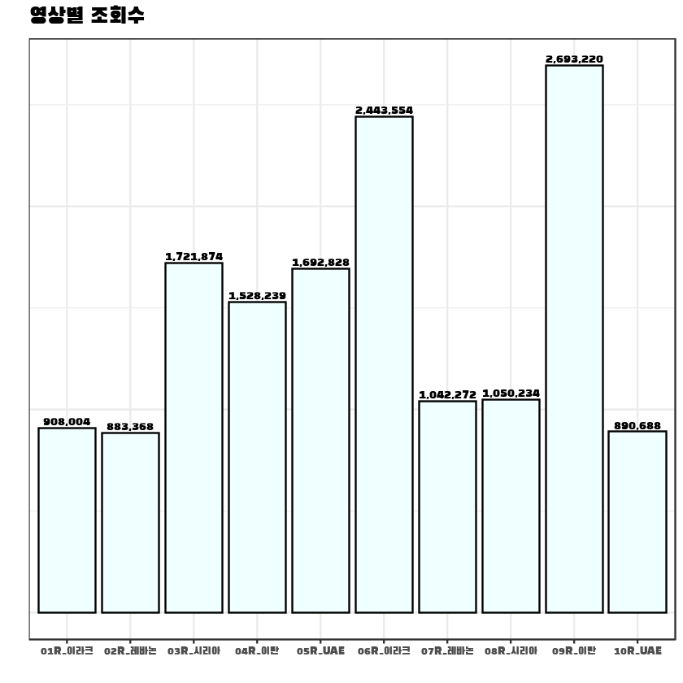
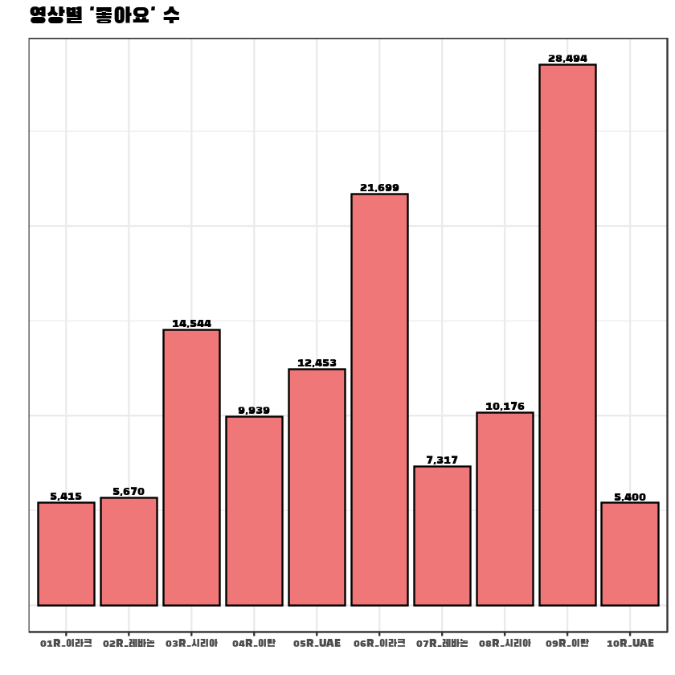
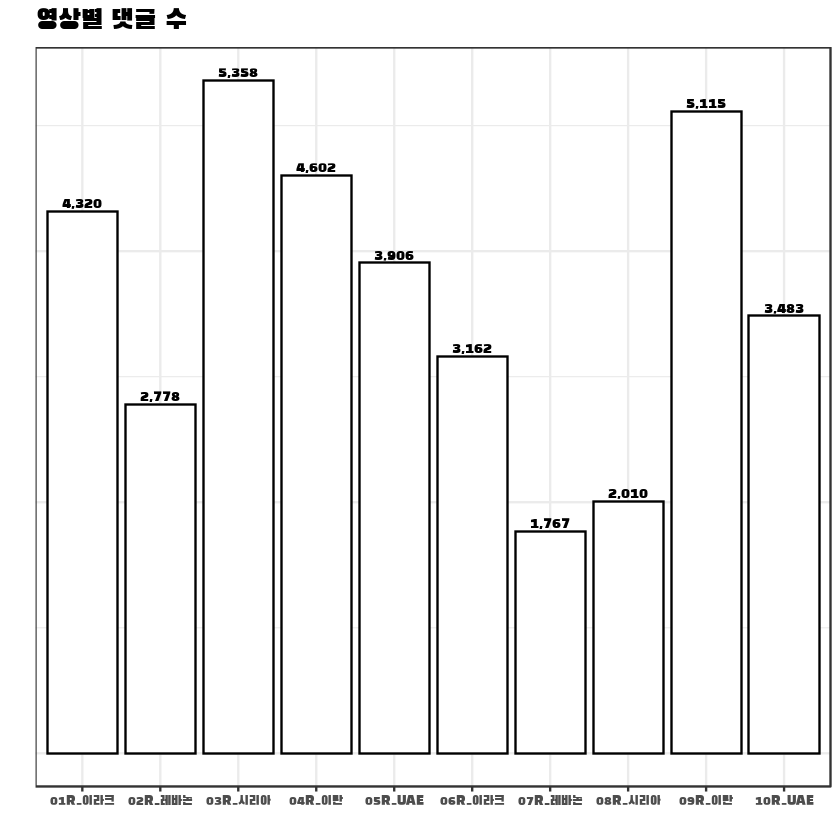
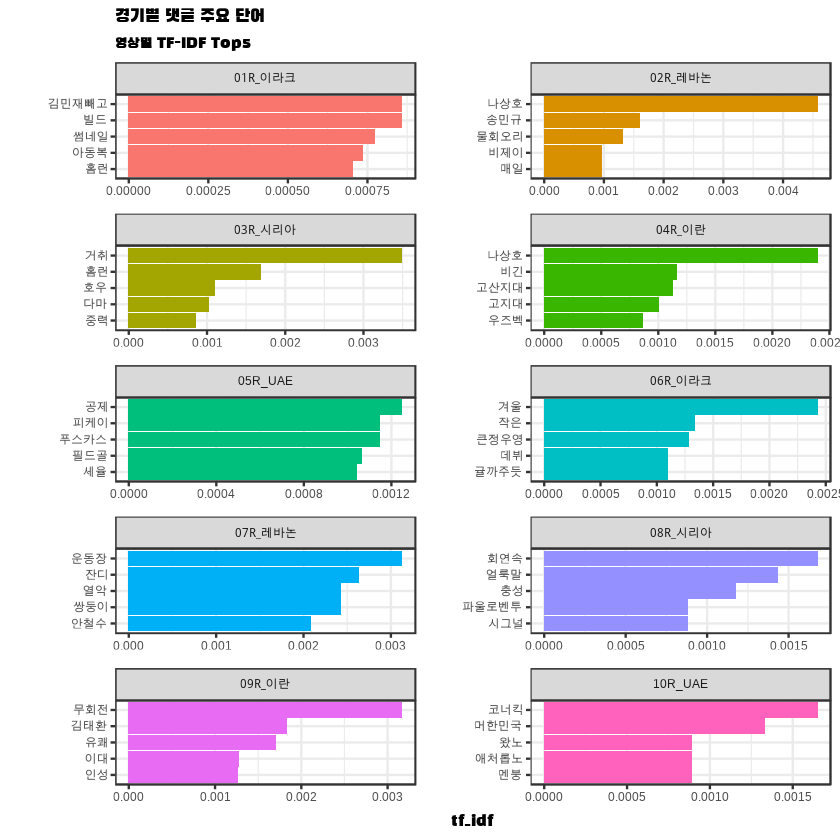
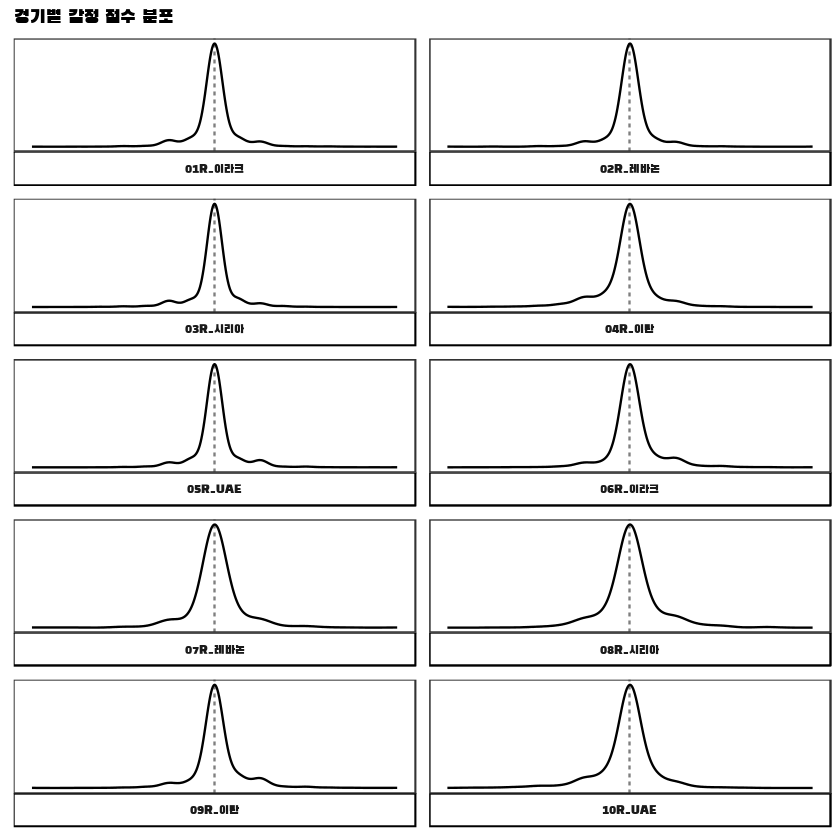
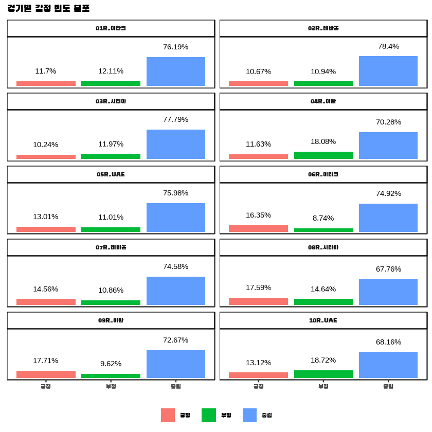
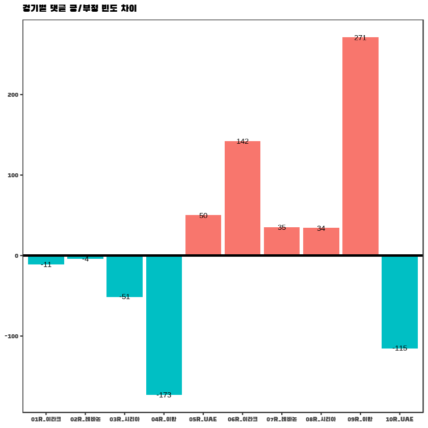
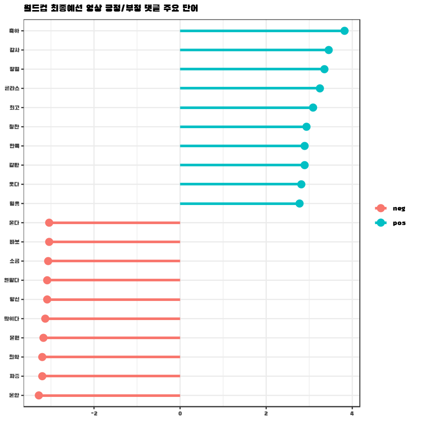

# 대한민국 축구 국가 대표팀 '2022 카타르 월드컵 최종예선'경기의 Youtube 하이라이트 영상 댓글

## 01. '2022 카타르 월드컵 최종에선'의 독점 중계사인 tvn SPORTS채널에 업로드 된, 경기별 Youtube 댓글 수집

| **영상 업로드 일자** | **경기 대진** | **링크** |
| -- | -- | -- |
2021-09-03 | 대한민국 0:0 이라크 | https://www.youtube.com/watch?v=tD3Rt0G5DzQ
2021-09-08 | 대한민국 1:0 레바논 | https://www.youtube.com/watch?v=KpeMHJt51dM
2021-10-08 | 대한민국 2:1 시리아 | (https://www.youtube.com/watch?v=moWz-iJt21A
2021-10-13 | 이란 1:1 대한민국 | https://www.youtube.com/watch?v=dilLNo2tXaE
2021-11-12 | 대한민국 1:0 아랍에미리트 | https://www.youtube.com/watch?v=IwgZhtMLx3s
2021-11-17 | 이라크 0:3 대한민국 | https://www.youtube.com/watch?v=aVNcxjMxnHg
2022-01-28 | 레바논 0:1 대한민국 | https://www.youtube.com/watch?v=TYT15A1ZzQQ
2022-02-02 | 시리아 0:2 대한민국 | https://www.youtube.com/watch?v=SvtTEEOuokc
2022-03-25 | 대한민국 2:0 이란 | https://www.youtube.com/watch?v=oGuwk9Riw0I
2022-03-30 | 아랍에미리트 1:0 대한민국 | https://www.youtube.com/watch?v=PlJ2Dd7ZpgE

### YouTube API를 통한 영상 정보 수집


```R
library(tuber)
library(tidyverse)
ggplot2::theme_set(theme_bw())
library(scales)
library(tidytext)
```


```R
library(showtext)
font_add_google(name = "Black Han Sans", family = "blackhansans")
showtext_auto()
```

    Loading required package: sysfonts
    
    Loading required package: showtextdb
    
    


```R
app_id = "283314905082-og0oatqboos96ndgil9utdli433mr4ba.apps.googleusercontent.com"
app_secret = "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"
```


```R
yt_oauth(app_id = app_id,
         app_secret = app_secret,
         token = "")
```


```R
video_id = c("tD3Rt0G5DzQ", "KpeMHJt51dM", "moWz-iJt21A", "dilLNo2tXaE", "IwgZhtMLx3s",
             "aVNcxjMxnHg", "TYT15A1ZzQQ", "SvtTEEOuokc", "oGuwk9Riw0I", "PlJ2Dd7ZpgE")
title <- c("01R_이라크", "02R_레바논", "03R_시리아", "04R_이란", "05R_UAE", 
           "06R_이라크", "07R_레바논", "08R_시리아", "09R_이란", "10R_UAE")
```


```R
round <- data.frame()
for (i in 1:length(video_id)) {
  r <- as.data.frame(get_stats(video_id = video_id[i]))
  round <- rbind(round, r)
}
```

    Auto-refreshing stale OAuth token.
    
    


```R
round <- cbind(title, round) %>%
    mutate(viewCount = as.numeric(viewCount),
           likeCount = as.numeric(likeCount),
           commentCount = as.numeric(commentCount))
```


```R
round
```


<table class="dataframe">
<caption>A data.frame: 10 × 6</caption>
<thead>
	<tr><th scope=col>title</th><th scope=col>id</th><th scope=col>viewCount</th><th scope=col>likeCount</th><th scope=col>favoriteCount</th><th scope=col>commentCount</th></tr>
	<tr><th scope=col>&lt;chr&gt;</th><th scope=col>&lt;chr&gt;</th><th scope=col>&lt;dbl&gt;</th><th scope=col>&lt;dbl&gt;</th><th scope=col>&lt;chr&gt;</th><th scope=col>&lt;dbl&gt;</th></tr>
</thead>
<tbody>
	<tr><td>01R_이라크</td><td>tD3Rt0G5DzQ</td><td> 908003</td><td> 5416</td><td>0</td><td>4319</td></tr>
	<tr><td>02R_레바논</td><td>KpeMHJt51dM</td><td> 883367</td><td> 5671</td><td>0</td><td>2777</td></tr>
	<tr><td>03R_시리아</td><td>moWz-iJt21A</td><td>1721874</td><td>14544</td><td>0</td><td>5358</td></tr>
	<tr><td>04R_이란  </td><td>dilLNo2tXaE</td><td>1528239</td><td> 9940</td><td>0</td><td>4602</td></tr>
	<tr><td>05R_UAE   </td><td>IwgZhtMLx3s</td><td>1692827</td><td>12453</td><td>0</td><td>3907</td></tr>
	<tr><td>06R_이라크</td><td>aVNcxjMxnHg</td><td>2443554</td><td>21698</td><td>0</td><td>3162</td></tr>
	<tr><td>07R_레바논</td><td>TYT15A1ZzQQ</td><td>1042273</td><td> 7318</td><td>0</td><td>1767</td></tr>
	<tr><td>08R_시리아</td><td>SvtTEEOuokc</td><td>1050234</td><td>10175</td><td>0</td><td>2009</td></tr>
	<tr><td>09R_이란  </td><td>oGuwk9Riw0I</td><td>2693221</td><td>28495</td><td>0</td><td>5116</td></tr>
	<tr><td>10R_UAE   </td><td>PlJ2Dd7ZpgE</td><td> 890687</td><td> 5401</td><td>0</td><td>3484</td></tr>
</tbody>
</table>


```R
ggplot(round) + geom_col(aes(title, viewCount), fill = "azure", color = "black") + 
    labs(title = "영상별 조회수",
        x = "", y = "") +
    geom_text(aes(title, viewCount, label = comma(viewCount, 3)),
              vjust = -0.3,
              family = "blackhansans") + 
    theme(text = element_text(family = "blackhansans", size = 12),
         plot.title = element_text(size = 20, face = "bold"),
         axis.text.y = element_blank(),
         axis.ticks.y = element_blank())
```


    

    


```R
ggplot(round) + geom_col(aes(title, likeCount), fill = "#F07777", color = "black") + 
    labs(title = "영상별 '좋아요' 수",
        x = "", y = "") +
    geom_text(aes(title, likeCount, label = comma(likeCount, 3)),
              vjust = -0.3,
              family = "blackhansans") + 
    theme(text = element_text(family = "blackhansans", size = 12),
         plot.title = element_text(size = 20, face = "bold"),
         axis.text.y = element_blank(),
         axis.ticks.y = element_blank())
```


    

    


```R
ggplot(round) + geom_col(aes(title, commentCount), fill = "white", color = "black") + 
    labs(title = "영상별 댓글 수",
        x = "", y = "") +
    geom_text(aes(title, commentCount, label = comma(commentCount, 3)),
              vjust = -0.3,
              family = "blackhansans") + 
    theme(text = element_text(family = "blackhansans", size = 12),
         plot.title = element_text(size = 20, face = "bold"),
         axis.text.y = element_blank(),
         axis.ticks.y = element_blank())
```


    

    


### 댓글 수집


```R
cmt1 <- get_all_comments(video_id = video_id[1])
cmt2 <- get_all_comments(video_id = video_id[2])
cmt3 <- get_all_comments(video_id = video_id[3])
cmt4 <- get_all_comments(video_id = video_id[4]) 
cmt5 <- get_all_comments(video_id = video_id[5])
cmt6 <- get_all_comments(video_id = video_id[6])
cmt7 <- get_all_comments(video_id = video_id[7])
cmt8 <- get_all_comments(video_id = video_id[8]) 
cmt9 <- get_all_comments(video_id = video_id[9]) 
cmt10 <- get_all_comments(video_id = video_id[10]) 
```

    Warning message in seq_len(n_replies):
    "first element used of 'length.out' argument"
    Warning message in seq_len(n_replies):
    "first element used of 'length.out' argument"
    Warning message in seq_len(n_replies):
    "first element used of 'length.out' argument"
    Warning message in seq_len(n_replies):
    "first element used of 'length.out' argument"
    Warning message in seq_len(n_replies):
    "first element used of 'length.out' argument"
    Warning message in seq_len(n_replies):
    "first element used of 'length.out' argument"
    Warning message in seq_len(n_replies):
    "first element used of 'length.out' argument"
    Warning message in seq_len(n_replies):
    "first element used of 'length.out' argument"
    Warning message in seq_len(n_replies):
    "first element used of 'length.out' argument"
    Warning message in seq_len(n_replies):
    "first element used of 'length.out' argument"
    Warning message in seq_len(n_replies):
    "first element used of 'length.out' argument"
    Warning message in seq_len(n_replies):
    "first element used of 'length.out' argument"
    Warning message in seq_len(n_replies):
    "first element used of 'length.out' argument"
    Warning message in seq_len(n_replies):
    "first element used of 'length.out' argument"
    Warning message in seq_len(n_replies):
    "first element used of 'length.out' argument"
    Warning message in seq_len(n_replies):
    "first element used of 'length.out' argument"
    Warning message in seq_len(n_replies):
    "first element used of 'length.out' argument"
    Warning message in seq_len(n_replies):
    "first element used of 'length.out' argument"
    Warning message in seq_len(n_replies):
    "first element used of 'length.out' argument"
    Warning message in seq_len(n_replies):
    "first element used of 'length.out' argument"
    Warning message in seq_len(n_replies):
    "first element used of 'length.out' argument"
    Warning message in seq_len(n_replies):
    "first element used of 'length.out' argument"
    Warning message in seq_len(n_replies):
    "first element used of 'length.out' argument"
    Warning message in seq_len(n_replies):
    "first element used of 'length.out' argument"
    Warning message in seq_len(n_replies):
    "first element used of 'length.out' argument"
    Warning message in seq_len(n_replies):
    "first element used of 'length.out' argument"
    Warning message in seq_len(n_replies):
    "first element used of 'length.out' argument"
    Warning message in seq_len(n_replies):
    "first element used of 'length.out' argument"
    Warning message in seq_len(n_replies):
    "first element used of 'length.out' argument"
    Warning message in seq_len(n_replies):
    "first element used of 'length.out' argument"
    Warning message in seq_len(n_replies):
    "first element used of 'length.out' argument"
    Warning message in seq_len(n_replies):
    "first element used of 'length.out' argument"
    Warning message in seq_len(n_replies):
    "first element used of 'length.out' argument"
    Warning message in seq_len(n_replies):
    "first element used of 'length.out' argument"
    Warning message in seq_len(n_replies):
    "first element used of 'length.out' argument"
    Warning message in seq_len(n_replies):
    "first element used of 'length.out' argument"
    Warning message in seq_len(n_replies):
    "first element used of 'length.out' argument"
    Warning message in seq_len(n_replies):
    "first element used of 'length.out' argument"
    Warning message in seq_len(n_replies):
    "first element used of 'length.out' argument"
    Warning message in seq_len(n_replies):
    "first element used of 'length.out' argument"
    Warning message in seq_len(n_replies):
    "first element used of 'length.out' argument"
    Warning message in seq_len(n_replies):
    "first element used of 'length.out' argument"
    Warning message in seq_len(n_replies):
    "first element used of 'length.out' argument"
    Warning message in seq_len(n_replies):
    "first element used of 'length.out' argument"
    Warning message in seq_len(n_replies):
    "first element used of 'length.out' argument"
    Warning message in seq_len(n_replies):
    "first element used of 'length.out' argument"
    Warning message in seq_len(n_replies):
    "first element used of 'length.out' argument"
    Warning message in seq_len(n_replies):
    "first element used of 'length.out' argument"
    Warning message in seq_len(n_replies):
    "first element used of 'length.out' argument"
    Warning message in seq_len(n_replies):
    "first element used of 'length.out' argument"
    Warning message in seq_len(n_replies):
    "first element used of 'length.out' argument"
    Warning message in seq_len(n_replies):
    "first element used of 'length.out' argument"
    Warning message in seq_len(n_replies):
    "first element used of 'length.out' argument"
    Warning message in seq_len(n_replies):
    "first element used of 'length.out' argument"
    Warning message in seq_len(n_replies):
    "first element used of 'length.out' argument"
    Warning message in seq_len(n_replies):
    "first element used of 'length.out' argument"
    Warning message in seq_len(n_replies):
    "first element used of 'length.out' argument"
    Warning message in seq_len(n_replies):
    "first element used of 'length.out' argument"
    Warning message in seq_len(n_replies):
    "first element used of 'length.out' argument"
    Warning message in seq_len(n_replies):
    "first element used of 'length.out' argument"
    Warning message in seq_len(n_replies):
    "first element used of 'length.out' argument"
    Warning message in seq_len(n_replies):
    "first element used of 'length.out' argument"
    Warning message in seq_len(n_replies):
    "first element used of 'length.out' argument"
    Warning message in seq_len(n_replies):
    "first element used of 'length.out' argument"
    Warning message in seq_len(n_replies):
    "first element used of 'length.out' argument"
    Warning message in seq_len(n_replies):
    "first element used of 'length.out' argument"
    Warning message in seq_len(n_replies):
    "first element used of 'length.out' argument"
    Warning message in seq_len(n_replies):
    "first element used of 'length.out' argument"
    Warning message in seq_len(n_replies):
    "first element used of 'length.out' argument"
    Warning message in seq_len(n_replies):
    "first element used of 'length.out' argument"
    Warning message in seq_len(n_replies):
    "first element used of 'length.out' argument"
    Warning message in seq_len(n_replies):
    "first element used of 'length.out' argument"
    Warning message in seq_len(n_replies):
    "first element used of 'length.out' argument"
    Warning message in seq_len(n_replies):
    "first element used of 'length.out' argument"
    Warning message in seq_len(n_replies):
    "first element used of 'length.out' argument"
    Warning message in seq_len(n_replies):
    "first element used of 'length.out' argument"
    Warning message in seq_len(n_replies):
    "first element used of 'length.out' argument"
    Warning message in seq_len(n_replies):
    "first element used of 'length.out' argument"
    Warning message in seq_len(n_replies):
    "first element used of 'length.out' argument"
    Warning message in seq_len(n_replies):
    "first element used of 'length.out' argument"
    Warning message in seq_len(n_replies):
    "first element used of 'length.out' argument"
    Warning message in seq_len(n_replies):
    "first element used of 'length.out' argument"
    Warning message in seq_len(n_replies):
    "first element used of 'length.out' argument"
    Warning message in seq_len(n_replies):
    "first element used of 'length.out' argument"
    Warning message in seq_len(n_replies):
    "first element used of 'length.out' argument"
    Warning message in seq_len(n_replies):
    "first element used of 'length.out' argument"
    Warning message in seq_len(n_replies):
    "first element used of 'length.out' argument"
    Warning message in seq_len(n_replies):
    "first element used of 'length.out' argument"
    Warning message in seq_len(n_replies):
    "first element used of 'length.out' argument"
    Warning message in seq_len(n_replies):
    "first element used of 'length.out' argument"
    Warning message in seq_len(n_replies):
    "first element used of 'length.out' argument"
    Warning message in seq_len(n_replies):
    "first element used of 'length.out' argument"
    Warning message in seq_len(n_replies):
    "first element used of 'length.out' argument"
    Warning message in seq_len(n_replies):
    "first element used of 'length.out' argument"
    Warning message in seq_len(n_replies):
    "first element used of 'length.out' argument"
    Warning message in seq_len(n_replies):
    "first element used of 'length.out' argument"
    Warning message in seq_len(n_replies):
    "first element used of 'length.out' argument"
    Warning message in seq_len(n_replies):
    "first element used of 'length.out' argument"
    Warning message in seq_len(n_replies):
    "first element used of 'length.out' argument"
    Warning message in seq_len(n_replies):
    "first element used of 'length.out' argument"
    Warning message in seq_len(n_replies):
    "first element used of 'length.out' argument"
    Warning message in seq_len(n_replies):
    "first element used of 'length.out' argument"
    Warning message in seq_len(n_replies):
    "first element used of 'length.out' argument"
    Warning message in seq_len(n_replies):
    "first element used of 'length.out' argument"
    Warning message in seq_len(n_replies):
    "first element used of 'length.out' argument"
    Warning message in seq_len(n_replies):
    "first element used of 'length.out' argument"
    Warning message in seq_len(n_replies):
    "first element used of 'length.out' argument"
    Warning message in seq_len(n_replies):
    "first element used of 'length.out' argument"
    Warning message in seq_len(n_replies):
    "first element used of 'length.out' argument"
    Warning message in seq_len(n_replies):
    "first element used of 'length.out' argument"
    Warning message in seq_len(n_replies):
    "first element used of 'length.out' argument"
    Warning message in seq_len(n_replies):
    "first element used of 'length.out' argument"
    Warning message in seq_len(n_replies):
    "first element used of 'length.out' argument"
    Warning message in seq_len(n_replies):
    "first element used of 'length.out' argument"
    Warning message in seq_len(n_replies):
    "first element used of 'length.out' argument"
    Warning message in seq_len(n_replies):
    "first element used of 'length.out' argument"
    Warning message in seq_len(n_replies):
    "first element used of 'length.out' argument"
    Warning message in seq_len(n_replies):
    "first element used of 'length.out' argument"
    Warning message in seq_len(n_replies):
    "first element used of 'length.out' argument"
    Warning message in seq_len(n_replies):
    "first element used of 'length.out' argument"
    Warning message in seq_len(n_replies):
    "first element used of 'length.out' argument"
    Warning message in seq_len(n_replies):
    "first element used of 'length.out' argument"
    Warning message in seq_len(n_replies):
    "first element used of 'length.out' argument"
    Warning message in seq_len(n_replies):
    "first element used of 'length.out' argument"
    Warning message in seq_len(n_replies):
    "first element used of 'length.out' argument"
    Warning message in seq_len(n_replies):
    "first element used of 'length.out' argument"
    Warning message in seq_len(n_replies):
    "first element used of 'length.out' argument"
    Warning message in seq_len(n_replies):
    "first element used of 'length.out' argument"
    Warning message in seq_len(n_replies):
    "first element used of 'length.out' argument"
    Warning message in seq_len(n_replies):
    "first element used of 'length.out' argument"
    Warning message in seq_len(n_replies):
    "first element used of 'length.out' argument"
    Warning message in seq_len(n_replies):
    "first element used of 'length.out' argument"
    Warning message in seq_len(n_replies):
    "first element used of 'length.out' argument"
    Warning message in seq_len(n_replies):
    "first element used of 'length.out' argument"
    Warning message in seq_len(n_replies):
    "first element used of 'length.out' argument"
    Warning message in seq_len(n_replies):
    "first element used of 'length.out' argument"
    Warning message in seq_len(n_replies):
    "first element used of 'length.out' argument"
    Warning message in seq_len(n_replies):
    "first element used of 'length.out' argument"
    Warning message in seq_len(n_replies):
    "first element used of 'length.out' argument"
    Warning message in seq_len(n_replies):
    "first element used of 'length.out' argument"
    Warning message in seq_len(n_replies):
    "first element used of 'length.out' argument"
    Warning message in seq_len(n_replies):
    "first element used of 'length.out' argument"
    Warning message in seq_len(n_replies):
    "first element used of 'length.out' argument"
    Warning message in seq_len(n_replies):
    "first element used of 'length.out' argument"
    Warning message in seq_len(n_replies):
    "first element used of 'length.out' argument"
    Warning message in seq_len(n_replies):
    "first element used of 'length.out' argument"
    Warning message in seq_len(n_replies):
    "first element used of 'length.out' argument"
    Warning message in seq_len(n_replies):
    "first element used of 'length.out' argument"
    Warning message in seq_len(n_replies):
    "first element used of 'length.out' argument"
    Warning message in seq_len(n_replies):
    "first element used of 'length.out' argument"
    Warning message in seq_len(n_replies):
    "first element used of 'length.out' argument"
    Warning message in seq_len(n_replies):
    "first element used of 'length.out' argument"
    Warning message in seq_len(n_replies):
    "first element used of 'length.out' argument"
    Warning message in seq_len(n_replies):
    "first element used of 'length.out' argument"
    Warning message in seq_len(n_replies):
    "first element used of 'length.out' argument"
    Warning message in seq_len(n_replies):
    "first element used of 'length.out' argument"
    Warning message in seq_len(n_replies):
    "first element used of 'length.out' argument"
    Warning message in seq_len(n_replies):
    "first element used of 'length.out' argument"
    Warning message in seq_len(n_replies):
    "first element used of 'length.out' argument"
    Warning message in seq_len(n_replies):
    "first element used of 'length.out' argument"
    Warning message in seq_len(n_replies):
    "first element used of 'length.out' argument"
    Warning message in seq_len(n_replies):
    "first element used of 'length.out' argument"
    Warning message in seq_len(n_replies):
    "first element used of 'length.out' argument"
    Warning message in seq_len(n_replies):
    "first element used of 'length.out' argument"
    Warning message in seq_len(n_replies):
    "first element used of 'length.out' argument"
    Warning message in seq_len(n_replies):
    "first element used of 'length.out' argument"
    Warning message in seq_len(n_replies):
    "first element used of 'length.out' argument"
    Warning message in seq_len(n_replies):
    "first element used of 'length.out' argument"
    Warning message in seq_len(n_replies):
    "first element used of 'length.out' argument"
    Warning message in seq_len(n_replies):
    "first element used of 'length.out' argument"
    Warning message in seq_len(n_replies):
    "first element used of 'length.out' argument"
    Warning message in seq_len(n_replies):
    "first element used of 'length.out' argument"
    Warning message in seq_len(n_replies):
    "first element used of 'length.out' argument"
    Warning message in seq_len(n_replies):
    "first element used of 'length.out' argument"
    Warning message in seq_len(n_replies):
    "first element used of 'length.out' argument"
    Warning message in seq_len(n_replies):
    "first element used of 'length.out' argument"
    Warning message in seq_len(n_replies):
    "first element used of 'length.out' argument"
    Warning message in seq_len(n_replies):
    "first element used of 'length.out' argument"
    Warning message in seq_len(n_replies):
    "first element used of 'length.out' argument"
    Warning message in seq_len(n_replies):
    "first element used of 'length.out' argument"
    Warning message in seq_len(n_replies):
    "first element used of 'length.out' argument"
    Warning message in seq_len(n_replies):
    "first element used of 'length.out' argument"
    Warning message in seq_len(n_replies):
    "first element used of 'length.out' argument"
    Warning message in seq_len(n_replies):
    "first element used of 'length.out' argument"
    Warning message in seq_len(n_replies):
    "first element used of 'length.out' argument"
    Warning message in seq_len(n_replies):
    "first element used of 'length.out' argument"
    Warning message in seq_len(n_replies):
    "first element used of 'length.out' argument"
    Warning message in seq_len(n_replies):
    "first element used of 'length.out' argument"
    Warning message in seq_len(n_replies):
    "first element used of 'length.out' argument"
    Warning message in seq_len(n_replies):
    "first element used of 'length.out' argument"
    Warning message in seq_len(n_replies):
    "first element used of 'length.out' argument"
    Warning message in seq_len(n_replies):
    "first element used of 'length.out' argument"
    Warning message in seq_len(n_replies):
    "first element used of 'length.out' argument"
    Warning message in seq_len(n_replies):
    "first element used of 'length.out' argument"
    Warning message in seq_len(n_replies):
    "first element used of 'length.out' argument"
    Warning message in seq_len(n_replies):
    "first element used of 'length.out' argument"
    Warning message in seq_len(n_replies):
    "first element used of 'length.out' argument"
    Warning message in seq_len(n_replies):
    "first element used of 'length.out' argument"
    Warning message in seq_len(n_replies):
    "first element used of 'length.out' argument"
    Warning message in seq_len(n_replies):
    "first element used of 'length.out' argument"
    Warning message in seq_len(n_replies):
    "first element used of 'length.out' argument"
    Warning message in seq_len(n_replies):
    "first element used of 'length.out' argument"
    Warning message in seq_len(n_replies):
    "first element used of 'length.out' argument"
    Warning message in seq_len(n_replies):
    "first element used of 'length.out' argument"
    Warning message in seq_len(n_replies):
    "first element used of 'length.out' argument"
    Warning message in seq_len(n_replies):
    "first element used of 'length.out' argument"
    Warning message in seq_len(n_replies):
    "first element used of 'length.out' argument"
    Warning message in seq_len(n_replies):
    "first element used of 'length.out' argument"
    Warning message in seq_len(n_replies):
    "first element used of 'length.out' argument"
    Warning message in seq_len(n_replies):
    "first element used of 'length.out' argument"
    Warning message in seq_len(n_replies):
    "first element used of 'length.out' argument"
    Warning message in seq_len(n_replies):
    "first element used of 'length.out' argument"
    Warning message in seq_len(n_replies):
    "first element used of 'length.out' argument"
    Warning message in seq_len(n_replies):
    "first element used of 'length.out' argument"
    Warning message in seq_len(n_replies):
    "first element used of 'length.out' argument"
    Warning message in seq_len(n_replies):
    "first element used of 'length.out' argument"
    Warning message in seq_len(n_replies):
    "first element used of 'length.out' argument"
    Warning message in seq_len(n_replies):
    "first element used of 'length.out' argument"
    Warning message in seq_len(n_replies):
    "first element used of 'length.out' argument"
    Warning message in seq_len(n_replies):
    "first element used of 'length.out' argument"
    Warning message in seq_len(n_replies):
    "first element used of 'length.out' argument"
    Warning message in seq_len(n_replies):
    "first element used of 'length.out' argument"
    Warning message in seq_len(n_replies):
    "first element used of 'length.out' argument"
    Warning message in seq_len(n_replies):
    "first element used of 'length.out' argument"
    Warning message in seq_len(n_replies):
    "first element used of 'length.out' argument"
    Warning message in seq_len(n_replies):
    "first element used of 'length.out' argument"
    Warning message in seq_len(n_replies):
    "first element used of 'length.out' argument"
    Warning message in seq_len(n_replies):
    "first element used of 'length.out' argument"
    Warning message in seq_len(n_replies):
    "first element used of 'length.out' argument"
    Warning message in seq_len(n_replies):
    "first element used of 'length.out' argument"
    


```R
raw_cmt <- rbind(cmt1, cmt2) %>% rbind(cmt3) %>% rbind(cmt4) %>% rbind(cmt5) %>%
    rbind(cmt6) %>% rbind(cmt7) %>% rbind(cmt8) %>% rbind(cmt9) %>% rbind(cmt10) %>%
    mutate(title = c(rep(title[1], dim(cmt1)[1]),
                    rep(title[2], dim(cmt2)[1]),
                    rep(title[3], dim(cmt3)[1]),
                    rep(title[4], dim(cmt4)[1]),
                    rep(title[5], dim(cmt5)[1]),
                    rep(title[6], dim(cmt6)[1]),
                    rep(title[7], dim(cmt7)[1]),
                    rep(title[8], dim(cmt8)[1]),
                    rep(title[9], dim(cmt9)[1]),
                    rep(title[10], dim(cmt10)[1]))) %>%
    select(title, textOriginal)
```


```R
raw_cmt$textOriginal %>% head(10) %>% print
raw_cmt$textOriginal %>% head(10)
```

     [1] "다음 경기에서의 멋진 승리를 기대합니다! <U+0001F60E><U+0001F44D>"                                          
     [2] "<U+0646><U+062D><U+0646> <U+0646><U+0644><U+0639><U+0628> <U+0628><U+0645><U+0647><U+0627><U+062C><U+0645> <U+0648><U+0627><U+062D><U+062F><U+0647>"
     [3] "다시봐도 고구마 10개 한번에 먹은기분이네"                                                                  
     [4] "<U+0644><U+0627><U+064A><U+0644><U+0642> <U+0628><U+0646><U+0627> <U+0627><U+0644><U+0627><U+0633><U+062A><U+0633><U+0644><U+0627><U+0645> <U+0646><U+062D><U+0646> <U+0627><U+0628><U+0646><U+0627><U+0621> <U+0627><U+0644><U+062D><U+0631><U+0648><U+0628> <U+0648><U+0627><U+0644><U+0639><U+0627><U+0644><U+0645> <U+064A><U+0634><U+0647><U+062F>          if you DONT FIGHT YOU VE LOST IN THE FIRS. <U+0001F5A4><U+0001F1EE><U+0001F1F6>"
     [5] "<U+0639><U+0631><U+0627><U+0642><U+064A><U+0647> <U+0648><U+0627><U+0641><U+062A><U+062E><U+0631>  <U+2764><U+0001F1EE><U+0001F1F6>"
     [6] "황의조 최종예선 무득점.,,"                                                                                 
     [7] "이 경기보면서 고구마 <U+0001F4AF>개 먹는 느낌이 들줄이야!<U+263A><U+FE0F>"                                 
     [8] "황희찬은 깨끗하게 골을 넣는걸 못봤네..."                                                                   
     [9] "<U+0635><U+0627><U+0631><U+0644><U+064A> <U+0643><U+0645> <U+0627><U+0633><U+0628><U+0648><U+0639> <U+062F><U+0627> <U+0627><U+062A><U+0627><U+0628><U+0639> <U+0628><U+0627><U+0644><U+0644><U+0639><U+0628><U+0629> <U+0628><U+0633> <U+0645><U+0627><U+0627><U+0639><U+0631><U+0641> <U+0645><U+0646> <U+0641><U+0627><U+0632> <U+0643><U+0648><U+0631><U+064A><U+0627> <U+0644><U+0648> <U+0627><U+0644><U+0639><U+0631><U+0627><U+0642> <U+0001F923><U+0001F923>"
    [10] "잘봤어요^^"                                                                                                
    


<style>
.list-inline {list-style: none; margin:0; padding: 0}
.list-inline>li {display: inline-block}
.list-inline>li:not(:last-child)::after {content: "\00b7"; padding: 0 .5ex}
</style>
<ol class=list-inline><li>'다음 경기에서의 멋진 승리를 기대합니다! 😎👍'</li><li>'نحن نلعب بمهاجم واحده'</li><li>'다시봐도 고구마 10개 한번에 먹은기분이네'</li><li><span style=white-space:pre-wrap>'لايلق بنا الاستسلام نحن ابناء الحروب والعالم يشهد          if you DONT FIGHT YOU VE LOST IN THE FIRS. 🖤🇮🇶'</span></li><li><span style=white-space:pre-wrap>'عراقيه وافتخر  ❤🇮🇶'</span></li><li>'황의조 최종예선 무득점.,,'</li><li>'이 경기보면서 고구마 💯개 먹는 느낌이 들줄이야!☺️'</li><li>'황희찬은 깨끗하게 골을 넣는걸 못봤네...'</li><li>'صارلي كم اسبوع دا اتابع باللعبة بس مااعرف من فاز كوريا لو العراق 🤣🤣'</li><li>'잘봤어요^^'</li></ol>


### 기본 텍스트 전처리


```R
library(textclean)
```


```R
raw_cmt <- raw_cmt %>% 
    filter(str_detect(textOriginal, "[가-힣]")) %>%
    mutate(textOriginal = str_replace_all(textOriginal, "[^가-힣]", " ") %>% str_squish())
```


```R
raw_cmt$textOriginal %>% head(10) %>% print
```

     [1] "다음 경기에서의 멋진 승리를 기대합니다"                                                                             
     [2] "다시봐도 고구마 개 한번에 먹은기분이네"                                                                             
     [3] "황의조 최종예선 무득점"                                                                                             
     [4] "이 경기보면서 고구마 개 먹는 느낌이 들줄이야"                                                                       
     [5] "황희찬은 깨끗하게 골을 넣는걸 못봤네"                                                                               
     [6] "잘봤어요"                                                                                                           
     [7] "골 이상한골"                                                                                                        
     [8] "이 경기랑 아자디 원정만 비기고 나머지를 깡그리 이겨버리다니 역시 차분히 지켜봐야됨 벤투가 옳았어"                   
     [9] "도대체 이재성 을 누구의 압력으로 계속 출전시키는지 궁금하다"                                                        
    [10] "이라크 키퍼 뭐 하는거냐 저건 줍는게 아니라 업드려버리는거 보소 지금 와서 봐서 그런데 확실히 이땐 뭔가 호흡이 안맞네"
    


```R
write.csv(raw_cmt, "raw_cmt.csv",
         row.names = F)
```

## 02. 경기 영상별 단어 빈도 비교

### TF-IDF(Term Frequency - Inverse Document Frequency)
- 어떤 단어가 흔하지 않으면서도 특정 텍스트에서는 자주 사용된 정도

<br/>

***TF : 특정 텍스트에서의 단어 빈도***

***DF : 단어가 사용된 텍스트 수 '문서 빈도', DF가 클수록 여러 문서에 흔하게 사용된 일반적인 단어***

***IDF : 전체 문서 수(N)에서 DF가 차지하는 비중을 구하고, 그 값의 역수에 로그를 취함 (역문서 빈도)***

$$
IDF = log{N \over DF}
$$

#### TF-IDF : 어떤 단어가 분석 대상이 되는 텍스트 내에서 많이 사용될수록 커지고, 동시에 해당 단어가 사용된 텍스트가 드물수록 커짐

### 즉 "흔하지 않은 단어인데 특정 텍스트에서 자주 사용될수록 큰 값"

$$
TF-IDF = TF \; \times \;log{N \over DF}
$$

**모든 문서에 사용된 단어는 IDF가 0이므로 TF-IDF도 0이 됨, 따라서 TF-IDF를 활용하면 어떤 단어가 특정 문서에 특출나게 많이 사용되더라도 모든 문서에 사용되면 발견 할 수 없는 한계가 존재**

### 사전에 단어 추가
- 기존 사전에 "손흥민", "황희찬"등 과 같은 선수명은 포함되어 있지 않아, 형태소 분석시 단어를 추출하지 못함.
- 이를 위해 국가대표 선수 명단의 선수들이 이름을 사전에 추가


```R
raw_cmt <- read.csv("raw_cmt.csv")
```


```R
library(KoNLP)
useNIADic()
```

    Checking user defined dictionary!
    
    
    

    Backup was just finished!
    1213109 words dictionary was built.
    


```R
term <- c("김승규", "김동준", "조현우", "송범근", "윤종규", "김진수", "김민재", "박지수", "이재익",
         "김영권", "권경원", "김태환", "박민규", "정우영", "손흥민", "남태희", "이동준", "이재성",
         "황희찬", "조영욱", "권창훈", "송민규", "고승법", "빌드업", "빌드업", "나상호", "이동경",
          "황의조", "벤투", "무회전", "이대로", "회연속")

userDic <- data.frame(term = term, tag = "ncn")
```


```R
buildDictionary(ext_dic = c("NIADic", "woorimalsam", "insighter", "sejong"),
                user_dic = userDic,
                replace_usr_dic = T,
                category_dic_nms = "all")
```

    1300149 words dictionary was built.
    


```R
word_cmt_raw <- raw_cmt %>%
    unnest_tokens(input = textOriginal,
                 output = word,
                 token = extractNoun,
                 drop = F)
```


```R
word_cmt_raw %>% head %>% print
```

           title                           textOriginal     word
    1 01R_이라크 다음 경기에서의 멋진 승리를 기대합니다     다음
    2 01R_이라크 다음 경기에서의 멋진 승리를 기대합니다     경기
    3 01R_이라크 다음 경기에서의 멋진 승리를 기대합니다     승리
    4 01R_이라크 다음 경기에서의 멋진 승리를 기대합니다     기대
    5 01R_이라크 다음 경기에서의 멋진 승리를 기대합니다       합
    6 01R_이라크 다시봐도 고구마 개 한번에 먹은기분이네 다시봐도
    


```R
write.csv(word_cmt_raw, "word_cmt_raw.csv",
         row.names = F)
```

### 불용어 제거
- "너무", "많이"등 의 부사들과, 스팸댓글이 포함한 "꽈뚜룹", "수위", "교회"등의 단어들을 불용어로 지정 


```R
stop_words <- c('의','가','이','은','들','는','좀','잘','걍','과','도','를','으로','자','에','와','한','하다',
              '전', '난', '일', '걸', '뭐', '줄', '만', '건', '분', '개', '끝', '잼', '이거', '번', '중', '듯',
              '때', '게', '내', '말', '나', '수', '거', '점', '것', 
                "꽈뚜룹", "블랑", "수위", "진짜", "정상수", "예슈아를", "보예", "교회", "개표", "화재", "이단",
                "화재", "너무", "꽈뚜", "많이", "그냥", "정말", "천국")
```


```R
frequency <- word_cmt_raw %>%
    group_by(title) %>%
    filter(!word %in% stop_words) %>%
    filter(str_count(word) >= 2) %>%
    count(word, sort = T)
```

### TF-IDF 계산


```R
frequency <- frequency %>%
    bind_tf_idf(term = word,
               document = title,
               n = n) %>%
    arrange(-tf_idf)
```


```R
frequency %>% head %>% print
```

    # A tibble: 6 x 6
    # Groups:   title [5]
      title      word       n      tf   idf  tf_idf
      <chr>      <chr>  <int>   <dbl> <dbl>   <dbl>
    1 02R_레바논 나상호    90 0.00895 0.511 0.00457
    2 03R_시리아 거취      41 0.00217 1.61  0.00349
    3 09R_이란   무회전    75 0.00345 0.916 0.00316
    4 07R_레바논 운동장    30 0.00451 0.693 0.00312
    5 07R_레바논 잔디     166 0.0249  0.105 0.00263
    6 06R_이라크 겨울      19 0.00151 1.61  0.00242
    


```R
top5 <- frequency %>%
    group_by(title) %>%
    slice_max(tf_idf, n = 5, with_ties = F)

top5$title <- factor(top5$title,
                     levels = title)
```


```R
ggplot(top5, aes(reorder_within(word, tf_idf, title),
                 tf_idf,
                 fill = title)) + 
    labs(title = "경기별 댓글 주요 단어",
        subtitle = "영상별 TF-IDF Top5",
        x = NULL) + 
    geom_col(show.legend = F) + 
    coord_flip() + 
    facet_wrap(~ title, scales = "free", ncol = 2) +
    scale_x_reordered() + 
    theme(title = element_text(family = "blackhansans"),
          axis.title.y = element_blank())
```


    

    


### 댓글 내용 살펴보기
- 각 영상별 ```tf-idf```값이 높은 주요 단어는 각각 ```"김민재빼고", "나상호", "거취", "공제", "겨울", "운동장", "회연속", "무회전", "코너킥"```이다.
- 주요 단어를 언급한 댓글을 추출해 내용 확인


```R
library(crayon)
```


```R
find_word <- function(df, x, keyword, n = 6) {
    font <- combine_styles(make_style("black"),
                          make_style("white", bg = T),
                          make_style("bold"))
    df %>%
        filter(str_detect({{x}}, keyword)) %>%
        head(n) %>%
    mutate(x = paste0("[", row_number(), "] ", {{x}}),
          x = paste0(str_replace_all(x, keyword, font(keyword)))) %>%
    pull(x) %>%
    cat(sep = "\n\n")
}
```

### 주요 단어가 사용된 댓글을 다음과 같이 요약할 수 있다.


```R
raw_cmt %>% filter(title == "01R_이라크") %>%
    find_word(x = textOriginal, keyword = "김민재빼고")
```

    [1] 손흥민원톱 박고 그뒤에 이강인써라 나머지는 김민재빼고 나머진 도찐개찐이니 대충쓰고
    
    [2] 김민재빼고 잘하는애가없노
    
    [3] 진짜 손흥민 손준호 이재성 김민재빼고 다 바꿔야한다 특히 황의조 권창훈 남태희 송민규 황희찬 황인범 너무 못한다 주민규 이청용 이동경 정우영 이강인 오세훈 정승원 강상우 임상협 이순민 김륜성으로 다 바꿔라 예선 내내 이런 경기력일텐데 답도 없다
    
    [4] 손흥민 욕이없어서 한마디만하겟는데 솔직히 손흥민이라고 다알고잇어서 그렇지 블라인드하고 그냥 경기만보면 김민재빼고 손흥민포함 다 존나못함 이름블라인드 처리기준 특히 황의조 손흥민 황인범 이재성은 뭐하는애들인지 모르겠음 고딩들보다 못하는거같은데
    
    [5] 김민재빼고 그냥 다 못함
    
    [6] 솔직히 어제 손흥민도 못했는데 이재성 황의조 황인범만 까이네 어제 김민재빼고 잘한 선수 아무도 없음
    

### 1 : **01R_이라크**
- ```"김민재빼고"``` : 김민재를 제외한 대부분의 선수들이 부진하다


```R
raw_cmt %>% filter(title == "04R_이란" | title == "02R_레바논") %>%
    find_word(x = textOriginal, keyword = "나상호")
```

    [1] 나상호랑 이재성 좀 쓰지말라고
    
    [2] 송민규랑 나상호는 일단 기본 볼컨트롤부터 다시 훈련해야할듯 너무 미스 많이나네 국대인가 내눈을 의심함
    
    [3] 제일 문제는 나상호 입니다 폼이 많이 떨어져 있습니다 벤투는 백승호 정상빈 이동준 꼭 뽑아야 합니다
    
    [4] 나상호 이제 국대에서 그만 보자 너무 못한다
    
    [5] 홍철이랑 황인범 패스길 잘보네 그걸 알고 황인범한테 자꾸 거친 태클 들어오더라 레바논 옐로카드 개 중 개 황인범 견제하다 받은것 그런데 마지막 홍철 실수해서 실점 할뻔함 원래 잘해오던 선수들 황희찬 오늘 발끝 정확도가 부족한거랑 과하게 슛 양보한거 빼면 다 좋음 이동경 황희찬과 마찬가지로 정확도 부족한거 타이밍 놓치는거 빼곤 좋았음 김민재 항상 잘하지 무난한 선수들 김영권 무난함 이용 뻔한 크로스 각도와 타이밍이라 위협적이진 않지만 항상 자기 할일은 다 함 홍철 패스는 잘하는데 중요한 타이밍때 수비실수들 때문에 무난한 선수로 강등 전반전에도 알렉산더 멜키한테 공중경합 밀려 슛 허용함 황인범 패스길 하난 정말 잘 봄 옛날부터 피지컬이 약점이었는데 요즘은 피지컬 경쟁 살아남는 방법을 터득한 것 같음 헌데 몸동작이 과해서 상대방에게 의도가 다 파악됨 몸동작 간결히 줄이고 터치 패스나 드리블도 간결하게 만들면 기술들이 더 잘 먹힐 것 같음 황의조 아시아를 벗어나 국제무대에서 뛰는 황의조는 슛 빼면 패스나 돌파 이런거 다 애매해짐 일본에서는 피지컬이 통했는데 국제무대에는 다들 덩치 크고 빠르다 보니 돌파형 스트라이커로 하기에는 스프린트가 애매하고 타깃형 스트라이커로 쓰기에는 키가 큰것도 아니고 드리블도 평범하고 전술에 따라 희비희가 커질 듯 머리는 좋은데 몸이 안 따라오는 선수들 권창훈 전술적 움직임은 가장 좋은데 동시에 패스랑 볼터치 안되는 것도 여전함 이재성 전술적 움직임 아주 좋은데 몸싸움이나 스피드에서 밀리는 것 같음 그래도 권창훈과 이재성이 적재적소에 있어주는게 상대팀에겐 큰 위협이 됨 나상호 돌파도 있었고 역습상황도 만들어 냈는데 계속 똥패스 지림 역공 상황이나 압박 받을때 패스 정확도 각도 러닝패스 이런 세밀한게 무너짐 조규성 제때 들어가고 제때 압박해 주기는 하는데 패스할때 강도나 각도 정확성이 없어서 투박함으로 찬스 많이 날림 나상호랑 비슷한 상황 개인기량은 좋은데 머리가 못따라간 선수들 송민규 개인기량은 확실히 좋은데 뭔가 계속 겉도는 느낌이 있음 팀 전술을 더 익히면 잘할 것 같음 전체적으로 전력으로 달리면서 하는 슛이나 패스는 다 망가질 수 밖에 없음 그만큼 평균 한국 선수들이 외국 선수들 비해 피지컬이 조금 약세라는 뜻 그러니 속도랑 체격이 안통할때는 전력질주 할 필요 없이 살짝살짝 전진하며 패스로 티키타카처럼 풀어내는게 답이긴 한데 한국 선수들 중에 볼트래핑과 패스 완벽히 하는 선수들이 많이 없어서 그게 안됨 그러니 최대한 팀 전체의 지구력을 올려서 계속해서 슛 패스 크로스 시도해서 운좋게 수비 뚫리게 만드는 것 그리고 역습이나 갑자기 기회가 왔을때 흥분하지 않고 빠르고 간결하고 정확하게 패스하는 것이 중요함 지구력은 훈련으로 올리 수 있고 차분함도 역시 훈련으로 멘탈을 잡으면 되는건데 오늘 경기에서 돌발상황이나 역습상황때 멘탈들이 너무 흔들려서 아쉬움 기회 왔을때 멘탈 못잡아서 흥분해 버리면 기회 날라감 멘탈 잡는거는 피지컬이랑 아무 관계 없는 선수들 개개인의 역량 문제 선수들 스스로가 연습해야함
    
    [6] 송민규 나상호 권창훈보다 이동준 정우영 이강인 김문환 이용보다 김태환 최철순
    

### 02 : **02R_레바논 / 04R_이란**
- ```"나상호"``` : 경기중 부진한 모습을 보인 나상호에 대한 비판


```R
raw_cmt %>% filter(title == "03R_시리아") %>%
    find_word(x = textOriginal, keyword = "거취")
```

    [1] 감독거취를 해설자가 먼데 거론하나 참 말로 하는 직업은 위험하긴하다
    
    [2] 서형욱 개역겹네 평가를 하려면 분이 다 끝나고 하던가 아니면 유튜브에서 얘기하던가 뭔 경기 다 끝나지도 않았는데 비기고 있다고 감독 거취 운운하고 자빠졌어 벤투 응원하는 사람들도 있을텐데 듣기 종나 거북하네 이래서 박문성이랑 서형욱이 싫다니까 손흥민이랑 황의조가 좋은 기회 만들면 그저 뽕에 취해서 캬 월클 빨기만 할줄알지 경기 해설풀이하는 꼬라지를 못봄 이러니 철밥통 마냥 오랫동안 눌러있어도 원투펀치 팀에 끼지도 못하고 살 차이나 나는 임형철한테도 밀리지
    
    [3] 서형욱 해설만 없으면 좋겠다 벤투에 호의적이진 않지만 열심히하는 선수들도있는데 해설자라는 가 비기면진거라고하고 감독거취운운하는건 주제넘다고본다
    
    [4] 감독 거취 나불거리냐
    
    [5] 해설이면 중립을 지켜야 하는 게 아닌가 싶네요 벤투가 마음에 안드는 건 이해하는데 해설 중에 자꾸 사심을 내비추면서 감독 거취 어쩌고 하는 게 시청자 입장에서도 듣기 좋지않고 벤투 감독에 대한 존중도 없어 보이네요 그리고 경기 끝나지도 않았는데 자꾸 무승부는 지는거라느니 뭐니 누가 그걸 모르냐고요 해설이 끝까지 희망을 불어넣어줘야지 진짜 마음에 안드네요
    
    [6] 서형욱이 뭔데 자꾸 감독거취를 논하는거지 왜 자꾸 물타기 하는거야 국민들이 다 보고있는 상황에 저 사람의 말 한마디 한마디가 얼마나 팀에 영향을 끼치는지 경각심을 가졌으면 좋겠다
    

### 03 : **03R_시리아**
- ```"거취"``` : 경기중 서형욱 해설위원의 감독 거취에 대한 커멘트 관련비판


```R
raw_cmt %>%  filter(title == "05R_UAE") %>%
    find_word(x = textOriginal, keyword = "공제")
```

    [1] 월급 억원 임 손흥민 세금 공제하고 실수령 월급 토트넘에서 매달 억원씩 받는다 실수령 주급 억 만원 임
    
    [2] 세율 중동 프로축구리그 중동에서 축구선수로 활동하는 한국 축구선수는 결국 한국에서 종합소득세 공제함 만약 중동에서 세율 공제한다면 한국에서 종합소득세 공제 중동에서 세율 공제한다면 한국에서 종합소득세 공제 만약 중동에서 세율 공제시 한국에서 세금 면제 임 그래서 손흥민은 한국에서 세금 면제 손흥민은 잉글랜드에서 세율 공제함
    
    [3] 세금 안낸다 손흥민은 잉글랜드에서 세율 적용되어 세금 내기때문에 중 세금 방지 목적으로 국내에서는 세금 면제 임 단 국내에서 활동 이나 방송 출연으로 출연료 받은건 세금 내고 축구로 벌인돈은 세금 안낸다 동시에 중국 슈퍼리그에서 뛴 한국 선수는 국내에서 종합소득세 공제함 이유는 중국 슈퍼리그는 세율 공제하거든 세율 인 이유는 연봉계약이 세후 계약이라 그렇다 참고로 한국 종합소득세 약 이기에
    
    [4] 억원 만 파운드 손흥민 연봉 억 만원 만 파운드 손흥민 주급 잉글랜드 프리미어리그 토트넘 홋스퍼 소속으로 리그 경기 출전해 골을 넣고 있으며 세율 공제시 실수령 연봉 억원 만 파운드 실수령 주급은 억 만원 만 파운드 이다 한국에서 사업소득 신고하면 원천지국에서 원천징수된 금액은 외국납부세액공제 처리가 되어 국내에서 세금은 감면조치 된다
    
    [5] 억원 만 파운드 황희찬 연봉 억원 만 천 파운드 황희찬 주급 황희찬은 잉글랜드 프리미어리그 울버햄튼 원더러스 소속으로 리그 경기 출전해 골을 넣고 있는 대활약중 이다 세율 공제하면 실수령 주급은 만원에 실수령 연봉은 억원이 되고 한국에서는 사업소득으로 신고해야 하며 신고후 원천지국에서 원천징수된 금액은 외국납부세액공제 처리가 되어 국내 세금에서는 감면된다
    

### 04 : **05R_UAE**
- ```"공제"``` : 손흥민을 비롯한 해외파 선수들의 세금 납부에 관한 언급


```R
raw_cmt %>% filter(title == "06R_이라크") %>%  
    find_word(x = textOriginal, keyword = "겨울", n = 3)
```

    [1] 동생에게 겨울에 귤 까주듯이 아 여기서 빵터짐 아나운서 짱이다
    
    [2] 겨울에 귤까주듯잌
    
    [3] 겨울에 귤까주듯이
    

### 05 : **06R_이라크**
- ```"겨울"``` : 경기중 해설위원의 코멘트에 대한 언급


```R
raw_cmt %>%  filter(title == "07R_레바논") %>%
    find_word(x = textOriginal, keyword = "운동장")
```

    [1] 운동장이 많이 안좋구나 코로나만 걸려서 오지마라 이기든 지근 월드컵 안본다
    
    [2] 한강 잠원지구 잡초운동장 수준이네
    
    [3] 근데 진짜 선수보호 차원에서라도 운동장 적격여부 판단해서 상태가 안좋으면 최대한 인근 국가 쪽에서 경기 진행했으면 좋겠다 그래도 나름 월드컵 최종예선인데 너무한거 아닌가
    
    [4] 동네 초등학교 운동장도 이거보다 잔디상태 좋을듯
    
    [5] 년대 동대문 운동장 잔디 보는 줄
    
    [6] 진짜 잔디상태 실화냐 중학교 잔디 운동장도 저거보간 좋다
    

### 06 : **07R_레바논**
- ```"운동장"``` : 경기가 펼쳐졌던 경기장의 상태가 좋지 않다


```R
raw_cmt %>% filter(title == '08R_시리아') %>%
    find_word(x = textOriginal, keyword = "회연속")
```

    [1] 대한민국의 첫번째 골 김진수 두번째 골 권창훈 보너스 대한민국 회연속 월드컵 본선 진출 확정 진심으로 축하드립니다
    
    [2] 잘봤어요 이 경기가 대한민국을 카타르월드컵 본선으로 가는 그런 경기였어요 회연속본선진출 회본선진출 너무 좋습니다 미캐멕월드컵에서도 대한민국이 본선진출을 해서 회연속본선진출을 하면 너무 좋겠습니다
    
    [3] 회연속진출 축하합니다 대단합니다 벤투역시 믿었습니다 이지랄 들 개많네 본선이 중요한거지 회연속 본선진출은 당연한거지 우리가 베트남 미얀마도 아니고 벤투가 본선진출하러왔냐 벤투가 추구하는 빌드업이 본선에서 먹혀들어가느냐가 문제지 시리아 하나 이겼다고 난리생난리 답답하다 이와중에 이강인 발탁안시켰네 뭐어쩌구저쩌구하는 놈들은 정말 뇌가없거나 축알못에 여자들이 프로다
    
    [4] 회연속 진출 축하드려요
    
    [5] 드디어 회연속 월드컵 진출한 대한민국 축구 국가대표팀 축하드립니다
    
    [6] 초반에 잘 안풀리는듯 했으나 후반부로 갈수록 멋진 팀워크를 보여줬네요 그리고 권창훈 의 쐐기골은 속이 다시원했다는 월드컵 회연속 진출 대한민국 대단합니다
    

###  07 : **08R_시리아**
- ```"회연속"``` : 대한민국 국가 대표팀의 월드컵 10회연속 진출에 대한 언급


```R
raw_cmt %>% filter(title == "09R_이란") %>%
    find_word(x = textOriginal, keyword = "무회전")
```

    [1] 와 무회전슛이네 저거실제로 정면에서보면 공이 살아움직이는것처럼움직여보이는데
    
    [2] 저 거리에서 무회전으로 번 쿠션을 먹고도 들어가는 골이라니 축구공의 무늬가 하나도 안바뀌고 끝까지 구겨넣는 군요
    
    [3] 좌우 앞뒤에서 태클할려고 뛰어오는 과정에서 자기 슛폼을 잡고 그것도 무게 제대로 실어서 무회전 슛을 꽂다니 월클이다 진심
    
    [4] 선흥민 무회전슛읔 지렸는데 똥도 좀 많이 쌋네
    
    [5] 공무늬가 보며 무회전인데 마지막에 떨어져서 골키퍼가 예측한 곳보다 낫게와서 손아래맞아서 들어가네
    
    [6] 손흥민의 골은 무회전이라 키퍼가 예측하기 힘든 슛이었는데 이란 골키퍼가 못한걸로 욕 먹는게 마음 아프네요
    

### 08: **09R_이란**
- ```"무회전"``` : 손흥민의 무회전슛에 대한 극찬


```R
raw_cmt %>% filter(title == '10R_UAE') %>%
    find_word(x = textOriginal, keyword = "코너킥")
```

    [1] 악플 두려워 그런지 실수하지 않으려고 적극적인 움직임 보이지 않고 리턴 빽 패스하며 움직여주지 않고 제자리 있는건 보이지 않을뿐 팀에 마이너스 요소임 손흥민 선수 코너킥은 감아찰수 있는 왼쪽 코너만 키커로 오른쪽은 왼발 잘쓰는 선수가 차야 세컨볼 노릴수 있음 낮고 빠르게 길고 짧게 다양성 필요 빌드업은 개인기 있는 이강인 백승호 같은 미드필더가 필요 수비수보다 미드필이 미드보다 공격수가 볼을 책임지는 자세로 탈입박 해야 조별예선 통과만 목표로 하지말고 강 대진을 대비해 분석하고 준비 해야함 브라질 우루과이 포루투갈 필승전략 있어야 강 오를수 있음 역대 최고 멤버로 구성된 대표팀 으로 선전 하시기 바랍니다
    
    [2] 수비의 움직임은 한국 선수들의 공격 패턴과 개인전술에 대해 사전 준비가 잘 되어있었음 한국선수들은 빌드업에서 공격전개가 한템포씩 느리고 동일 패턴이 반복되어서 수비한테 차단됨 발밑만으로 안되면 중거리 슛이나 공중볼 전략 원탑의 포스트 플레이 코너킥 프리킥에서 다양한 전술이 있어야 했으나 부족했음
    
    [3] 손흥민 줄 줄에 세워놓고 슛 기회 패스는 열에만 줌 코너킥때 계속 손흥민 코너킥 차게 시킴 그냥 손흥민 골 넣지 말라는셈
    
    [4] 흥민아 슛에 욕심좀 내자 코너킥도 번이상하고
    
    [5] 진짜 코너킥 번에 세트피스까지 합치면 적어도 회 이상인데 저렇게 연결을 못시키면 그냥 볼 돌려라 우리나라는 데드볼 스페셜리스트가 없냐 그리고 진짜 벤투 플랜 이고 나발이고 선수 기용 폭이 저렇게 좁아서 뭘하냐 용병술이 없어서 쓰는 놈만 쓰냐
    
    [6] 그냥 무조건 잘한다 잘한다 라고만 한다면 이번 같은 일이 또 생기지 말라는법 없다 본선 확정 했으니 대충하자 는 느낌 분 내내 코너킥만 여번 도대체가 그럼 니가 해보라고 막말로 내가 저들처럼 축구에 열정적여서 어릴때부터 축구를 하게 되서 국가대표 였다면 적어도 적어도 대충대충 하자는 생각 행동은 않했을것이다 최소한
    

### 09 : **10R_UAE**
- ```"코너킥"``` : 대표팀의 코너킥 전술이 불만족스럽다

## 03. 감정 단어 살펴보기
- 댓글에 갑정 점수를 부여한 다음 감정 범주로 라벨링
- 감정 범주별로 자주 언급한 단어를 추출해 막대 그래프 생성

- KNU 한국어 감성사전 (https://github.com/park1200656/KnuSentiLex)의 긍정/부정사전을 각각 로드
- 부정 단어에는 -1, 긍정 단어에는 1로 구분

### 감성 단어 사전 로드


```R
dic <- read_csv("knu_sentiment_lexicon.csv")
head(dic)
```

    Rows: 14854 Columns: 2
    -- Column specification ------------------------------------------------------------------------------------------------
    Delimiter: ","
    chr (1): word
    dbl (1): polarity
    
    i Use `spec()` to retrieve the full column specification for this data.
    i Specify the column types or set `show_col_types = FALSE` to quiet this message.
    


<table class="dataframe">
<caption>A tibble: 6 × 2</caption>
<thead>
	<tr><th scope=col>word</th><th scope=col>polarity</th></tr>
	<tr><th scope=col>&lt;chr&gt;</th><th scope=col>&lt;dbl&gt;</th></tr>
</thead>
<tbody>
	<tr><td>ㅡㅡ </td><td>-1</td></tr>
	<tr><td>ㅠㅠ </td><td>-1</td></tr>
	<tr><td>ㅠ_ㅠ</td><td>-1</td></tr>
	<tr><td>ㅠ   </td><td>-1</td></tr>
	<tr><td>ㅜㅡ </td><td>-1</td></tr>
	<tr><td>ㅜㅜ </td><td>-1</td></tr>
</tbody>
</table>


### 감정 점수, 감정 범주 부여


```R
library(RcppMeCab)
library(RmecabKo)
```


```R
raw_cmt %>% head %>% print
```

           title                                 textOriginal
    1 01R_이라크       다음 경기에서의 멋진 승리를 기대합니다
    2 01R_이라크       다시봐도 고구마 개 한번에 먹은기분이네
    3 01R_이라크                       황의조 최종예선 무득점
    4 01R_이라크 이 경기보면서 고구마 개 먹는 느낌이 들줄이야
    5 01R_이라크         황희찬은 깨끗하게 골을 넣는걸 못봤네
    6 01R_이라크                                     잘봤어요
    


```R
pos_cmt <- raw_cmt %>%
    unnest_tokens(input = textOriginal,
                 output = word_pos,
                 token = posParallel,
                 drop = F)
```

    Warning message:
    "Outer names are only allowed for unnamed scalar atomic inputs"
    


```R
pos_cmt %>% head %>% print
```

           title                           textOriginal    word_pos
    1 01R_이라크 다음 경기에서의 멋진 승리를 기대합니다    다음/nng
    2 01R_이라크 다음 경기에서의 멋진 승리를 기대합니다    경기/nng
    3 01R_이라크 다음 경기에서의 멋진 승리를 기대합니다    에서/jkb
    4 01R_이라크 다음 경기에서의 멋진 승리를 기대합니다      의/jkg
    5 01R_이라크 다음 경기에서의 멋진 승리를 기대합니다 멋진/va+etm
    6 01R_이라크 다음 경기에서의 멋진 승리를 기대합니다    승리/nng
    


```R
separate_pos_cmt <- pos_cmt %>%
  separate_rows(word_pos, sep = "[+]") %>%                   # 품사 태그 분리
  filter(str_detect(word_pos, "/vv|/n|/pv|/pa")) %>%             # 품사 추출
  mutate(word = ifelse(str_detect(word_pos, "/vv|/pv|/pa"),      # "/pv", "/pa" 추출
                       str_replace(word_pos, "/.*$", "다"),  # "~다"로 바꾸기
                       str_remove(word_pos, "/.*$"))) %>%    # 태그 제거
  filter(str_count(word) >= 2) %>%                           # 2글자 이상 추출
  arrange(title) %>%
  mutate(word = ifelse(word == "황희", "황희찬", word)) %>%
  mutate(word = ifelse(word == "봐도다", "보다", word))
```


```R
word_cmt <- separate_pos_cmt %>%
    left_join(dic, by = "word") %>%
    mutate(polarity = ifelse(is.na(polarity), 0, polarity),
          sentiment = ifelse(polarity > 0, "긍정", 
                             ifelse(polarity < 0, "부정", "중립")))
```


```R
word_cmt %>% head %>% print
```

    # A tibble: 6 x 6
      title      textOriginal                      word_pos word  polarity sentiment
      <chr>      <chr>                             <chr>    <chr>    <dbl> <chr>    
    1 01R_이라크 다음 경기에서의 멋진 승리를 기대~ 다음/nng 다음         0 중립     
    2 01R_이라크 다음 경기에서의 멋진 승리를 기대~ 경기/nng 경기         0 중립     
    3 01R_이라크 다음 경기에서의 멋진 승리를 기대~ 승리/nng 승리         2 긍정     
    4 01R_이라크 다음 경기에서의 멋진 승리를 기대~ 기대/nng 기대         1 긍정     
    5 01R_이라크 다시봐도 고구마 개 한번에 먹은기~ 봐도/vv  보다         0 중립     
    6 01R_이라크 다시봐도 고구마 개 한번에 먹은기~ 고구마/~ 고구~        0 중립     
    

### 감성 단어 사전 수정/추가


```R
neg2_word <- tibble(word = c("고구마", "가관", "씨바", "고전", "조작", "탈락",  "장애", 
                           "오합지졸", "승부조작", "변명", "띨띨", "쯧", "가지가지", "개고생",
                           "개돼지", "개망신", "개똥", "개떡", "개박", "개뿔", "개새", "개새끼",
                           "개소리", "개판", "개폼", "경질", "계륵", "고장난다", "관둬라다",
                            "그따위", "그만둬라다", "꼴값", "꼴다", "꼴찌", "나락", "대패", 
                            "쓰레기"),
                    polarity = -2)
neg1_word <- tibble(word = c("민망", "고전", "고질", "과대평가", "기권", "나로호", "나몰라",
                            "낙제점", "난국", "대가리", "말아먹다", "퇴보", "무능", "미스", "미쓰"),
                   polarity = -1)
pos1_word <- tibble(word = c("다행"),
                   polarity = 1)
pos2_word <- tibble(word = c("연속", "웅장하다", "웅장", "킹", "갓", "대승", "축신"),
                   polarity = 2)
```


```R
dic <- dic %>% rbind(neg2_word) %>% rbind(neg1_word) %>% rbind(pos1_word) %>% rbind(pos2_word)
```


```R
dic <- dic %>% mutate(polarity = ifelse(word == "재미", 0, polarity))
```


```R
write.csv(dic, "knu_sentiment_lexicon_forcmt.csv",
         row.names = F)
```


```R
dic <- read.csv("knu_sentiment_lexicon_forcmt.csv")
dic %>% head
```


<table class="dataframe">
<caption>A data.frame: 6 × 2</caption>
<thead>
	<tr><th></th><th scope=col>word</th><th scope=col>polarity</th></tr>
	<tr><th></th><th scope=col>&lt;chr&gt;</th><th scope=col>&lt;int&gt;</th></tr>
</thead>
<tbody>
	<tr><th scope=row>1</th><td>ㅡㅡ </td><td>-1</td></tr>
	<tr><th scope=row>2</th><td>ㅠㅠ </td><td>-1</td></tr>
	<tr><th scope=row>3</th><td>ㅠ_ㅠ</td><td>-1</td></tr>
	<tr><th scope=row>4</th><td>ㅠ   </td><td>-1</td></tr>
	<tr><th scope=row>5</th><td>ㅜㅡ </td><td>-1</td></tr>
	<tr><th scope=row>6</th><td>ㅜㅜ </td><td>-1</td></tr>
</tbody>
</table>


```R
word_cmt <- separate_pos_cmt %>%
    left_join(dic, by = "word") %>%
    mutate(polarity = ifelse(is.na(polarity), 0, polarity),
          sentiment = ifelse(polarity > 0, "긍정", 
                             ifelse(polarity < 0, "부정", "중립")))
```


```R
write.csv(word_cmt, "word_cmt.csv",
         row.names = F)
```

### 감정 경향 탐색
- 감정 점수로 히스토그램과 확률 밀도 함수 그래프를 생성해 분포 탐색
- 확률 밀도 함수 그래프를 영상별로 생성하여 감정 점수 분포가 어떻게 다른지 탐색


```R
word_cmt1 <- separate_pos_cmt %>%
    left_join(dic, by = "word") %>%
    mutate(polarity = ifelse(is.na(polarity), 0, polarity),
          sentiment = ifelse(polarity > 0, "긍정", 
                             ifelse(polarity < 0, "부정", "중립")))
```


```R
sentiment_cmt <- word_cmt1 %>%
    group_by(title, textOriginal) %>%
    summarise(score = sum(polarity)) %>%
    ungroup()
```

    `summarise()` has grouped output by 'title'. You can override using the `.groups` argument.
    


```R
sentiment_cmt %>% head %>% print
```

    # A tibble: 6 x 3
      title      textOriginal                                                  score
      <chr>      <chr>                                                         <dbl>
    1 01R_이라크 가관이네 하 총체적 난국이다 감독 기량 미달 선수들 기량 미달 ~     0
    2 01R_이라크 가관이다 가관이여 벤투 씨바 선수를 관리를 해야지 유럽파 그냥~     0
    3 01R_이라크 각자 팀에서는 잘하는거 같더니 한곳에 모으니깐 되네 오합지졸~      0
    4 01R_이라크 간단한걸 못해서 이렇게 고전하냐 패스 런 역습 시 전체적인 라~      1
    5 01R_이라크 감독 비롯 몇몇 선수는 진짜 승부조작 연루 된게 아닌가 하는 경~     0
    6 01R_이라크 감독 성향이 골안넣기인가요 슈팅을못하게하나                       0
    


```R
write.csv(sentiment_cmt, "sentiment_cmt.csv",
         row.names = F)
```


```R
ggplot(sentiment_cmt, aes(score)) + 
    geom_density(adjust = 2, alpha = 0.6) +
    geom_vline(xintercept = 0,
              linetype = "dashed",
              size = 0.5,
              alpha = 0.5) +
    facet_wrap( ~ title, scales = "free", ncol = 2, strip.position = "bottom") + 
    scale_x_continuous(breaks = c(-8:8), limits = c(-8, 8)) + 
    labs(title = "경기별 감정 점수 분포", x = NULL, y = NULL, fill = NULL) + 
    theme(text = element_text(family = "blackhansans"),
         plot.title = element_text(size = 14, face = "bold"),
         panel.grid = element_blank(),
         axis.ticks = element_blank(),
         axis.text = element_blank(),
         strip.background = element_rect(colour = "black", fill = "white"))
```

    Warning message:
    "Removed 18 rows containing non-finite values (stat_density)."
    


    

    


```R
sentiment_cmt <- sentiment_cmt %>%
    mutate(sentiment = ifelse(score < 0, "부정", 
                              ifelse(score > 0, "긍정", "중립"))) %>%
    group_by(title) %>%
    count(sentiment) %>%
    mutate(ratio = n / sum(n)) %>%
    ungroup()
```


```R
sentiment_cmt %>% 
    ggplot() + geom_col(aes(sentiment, ratio, fill = sentiment)) + 
    labs(title = "경기별 감정 빈도 분포", x = NULL, y = NULL, fill = NULL) + 
    facet_wrap(~ title, ncol = 2) +
    geom_text(aes(sentiment, ratio, label = paste0(round(ratio * 100, 2), "%")), vjust = -1.5) +
    ylim(0, 1.25) + 
    theme(text = element_text(family = "blackhansans"),
         plot.title = element_text(size = 14, face = "bold"),
         panel.grid = element_blank(),
         axis.ticks.y = element_blank(),
         axis.text.y = element_blank(),
         strip.background = element_rect(colour = "black", fill = "white"),
         legend.position = "bottom")
```


    

    


**감정점수는 조심해서 해석**
- 단지 긍정/부정적인 감정을 표현하는 단어를 많이 포함함에 따라 점수의 높낮이가 결정되는 것.
- 따라서 조심해서 해석해야 함.

### 영상별 감정 추이


```R
sentiment_cmt %>%
    filter(sentiment != "중립") %>%
    group_by(title) %>% 
    summarise(diff = -diff(n)) %>%
    mutate(np = ifelse(diff > 0, "a", "b")) %>%
    ggplot() + geom_col(aes(title, diff, fill = np), show.legend = F) + 
    geom_text(aes(title, diff, label = diff)) + 
    labs(title = "경기별 댓글 긍/부정 빈도 차이",
        x = NULL, y = NULL) + 
    geom_hline(yintercept = 0,
              size = 1) + 
    theme(text = element_text(family = "blackhansans"),
          plot.title = element_text(size = 14, face = "bold"),
          panel.grid = element_blank())
```


    

    


- 최종예선의 첫 4경기 까지는 부정 댓글이 긍정 댓글보다 많음을 알 수 있다.
- 05R UAE전부터 09R 이란전까지의 5연승 기간 동안은 긍정 댓글이 부정 댓글보다 많다.
- 5연승이 끊키고, 최종예선 조 1위 달성에 실패를 확정한 10R UAE전에는 다시 부정 댓글이 긍정 댓글보다 많아졌음을 알 수 있다.

## 05 긍정, 부정 단어 비교
- 로그 오즈비를 구한 다음 주요 긍정 단어와 부정 단어를 추출
- 롤리팝 차트를 만들어 주요 단어 비교


```R
word_cmt <- read.csv("word_cmt.csv")
sentiment_cmt <- read.csv("sentiment_cmt.csv")
```


```R
sentiment_cmt <- sentiment_cmt %>%
    mutate(sentiment = ifelse(score < 0, "부정", 
                              ifelse(score > 0, "긍정", "중립")))
```

### 오즈비
오즈비 : 어떤 사건이 A 조건에서 발생할 확률이 B조건에서 발생할 화귤에 비해 얼마나 더 큰지 나타냄

### 단어의 비중을 나타낸 변수 추가
- 어떤 단어가 전혀 사용되지 않아 빈도가 0이면 오즈비가 0이 됨으로, 빈도가 0보다 큰 값이 되도록 모든값에 1을 더해줌

- 오즈비가 1보다 큰 단어는 양수, 오즈비가 1보다 작은 단어는 음수
- 두 텍스트 중 어디에서 비중이 큰지에 따라 서로 다른 부호를 가짐


$$
log \; odds \;ratio = log({{({n+1 \over total+1})_{Text \;A}} \over {({n+1 \over total+1})_{Text \; B}}})
$$


```R
pos_sentences <- sentiment_cmt %>% 
    filter(sentiment == "긍정") %>%
    select(textOriginal)

neg_sentences <- sentiment_cmt %>% 
    filter(sentiment == "부정") %>%
    select(textOriginal)
```


```R
word_sentiment <- word_cmt %>%
    filter(str_count(word) >= 2) %>%
    mutate(sentiment2 = ifelse(textOriginal %in% pos_sentences$textOriginal, "긍정",
                              ifelse(textOriginal %in% neg_sentences$textOriginal, "부정", "중립")))
```


```R
frequency_sentiment <- word_sentiment %>%
    group_by(textOriginal) %>%
    distinct(word, .keep_all = T) %>%
    ungroup() %>%
    count(sentiment2, word, sort = T)

frequency_sentiment %>% head %>% print
```

    # A tibble: 6 x 3
      sentiment2 word       n
      <chr>      <chr>  <int>
    1 중립       하다    2408
    2 중립       손흥민  1451
    3 중립       경기    1443
    4 중립       선수    1402
    5 중립       황희찬  1219
    6 중립       축구    1174
    

### 로그 오즈비 구하기


```R
wide_pos <- frequency_sentiment %>%
    filter(sentiment2 != "중립") %>%
    pivot_wider(names_from = sentiment2,
               values_from = n,
               values_fill = list(n = 0))
```


```R
log_odds_pos <- wide_pos %>%
  mutate(log_odds_ratio = log(((긍정 + 1) / (sum(긍정 + 1))) /
                              ((부정 + 1) / (sum(부정 + 1)))))
```

### 불용어 목록 생성


```R
stopwords_pos <- c("하다", "월드컵", " 선수", "수비", "패스", "가다", "했다", "되다", "보다",
                  "받다")
```


```R
top10_pos <- log_odds_pos %>%
    filter(!word %in% stopwords_pos) %>%
    group_by(sentiment = ifelse(log_odds_ratio > 0, "pos", "neg")) %>%
    slice_max(abs(log_odds_ratio), n = 10, with_ties = F) %>%
    ungroup() %>%
    mutate(word = reorder(word, log_odds_ratio))
```


```R
top10_pos %>% ggplot(aes(word, 
                         log_odds_ratio, col = sentiment)) + 
    geom_segment(aes(x= word, xend = word,
                    y = 0, yend = log_odds_ratio),
                size = 1.1) +
    geom_point(size = 3.5) + 
    coord_flip() + 
    labs(title = "월드컵 최종예선 영상 긍정/부정 댓글 주요 단어",
        x = NULL, y = NULL, col = NULL) + 
    theme(text = element_text(family = "blackhansans"),
         plot.title = element_text(size = 14, face = "bold"))
```


    

    


### 원문 살펴보기
- 로그 오즈비가 높은 단어가 사용된 댓글을 확인

**부정 댓글에서 관심 단어가 사용된 댓글을 추출**

**```불안```** : 국가대표팀의 경기력에 대한 우려


```R
font <- combine_styles(make_style("black"),
                          make_style("white", bg = T),
                          make_style("bold"))
```


```R
word_cmt %>% filter(word == "불안") %>% 
    mutate(textOriginal = paste0("[", row_number(), "] ", textOriginal),
          textOriginal = paste0(str_replace_all(textOriginal, "불안", font("불안")))) %>%
    pull(textOriginal) %>% 
    head() %>%
    cat(sep = "\n\n")
```

    [1] 이라크 원정 경기가 불안하네 이라크는 사우디 이란과 함께 한국과 실력이 비슷한 나라라서 홈에서 반드시 이겼어야 했는데 아쉽다
    
    [2] 국대에서 에이스는 김민재임 그전 브라질 러시아 월컵예선 곽태휘 장현수 김기희 홍정호 진짜 불안했음
    
    [3] 한국 이래갖고 위이내로 들수 있겠어 상관도 없는 일본만 욕하고 발전도 없는것들이 설마 년부터 연속 진출 기록을 깨는거 아니지 박지성 있던 까지는 안심했는데 그뒤로는 위로만 올라가서 항상 불안하더니만
    
    [4] 보면서 답답했던 건 아무리 벤투가 정확한 축구 빌드업 축구를 한다고 해도 이건 선수들이 너무 보수적으로 경기한 거 같음 고질적 중원 패스미스도 이번 경기 많이 나왔고 슈팅또한 유효 슈팅이 많이 없었음 애초에 벤투 감독의 전술 스타일은 만들어가는 느린 템포의 축구라서 골이 많이 나오지는 않음 그래서 패스미스가 좀 뼈아픔 적어도 만들어가는 과정에서 실수가 나오면 벤투도 해줄 수 있는게 없음 수비는 진짜 우리나라가 잘해주고 있고 불안한 예전 모습에 비하면 빌드업 과정 패스나 백패스도 깔끔함 김민재 김영권 이 두명의 센터백이 잘 커버하고 있다고 생각함 홍철 이용은 제발 이제 국대 은퇴해야하는 거 아닌가 싶은데 풀백 자원 없는게 너무나 아쉬움 뭐 이건 대한민국 유스부터의 문제니 어쩔 수 없긴함
    
    [5] 벤투 왜 더 믿어보자는 건가요 저도 조금만 안좋으면 감독 경질부터 말하는 구태는 반대합니다 하지만 벤투에게 준 시간은 적지 않습니다 그렇지만 그가 무슨축구를 하고싶은건지 도무지 모르겠습니다 하다못해 만화축구 역습축구 뻥축구하고픈거구나 라고 말할 수 있는게 있습니까 그리고 그가 그리 전략적인 것 같지도 않습니다 어제경기만 보더라도 아드보카트 감독이 일부러 템포 늦추는게 보이는데 그 템포도 깨지 못하고 후반 공격적으로하기 위해 황인범을 백 위에 혼자 둬서 불안해지는것보다 포메이션에 변화를 주는게 더 낫지 않았을까요 혹자는 벤투의 과거 이력만으로도 우리에겐 감지덕지한 감독이라는데 그게 무슨 상관입니까 우리에게 와서 우리가 더 나아지는 모습이 없는데 과거에 조기축구 감독했던 사람이라도 우리 국대가 확 달라지는 모습을 보여준다면 그게 더 나은 감독인겁니다
    
    [6] 황의조 황인범 좀 빼자 불안해 못 살겠다
    

**```짜증```** : 경기를 중계한 해설위원에 대한 비난, 국가대표 선수들에 대한 감정적인 내용


```R
word_cmt %>% filter(word == "짜증") %>% 
    mutate(textOriginal = paste0("[", row_number(), "] ", textOriginal),
          textOriginal = paste0(str_replace_all(textOriginal, "짜증", font("짜증")))) %>%
    pull(textOriginal) %>% 
    head() %>%
    cat(sep = "\n\n")
```

    [1] 영상땡큐 생각만큼 엉망은 아니었음 근데 손흥민도 예외아닌게 중동전은 항상 소화불량걸린 플레이들이 속출한다 위험죤에서의 느려터진 판단 굳은 움직임이 결과내지 최대 장애물로 보이인다 그렇다고 짜증내면 같은 팀원들 맥빠지고 차가워진다 이재성입터져 피흘릴때 정말 짠했다
    
    [2] 손흥민 답답한건 아는데 팀원들한테 짜증내진 말았으면 누가 안이기고싶겠냐 예전에도 경기끝나고 정우영탓해서 선배인 정우영 욱해서 화내게만들더만
    
    [3] 한국축구보면 볼때마다 짜증난다 한심한 한국축구 으휴 더이상 발전없는 한국축구 욕심은 금물
    
    [4] 손흥민 경기 순간순간마다 표정에서 드러난다 본인이 슛 찬스가있었지만 더 좋은 찬스를 찾기위해 패스 롱슛 홈런 짜증날만하지
    
    [5] 박지성이 뼈에 사무치도록 그립네요 패스나 슈팅 공격이나 수비 아시아에서는 독보적이였지 그리고 팀에 끼치는 영향력은 손흥민 몇배는 됐고 손흥민 잘하는건 슛하고치달 못하는건 공간을 향한패스 거의다 사람향한패스임 이건 고치기힘듬 어릴때부터 훈련하지 못한부분이라 그걸 파악못하고 중미로 쓰는 벤또 선수들능력 파악이 않되고 그냥 각자의 잘하는 부분을 극대화하는 능력이 없음 손흥민도 짜증만 내지 말고 자기역할을 진지하게 고민해야 한다 녹아들지 못하고 걷멋만 부리는 느낌
    
    [6] 배성재 존나 짜증났는데 왜 에서 중계하냐 툭하면 초롱이 놀려먹던 개
    

**긍정 댓글에서 관심 단어가 사용된 댓글을 추출**

**```축하```** : 국가대표팀의 승리에 대한 축하


```R
word_cmt %>% filter(word == "축하") %>% 
    mutate(textOriginal = paste0("[", row_number(), "] ", textOriginal),
          textOriginal = paste0(str_replace_all(textOriginal, "축하", font("축하")))) %>%
    pull(textOriginal) %>% 
    head() %>%
    cat(sep = "\n\n")
```

    [1] 축하한다 어웨이에서 패 확정이네
    
    [2] 후반 분 황희찬 선수 어시스트 권창훈 선수 멋진 왼발골 축하드립니다
    
    [3] 제발 회 연속가자 레바논전 승리를 축하합니다
    
    [4] 한국 축구 너무 운이 좋고 축하합니다 레바논 골키퍼 월드 클래스 서울 코리아 셀라탄에서
    
    [5] 한국대표팀시리아팀전 승리축하하나 경기내용면서 실수가 많았다 한국대표팀 시리아팀전치르면서 우수한선수가 나타나는데 황인범선수 송민규선수 이동경선수 이동준선수들이 있는데 한국대표팀 공격수로 손흥민선수로 공 격수올리고 황희찬선수는 실수가많은데 미드공격형선수로 내리고 황의조선수도 미드공격형선수로 내려야한다 공격수로 황인범선수기용 송민규선수로 공격수 명기용하고 이동경선수도 공격수자원이다 미드공격형선수로 황희찬선수 황의조선수도 미드공격형선수로 내리고 대표팀경기변화를 주어야한다 한국대표팀 공격진은 훈련잘해 아시아최강팀 만들고 대표팀경기 경기를기본해야한다 미드필더가 중요하지 대표팀이강인선수 미드공격형선수로 최고선수로 대표팀서 공격수역활로 육성해야한다 공격수기용하면서 불필요한드리볼줄이고 공격수로서 아크부문유효슈팅날리는선수로 대표팀육성해야한다 이강인선수공격수로 최고선수되면 공격수기용하고 대표팀상황보고 미드공격형선수로 기용해라 황희찬선수 미드공격형선수로 좋은선수로본다 이동준선수 이동경선수도 있고 이강인선수가동하면 대표팀경기발전하리라본다 이란팀전 한국대표팀어려운경기하리라보고 이란팀전서 경기해라 미드필드부터 한국팀우위로가져가고 한국대표팀 공격진구성해라 경기면 미드에서 명한국팀선수가 상대팀과경합하고 공격시 수비수 명하프라인정도올라오고 공격수는 명정도 공격시에는 경기로 아크부문서 상대수비가 많으니 공격수 명기용하는거 당연하다 미드공격형선수 명이 공격수역활하고 미드필더 명은 공격과수비를 같이해야한다 수비시에는 수비수 명이 같이내려와야하고 이란팀전 경기해라 대표팀기존경기로 이란팀전승리하기어렵다 이란팀공격수들 대단한선수들많고 개인기가좋고 스피드좋고 한국팀어려운경기한다 공격수이란팀마크시 마크염두해두고 이란팀공격수들 맨투맨으로 볼패스를 미리확보해야한다 이란팀전서 미드필드부터한국팀우위로가져가야한다 한국대표팀 대 로 이기기바라고 이란팀전은 점경기이상나는경기가된다 대표팀수비 시리아전서 크로스상황 수비수 명있는데 수비수 명은 적극적수비로 발을높이들고 볼터치시도해야지 상대선수시리아선수한테슈팅찬수준다 골키퍼도 펀칭상황서 충분히 걷어내야하는데 시라아팀전 점실점은 아쉬운경기다 이란팀전서 오늘과같은슈팅찬스준다면 대표팀 대 로지는경기할것이다 월드컵예선전치르면서 대표팀선수배치 윤곽이 나오는구만 벤투감독똑바로경기해라 이강인선수 최고미드공격형선수다 손흥민선수공격수로 올리고 황인범선수 송민규선수공격수로 이동경선수 이동준선수도있고 이재성선수도 후보군이고 미드필더로 황희찬선수 황의조선수로 내리고 대표팀경기배치변화를주어야한다 세계최고공격수손흥민선수를 공격수배치해야지 손흥민선수와동료선수든 을 육성해야한다 손흥민선수컨디션좋을때 전반과후반초반까지 경기투입하고 선수교체해야지 손흥민선수풀타임경기 무리한출전이고 한국팀보다약팀경우 벤취공격수기용해야지 공격수자원들이 상당히많은데 미드필더도 육성해야하고 이강인선수 최고미드공격형선수다 이동경선수 이동준선수 황희찬선수 황의조선수들 미드필더로 육성해야하는데 이동경선수는 좋은선수고 황희찬선수좋은선수가 되리라본다 이강인선수주축으로 미드필더육성해야하고 공격수는 손흥민선수주축으로 공격수육성해야하고 수비진은 김민재선수주축으로 수비진육성하면되리라본다 한국대표팀이 세계 강수준으로 축구경기발전해야지 한국대표팀감독중요하고 단기적성적보다 세계 강수준축구경기육성하는 감독선임정책추진해야한다 차범근감독기용해라 유럽축구경험가진 한국축구자산을 버릴수없다 히딩크감독축구기본으로 한국축구발전해야하고 박항서감독이 대표팀역임해야되고 차범근감독 박항서감독이 순차적역임하여 한국축구발전시작으로 히딩크감독아카데미설립하여 히딩크감독축구기본으로 감독으로서 세계 강수준대표팀경기로 발전하는 히딩크축구감독아카데미 감독위원회를 만들어야지 축구협회가 감독위원회를 지원해야하고 해외유학유럽에 명 남미브라질아르혠티나에 명씩유학보내고 축구협회가 한국축구발전위해 축구협회임원들과기술위원장들이 한국축구발전위해 특별기구만들고 한국축구발전위해 지원노력해야한다
    
    [6] 황인범 손흥민 선수 골 축하드립니다
    

**```감사```** : 하이라이트 영상을 게시한 방송국, 경기를 펼친 선수들에 대한 감사


```R
word_cmt %>% filter(word == "감사") %>% 
    mutate(textOriginal = paste0("[", row_number(), "] ", textOriginal),
          textOriginal = paste0(str_replace_all(textOriginal, "감사", font("감사")))) %>%
    pull(textOriginal) %>% 
    head(10) %>%
    cat(sep = "\n\n")
```

    [1] 담소싸커 감사합니다 한국 리그는 아시아에서도 강하고 현재도 좋은 선수들이 있고 과거 유럽 주요 리그에서도 좋은 선수들이 있습니다 저도 한국 이란 일본이 강한 팀이라고 말하고 때로는 사우디아라비아와 카타르도 잘합니다
    
    [2] 다들 블랑 티 비 블 랑 티 비 하던데 들어가보니까 진짜 신세계네 안믿었던 제자신을 원망하게 되네요 감사합니다
    
    [3] 다들 블랑 티 비 블 랑 티 비 하던데 들어가보니까 진짜 신세계네 안믿었던 제자신을 원망하게 되네요 감사합니다
    
    [4] 라이브로 경기 못봤었는데 이렇게나 정성스런 편집 너무나 감사합니다 우리나라도 행복 축구하는 것 보고싶네요 우리 선수분들 고생 하셨고 푹 쉬시고 다음 홈 두번째 레바논전 경기는 꼭 좋은 마무리 되길 기원 하겠습니다 화이팅
    
    [5] 하이라이트 만들어 주셔서 감사합니다 씹포티비랑 비교되네요
    
    [6] 이라크 국민 여러분께 인사드립니다 좋은 경기였습니다 한국 공격의 위험을 줄일 수 있었습니다 우리 팀 선수들과 새 감독에게 박수를 보냅니다 환대해 주신 한국 국민들에게 감사드립니다
    
    [7] 김민재 선수 유일한 사이다 감사합니다
    
    [8] 진짜 이런게 하이라이트지 요즘 스포티비 하이라이트랍시고 분 올리는거보면 개빡침 분 남짓한 경기를 영양가있게 요약해주셔서 감사합니다
    
    [9] 손흥민 선수 그냥 열심히 최선을 다해 뛰지 말고 부상도 당하지 말아주세요 이런 답 없는 팀에서 그럴 필요 없이 리그에서 최고의 모습 보여주시면 감사하겠습니다
    
    [10] 예 예 예 대한민국 땅 서울 한 가운데 가장 행복한 이라크인과 동등합니다 천 개의 찬양과 감사가 하나님께
    
