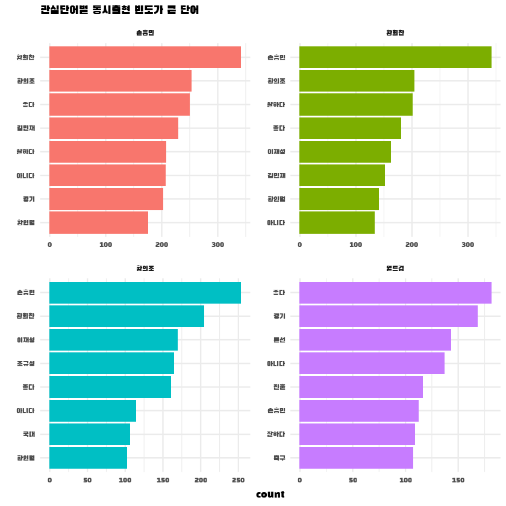

# 단어간 관계 파악
- 파이 계수를 구해 관심 단어와 관련성이 큰 단어 추출
- 막대 그래프를 만들어 주요 단어 탐색
- 네트워크 그래프를 만들어 단어의 관계를 탐색
- 단어쌍이 언급된 댓글을 추출해 내용을 탐색

<br/>


```R
library(tidyverse)
ggplot2::theme_set(theme_bw())
library(scales)
library(tidytext)
library(textclean)
```


```R
library(showtext)
font_add_google(name = "Black Han Sans", family = "blackhansans")
showtext_auto()
```


```R
word_cmt <- read.csv("word_cmt.csv")
word_cmt %>% head
```


<table class="dataframe">
<caption>A data.frame: 6 × 6</caption>
<thead>
	<tr><th></th><th scope=col>title</th><th scope=col>textOriginal</th><th scope=col>word_pos</th><th scope=col>word</th><th scope=col>polarity</th><th scope=col>sentiment</th></tr>
	<tr><th></th><th scope=col>&lt;chr&gt;</th><th scope=col>&lt;chr&gt;</th><th scope=col>&lt;chr&gt;</th><th scope=col>&lt;chr&gt;</th><th scope=col>&lt;int&gt;</th><th scope=col>&lt;chr&gt;</th></tr>
</thead>
<tbody>
	<tr><th scope=row>1</th><td>01R_이라크</td><td>다음 경기에서의 멋진 승리를 기대합니다</td><td>다음/nc    </td><td>다음    </td><td>0</td><td>중립</td></tr>
	<tr><th scope=row>2</th><td>01R_이라크</td><td>다음 경기에서의 멋진 승리를 기대합니다</td><td>경기/nc    </td><td>경기    </td><td>0</td><td>중립</td></tr>
	<tr><th scope=row>3</th><td>01R_이라크</td><td>다음 경기에서의 멋진 승리를 기대합니다</td><td>멋지/pa    </td><td>멋지다  </td><td>2</td><td>긍정</td></tr>
	<tr><th scope=row>4</th><td>01R_이라크</td><td>다음 경기에서의 멋진 승리를 기대합니다</td><td>승리/nc    </td><td>승리    </td><td>2</td><td>긍정</td></tr>
	<tr><th scope=row>5</th><td>01R_이라크</td><td>다음 경기에서의 멋진 승리를 기대합니다</td><td>기대합/nc  </td><td>기대합  </td><td>0</td><td>중립</td></tr>
	<tr><th scope=row>6</th><td>01R_이라크</td><td>다시봐도 고구마 개 한번에 먹은기분이네</td><td>다시봐도/nc</td><td>다시봐도</td><td>0</td><td>중립</td></tr>
</tbody>
</table>


```R
library(ggwordcloud)
```


```R
oldw <- getOption("warn")
options(warn = -1)

word_cmt %>% 
    group_by(word) %>%
    count() %>% arrange(-n) %>%
    ggplot(aes(label = word, size = n, col = n)) + 
    geom_text_wordcloud(seed = 2022,
                        family = "blackhansans") +
    scale_radius(limits = c(600, NA),
                 range = c(3, 35)) +
    scale_color_gradient(low = "#66aaf2",
                         high = "#004EA1") + 
    theme_minimal()

options(warn = 0)
```


    

    


```R
word_cmt %>% 
    group_by(word) %>%
    count() %>%
    arrange(-n) %>% head(15) %>%
    ggplot(aes(fct_reorder(word, n), n)) + 
    geom_col(fill = "white", color = "black") +
    ylim(0, 2700) + 
    labs(x = NULL, y = NULL) + 
    geom_text(aes(label = n),
              hjust = -0.3,
              family = "blackhansans") + 
    theme(text = element_text(family = "blackhansans", size = 12),
          plot.title = element_text(size = 20, face = "bold"),,
          axis.ticks.y = element_blank()) + 
    coord_flip()
```


    

    


<br/>

### 관심단어 설정


```R
target = c("손흥민", "황희찬", "황의조", "월드컵")
```

<br/>

## 01. 동시 출현 단어 분석 (Co-occurrence analysis)

<br/>

### 01-01 단어 동시 출현 빈도 구하기


```R
library(widyr)
```


```R
stopwords <- c("진짜", "너무", "많이", "정말", "그냥", "많다",
               "서다", "없다", "같다", "베다", "되다", "이번")
```


```R
pair <- word_cmt %>%
    pairwise_count(item = word,
                   feature = textOriginal,
                   sort = T)

pair %>% head %>% print
```

    # A tibble: 6 x 3
      item1  item2      n
      <chr>  <chr>  <dbl>
    1 손흥민 서다     381
    2 서다   손흥민   381
    3 서다   좋다     346
    4 좋다   서다     346
    5 손흥민 황희찬   341
    6 황희찬 손흥민   341
    

<br/>

### 01-02 관심단어와 자주 함께 사용된 단어 탐색


```R
top_pair <- pair %>% 
    filter(!item2 %in% stopwords) %>%
    mutate(count = n) %>%
    filter(item1 %in% target) %>% 
    group_by(item1) %>%
    slice_max(count, n = 8) 
```


```R
top_pair$item1 <- factor(top_pair$item1, levels = target)

ggplot(top_pair, aes(reorder_within(item2, count, item1),
                     count,
                     fill = item1)) + 
    geom_col(show.legend = F) + 
    facet_wrap(~ item1, scales = "free") + 
    coord_flip() + 
    scale_x_reordered() + 

    labs(title = "관심단어별 동시출현 빈도가 큰 단어",
         x = NULL) + 
    theme_minimal() + 
    theme(text = element_text(family = "blackhansans"),
          plot.title = element_text(size = 14, face = "bold"))
```


    

    


#### ```"손흥민", "황희찬", "황의조"``` 
- 선수의 이름이 언급된 댓글에는, 그 선수만이 아닌, ```"김민재"```, ```"황인범"```등 다른 선수의 이름도 동시에 언급된 댓글이 많음을 알 수 있다.
- 그 외 선수의 기량에 대한 언급인 ```"좋다"```, ```"잘하다"```가 동시에 언급됨을 알 수 있다.

#### ```"월드컵"```
- 같은 조에서 1위를 두고 경쟁했던 ```"이란"```에 대한 언급이 존재
- ```"본선"```, ```"진출"```등 월드컵 진출을 확점한에 대한 언급

<br/>

### 01-03 네트워크 그래프 생성

<br/>

***연결 중심성***
- 노드가 다른 노드들과 얼마나 밀접하게 연결되는지 나타낸 값
- 연결된 노드가 많을수록 증가

***커뮤니이***
- 단어 간의 관계가 가까워 빈번하게 연결된 노드 집단


```R
library(tidygraph)
library(ggraph)
```


```R
set.seed(2022)

graph_comment <- pair %>%
    filter(n >= 120) %>%
    as_tbl_graph(directed = F) %>%
    mutate(centrality = centrality_degree(),
           group = as.factor(group_infomap()))
```


```R
graph_comment
```


    # A tbl_graph: 35 nodes and 262 edges
    #
    # An undirected multigraph with 1 component
    #
    # Node Data: 35 x 3 (active)
      name   centrality group
      <chr>       <dbl> <fct>
    1 손흥민         38 2    
    2 서다           50 1    
    3 좋다           42 3    
    4 황희찬         22 4    
    5 없다           32 7    
    6 많다           22 1    
    # ... with 29 more rows
    #
    # Edge Data: 262 x 3
       from    to     n
      <int> <int> <dbl>
    1     1     2   381
    2     1     2   381
    3     2     3   346
    # ... with 259 more rows


```R
set.seed(2022)
ggraph(graph_comment, layout = "fr") + 

    geom_edge_link(color = "gray50",
                   alpha = 0.5) + 

    geom_node_point(aes(size = centrality,
                        color = group),
                    show.legend = F) + 
    scale_size(range = c(3, 10)) + 
    geom_node_text(aes(label = name),
                   repel = T,
                   size = 5,
                   family = "blackhansans") + 
    theme_graph()
```


    

    


<br/>

### 01-04 네트워크의 주요 단어 살펴보기


<br/>

- 연결 중심성이 높은 주요 단어 살펴보기


```R
graph_comment %>%
    arrange(-centrality) %>%
    data.frame() %>% head
```


<table class="dataframe">
<caption>A data.frame: 6 × 3</caption>
<thead>
	<tr><th></th><th scope=col>name</th><th scope=col>centrality</th><th scope=col>group</th></tr>
	<tr><th></th><th scope=col>&lt;chr&gt;</th><th scope=col>&lt;dbl&gt;</th><th scope=col>&lt;fct&gt;</th></tr>
</thead>
<tbody>
	<tr><th scope=row>1</th><td>서다  </td><td>50</td><td>1</td></tr>
	<tr><th scope=row>2</th><td>좋다  </td><td>42</td><td>3</td></tr>
	<tr><th scope=row>3</th><td>손흥민</td><td>38</td><td>2</td></tr>
	<tr><th scope=row>4</th><td>경기  </td><td>36</td><td>8</td></tr>
	<tr><th scope=row>5</th><td>없다  </td><td>32</td><td>7</td></tr>
	<tr><th scope=row>6</th><td>진짜  </td><td>28</td><td>9</td></tr>
</tbody>
</table>


<br/>

- 연결 중심성이 높은 ```"손흥민"```단어가 속한 커뮤니티 탐색


```R
graph_comment %>%
    filter(name == "손흥민")
```


    # A tbl_graph: 1 nodes and 0 edges
    #
    # An unrooted tree
    #
    # Node Data: 1 x 3 (active)
      name   centrality group
      <chr>       <dbl> <fct>
    1 손흥민         38 2    
    #
    # Edge Data: 0 x 3
    # ... with 3 variables: from <int>, to <int>, n <dbl>


<br/>

- ```"손흥민"```단어가 속한 커뮤니티의 주요 단어 살펴보기


```R
graph_comment %>%
    filter(group == 2) %>%
    arrange(-centrality) %>%
    data.frame()
```


<table class="dataframe">
<caption>A data.frame: 4 × 3</caption>
<thead>
	<tr><th scope=col>name</th><th scope=col>centrality</th><th scope=col>group</th></tr>
	<tr><th scope=col>&lt;chr&gt;</th><th scope=col>&lt;dbl&gt;</th><th scope=col>&lt;fct&gt;</th></tr>
</thead>
<tbody>
	<tr><td>손흥민</td><td>38</td><td>2</td></tr>
	<tr><td>패스  </td><td> 8</td><td>2</td></tr>
	<tr><td>국대  </td><td> 4</td><td>2</td></tr>
	<tr><td>넣다  </td><td> 2</td><td>2</td></tr>
</tbody>
</table>


<br/>

- 단어가 사용된 원문 살펴보기


```R
library(crayon)
```


```R
font1 <- combine_styles(make_style("black"),
                          make_style("white", bg = T),
                          make_style("bold"))

font2 <- combine_styles(make_style("darkblue"),
                          make_style("white", bg = T),
                          make_style("bold"))
```

<br/>

#### - ```손흥민``` &  ```패스``` : 손흥민의 패스위주 플레이에 대한 비판


```R
word_cmt %>% 
    filter(str_detect(textOriginal, "손흥민") & str_detect(textOriginal, "패스")) %>% 
    group_by(textOriginal) %>% count() %>%
    mutate(textOriginal = paste0("[", row_number(), "] ", textOriginal),
           textOriginal = paste0(str_replace_all(textOriginal, "손흥민", font1("손흥민"))),
           textOriginal = paste0(str_replace_all(textOriginal, "패스", font2("패스")))) %>%
    pull(textOriginal) %>% 
    head() %>%
    cat(sep = "\n\n")
```

    [1] 가지로 정리하고싶습니다 손흥민에 위엄 이란이 힘을못쓴다 번째골 공간패스골 이란보다 아직은 한수위라는걸 보여준 번째골
    
    [1] 간단한걸 못해서 이렇게 고전하냐 패스 런 역습 시 전체적인 라인 올리기 그리고 손흥민은 슈팅 아끼지말았으면
    
    [1] 간만에 프리미어리그 보는것같았음 왠일로 패스가 그림같지 골결은 정말 운이 없었음 손흥민 프리미어리그에서도 기대값대비 최고의 골결을 가지고있는데 태극기만달면
    
    [1] 감독 욕하는것들 조용해졌죠 경기력이 상당히 좋아짐 난 특히 손흥민이 무리하게 페널티 박스로 침투하는게 없어져서 좋았음 아니면 바로 패스해주는게 개인적인 핵심포인트임 그리고 황인범 짱 송민규 기대도 안했는데 잘함
    
    [1] 개인기도 없고 패스도 개판이고 유기적인 플레이가 안되니 답답하기 그지 없는 경기가 되얏네 무엇보다도 손흥민은 과감하게 슛을 쏘아야 한다 왜 자꾸 패스만 하는건지
    
    [1] 걍 손흥민이 토트넘때처럼 패스 좀 그만하고 막히더라도 바로 중거리슛 차거나 때리면 안되나 너무 답답하네
    

<br/>

#### - ```손흥민``` &  ```국대``` : 손흥민의 국가대표 경기력 부진에 대한 비판


```R
word_cmt %>% 
    filter(str_detect(textOriginal, "손흥민") & str_detect(textOriginal, "국대")) %>% 
    group_by(textOriginal) %>% count() %>%
    mutate(textOriginal = paste0("[", row_number(), "] ", textOriginal),
           textOriginal = paste0(str_replace_all(textOriginal, "손흥민", font1("손흥민"))),
           textOriginal = paste0(str_replace_all(textOriginal, "국대", font2("국대")))) %>%
    pull(textOriginal) %>% 
    head() %>%
    cat(sep = "\n\n")
```

    [1] 개쓰레기 세대 손흥민은 국대에서는 이떄까지 잘했던게 하나도없냐
    
    [1] 개인 전술 부족한 팀이 수비적인 팀하고 경기하면 어떻게 되는지 보여준 경기 그나마 믿을만한 손흥민도 국대오면 다운그레이드돼서 대한민국은 아직 세계 레벨에서 볼 땐 한참 멀었다는걸 알려준다
    
    [1] 개인공격포인트를 떠나 국대경기력보면 손흥민은 박지성이 절대 될수없음 해버지는 소속팀이나 국대나 변함없이 꾸준했음
    
    [1] 결론 한국국대 실력은 그냥 아시아범위내 중상위권 수준 손흥민 황의조는 팀빨없이는 아무것도 못한다
    
    [1] 경기 최대 역적은 이재성이고 최고 선수는 김민재 였다 손흥민의 국대경기는 토트넘 경기 수준의 할도 안되는 능력을 보여줬다 국대경기에서 몸 다치면 안되니 페널티 박스 근처에서 소극적인 움직임으로 일관했다 월드컵 본선 무대가 아니니 경기능력을 최고로 올리다가 부상으로 다치면 말짱 꽝이니 영리한 몸관리 경기운영을 하고 있다고 보면 된다 하지만 다른 선수들은 과연 그렇게 할만한 레벨이던가 황의조 황의찬 이재성 전부 소극적으로 돌파 없는 공격을 전후반 내내 보여줬다 이란도 마찬가지 모두가 봤듯이 이란이 지고 있고 후반 중반에 이란이 공격템포를 확 끌어올리니 결국 골문이 열리고 계속해서 두들겨 맞았다 결국 이길 수 있는 경기를 스스로 이란 전은 비겨도 된다는 경기 자세를 처음부터 갖고 출발한 것이니 비겼으니 목표 달성 한건가 한국 축구를 보는 내내 답답하더라니 월드컵에 가기위한 선수들의 투혼 선발되기 위한 경쟁 투쟁심이 사라진 한국팀 과연 이게 한국축구 색깔인가
    
    [1] 경기내용은 재미있고 공격적이고 좋았는데 저렇게 몰아세우면서 필드골이없는건 참 아쉽네 고질적인 문제 골결정력 그렇게 골감각이좋은 손흥민도 국대오면 골대에 옆그물이네 아쉽네 국대저주에걸린것인가
    

<br/>

#### - ```손흥민``` &  ```넣다(넣어)```


```R
word_cmt %>% 
    filter(str_detect(textOriginal, "손흥민") & str_detect(textOriginal, "넣어")) %>% 
    group_by(textOriginal) %>% count() %>%
    mutate(textOriginal = paste0("[", row_number(), "] ", textOriginal),
           textOriginal = paste0(str_replace_all(textOriginal, "손흥민", font1("손흥민"))),
           textOriginal = paste0(str_replace_all(textOriginal, "넣어", font2("넣어")))) %>%
    pull(textOriginal) %>% 
    head() %>%
    cat(sep = "\n\n")
```

    [1] 개인적으로 정우영 이재성 권창훈이 진짜 잘햇다고 생각함 빌드업은 물론이고 역습공격이 수준급인 이란을 상대로 압박으로 끊어내고 진짜 미친 활동량 보여줌 손흥민 좋아하고 골넣어서 다행이긴한데 미스가 많더라 영국에서 바로 온거라 그부분 충분히 이해함
    
    [1] 과거에 비해 한국선수들이 볼키핑력과 탈압박 능력이 굉장히 좋아졌음 손흥민은 말할 필요없는 세계적인 선수 황의조도 요즘 골을 못넣어서 그렇지 볼키핑력과 콘트롤이 좋음 황인범은 원래 개인기량이 출중했는데 컨디션 저하로 인한 악플을 이겨내고 지금은 기성용을 지웠음 한국대표팀 최고 캡틴 이재성은 한국에서 테크니션으로 유명했고 독일진출후 더욱 출중해졌음 권창훈은 불운의 아이콘이긴 하지만 개인기술은 예전부터 워낙 출중했고 년 월드컵때 신태용 감독이 못데려가서 땅을 쳤다는 그런 선수임 개인적으로 권창훈 플레이중에 공중볼 날라오는 볼을 오른발로 콘트롤해서 왼발로 결정짓는 능력이 굉장히 탁월함 그런 창훈이가 머리가 동글동글해져 아주 귀여운 얼굴로 완벽하게 국대팀 일원으로 복귀함 정말 기대되는 선수 백승호 바르셀로나 유스출신으로 탈압박 능력과 킥능력이 최고임 수비력만 조금더 보완하면 정우영선수를 능가할 재목임 정우영은 수비력과 킥력은 좋은데 간혹 어이없는 실수가 있어서 좋은평가는 어려움 그리고 자라나는 새싹 이강인 개인기술은 어나더레벨 부족한 수비력은 보완되고 있으나 이런 세계적인 선수가 국대팀에 선발되지 않는걸보면 국대팀 선수층이 굉장히 두텁다는 사실을 알수있음
    
    [1] 내가 할얘기는 아니다만 중앙미드필더라는애가 노마크상황에서 떨어진볼을 슈팅햇는데 공이 하늘로 승천하고 또 공격진들 전부 기본적으로 유럽에서 뛰는애들인데 헤딩타점이 저게뭐야 노마크인데 왜 키퍼정면으로 헤딩슛팅 하냐고 저 상황에선 본인이 헤딩이 약점이어도 넣어야되는거아니냐 얘네 프로선수자나 프로 말이안나오네진짜 손흥민은 계속 명한테 둘러쌓이니 그렇다쳐도 손흥민한테 이라크수비들이 쏠리는 동안에 황희찬 이재성같은애들은 수비도안붙는데 쟤네들은 노마크상황 슈팅이 왜저따구야 흥민이가 이라크전 경기중에 개빡쳐서 소리지르는이유가 다 있었네
    
    [1] 느린화면 봤는데 뭘 또 느린화면 찾노 이동국씨 뭘본거여 해설함서 손흥민은 두번연속 비슷한 위치 찬스인데도 걸 왜 못 넣어 원래 못 넣는거 아이야
    
    [1] 딴걸 떠나서 벤투호에서 손흥민이 년간 포함 골이라는데 아무리 처럼 받쳐줄 선수가 없다한들 골을 넣어야 이기는게 축구경긴데 지금이 전성기인 골잡이 줘도 못씀 해외파 체력 선수생명 갈리든 말든 알빠아닌 감독의 마인드 벤투 전술은 그냥 상대가 수비하기 존나 쉽게만듬 거의 스파이임 전술을 무슨 혼자 피파 게임하면서 짜는듯
    
    [1] 때도 황희찬이 어시스트 욕심인거지 저건 그냥 옆에 뛰어들어가는 풀백한테 건네줬기만 했어도 살짝 스루패스로 그럼 그 풀팩이 조금 박스쪽으로 치고들어가려 하면 명 수비중에 명이 붙을수 밖에 없는거고 안붙으면 가서 슛 때리면 돼고 붙으면 앞에 명한테 패스 주면 찬스라서 수비가 붙는쪽 말고 다른쪽으로 패스를 또 하면 그냥 거의 골인데 더 좋은 상황까지 전술적 생각을 전혀 못하고 굳이 않좋은 패스길을보고 저기서 로빙 패스를 하면 자기가 아주 잘 주지 않는이상은 받는 과정에서 더 않좋은상황인데 그냥 단순하게밖에 생각을 못하는건가 프리미어리그까지 갔다면서도 이런정도는 명정도 공격을 거치는과정에 대한 이해도가 없는건가 그리고 국대의 문제점들이 각자 손흥민을 제외하곤 자신들의 실력이 낮다는걸 받아들이질 않고 그냥 각자 이번기회에 골넣어서 클럽에서 입지나 위상을 굳건히 해보려는 욕심에 그게 팀을 망치는거 같음 충분히 자기가 훈련을 통핵서 실력이 어느정도급이 돼기전까진 자기 실력에 대해서 보다 좀 객관적으로 평가를 해서 지나친 골욕심은 버렸어야지 이재성선수도 저기서 저걸 받아서 주변수비수들까지 파악하고 키퍼 위치까지 파악하고 공위치까지 파악해서 제대로 킥을 할 실력은 안돼는걸 좀 받아들여야하는데 그랬다면 저기서 공 터치로 받아서 바로 그냥 옆이나 뒤로 패스만 했어도 더 좋은 기회가 나왔을껀데 뒤에서 손흥민 오픈이었고 백힐패스로 손흥민에게 주거나 옆에 조규성선수한테 패스를 하거나
    

<br/>

## 02. 단어 간 상관 분석 (Phi coefficient)

### 02-01 단어 간 상관 분석 - Phi coefficient
- 다른 단어에 비해 상대적으로 자주 함꼐 사용된 단어가 무엇인지 탐색

#### 파이 계수 (phi coefficient) : 두 단어가 함꼐 사용되는 경우가 각각 사용되는 경우에 비해 얼마나 많은지 나타낸 지표
- 어떤 단어와 자주 함꼐 사용되지만 다른 단어와는 자주 함께 사용되지 않는 단어, 즉 상대적으로 관련성이 큰 단어가 무엇인지 알 수 있음

#### 파이 계수의 의미 
- X, Y 모두 있음(a)
- X만 있음 (b)
- Y만 있음 (c)
- X, Y 모두 없음(d)


| | **단어 Y 잇음** | **단어 Y 없음** | **전체** |
| -- | -- | -- | -- |
| **단어 X 있음** | a | b | a + b |
| **단어 X 없음** | c | d | c + d |
| **전체** | a + c | b + d| |

### 

$$
\phi = { {ad - bc} \over {\sqrt{(a + b)(c + d)(a + c)(b + d)}} }
$$
- **범위 -1 ~ +1**
- **+1에 가까울수록 두 단어가 자주 함께 사용되어 관련성이 큼**
- **-1에 가까울수록 함께 사용되는 경우가 드물어 관련성이 적음**

<br/>

### 02-02 파이 계수 구하기


```R
wide_cors <- word_cmt %>%
    filter(!word %in% stopwords) %>%
    add_count(word) %>%
    filter(n >= 100) %>%
    pairwise_cor(item = word,
                 feature = textOriginal,
                 sort = T)
```


```R
wide_cors %>% print
```

    # A tibble: 59,780 x 3
       item1  item2  correlation
       <chr>  <chr>        <dbl>
     1 서형욱 해설         0.326
     2 해설   서형욱       0.326
     3 홍철   이용         0.310
     4 이용   홍철         0.310
     5 정몽규 보내다       0.280
     6 보내다 정몽규       0.280
     7 이동국 해설         0.275
     8 해설   이동국       0.275
     9 김승규 조현우       0.270
    10 조현우 김승규       0.270
    # ... with 59,770 more rows
    

<br/>

### 02-03 관심단어와 관련성이 큰 단어 탐색


```R
top_cors <- wide_cors %>%
    filter(item1 %in% target) %>%
    group_by(item1) %>%
    slice_max(correlation, n = 8)
```


```R
top_cors$item1 <- factor(top_cors$item1, levels = target)

ggplot(top_cors, aes(reorder_within(item2, correlation, item1),
                     correlation,
                     fill = item1)) + 
    geom_col(show.legend = F) + 
    facet_wrap(~ item1, scales = "free") + 
    coord_flip() + 
    scale_x_reordered() + 

    labs(title = "관심단어별 관련성이 큰 단어",
         x = NULL) +

    theme_minimal() + 
    theme(text = element_text(family = "blackhansans"),
          plot.title = element_text(size = 14, face = "bold"))
```


    

    


<br/>

### 02-04 댓글 내용 확인

<br/>

#### - ```손흥민``` & ```토트넘```
- **손흥민의 소속팀과 국가대표팀 경기력 사이의 괴리감/차이에 대한 비판**


```R
word_cmt %>% 
    filter(str_detect(textOriginal, "손흥민") & str_detect(textOriginal, "토트넘")) %>% 
    group_by(textOriginal) %>% count() %>%
    mutate(textOriginal = paste0("[", row_number(), "] ", textOriginal),
           textOriginal = paste0(str_replace_all(textOriginal, "손흥민", font1("손흥민"))),
           textOriginal = paste0(str_replace_all(textOriginal, "토트넘", font2("토트넘")))) %>%
    pull(textOriginal) %>% 
    head() %>%
    cat(sep = "\n\n")
```

    [1] 걍 손흥민이 토트넘때처럼 패스 좀 그만하고 막히더라도 바로 중거리슛 차거나 때리면 안되나 너무 답답하네
    
    [1] 경기 최대 역적은 이재성이고 최고 선수는 김민재 였다 손흥민의 국대경기는 토트넘 경기 수준의 할도 안되는 능력을 보여줬다 국대경기에서 몸 다치면 안되니 페널티 박스 근처에서 소극적인 움직임으로 일관했다 월드컵 본선 무대가 아니니 경기능력을 최고로 올리다가 부상으로 다치면 말짱 꽝이니 영리한 몸관리 경기운영을 하고 있다고 보면 된다 하지만 다른 선수들은 과연 그렇게 할만한 레벨이던가 황의조 황의찬 이재성 전부 소극적으로 돌파 없는 공격을 전후반 내내 보여줬다 이란도 마찬가지 모두가 봤듯이 이란이 지고 있고 후반 중반에 이란이 공격템포를 확 끌어올리니 결국 골문이 열리고 계속해서 두들겨 맞았다 결국 이길 수 있는 경기를 스스로 이란 전은 비겨도 된다는 경기 자세를 처음부터 갖고 출발한 것이니 비겼으니 목표 달성 한건가 한국 축구를 보는 내내 답답하더라니 월드컵에 가기위한 선수들의 투혼 선발되기 위한 경쟁 투쟁심이 사라진 한국팀 과연 이게 한국축구 색깔인가
    
    [1] 골이 많이 안 들어간건 너무 아쉽지만 볼을 잡고 과감하게 슈팅 때리는 모습이나 마무리를 짓는 모습이 정말 시원하고 좋았다 오랜만에 손흥민이 토트넘 손흥민 보여줘서 좋았지만 슈팅연습을 많이 안 하고 경기를 뛰었나보네
    
    [1] 공간에 대한 기본 이해 부족 압박의 의미 지역 방어 대인 방어에 대한 기본 개념 미 탑재 공을 주는 사람보다 받는 사람의 위치가 좋지 못하며 공을 주고 움직이지 않는다 템포 조절은 아예 없으며 공을 받을 사람이 선행 수비수와 일직선에 놓여 패스의 부정확으로 수비 라인 붕괴를 만들 수 없다 좌 우 측면 돌파만 고집하지만 오히려 중앙에 공을 받는 공격 숫자와 흘러 나올 공을 처리할 공격자원이 부족하다 골키퍼를 제외한 명이 라인을 올려 공격하지만 이라크나 레바논의 지역 방어와 대인 방어를 기본적인 대 패스로 뚤으려 하는 시도가 없었기에 무리한 전방패스와 횡패스만 반복함 몇 몇 선수는 패스를 준 후 그 자리에 정지하는 최악의 움직임을 보이고 몇 몇은 공을 받을 준비도 하지 않았음 공격수는 꼭 자신이 골을 넣지 않아도 수비를 끌고 다녀야 하는데 수비수가 잡은 자리에 버티며 군데스리가를 재현함 미들진의 중거리는 약체와 경기할 때는 반드시 필요함 중거리 숫 몇 번 갈기면 하는 수 없이 수비수 앞으로 나옵니다 그러다가 최전방 공격수 한 번 잘 돌아가 들어 가면 대 기회 나오거나 포스트 플레이로 주고 빈자리로 들어가면 슈팅기회나 유도됩니다 그런 시도가 전혀 없음 손흥민은 장점이 뚜렷하고 잘하는 선수지만 박지성 처럼 축구 지능이 높지 못한 까닭은 순간 순간 변화가 없다는 것이고 이타적인 플레이가 아니라 이라크 전은 무책임한 플레이를 한 것 코너킥 프리킥시 직접차는 것은 이해되지만 페인팅 하려고 공 근처에 있는 건 자신이 가진 슈팅력을 그냥 낭비하는 것이 토트넘 경기 시 사각지대에서도 곧장 슈팅으로 골을 넣지만 더 좋은 각도에서도 슈팅 대신 패스를 함 황의조는 올림픽 때도 그랬지만 자신감이 없다 마음이 급한지 필요 없는 압박으로 체력을 낭비하거나 조급해서 볼 터치가 예전 같지 않다 차라리 선으로 내려와서 패스 주고 받으며 공간 노리는 것이 좋다 너무 정지되고 마킹 심하면 체력저하와 집중력 저하만 발생됨 진짜 한국 축구의 문제가 심각한 것이 기술 조직력 문제를 떠나 공간과 흐름의 이해가 부족해도 너무 부족하고 시종일관 다급하게 우당땅땅하는 경기를 반복하고 있음 목적과 의도가 보이지 않고 그냥 하나 얻어 걸려라 하는 축구임 기량차가 많이 나는 팀에게는 그것이 통해도 비슷한 팀 특히 우리보다 못한 팀이 맘 먹고 수비하다 역습하는 판을 짜면 답이 없어 전반 분 넘어서면 당혹한 표정이 보임 감독이 측면에서 중앙으로 공격 전개하라면 분 동안 그것만 함 나머지 자원은 중앙으로 돌격도 않함 결론 못하는 것이 아니라 않 하는 것이다 그 이유는 축구를 혼자서 들 하고 있다 그래서 힘들고 그래서 답답하다 적어도 우리 국대 수준의 개인이 베트남 처럼 공을 차면 이란은 힘들어도 이라크는 대 이나 대 레바논은 대 정도가 나야 정상이다 선수들이 경기를 풀어가는 축구지능과 서로에 대한 신뢰가 회복 되지 않는 한 월드컵 본선 진출은 어려울 듯 하다 정말 개인 기량을 떠나 팀으로써 가장 최악의 팀이 되어 있음을 느꼈다
    
    [1] 공격 손흥민 토트넘 황의조 보르도 리그앙 황희찬 울버햄튼 이동준 베를린 분데스리가 미드 황인범 루빈카잔 러시아 정우영 프라이부르크 분데스리가 이강인 마요르카 프리메라리가 이재성 마인츠 분데스리가 이동경 샬케 분데스리가 수비 김민재 페네르바체 터키 쉬페르리그 벤투국대로 뽑혔던 뽑힌 현유럽파 생각나는게 이 정도인데 더 있을까요
    
    [1] 관중들은 항상 손흥민 선수가 토트넘때처럼 유쾌한 골을 넣길 기대했었는데 오늘 무회전 대포슛으로 드뎌 보여줬어 년차 힘든 세상에 접어들면서 저렇게 많은 관중을 보는 것 또한 좋은 기분이 들었을테고 본선 뿐만 아니라 강 강 갈 때까지 가보자 대한민국 수비 탄탄 김민재부터 킬패스 이재성 정우영 손흥민 축구계 이봉주 황희찬에 이상하게 잘 넣는 황의조까지 너무 듬직하다 개인기량을 좀 더 갈고 닦아서 해외파 못치않게 잘 비벼보자규
    

<br/>

#### - ```황희찬``` & ```손흥민```
- 황희찬과 함꼐 공격진을 구성하는 손흥민등이 선수들에 대한 언급


```R
word_cmt %>%
    filter(str_detect(textOriginal, "황희찬") & str_detect(textOriginal, "손흥민")) %>% 
    group_by(textOriginal) %>% count() %>%
    mutate(textOriginal = paste0("[", row_number(), "] ", textOriginal),
           textOriginal = paste0(str_replace_all(textOriginal, "황희찬", font1("황희찬"))),
           textOriginal = paste0(str_replace_all(textOriginal, "손흥민", font2("손흥민")))) %>%
    pull(textOriginal) %>% 
    head() %>%
    cat(sep = "\n\n")
```

    [1] 가 플랜 가 아닌 로 가는게 맞다 왜냐하면 손흥민 황의조 황희찬 톱의 시너지가 크지 않다 셋다 좌측에서 플레이하는걸 선호하고 동선이 굉장히 겹침 특히 억지로 송민규 황희찬 우측으로 보내면 경기력은 더 안좋아짐 선택과 집중이 필요할듯 조규성의 타켓 플레이 헌신적으로 뛰면서 경합해주고 리턴 내주면 그만큼 황의조나 이재성 권창훈 황인범한테도 공격 찬스가 많이 생김 미드필더 숫자 강화 냉정하게 우리나라 미드필더들가 명으로 중원 싸움하는건 무리가 있음 오늘처럼 이재성 권창훈이 폭넓게 움직여주면서 하프스페이스 공략하고 황인범이 볼배급 완급조절하면서 정우영이 홀딩 어설프게 윙포워드 좁혀쓰다가 턴오버 내는것 보다 이렇게 플레이하는게 풀백 오버래핑 활용하기에도 더 좋다
    
    [1] 간만에 이란 원장에서 이기나 했는데 아쉽 손흥민은 그냥 존재만으로 보물 김민재 짱이고 이재성은 어시스트 하나는 기가 막혔음 근데 너무 공을 끌다가 위험한 장면 몇차례 만든게 옥의티 황희찬 의조는 기대 이하 골 키퍼는 개 선방 개 골대 도움 실점 허용한 헤딩슛은 멍때리다가 놓친건가 너무 아쉽이고 나상호 마지막 슛은 하 영웅 될 기회 였는데
    
    [1] 감독의 무능력 송민규 이재성 대신 황희찬 쓰자 손흥민 김민재가 감독해라 진짜 답 없다 한국 축구 한골 넣고 전원수비하는 스타일인데 월드컵가면 개털리는게 현실 이재성 오른발 쓰레기라 쓰지 마라 홍철 김민재 최고 김문환은 애매 그래도 스피드 최고 황인범 피지컬 답없음 기성용 같은 무게감 선수가 없음 후반 되면 골 못넣으면 어떡하지 라고 선수들도 느끼는듯 아시아 예선에서 이런 수준 한국 축구 현실
    
    [1] 갓 갓민재 아주칭찬해 황인범 정우영 인분 김영권 손흥민 홍철 아쉽다 이용 이재성 고스트 황의조 황희찬 희찬이 풀타임이더라 진짜맘에안듬 벤투
    
    [1] 개인적으로 손흥민 황희찬 제일 좋아하지만 오늘 최고 활동가의 이재성이 같네요 정말 독일서 날아오고 이렇게 뛰다니 정말 너무 대단합니다
    
    [1] 개인적으로 신태용 감독이 썼던 역습 전술이 가장 우리나라에 들어 맞는다고 생각함 포워드 손흥민 황희찬 미들 이재성 정우영 손준호 권창훈 포백 김진수 김영권 김민재 이용 키퍼 김승규 이정도
    

<br/>

#### - ```황의조``` & ```조규성```
- 황의조의 부진으로 인하여, 동 포지션(스트라이커) 경쟁자인 조규성에 대한 언급


```R
word_cmt %>%
    filter(str_detect(textOriginal, "황의조") & str_detect(textOriginal, "조규성")) %>% 
    group_by(textOriginal) %>% count() %>%
    mutate(textOriginal = paste0("[", row_number(), "] ", textOriginal),
           textOriginal = paste0(str_replace_all(textOriginal, "황의조", font1("황의조"))),
           textOriginal = paste0(str_replace_all(textOriginal, "조규성", font2("조규성")))) %>%
    pull(textOriginal) %>% 
    head() %>%
    cat(sep = "\n\n")
```

    [1] 가 플랜 가 아닌 로 가는게 맞다 왜냐하면 손흥민 황의조 황희찬 톱의 시너지가 크지 않다 셋다 좌측에서 플레이하는걸 선호하고 동선이 굉장히 겹침 특히 억지로 송민규 황희찬 우측으로 보내면 경기력은 더 안좋아짐 선택과 집중이 필요할듯 조규성의 타켓 플레이 헌신적으로 뛰면서 경합해주고 리턴 내주면 그만큼 황의조나 이재성 권창훈 황인범한테도 공격 찬스가 많이 생김 미드필더 숫자 강화 냉정하게 우리나라 미드필더들가 명으로 중원 싸움하는건 무리가 있음 오늘처럼 이재성 권창훈이 폭넓게 움직여주면서 하프스페이스 공략하고 황인범이 볼배급 완급조절하면서 정우영이 홀딩 어설프게 윙포워드 좁혀쓰다가 턴오버 내는것 보다 이렇게 플레이하는게 풀백 오버래핑 활용하기에도 더 좋다
    
    [1] 개인적으로 황의조보다 조규성이 나아보이네
    
    [1] 개인적으로는 황의조 보다는 조규성이다
    
    [1] 경기력이 좋아진 건 마음에 들지만 황의조 탓 좀 그만하세요 황의조가 그간 해준 게 얼만데 요즘 국대에서 부진하다고 황의조 없어서 너무 잘하네 이런 말이 나오나요 아무리 스트라이커는 득점으로 얘기하지만 그동안 부진했던 걸 왜 모두 황의조가 짊어져야 하나요 조규성도 이번엔 잘했지만 좀 더 두고봐야합니다 이러고 다음에 못하면 또 무슨 욕을 하실려고
    
    [1] 골키퍼 펀칭이었음 황희찬 황의조 황희찬 좀 더 달려들어가서 센터링했어야 그자리에선 각도 안나옴 정호성 이재성 황의조 이재성 항상 패쓰가 너무김 김민재 볼 커트가 이란 선수들과 비슷한 커트 이란 수비진도 만만치 않다는 뜻 김민재 패쓰가 너무 짧음 정확한 택배 연습 필요 권창훈 다리 너무 짧음 속도 더 빨라야 이재성 넘어지지 말았어야 손흥민 골 한국 선수들 모두 저런 강도의 슛이 필요 특히 홈런치지 않는 연습 황희찬 손흥민 단독찬스이므로 짧은 페인트 후 슛했어야 리바운드 황의조 슛도 반템포 느리게 슛했어야 황희찬 이재성 김영권 골 김영권의 항상 정확한 슛은 보배 김진수 조규성 권창훈 손흥민 슛 헛발질 어수선한 상황 마인드콘트롤 필요 황희찬 고질적인 홈런슛 개선해야 김태환 손흥민 슛 이란 수비수들이 다리가 긴 것인지 모두 김민재처럼 볼에 발을 잘 갖다댐 이렇게 많은 좋은 기회를 만들어낸 우리 선수들 대단하지만 충분히 을 만들 수 있었던 경기였으니까 잘 복기해서 미진한 부분들에 대해서 피나는 연습과 연구해서 월드컵 우승한번 가보세요
    
    [1] 국대에서 필요한 선수 황희찬 조규성 황인범 송민규 김민재 김영권 김승규 국대에서 필요없는 선수 손흥민 황의조 권창훈 김진수 황의조는 그냥 리그에서나 열심히 뛰라하고 국대에선 이제 더이상 안보는게 맞음 벌써 몇경기째 골도 없고 공중볼경합 선이랑의 연계 모든게 안됨 근 국대에서 폼만 보면 조규성이 공중볼 경합부터 연계 전방압박 공수기여도 심지어 라인브레이킹까지 훨씬 나음 그리고 손흥민은 제발 제발 사이드에만 짱박히고 중앙에 없었음 좋겠음 이란전 골키퍼 실책으로 들어간 중거리 세탁골땜에 안까인거지 턴오버 최다에 손흥민 공만 잡으면 다 뺏겼었음 이번에도 똑같음 손흥민이 골을 잡으면 위협적이겠다는 느낌이 있어야 하는데 턴오버 낼까 안낼까 조마조마하고 도 안되는 연계하지말고 그냥 무지성 슈팅이나 때렸으면 좋겠다는 생각밖에 안듦 진짜 차라리 손흥민 없을 때가 중원에서 연계도 좋고 오히려 경기력 좋음 진짜 조규성 황인범 없는게 너무 컸고 기댓값 충족도 못시켜주는 해외파보다 실력좋으면 국내파라도 쓰는게 나을 듯
    

<br/>

#### - ```월드컵``` & ```진출```
- 예선초반 월드컵 진출 가능성에 대한 우려, 이후 월드컵 진출에 확정에 대한 기대감 및 축하


```R
word_cmt %>%
    filter(str_detect(textOriginal, "월드컵") & str_detect(textOriginal, "진출")) %>% 
    group_by(textOriginal) %>% count() %>%
    mutate(textOriginal = paste0("[", row_number(), "] ", textOriginal),
           textOriginal = paste0(str_replace_all(textOriginal, "월드컵", font1("월드컵"))),
           textOriginal = paste0(str_replace_all(textOriginal, "진출", font2("진출")))) %>%
    pull(textOriginal) %>% 
    head(3) %>%
    cat(sep = "\n\n")

word_cmt %>%
    filter(str_detect(textOriginal, "월드컵") & str_detect(textOriginal, "진출")) %>% 
    group_by(textOriginal) %>% count() %>%
    mutate(textOriginal = paste0("[", row_number(), "] ", textOriginal),
           textOriginal = paste0(str_replace_all(textOriginal, "월드컵", font1("월드컵"))),
           textOriginal = paste0(str_replace_all(textOriginal, "진출", font2("진출")))) %>%
    pull(textOriginal) %>% 
    tail(3) %>%
    cat(sep = "\n\n")
```

    [1] 감독 교체안하면 월드컵 진출 어렵다
    
    [1] 개인적인 이란의 추억 년 미국 월드컵 예선 떡실신 시킨걸 보고 밥 취급했는데 아시안컵 강에서 참패 이때 충격이 상당했음 그뒤로 이란사람들은 한국 사람만 만나면 손가락 개를 흔들면서 놀리기 시작 년 아시안컵에서 또 만남 군대 밤시간에 시청 을로 끌려가다 후반 막판 동점골에 연장에서 이동국의 발리 골든골로 이김 년 아시안컵에서 또또 만남 정말 이란 얄밉게 축구한걸로 기억남 한골 넣고 침대 시전 다시 따라 붙으면 총공격 후 골 넣고 침대시전 반복하다 한국패 년 아시안컵에 또또또 만남 승부차기 였나 아무튼 이긴걸로 기억 년 남아공 월드컵 예선 홈에서 박지성의 후반 막판 동점골로 이란 탈락 시킬대는 정말 좋아했음 한국은 이미 본선 진출 한 상태에서 이란은 무조건 이겨야 했는데 이경기 비기는 바람에 어찌저찌 북한이 올라가고 정대세가 엄청 고마워했던걸로 기억남 그전에 열린 원정에서도 로 봐도 느켜지는 만 이란 관중의 위엄에 깜놀하고 당시도 홈텃세 장난 아니었음 그래도 후반에 역시 박지성의 동점골로 비김 동점골 후 만관중 일순간에 아닥한건 대박이었음 년 아시안컵 강에서 또또또또 만남 윤빛가람의 중거리 결승골로 승리 웃긴게 이란하고 강에서만 번 연속 만나고 여기서 이긴팀은 힘을 다했는지 무조건 강 탈락 년 아시안컵 강은 안 만나게 됐지만 강 이란 이라크 승자가 강에서 한국과 만나게 됨 연장까지 가는 혈투에 승부차기에서 이라크가 이김 정말 한국 응원하듯이 미친듯이 이라크 응원함 년 브라질 월드컵 예선 역시 이란 원정에서 홈텃세를 떠나 적국 대접을 받음 훈련장가는데 버스기사가 일부러 빙빙돌았는지 시간 걸리고 훈련장도 잔디 반 모래반 오죽했으면 당시 최강희 감독이 이란 한국 오면 고수부지에다 훈력장 줘야한다고 했음 중계직전 한국중계팀 송출 선을 잘라 버리는 만행도 저질러 배성재와 차범근 위원도 경기전 분노의 멘트 시전 본인도 새벽에 시청하며 참교육을 바랬지만 패함 이 사태를 한국 홈경기 직전 지적하자 케이로스 이란감독 한국을 향해 도발 하고 결국엔 경기 끝나고 최강희 감독에게 주먹감자를 시전하는 사태까지 발생함 막게임 이란과의 한국 홈에서 정말 이기길 바랬지만 여기서 한국이 이란을 이기기거나 비겼으면 우즈벡이 본선 진출 했을텐데 주특기 이란의 침대와 영혼의 텐백으로 버티다 한국 수비수 단 한번의 실수로 패 지들 월드컵 올라갔다고 한국 홈 관중 앞에서 경기장 돌며 이란 국기 흔드는 세레머니 펼침 아진짜 이때 개빡쳐는데 년 러시아 월드컵 예선 또 만나게 되고 똥틸리케 감독의 지휘 아래 이란 홈에서 유효슈팅 의 치욕속에 패 이상하게 이란만 만나면 한국은 점유율 슛팅등은 앞도 하면서 침대 축구에 말리는지 바듯이 비기거나 졌음 특유의 홈텃세도 너무 싫다못해 분노까지 왔었고 이번에 초등학교 올라가는 아들과 인천에서 직관하러가며 꼭 이겨주길 바랬는데 정말 너무너무 감사합니다 마스크때문에 제대로 응원은 못했지만 정말 미친듯이 좋아했습니다 이번 월드컵은 월드컵 이후로 일 낼거 같네요
    
    [1] 거의 월드컵 진출 확정 지었으니까 이제 이 경기력 유지만 하고 부상만 최소화 하면 이대로면 충분히 잘할 수 있다
    [1] 회연속 월드컵 진출 확정 진짜 이렇게 쉽게 월드컵 진출 확정 됐다니 다들 오늘 경기 수고 많으셨고 부상 당하지 않으셔서 다행이에요 이란전 결과는 중요하지 않지만 그래도 이겼으면 해요 월드컵 가서도 좋은 결과만 만들자고요 화이팅
    
    [1] 회연속이면 년동안 월드컵 본선에 계속들어갔네 근데 과거엔 아시아 시드가 장일 때도 있었는 걸로 기억하는데 대단한거지 세계에서도 브라질 독일 이탈리아 아르헨티나 스페인 등에 이어 번째월드컵 연속 밟은 국가는 전통적 축구강국들이니 좋은 기록이긴하다 년 스위스 월드컵에 첫발을 디뎠고 년 멕시코 월드컵부터 년 러시아 월드컵까지 회 연속 본선 진출을 포함해 총 번의 월드컵 본선 무대를 밟았으니 이번이 번때이고 아시아 기록이다 회 연속 월드컵 본선 진출에 성공한 국가는 브라질 회 독일 회 이탈리아 회 아르헨티나 회 스페인 회 라이벌 일본은 회 연속 이란은 회에 불과하다 다시 한번 새로운 도전에 나서고 있는 대한민국 대표팀이 중동의 모래바람을 뚫고 자랑스럽게 월드컵 본선에 진출 확정된 태극전사들의 도전에 힘찬 응원의 박수를 보낸다
    
    [1] 히야 무패 월드컵 본선 진출 가능하겠네
    

<br/>

### 02-04 네트워크 그래프 생성


```R
set.seed(2022)

graph_cors <- wide_cors %>%
    filter(correlation >= 0.125) %>%
    as_tbl_graph(directed = F) %>%
    mutate(centrality = centrality_degree(),
           group = as.factor(group_infomap()))
```


```R
set.seed(2022)
options(warn = -1)

ggraph(graph_cors, layout = "fr") + 
    geom_edge_link(color = "gray50",
                   aes(edge_alpha = correlation,
                       edge_width = correlation),
                   show.legend = F) +
    scale_edge_width(range = c(1,5)) + 
    geom_node_point(aes(size = centrality,
                        color = group),
                    show.legend = F) + 
    scale_size(range = c(5, 10)) + 
    geom_node_text(aes(label = name),
                   repel = T,
                   size = 5,
                   family = "blackhansans") + 
    theme_graph()

options(warn = 0)
```


    

    


<br/>

## 03 연속으로 사용된 단어쌍 분석 (n-gram)

<br/>

### 03-01 n- gram : 연이어 사용된 n개의 단어
- **unigram(1-gram, 단어 기준 토큰화), bigram(2-gram), trigram(3-gram)**
- 텍스트를 n-gram으로 토큰화해 분석시 단어가 연결될 때 생기는 의미와 맥락을 이해
- 단어가 얼마나 자주 함꼐 사용되었는지가 아니라, 얼마나 자주 연이어 사용되었는지를 중심으로 분석
- 바이그램 단어쌍이 언급된 댓글을 추출해 내용을 확인

###  

- **바이그램 토큰화**


```R
line_comment <- word_cmt %>%
    filter(!word %in% stopwords) %>%
    group_by(textOriginal) %>%
    summarise(sentence = paste(word, collapse = " "))
```


```R
bigram_comment <- line_comment %>% 
    unnest_tokens(input = sentence,
                  output = bigram,
                  token = "ngrams",
                  n = 2)
```


```R
bigram_comment %>% 
    select(bigram) %>% print
```

    # A tibble: 154,244 x 1
       bigram             
       <chr>              
     1 선제골 넣다        
     2 넣다 까다로운팀은  
     3 까다로운팀은 아니다
     4 아니다 전방압박    
     5 전방압박 패싱      
     6 패싱 플레이        
     7 플레이 안되다보니  
     8 안되다보니 힘들다  
     9 힘들다 포트        
    10 포트 늘다          
    # ... with 154,234 more rows
    

####  

- **바이그램 분리**


```R
bigram_separated <- bigram_comment %>%
    separate(bigram, c("word1", "word2"), sep = " ")
```


```R
bigram_separated %>% 
    select(-textOriginal) %>% print
```

    # A tibble: 154,244 x 2
       word1        word2       
       <chr>        <chr>       
     1 선제골       넣다        
     2 넣다         까다로운팀은
     3 까다로운팀은 아니다      
     4 아니다       전방압박    
     5 전방압박     패싱        
     6 패싱         플레이      
     7 플레이       안되다보니  
     8 안되다보니   힘들다      
     9 힘들다       포트        
    10 포트         늘다        
    # ... with 154,234 more rows
    

####  

- **단어상 빈도**


```R
pair_bigram <- bigram_separated %>%
    count(word1, word2, sort = T) %>%
    na.omit()
```


```R
pair_bigram %>% print
```

    # A tibble: 122,600 x 3
       word1    word2      n
       <chr>    <chr>  <int>
     1 월드컵   본선     122
     2 한국     축구     110
     3 손흥민   황희찬    94
     4 대한민국 축구      72
     5 월드컵   진출      71
     6 경기력   좋다      67
     7 황희찬   잘하다    65
     8 어제     경기      62
     9 모습     보이다    60
    10 손흥민   황의조    59
    # ... with 122,590 more rows
    

<br/>

### 03-02 관심단어와 연속으로 사용된 단어 탐색


```R
top_pair <- pair_bigram %>% 
    mutate(count = n) %>% 
    select(-n) %>%
    filter(word1 %in% target) %>%
    group_by(word1) %>%
    slice_max(count, n = 8) 
```


```R
top_pair$word1 <- factor(top_pair$word1, levels = target)

ggplot(top_pair, aes(reorder_within(word2, count, word1),
                     count,
                     fill = word1)) + 
    geom_col(show.legend = F) + 
    facet_wrap(~ word1, scales = "free") + 
    coord_flip() + 
    scale_x_reordered() + 

    labs(title = "관심단어별 같이 사용된 단어",
         x = NULL) +

    theme_minimal() + 
    theme(text = element_text(family = "blackhansans"),
          plot.title = element_text(size = 14, face = "bold"))
```


    

    


<br/>

### 03-03 댓글 내용 확인

<br/>

#### - ```손흥민``` & ```황희찬```
- **손흥민과 황희찬이 포함된 공격진에 대한 언급**


```R
word_cmt %>%
    filter(str_detect(textOriginal, "손흥민 황희찬")) %>% 
    group_by(textOriginal) %>% count() %>%
    mutate(textOriginal = paste0("[", row_number(), "] ", textOriginal),
           textOriginal = paste0(str_replace_all(textOriginal, "손흥민", font1("손흥민"))),
           textOriginal = paste0(str_replace_all(textOriginal, "황희찬", font2("황희찬")))) %>%
    pull(textOriginal) %>% 
    head() %>%
    cat(sep = "\n\n")
```

    [1] 개인적으로 손흥민 황희찬 제일 좋아하지만 오늘 최고 활동가의 이재성이 같네요 정말 독일서 날아오고 이렇게 뛰다니 정말 너무 대단합니다
    
    [1] 개인적으로 신태용 감독이 썼던 역습 전술이 가장 우리나라에 들어 맞는다고 생각함 포워드 손흥민 황희찬 미들 이재성 정우영 손준호 권창훈 포백 김진수 김영권 김민재 이용 키퍼 김승규 이정도
    
    [1] 구성이 너무 완벽한데 미드필더 황인범 김진수 이재성 너무 잘하고 공격에 손흥민 황희찬 조규성 수비 김민재가 있다
    
    [1] 권창훈 그냥 너무 못함 중앙에서의 공격 전술이 너무 후짐 다른 경기보다 유연성 창의성 더 떨어졌던 경기고 공중볼에만 의존하기엔 정확성 너무 떨어짐 코너킥 회 골 크로스 골 회 어차피 월드컵 가면 점유율로 맞불 놓을수 있는 상대팀 없다고 봐야함 손흥민 황희찬 이피엘 듀오를 가장 잘 살릴수 있는 전술이 무엇일까 진지히 고민해봐야함
    
    [1] 근데 경기장 땅이 영국이랑 좀 다른걸까 손흥민 황희찬에서 유독 뜨는 슛이 많이 보이네
    
    [1] 김민재 손흥민 황희찬 황인범 소 정우영 빛났고 조규성 큰 정우영 이용 멋졌고 백승호 뛰는 거 좀 더 보고 싶다 근데 우리나라 지금은 진도 상당한 맴버라는 게 느껴지는 군 이재성은 딱 필요한 시점에 골을 넣었기에 칭찬하고 싶다
    

<br/>

#### - ```황희찬``` & ```잘하다```
- **황희찬에 대한 긍정적인 코멘트**


```R
word_cmt %>%
    filter(str_detect(textOriginal, "황희찬 잘하")) %>% 
    group_by(textOriginal) %>% count() %>%
    mutate(textOriginal = paste0("[", row_number(), "] ", textOriginal),
           textOriginal = paste0(str_replace_all(textOriginal, "손흥민", font1("손흥민"))),
           textOriginal = paste0(str_replace_all(textOriginal, "황희찬", font2("황희찬")))) %>%
    pull(textOriginal) %>% 
    head() %>%
    cat(sep = "\n\n")
```

    [1] 또 황희찬 잘하면 역시 이게 황희찬이지 암 할게 뻔하다
    
    [1] 아따 황희찬 잘하네
    
    [1] 역시 은 이다 황희찬 잘하네
    
    [1] 와 황희찬 잘하네 슬슬 클라스 나온다
    
    [1] 황희찬 잘하내
    
    [1] 황희찬 잘하네
    

<br/>

#### - ```황의조``` & ```빼다```
- **황의조를 출전시키지 말라는 비판적 댓글**


```R
word_cmt %>%
    filter(str_detect(textOriginal, "황의조 빼고")) %>% 
    group_by(textOriginal) %>% count() %>%
    mutate(textOriginal = paste0("[", row_number(), "] ", textOriginal),
           textOriginal = paste0(str_replace_all(textOriginal, "황의조", font1("황의조"))),
           textOriginal = paste0(str_replace_all(textOriginal, "빼고", font2("빼고")))) %>%
    pull(textOriginal) %>% 
    head() %>%
    cat(sep = "\n\n")
```

    [1] 걍 황의조 빼고 손흥민이 톱보면 안되냐
    
    [1] 교체 타이밍보다 교체를 하지 않지 골먹은 다음 교체 준비 하는 스코어 앞설 때 황의조 빼고 손흥민 탑에 넣고 카운터 노렸으면 득점이 안나왔어도 이란이 맘먹고 밀고 올라오질 못했을건데
    
    [1] 남태희 꼭 빼고 백승호 선수가 국가대표로 꼭 벤투 아 황희찬 황의조 빼고 이강인 리그 대학팀에서 유망주 뽑아라
    
    [1] 손흥민과 황의조의 관계는 앙리와 트레제게 관계와 같다 둘 다 잘하는 선수지만 같이 있으면 손흥민이 손해보는 것 같다 시너지가 없음 황의조 자리에 손흥민이 있었다면 몇 골 더 넣었을 거다 아깝지만 황의조 빼고 다른 선수를 넣는 게 더 좋을 듯하다
    
    [1] 손흥민이 살아난건 조금 무리긴 하지만 황의조 빼고 살아난것 같다 지금 조규성이 완전한 스트라이커의 역할을 해줬다 손흥민이 진짜 편하고 자유로워 보였다
    
    [1] 앞으로 일단 황의조 빼고 진행해라 올림픽부터 보면 감각이 너무 안좋다 손흥민과 호흡을 맞출 수 있는 선수를 넣어야 살아날 것
    

<br/>

#### - ```월드컵``` & ```본선```


```R
word_cmt %>%
    filter(str_detect(textOriginal, "월드컵 본선")) %>% 
    group_by(textOriginal) %>% count() %>%
    mutate(textOriginal = paste0("[", row_number(), "] ", textOriginal),
           textOriginal = paste0(str_replace_all(textOriginal, "월드컵", font1("월드컵"))),
           textOriginal = paste0(str_replace_all(textOriginal, "본선", font2("본선")))) %>%
    pull(textOriginal) %>% 
    head() %>%
    cat(sep = "\n\n")
```

    [1] 경기 최대 역적은 이재성이고 최고 선수는 김민재 였다 손흥민의 국대경기는 토트넘 경기 수준의 할도 안되는 능력을 보여줬다 국대경기에서 몸 다치면 안되니 페널티 박스 근처에서 소극적인 움직임으로 일관했다 월드컵 본선 무대가 아니니 경기능력을 최고로 올리다가 부상으로 다치면 말짱 꽝이니 영리한 몸관리 경기운영을 하고 있다고 보면 된다 하지만 다른 선수들은 과연 그렇게 할만한 레벨이던가 황의조 황의찬 이재성 전부 소극적으로 돌파 없는 공격을 전후반 내내 보여줬다 이란도 마찬가지 모두가 봤듯이 이란이 지고 있고 후반 중반에 이란이 공격템포를 확 끌어올리니 결국 골문이 열리고 계속해서 두들겨 맞았다 결국 이길 수 있는 경기를 스스로 이란 전은 비겨도 된다는 경기 자세를 처음부터 갖고 출발한 것이니 비겼으니 목표 달성 한건가 한국 축구를 보는 내내 답답하더라니 월드컵에 가기위한 선수들의 투혼 선발되기 위한 경쟁 투쟁심이 사라진 한국팀 과연 이게 한국축구 색깔인가
    
    [1] 고생많으셨지만 월드컵 본선 가면 힘들 거 같다 가봐야 알겠지만
    
    [1] 골대 두번맞는 불운도 있었고 우리가 못해서 졌다기보다 가 우리나라에 맞는 맞춤형 전술을 잘 소화해서 승리를 가져간거같다 남은 플레이오프 경기를 저런식으로 한다면 월드컵 본선진출도 꿈만은 아닐듯
    
    [1] 공간에 대한 기본 이해 부족 압박의 의미 지역 방어 대인 방어에 대한 기본 개념 미 탑재 공을 주는 사람보다 받는 사람의 위치가 좋지 못하며 공을 주고 움직이지 않는다 템포 조절은 아예 없으며 공을 받을 사람이 선행 수비수와 일직선에 놓여 패스의 부정확으로 수비 라인 붕괴를 만들 수 없다 좌 우 측면 돌파만 고집하지만 오히려 중앙에 공을 받는 공격 숫자와 흘러 나올 공을 처리할 공격자원이 부족하다 골키퍼를 제외한 명이 라인을 올려 공격하지만 이라크나 레바논의 지역 방어와 대인 방어를 기본적인 대 패스로 뚤으려 하는 시도가 없었기에 무리한 전방패스와 횡패스만 반복함 몇 몇 선수는 패스를 준 후 그 자리에 정지하는 최악의 움직임을 보이고 몇 몇은 공을 받을 준비도 하지 않았음 공격수는 꼭 자신이 골을 넣지 않아도 수비를 끌고 다녀야 하는데 수비수가 잡은 자리에 버티며 군데스리가를 재현함 미들진의 중거리는 약체와 경기할 때는 반드시 필요함 중거리 숫 몇 번 갈기면 하는 수 없이 수비수 앞으로 나옵니다 그러다가 최전방 공격수 한 번 잘 돌아가 들어 가면 대 기회 나오거나 포스트 플레이로 주고 빈자리로 들어가면 슈팅기회나 유도됩니다 그런 시도가 전혀 없음 손흥민은 장점이 뚜렷하고 잘하는 선수지만 박지성 처럼 축구 지능이 높지 못한 까닭은 순간 순간 변화가 없다는 것이고 이타적인 플레이가 아니라 이라크 전은 무책임한 플레이를 한 것 코너킥 프리킥시 직접차는 것은 이해되지만 페인팅 하려고 공 근처에 있는 건 자신이 가진 슈팅력을 그냥 낭비하는 것이 토트넘 경기 시 사각지대에서도 곧장 슈팅으로 골을 넣지만 더 좋은 각도에서도 슈팅 대신 패스를 함 황의조는 올림픽 때도 그랬지만 자신감이 없다 마음이 급한지 필요 없는 압박으로 체력을 낭비하거나 조급해서 볼 터치가 예전 같지 않다 차라리 선으로 내려와서 패스 주고 받으며 공간 노리는 것이 좋다 너무 정지되고 마킹 심하면 체력저하와 집중력 저하만 발생됨 진짜 한국 축구의 문제가 심각한 것이 기술 조직력 문제를 떠나 공간과 흐름의 이해가 부족해도 너무 부족하고 시종일관 다급하게 우당땅땅하는 경기를 반복하고 있음 목적과 의도가 보이지 않고 그냥 하나 얻어 걸려라 하는 축구임 기량차가 많이 나는 팀에게는 그것이 통해도 비슷한 팀 특히 우리보다 못한 팀이 맘 먹고 수비하다 역습하는 판을 짜면 답이 없어 전반 분 넘어서면 당혹한 표정이 보임 감독이 측면에서 중앙으로 공격 전개하라면 분 동안 그것만 함 나머지 자원은 중앙으로 돌격도 않함 결론 못하는 것이 아니라 않 하는 것이다 그 이유는 축구를 혼자서 들 하고 있다 그래서 힘들고 그래서 답답하다 적어도 우리 국대 수준의 개인이 베트남 처럼 공을 차면 이란은 힘들어도 이라크는 대 이나 대 레바논은 대 정도가 나야 정상이다 선수들이 경기를 풀어가는 축구지능과 서로에 대한 신뢰가 회복 되지 않는 한 월드컵 본선 진출은 어려울 듯 하다 정말 개인 기량을 떠나 팀으로써 가장 최악의 팀이 되어 있음을 느꼈다
    
    [1] 교민들 앞에서 이겨줬으면하는 바람도 있었지만 조 위도 무산되고 무패행진도 깨졌지만 그래도 월드컵 본선 회연속 진출이라는 쾌거도 달성했으니 앞으로 남은 시간동안 준비 잘해서 꼭 본선 무대에서는 멋진 모습 보여주실거라고 믿습니다 국가대표팀 화이팅입니다
    
    [1] 권창훈 이번엔 절대 부상당하지 말고 월드컵 본선 나가길 바랍니다
    

####  

### 03-02 네트워크 그래프 생성


```R
graph_bigram <- pair_bigram %>%
    filter(n >= 18) %>%
    as_tbl_graph(directed = F) %>%
    mutate(centrality = centrality_degree(),
           group = as.factor(group_infomap()))
```


```R
graph_bigram
```


    # A tbl_graph: 118 nodes and 168 edges
    #
    # An undirected multigraph with 16 components
    #
    # Node Data: 118 x 3 (active)
      name     centrality group
      <chr>         <dbl> <fct>
    1 월드컵           13 1    
    2 한국              6 2    
    3 손흥민           19 7    
    4 대한민국          3 2    
    5 경기력            4 8    
    6 황희찬           14 19   
    # ... with 112 more rows
    #
    # Edge Data: 168 x 3
       from    to     n
      <int> <int> <int>
    1     1     9   122
    2     2    31   110
    3     3     6    94
    # ... with 165 more rows


```R
set.seed(2022)
options(warn = -1)

ggraph(graph_bigram, layout = "fr") + 
    geom_edge_link(color = "gray50",
                   alpha = 0.5) +

    geom_node_point(aes(size = centrality,
                        color = group),
                    show.legend = F) + 

    scale_size(range = c(4, 8)) + 
    
    geom_node_text(aes(label = name),
                   repel = T,
                   size = 5,
                   family = "blackhansans") + 
    theme_graph()

options(warn = 0)
```


    

    

